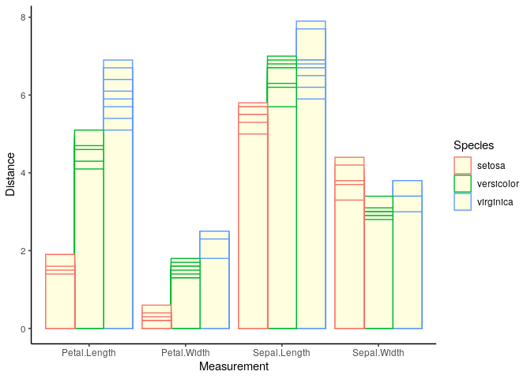
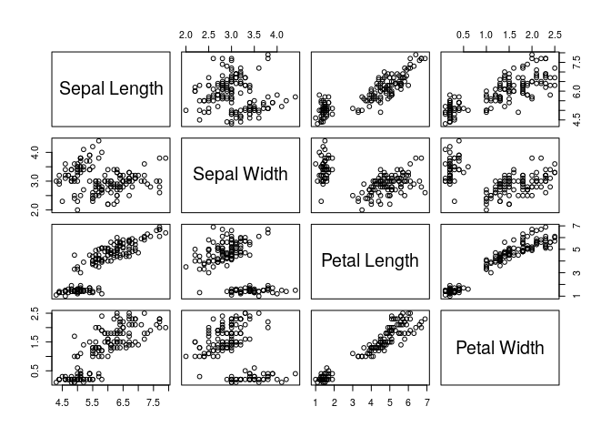
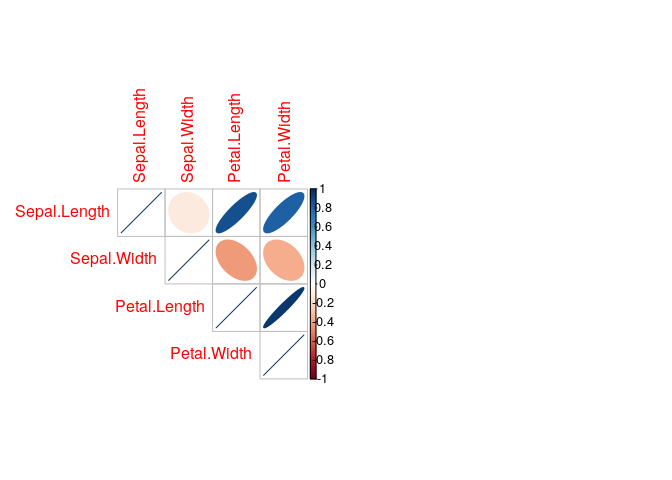
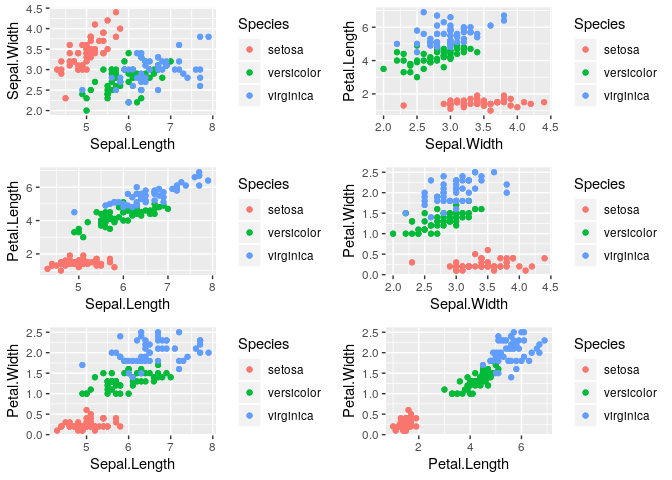
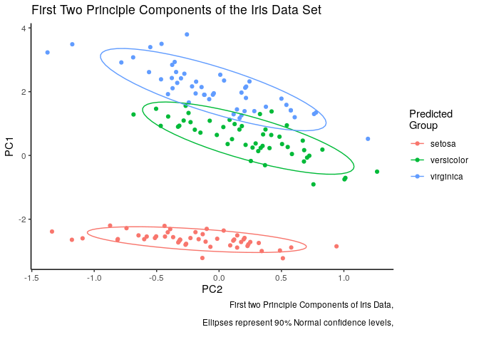
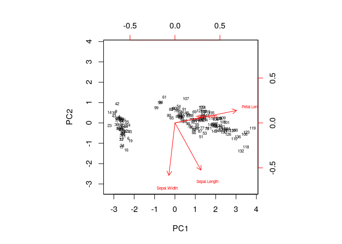
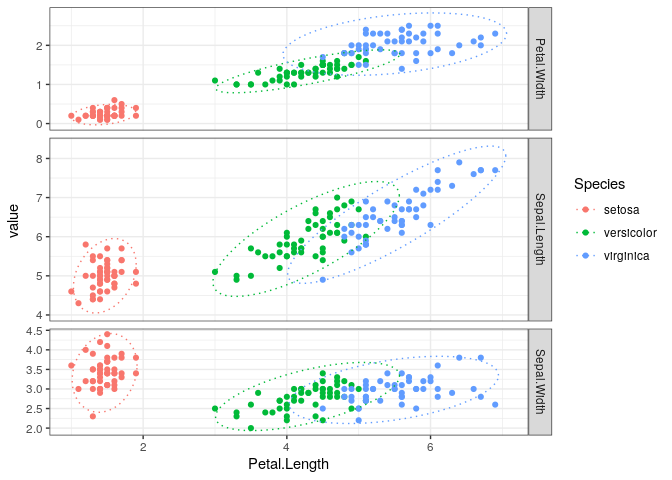
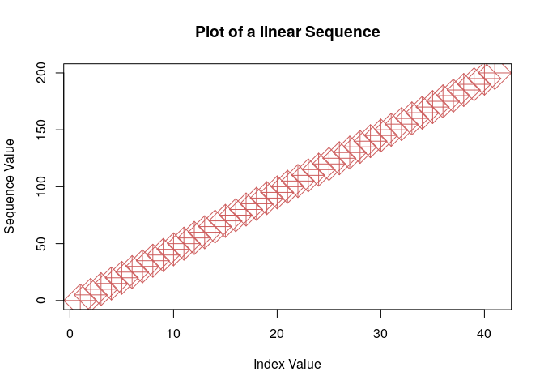
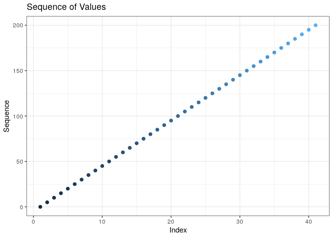

# Practical 01

## Preamble


```r
## (01) Clean up the Iris Data

# Preamble
## Install Pacman
load.pac <- function() {
  
  if(require("pacman")){
    library(pacman)
  }else{
    install.packages("pacman")
    library(pacman)
  }
  
  pacman::p_load(xts, sp, gstat, ggplot2, rmarkdown, reshape2, ggmap,
                 parallel, dplyr, plotly, tidyverse, reticulate, UsingR, Rmpfr,
                 swirl, corrplot, gridExtra)
  
}

load.pac()
```

```
## Loading required package: pacman
```


## (01) Clean up the Iris Data
So we were supposed to download the Iris Data from vUWS and clean it up in a spreadsheet, I couldn't find it online though so I'm not going to bother.

Instead let's insert some bad data and write a script to detect that bad doata


```r
# Make Unclean Data
irisBad <- iris
irisBad[sample(1:nrow(iris), size = 1),1:4] <- c(runif(4)*0.01)

# Clean the Bad Data
averagerows <- iris[,1:4] %>% apply(1, sum)# 1 is row, 2 is column 
averagecols <- iris[,1:4] %>% apply(2, mean)# 1 is row, 2 is column 
sdcols <- iris[,1:4] %>% apply(2, sd)

# Return Row numbers 3 SD from the column mean

badrows <- c()
for (i in 1:nrow(irisBad)) {
  for (j in 1:4) {
   leq <-  irisBad[i,j] < mean(irisBad[,j]) - 3 * sd(irisBad[,j])
   geq <-  irisBad[i,j] > mean(irisBad[,j]) + 3 * sd(irisBad[,j])
   if (leq || geq) {
     badrows <- c(badrows, i)
   }
  }
} 
badrows
```

```
## [1] 83 83
```

```r
irisBad[badrows,]
```

```
##      Sepal.Length Sepal.Width Petal.Length Petal.Width    Species
## 83    0.007265425 0.005053395  0.006237064 0.002496769 versicolor
## 83.1  0.007265425 0.005053395  0.006237064 0.002496769 versicolor
```

Observe now that each time the script is run the bad data is returned and can be modified or amended.


## (02) Summarise the Iris Data

The following commands are good for summarising Data


```r
head(iris)
```

```
##   Sepal.Length Sepal.Width Petal.Length Petal.Width Species
## 1          5.1         3.5          1.4         0.2  setosa
## 2          4.9         3.0          1.4         0.2  setosa
## 3          4.7         3.2          1.3         0.2  setosa
## 4          4.6         3.1          1.5         0.2  setosa
## 5          5.0         3.6          1.4         0.2  setosa
## 6          5.4         3.9          1.7         0.4  setosa
```

```r
str(iris)
```

```
## 'data.frame':	150 obs. of  5 variables:
##  $ Sepal.Length: num  5.1 4.9 4.7 4.6 5 5.4 4.6 5 4.4 4.9 ...
##  $ Sepal.Width : num  3.5 3 3.2 3.1 3.6 3.9 3.4 3.4 2.9 3.1 ...
##  $ Petal.Length: num  1.4 1.4 1.3 1.5 1.4 1.7 1.4 1.5 1.4 1.5 ...
##  $ Petal.Width : num  0.2 0.2 0.2 0.2 0.2 0.4 0.3 0.2 0.2 0.1 ...
##  $ Species     : Factor w/ 3 levels "setosa","versicolor",..: 1 1 1 1 1 1 1 1 1 1 ...
```

```r
summary(iris)
```

```
##   Sepal.Length    Sepal.Width     Petal.Length    Petal.Width   
##  Min.   :4.300   Min.   :2.000   Min.   :1.000   Min.   :0.100  
##  1st Qu.:5.100   1st Qu.:2.800   1st Qu.:1.600   1st Qu.:0.300  
##  Median :5.800   Median :3.000   Median :4.350   Median :1.300  
##  Mean   :5.843   Mean   :3.057   Mean   :3.758   Mean   :1.199  
##  3rd Qu.:6.400   3rd Qu.:3.300   3rd Qu.:5.100   3rd Qu.:1.800  
##  Max.   :7.900   Max.   :4.400   Max.   :6.900   Max.   :2.500  
##        Species  
##  setosa    :50  
##  versicolor:50  
##  virginica :50  
##                 
##                 
## 
```

```r
dim(iris)
```

```
## [1] 150   5
```

## (03) Visualise the Data

### Bar Chart

We could do like an overlapping bar chart:


```r
# Make a Tidy Data Frame
## Using Melt
irisTidy <- melt(iris)
```

```
## Using Species as id variables
```

```r
## using Tidy Verse
 ### Rearrange the Data
irisTidy <- dplyr::select(iris, "Species", names(iris)[1:4])
 ### use Pivot Longer
    # The `cols` argumnet is the columns containing relevant values
     # The remaining column(s) will become additional column
irisTidy <- tidyr::pivot_longer(data = iris, cols = names(iris[1:4]), names_to = "Measurement")
irisTidy <- irisTidy %>% dplyr::rename("Distance" = value)

# Call GGPlot2
ggplot(data = irisTidy, aes(x = Measurement, y = Distance, col = Species, shape = Species)) +
  geom_col(position = "dodge", fill = "lightyellow", size = 0.5) +
  theme_classic()
```

<!-- -->

### Scatter Plot

A Scatter Plot might be a better choice, but, there are 4 variables, this means that it would be necessary to create $\binom{4}{2} = 6$ plots.

#### Pairs Plot

This can be quickly visualised using the `pairs()` or `corrplot()` function.


```r
layout(matrix(1:2, nrow = 1))
pairs(iris[1:4], labels = c("Sepal Length", "Sepal Width", "Petal Length", "Petal Width"), )
```

<!-- -->

```r
cor(iris[1:4]) %>% corrplot(method = "ellipse", type = "upper")
```

<!-- -->

If however it was necessary to plot evey scatterplot properly, the most pragmatic way I could imagine to do this would be:


```r
# make a blank list
p <- list()

# Fill the list with the text to evaluate
  # The advantage to this is you can think about the numbers to call
p[[1]] <- paste("ggplot(iris, aes(x =", names(iris)[1:4][1], ", y =", names(iris)[1:4][2], ", col = Species)) + geom_point()")
p[[2]] <- paste("ggplot(iris, aes(x =", names(iris)[1:4][1], ", y =", names(iris)[1:4][3], ", col = Species)) + geom_point()")
p[[3]] <- paste("ggplot(iris, aes(x =", names(iris)[1:4][1], ", y =", names(iris)[1:4][4], ", col = Species)) + geom_point()")
p[[4]] <- paste("ggplot(iris, aes(x =", names(iris)[1:4][2], ", y =", names(iris)[1:4][3], ", col = Species)) + geom_point()")
p[[5]] <- paste("ggplot(iris, aes(x =", names(iris)[1:4][2], ", y =", names(iris)[1:4][4], ", col = Species)) + geom_point()")
p[[6]] <- paste("ggplot(iris, aes(x =", names(iris)[1:4][3], ", y =", names(iris)[1:4][4], ", col = Species)) + geom_point()")

# Replace the list with evaluated items
 
for (i in 1:length(p)) {
p[[i]] <- eval(parse(text = p[[i]])) + geom_point()
}

# Use Grid Arrange to lay them out
  # Refer to [this note](~/Notes/MD/Programming/R/Visualisation/Multiple Plots in R.md)
grid.arrange(grobs = p, layout_matrix = matrix(1:6, nrow = 3))
```

<!-- -->


A better alternative might be using PCA:


```r
# Create the model

PCA.mod.iris <- prcomp(x = iris[,1:4])
PCADF <- PCA.mod.iris$x %>% as_tibble()
PCADF$Species <- iris$Species

# Put the predicted groups on the end
#PCADF$KM2Pred <- groupPred

# Draw the Plot
ggplot(PCADF, aes(y = PC1, x = PC2, col = Species)) +
  geom_point() +
  labs(col = "Predicted\nGroup",
       caption = "First two Principle Components of Iris Data,\n
       Ellipses represent 90% Normal confidence levels,
       ") +
  stat_ellipse(level = 0.9) +
  theme_classic() +
  labs(title = "First Two Principle Components of the Iris Data Set")
```

<!-- -->

this can be interpreted using the biplot:


```r
biplot(PCA.mod.iris, cex = 0.5, scale = 0)
```

<!-- -->

Another way to visualise this is to use tiling like so:


```r
iris %>%
  pivot_longer(cols = c(Sepal.Length, Sepal.Width, Petal.Width))  %>% 
  ggplot(aes(x = Petal.Length, y = value, col = Species)) +
  geom_point() +
  facet_grid(name ~ ., scales = 'free_y', space = 'free_y', ) +
  theme_bw() +
  stat_ellipse(level = 0.99, lty =3, lwd = 0.5)
```

<!-- -->


## (04) Starting R

Some basic things in **_R_**


```r
1+1
```

```
## [1] 2
```

```r
sqrt(2)
```

```
## [1] 1.414214
```

```r
print("Hello World!")
```

```
## [1] "Hello World!"
```


## (05) Practice with R

```r
x <- 1
y <- 2
z <- x+y
ls()
```

```
##  [1] "averagecols"  "averagerows"  "badrows"      "geq"          "i"           
##  [6] "irisBad"      "irisTidy"     "j"            "leq"          "load.pac"    
## [11] "p"            "PCA.mod.iris" "PCADF"        "sdcols"       "x"           
## [16] "y"            "z"
```
variables can be removed:


```r
rm(x)
ls()
```

```
##  [1] "averagecols"  "averagerows"  "badrows"      "geq"          "i"           
##  [6] "irisBad"      "irisTidy"     "j"            "leq"          "load.pac"    
## [11] "p"            "PCA.mod.iris" "PCADF"        "sdcols"       "y"           
## [16] "z"
```

Help can be accessed by prefixing a function with a `?`:


```r
#?ls
#help(ls)
#help.start()
```

if you want a clean workspace, I recommend using the `mise()` package:


```r
# Mise creates a totally bare well behaved workspace
   # put this at the top of your script to ensure a standalone script
library(mise)
mise()
```



```r
# alternatively this only clears the console
cat("/014")
```

```
## /014
```

```r
# This removes all objects
rm(list=ls())
```


## (06) Practice with Vectors

first create a sequency of numbers increasing by 5

```r
x <- seq(0, 200, 5)
paste0("x is a vector of length ", length(x)) %>% print()
```

```
## [1] "x is a vector of length 41"
```

```r
x
```

```
##  [1]   0   5  10  15  20  25  30  35  40  45  50  55  60  65  70  75  80  85  90
## [20]  95 100 105 110 115 120 125 130 135 140 145 150 155 160 165 170 175 180 185
## [39] 190 195 200
```

Now plot those numbers using base plots and ggplot


```r
plot(x = 1:length(x),
     y = x,
     main = "Plot of a linear Sequence", 
     xlab = "Index Value", 
     ylab = "Sequence Value",
     col = "indianred",
     cex = 4,
     pch = 9)
```

<!-- -->

```r
ggplot(data = tibble::enframe(x), aes(x = name, y = value)) +
  geom_point(size = 2, mapping = aes(col = value) ) +
  theme_bw() +
  guides(col = FALSE) +
  labs(x = "Index", y = "Sequence", title = "Sequence of Values")
```

<!-- -->

Subsetting data is done by using the suffix `[]`:


```r
# Create Matrices
mx <- matrix(data = rnorm(50), ncol = 5)
my <- matrix(data = rnorm(50), ncol = 5)
mz <- matrix(data = rnorm(50), ncol = 5)

# Subset and Multiply
mx[1:10, 3:4] * mx[1:10, 3:4]
```

```
##               [,1]        [,2]
##  [1,] 5.295706e+00 0.413245491
##  [2,] 1.708310e-01 1.210188439
##  [3,] 3.406388e+00 0.306712452
##  [4,] 2.799697e-01 0.040584957
##  [5,] 9.127720e-04 0.210871764
##  [6,] 2.533186e+00 0.180911913
##  [7,] 1.586598e-05 0.007259872
##  [8,] 2.786061e-01 0.050848734
##  [9,] 4.490241e-02 2.829081662
## [10,] 3.676922e-01 3.238712546
```

```r
# Observe that matrix multiplication is done otherwise
  # also observe that print can take a rounding argument
mx[1:10, 3:4] %*% mx[3:4, 1:5] %>% print(2)
```

```
##         [,1]   [,2]   [,3]    [,4]   [,5]
##  [1,] -3.247  3.263 -4.587  1.4040  0.666
##  [2,] -1.844 -0.076 -0.181  0.0073  0.647
##  [3,]  3.713 -2.034  3.113 -0.9106 -0.998
##  [4,]  1.109 -0.560  0.870 -0.2525 -0.305
##  [5,] -0.425 -0.288  0.299 -0.1092  0.187
##  [6,]  3.148 -1.783  2.712 -0.7958 -0.838
##  [7,]  0.082  0.051 -0.052  0.0194 -0.035
##  [8,]  1.132 -0.545  0.855 -0.2469 -0.314
##  [9,]  2.105  0.648 -0.499  0.2215 -0.816
## [10,]  0.836  1.748 -2.071  0.6984 -0.532
```


## (07) self Learning with `swirl`


```r
library(swirl)
```

