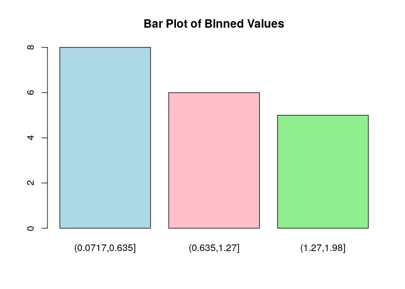
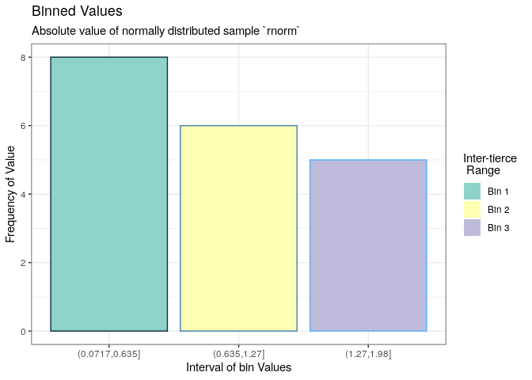
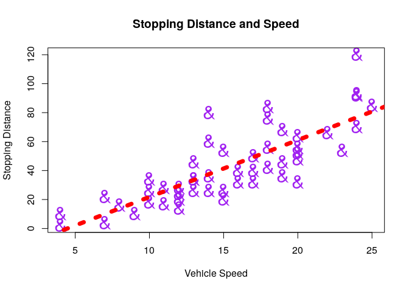
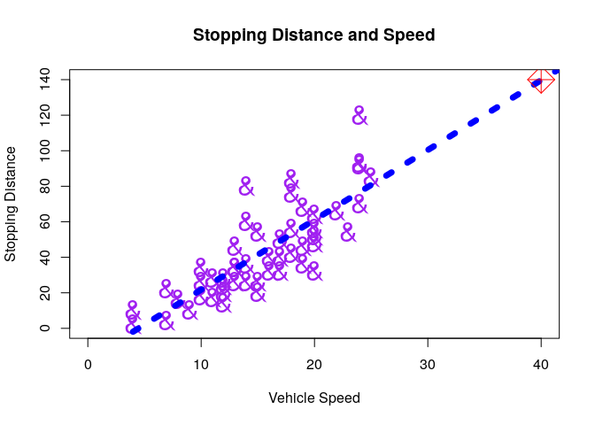
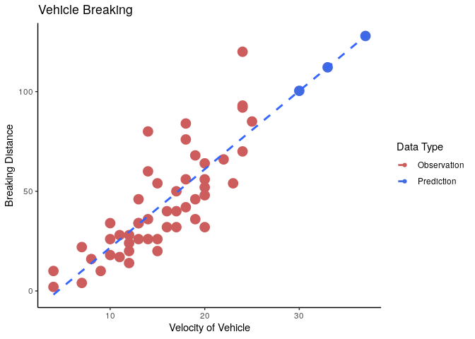
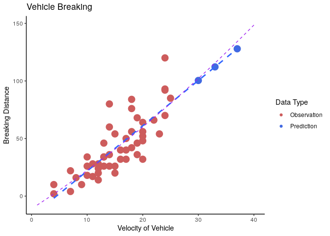

# Practical 02

## Preamble


```r
## (01) Clean up the Iris Data

# Preamble
## Install Pacman
load.pac <- function() {
  
  if(require("pacman")){
    library(pacman)
  }else{
    install.packages("pacman")
    library(pacman)
  }
  
  pacman::p_load(xts, sp, gstat, ggplot2, rmarkdown, reshape2, ggmap,
                 parallel, dplyr, plotly, tidyverse, reticulate, UsingR, Rmpfr,
                 swirl, corrplot, gridExtra, mise, latex2exp)
  
}

load.pac()
```

```
## Loading required package: pacman
```

```r
mise()
```



```r
set.seed(9823)
```


```r
knitr::opts_chunk$set(
  fig.path = "./figure/"
)
```

## (1) Create Gaussian Values


```r
std_normal <- rnorm(n = 20, mean = 0, sd = 1)
cat(std_normal)
```

```
## 0.8890603 -0.3824008 -0.1658778 1.52031 -1.382377 1.10355 -0.2035836 -1.77049 -0.7843132 -0.9573273 -0.3120387 1.4742 0.07174706 0.1801898 0.1126159 0.8977332 -0.2474811 1.026038 -1.977872 0.1270891
```
## (2) Manipulate the Values

### Print the number of Positive Values


```r
## Using Base Functions
n_geq0 <- std_normal[std_normal>0]  %>% length()

n_geq0 <- std_normal[sign(std_normal) == 1] %>% length()
n_neg <- length(std_normal)-n_geq0

## Using Dplyr
# std_normal %>% dplyr::filter()


 print("| Positive Values | Negative Values | ")
```

```
## [1] "| Positive Values | Negative Values | "
```

```r
print("| --------------- | --------------- | ")
```

```
## [1] "| --------------- | --------------- | "
```

```r
paste0("|     ", n_geq0, "           |     ", n_neg, "           | ") %>% print()
```

```
## [1] "|     10           |     10           | "
```
### Make all Values Positive

So the easiest way to do this would be to just use `abs()` or `sqrt(x^2)`, a more programatic way would be to use an if statement:


```r
std_normal[std_normal<0]<- std_normal[std_normal<0]*-1
std_normal
```

```
##  [1] 0.88906032 0.38240081 0.16587781 1.52030961 1.38237738 1.10355041
##  [7] 0.20358362 1.77049048 0.78431321 0.95732729 0.31203867 1.47419964
## [13] 0.07174706 0.18018983 0.11261591 0.89773317 0.24748110 1.02603848
## [19] 1.97787202 0.12708910
```

## (3) Create Bins

### Equal Size Histogram bins

Creating 3 bins that are equally sized, from the minimum observation, to the maximum observation could be acheived thusly:


```r
minval <- min(std_normal)
maxval <- max(std_normal)
delta <- (maxval-minval) / 3
break_points <- c(minval, delta, 2*delta, maxval)

#bin_count <- cut(std_normal, breaks = break_points) %>% table()
bin_index  <- factor(cut(std_normal, breaks = break_points))
bin_count   <- table(bin_index) 

paste("The distribution of values across the bins are:") %>% print()
```

```
## [1] "The distribution of values across the bins are:"
```

```r
print(bin_count)
```

```
## bin_index
## (0.0717,0.635]   (0.635,1.27]    (1.27,1.98] 
##              8              6              5
```

#### Plot the Binned Values

The bins can be used to pass breaks to a histogram or they can be used to specify counts for a barplot:


```r
# layout(matrix(1:2, nrow = 2))

hist(std_normal, breaks = break_points, freq = TRUE, main = "Histogram of Values", xlab = "Simulated Normal Value", col = c("lightblue", "pink", "lightgreen"))
```

```
## Warning in plot.histogram(r, freq = freq1, col = col, border = border, angle =
## angle, : the AREAS in the plot are wrong -- rather use 'freq = FALSE'
```

<!-- -->

```r
barplot(bin_count, col = c("lightblue", "pink", "lightgreen"), main = "Bar Plot of Binned Values")
```

<!-- -->

```r
ggplot(data = melt(bin_count), aes(x = bin_index, y = value, fill = bin_index, col = -value)) +
  geom_col() +
  guides(col = FALSE, fill = guide_legend("Inter-tierce \n Range")) +
  theme_bw() +
  labs(x = "Interval of bin Values", title = "Binned Values", y = "Frequency of Value", 
       subtitle = "Absolute value of normally distributed sample `rnorm`") +
  scale_fill_brewer(palette = "Set3", labels = paste("Bin", as.character(1:3)))
```

<!-- -->


remember that this values are absolute values and the skew left distribution is expected.


### Random Sample

This is very different from a random sample which could be done like this:


```r
bin_index <- sample(1:3, size = length(std_normal), replace = TRUE)

std_normal_df <- as_tibble(cbind(std_normal, bin_index))
# std_normal %>% dplyr::rename("value" = std_normal, "bin" = bin_index)
names(std_normal_df) <- c("Value", "Bin")
std_normal_df$Bin <- factor(std_normal_df$Bin, levels = 1:3, ordered = FALSE)
std_normal_df
```

```
## # A tibble: 20 x 2
##     Value Bin  
##     <dbl> <fct>
##  1 0.889  2    
##  2 0.382  3    
##  3 0.166  1    
##  4 1.52   2    
##  5 1.38   3    
##  6 1.10   2    
##  7 0.204  1    
##  8 1.77   1    
##  9 0.784  3    
## 10 0.957  3    
## 11 0.312  3    
## 12 1.47   3    
## 13 0.0717 3    
## 14 0.180  3    
## 15 0.113  1    
## 16 0.898  1    
## 17 0.247  3    
## 18 1.03   2    
## 19 1.98   2    
## 20 0.127  3
```

```r
summary(std_normal_df$Bin)
```

```
##  1  2  3 
##  5  5 10
```

### (4) Create a matrix of Values

this vector can be filled into a matrix, it will fill column wise by default:


```r
std_normal_mat <- matrix(data = std_normal, nrow = 3, ncol = 6)
```

```
## Warning in base::matrix(...): data length [20] is not a sub-multiple or multiple
## of the number of rows [3]
```

```r
std_normal_mat
```

```
##           [,1]     [,2]      [,3]      [,4]       [,5]      [,6]
## [1,] 0.8890603 1.520310 0.2035836 0.9573273 0.07174706 0.8977332
## [2,] 0.3824008 1.382377 1.7704905 0.3120387 0.18018983 0.2474811
## [3,] 0.1658778 1.103550 0.7843132 1.4741996 0.11261591 1.0260385
```

In order to fill the matrix row wise it is necessary to specify the `byrow` argument:


```r
std_normal_mat <- matrix(1:20, nrow = 3, ncol = 6, byrow = TRUE)
```

```
## Warning in base::matrix(...): data length [20] is not a sub-multiple or multiple
## of the number of rows [3]
```

```r
std_normal_mat
```

```
##      [,1] [,2] [,3] [,4] [,5] [,6]
## [1,]    1    2    3    4    5    6
## [2,]    7    8    9   10   11   12
## [3,]   13   14   15   16   17   18
```

```r
std_normal_mat <- matrix(data = std_normal, nrow = 6, ncol = 3) %>% t
```

```
## Warning in base::matrix(...): data length [20] is not a sub-multiple or multiple
## of the number of rows [6]
```

```r
std_normal_mat
```

```
##            [,1]      [,2]      [,3]      [,4]      [,5]     [,6]
## [1,] 0.88906032 0.3824008 0.1658778 1.5203096 1.3823774 1.103550
## [2,] 0.20358362 1.7704905 0.7843132 0.9573273 0.3120387 1.474200
## [3,] 0.07174706 0.1801898 0.1126159 0.8977332 0.2474811 1.026038
```


alternatively it would also be possible to transpose the data:


```r
std_normal_mat <- matrix(data = 1:20 , nrow = 6, ncol = 3) %>% t
```

```
## Warning in base::matrix(...): data length [20] is not a sub-multiple or multiple
## of the number of rows [6]
```

```r
std_normal_mat
```

```
##      [,1] [,2] [,3] [,4] [,5] [,6]
## [1,]    1    2    3    4    5    6
## [2,]    7    8    9   10   11   12
## [3,]   13   14   15   16   17   18
```

```r
std_normal_mat <- matrix(data = std_normal, nrow = 6, ncol = 3) %>% t
```

```
## Warning in base::matrix(...): data length [20] is not a sub-multiple or multiple
## of the number of rows [6]
```

```r
std_normal_mat
```

```
##            [,1]      [,2]      [,3]      [,4]      [,5]     [,6]
## [1,] 0.88906032 0.3824008 0.1658778 1.5203096 1.3823774 1.103550
## [2,] 0.20358362 1.7704905 0.7843132 0.9573273 0.3120387 1.474200
## [3,] 0.07174706 0.1801898 0.1126159 0.8977332 0.2474811 1.026038
```

## (5) Linear Regression

### Base Packages 

Using Base Packages Speed and Distance may be plotted thusly:


```r
carsForm <- dist ~ speed
cars_model <- lm(formula = carsForm, data = cars)

plot(dist ~ speed, data = cars,
     main = "Stopping Distance and Speed",
     ylab = "Stopping Distance",
     xlab = "Vehicle Speed",
     bg = "red",
     pch = "&", cex = 2,
     col = "purple")

abline(cars_model, lty = 3, lwd = 7, col = "red")
```

<!-- -->

Values can be forecast using the `predict()` function:


```r
names(cars)
```

```
## [1] "speed" "dist"
```

```r
attach(cars)
predict(cars_model, newdata = data.frame(speed = 40))
```

```
##        1 
## 139.7173
```

```r
detach(cars)
```

This can then be added onto the plot using `points()`:


```r
# Increase the Plot Limit

plot(dist ~ speed, data = cars,
     main = "Stopping Distance and Speed",
     ylab = "Stopping Distance",
     xlab = "Vehicle Speed",
     bg = "red",
     pch = "&", cex = 2,
     col = "purple", 
     xlim = c(0, 40), 
     ylim = c(0, 140))

abline(cars_model, lty = 3, lwd = 7, col = "blue")
points(40, 140, pch = 9, cex = 3, col = "red")
```

<!-- -->

### GGPlot2

This is a little simpler in ggplot2.

#### Build the Model


```r
cars_model <- lm(dist ~ speed, data = cars)
summary(cars_model)
```

```
## 
## Call:
## lm(formula = dist ~ speed, data = cars)
## 
## Residuals:
##     Min      1Q  Median      3Q     Max 
## -29.069  -9.525  -2.272   9.215  43.201 
## 
## Coefficients:
##             Estimate Std. Error t value Pr(>|t|)    
## (Intercept) -17.5791     6.7584  -2.601   0.0123 *  
## speed         3.9324     0.4155   9.464 1.49e-12 ***
## ---
## Signif. codes:  0 '***' 0.001 '**' 0.01 '*' 0.05 '.' 0.1 ' ' 1
## 
## Residual standard error: 15.38 on 48 degrees of freedom
## Multiple R-squared:  0.6511,	Adjusted R-squared:  0.6438 
## F-statistic: 89.57 on 1 and 48 DF,  p-value: 1.49e-12
```

$$
\texttt{dist} = 0.017 \times \texttt{speed } + 8.28
$$
#### Create some Predictions


```r
max(cars$speed)
```

```
## [1] 25
```

```r
newdata <- data.frame(speed = c(30, 33, 37))
newdata$dist <- predict(object = cars_model, newdata)
newdata$datatype <- c("pred")

cars$datatype <- c("obs")

cars <- rbind(cars, newdata)
cars$datatype <- factor(cars$datatype)
head(cars)
```

```
##   speed dist datatype
## 1     4    2      obs
## 2     4   10      obs
## 3     7    4      obs
## 4     7   22      obs
## 5     8   16      obs
## 6     9   10      obs
```

#### Plot the Data Type


```r
ggplot(data = cars, aes(x = speed, y = dist, col = datatype)) +
  geom_point(aes(size = 3)) +
  theme_classic() +
  guides(size = FALSE) +
  stat_smooth(method = lm, aes(group = 1), se = FALSE, lty = 2) +
  labs(x = "Velocity of Vehicle", y = "Breaking Distance", title = "Vehicle Breaking") +
  guides(col = guide_legend("Data Type")) + 
  scale_color_discrete(labels = c("Observation", "Prediction")) +
  scale_color_manual(labels = c("Observation", "Prediction"),
                     values = c("indianred", "royalblue"))
```

```
## Scale for 'colour' is already present. Adding another scale for 'colour',
## which will replace the existing scale.
```

<!-- -->


##### Refine the Model

A car break transforms the kinetic energy of the car into thermal energy in the break rotor:


$$\begin{aligned}
E_\textsf{Brk} &= E_\textsf{Car} \\
F\cdot  s  &= \frac{1}{2}\cdot  m\cdot  v^2 \\
 \implies  s &=  \frac{m\cdot  F}{s} \cdot  v^2 \\
 s & \propto v^2
\end{aligned}$$

Another way to look at this model, as opposed to a conservation of energy argument is to consider the distance travelled while breaking as a function of the force applied by the break.

Assume that the breaking force  of the car is constant, if the breaking system of any given car is adjusted to be stronger for heavier cars such that the deceleration is constant for any car regardless of mass the following simplification can be used where $a$ represents the deceleration caused by breaking:

$$\begin{aligned}
F &=  m\cdot  a \\
\implies  F &\propto a
\end{aligned}$$

and hence the distance travelled while breaking will be

$$\begin{aligned}
v &=  a \cdot   t \\
\int v \mathrm{d}t &=  \int a\cdot t \mathrm{d}t  \\
s&= \frac{1}{2}a\cdot  t^2 \\
2s &= a\cdot  \left( \frac{v}{a} \right)^2\\
2as &= v^2
\end{aligned}$$

Under the assumption that deceleratoin is constant:

$$\begin{aligned}
s \propto v^2
\end{aligned}$$

###### using `stat_smooth`

This can be added by using the stats layer in ggplot2, simply add `formula = y ~ I(x^2)` to the `stat_smooth` lm layer:

> remember that it is a linear model in the sense that a linear model is simply fit to a new variable that just so happens to be the square of the original data, the method used is still Ordinary Least Squares Regression, refer to [This Document](/home/ryan/Dropbox/Studies/Old/Studies(ONote)/Statistics/Data Science/PredMod/Proofs/Number Theory/Simple Linear Regression.pdf) for a proof.


```r
# cars <- cars %>% dplyr::filter("obs" %in% datatype)
# cars <- cars[cars$datatype == "obs",] 
ggplot(data = cars, aes(x = speed, y = dist, col = datatype)) +
  geom_point(aes(size = 3)) +
  theme_classic() +
  guides(size = FALSE) +
  stat_smooth(method = lm, aes(group = 1), formula = y ~ I(x^2), se = FALSE, lty = 2, col = "purple") +
  labs(x = "Velocity of Vehicle", y = "Breaking Distance", title = "Vehicle Breaking") +
  guides(col = guide_legend("Data Type")) + 
  scale_color_discrete(labels = c("Observation", "Prediction")) +
  scale_color_manual(labels = c("Observation", "Linear Prediction"),
                     values = c("indianred", "royalblue"))
```

```
## Scale for 'colour' is already present. Adding another scale for 'colour',
## which will replace the existing scale.
```

<!-- -->

###### Build the Model

If more precise control was necessary for the model that was built, a seperate data set can simply be plotted over the top of the data in a seperate layer like so:


```r
cars_model <- lm(dist ~ poly(speed, degree = 2, raw = TRUE), data = cars)
summary(cars_model)
```

```
## 
## Call:
## lm(formula = dist ~ poly(speed, degree = 2, raw = TRUE), data = cars)
## 
## Residuals:
##     Min      1Q  Median      3Q     Max 
## -28.033  -8.920  -2.095   4.484  43.668 
## 
## Coefficients:
##                                       Estimate Std. Error t value Pr(>|t|)  
## (Intercept)                          -10.95719   10.75299  -1.019   0.3131  
## poly(speed, degree = 2, raw = TRUE)1   3.11171    1.18526   2.625   0.0115 *
## poly(speed, degree = 2, raw = TRUE)2   0.02189    0.03049   0.718   0.4762  
## ---
## Signif. codes:  0 '***' 0.001 '**' 0.01 '*' 0.05 '.' 0.1 ' ' 1
## 
## Residual standard error: 14.99 on 50 degrees of freedom
## Multiple R-squared:  0.7609,	Adjusted R-squared:  0.7513 
## F-statistic: 79.55 on 2 and 50 DF,  p-value: 2.921e-16
```

$$
\texttt{dist} = 0.099 \times \texttt{speed}^2 + 0.91 \times \texttt{speed} + 2.4
$$

This can be added to ggplot2 by just using geom_line over the modelled like so:


```r
cars$quad <- predict(cars_model, newdata = data.frame("speed"=cars[,names(cars) == "speed"]))

quad_model_df <- tibble("speed" = 1:40)
quad_model_df$distq <- predict(object = cars_model, newdata = quad_model_df)

ggplot(data = cars, aes(x = speed, y = dist)) +
  geom_point(aes(size = 3, col = datatype)) +
  theme_classic() +
  guides(size = FALSE) +
  stat_smooth(method = lm, aes(group = 1), se = FALSE, lty = 2) +
  labs(x = "Velocity of Vehicle", y = "Breaking Distance", title = "Vehicle Breaking") +
  guides(col = guide_legend("Data Type")) + 
  scale_color_discrete(labels = c("Observation", "Prediction")) +
  scale_color_manual(labels = c("Observation", "Prediction"),
                     values = c("indianred", "royalblue")) +
  geom_line(data = quad_model_df, aes(x = speed, y = distq), col = "purple", lty =2)
```

```
## Scale for 'colour' is already present. Adding another scale for 'colour',
## which will replace the existing scale.
```

<!-- -->


