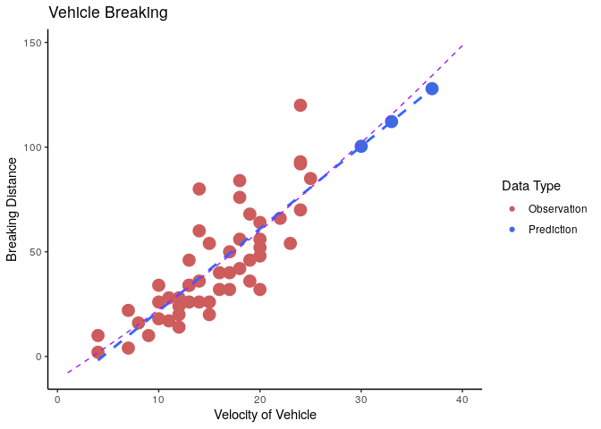

# Practical 03


## Preamble
  

```r
## (01) Clean up the Iris Data

# Preamble
## Install Pacman
load.pac <- function() {
  
  if(require("pacman")){
    library(pacman)
  }else{
    install.packages("pacman")
    library(pacman)
  }
  
  pacman::p_load(xts, sp, gstat, ggplot2, rmarkdown, reshape2, ggmap,
                 parallel, dplyr, plotly, tidyverse, reticulate, UsingR, Rmpfr,
                 swirl, corrplot, gridExtra, mise, latex2exp, tree, rpart)
  
}

load.pac()
```

```
## Loading required package: pacman
```

```r
mise()
```


 
 
 
 
 
 
 
 
 
 
 
 
 
 
 
 
 
 
 
 
 
 
 
 
 
 
 
 
 
 
 
 
 
 
 
 
 
 
 
 
 
 
 
 
 
 
 
 
 

## (01) Reading in iris data


```r
iris_bad <- read.csv(file = "./DataSets/iris_badvalues.csv", header = TRUE, sep = ",")
load(file = "./iriswithbadvalues.RData")

head(iris_bad)
```

```
##   Sample.Index Sepal.Length Sepal.Width Petal.Length Petal.Width Species
## 1            1          5.1         3.5          1.4         0.2  setosa
## 2            2          4.9         3.0          1.4         0.2  setosa
## 3            3          4.7         3.2          1.3         0.2  setosa
## 4            4          4.6         3.1         -1.0         0.2  setosa
## 5            5          5.0          NA          1.4         0.2  setosa
## 6            6          5.4         3.9          1.7          NA  setosa
```

```r
str(iris_bad)
```

```
## 'data.frame':	150 obs. of  6 variables:
##  $ Sample.Index: int  1 2 3 4 5 6 7 8 9 10 ...
##  $ Sepal.Length: num  5.1 4.9 4.7 4.6 5 5.4 4.6 5 4.4 4.9 ...
##  $ Sepal.Width : num  3.5 3 3.2 3.1 NA 3.9 3.4 3.4 2.9 3.1 ...
##  $ Petal.Length: num  1.4 1.4 1.3 -1 1.4 1.7 NA 1.5 1.4 1.5 ...
##  $ Petal.Width : num  0.2 0.2 0.2 0.2 0.2 NA 0.3 0.2 0.2 0.1 ...
##  $ Species     : Factor w/ 3 levels "setosa","versicolor",..: 1 1 1 1 1 1 1 1 1 1 ...
```

```r
summary(iris_bad)
```

```
##   Sample.Index     Sepal.Length     Sepal.Width    Petal.Length   
##  Min.   :  1.00   Min.   :-5.700   Min.   :0.00   Min.   :-6.000  
##  1st Qu.: 38.25   1st Qu.: 5.100   1st Qu.:2.80   1st Qu.: 1.600  
##  Median : 75.50   Median : 5.800   Median :3.00   Median : 4.350  
##  Mean   : 75.50   Mean   : 5.724   Mean   :3.01   Mean   : 3.703  
##  3rd Qu.:112.75   3rd Qu.: 6.400   3rd Qu.:3.30   3rd Qu.: 5.100  
##  Max.   :150.00   Max.   : 7.900   Max.   :4.40   Max.   : 6.900  
##                   NA's   :10       NA's   :12     NA's   :12      
##   Petal.Width          Species  
##  Min.   :0.000   setosa    :50  
##  1st Qu.:0.300   versicolor:50  
##  Median :1.300   virginica :50  
##  Mean   :1.203                  
##  3rd Qu.:1.800                  
##  Max.   :2.500                  
##  NA's   :1
```

### Clean the Data

Copy the data into another data frame to work with:


```r
(iris_tib <- as_tibble(iris_bad))
```

```
## # A tibble: 150 x 6
##    Sample.Index Sepal.Length Sepal.Width Petal.Length Petal.Width Species
##           <int>        <dbl>       <dbl>        <dbl>       <dbl> <fct>  
##  1            1          5.1         3.5          1.4         0.2 setosa 
##  2            2          4.9         3            1.4         0.2 setosa 
##  3            3          4.7         3.2          1.3         0.2 setosa 
##  4            4          4.6         3.1         -1           0.2 setosa 
##  5            5          5          NA            1.4         0.2 setosa 
##  6            6          5.4         3.9          1.7        NA   setosa 
##  7            7          4.6         3.4         NA           0.3 setosa 
##  8            8          5           3.4          1.5         0.2 setosa 
##  9            9          4.4         2.9          1.4         0.2 setosa 
## 10           10          4.9         3.1          1.5         0.1 setosa 
## # … with 140 more rows
```

```r
iris_df <- iris_bad
```


#### Negative Values

##### Remove Negative Values
In order to remove negative values the `abs` function could be used:


```r
# Easy Built in
iris_df[, 1:5] %>% abs() %>% head()
```

```
##   Sample.Index Sepal.Length Sepal.Width Petal.Length Petal.Width
## 1            1          5.1         3.5          1.4         0.2
## 2            2          4.9         3.0          1.4         0.2
## 3            3          4.7         3.2          1.3         0.2
## 4            4          4.6         3.1          1.0         0.2
## 5            5          5.0          NA          1.4         0.2
## 6            6          5.4         3.9          1.7          NA
```

```r
iris_tib[, 1:5] %>% abs() %>% head()
```

```
## # A tibble: 6 x 5
##   Sample.Index Sepal.Length Sepal.Width Petal.Length Petal.Width
##          <int>        <dbl>       <dbl>        <dbl>       <dbl>
## 1            1          5.1         3.5          1.4         0.2
## 2            2          4.9         3            1.4         0.2
## 3            3          4.7         3.2          1.3         0.2
## 4            4          4.6         3.1          1           0.2
## 5            5          5          NA            1.4         0.2
## 6            6          5.4         3.9          1.7        NA
```

It's always possible to roll your own function but in doing so it is necessary to:

1. Check for `na` values
  + notice that `is.numeric()` will return `TRUE` if the `NA` value is an element of a `data.frame`, for this reason use `! is.na()`
2. Don't assign Null Values


So it's usually better to use built in functions where possible:


```r
# Roll your own

my_abs <- function(x) {
  if (!is.na(x)) {
    if (x < 0) {
      -x
    } else {
      x
    }
  }
}


new_df <- iris_df
for (r in 1:nrow(iris_df)) {
  for (c in 1:5) {
    if (length(my_abs(iris_df[r, c])) == 1) {
      new_df[r, c] <- my_abs(iris_df[r, c])
    }
  }
}
new_df %>% head()
```

```
##   Sample.Index Sepal.Length Sepal.Width Petal.Length Petal.Width Species
## 1            1          5.1         3.5          1.4         0.2  setosa
## 2            2          4.9         3.0          1.4         0.2  setosa
## 3            3          4.7         3.2          1.3         0.2  setosa
## 4            4          4.6         3.1          1.0         0.2  setosa
## 5            5          5.0          NA          1.4         0.2  setosa
## 6            6          5.4         3.9          1.7          NA  setosa
```


##### Show Negative Values

###### Base Packages 

We may wan't to preview rows that have negative values rather than just making them positive. 

A possible way to do this is to use `df[df<0]`, but tht will not work with tibbles, instead create a logical matrix in order to find the negative values, bear in mind that **_R_** consideres any number that isn't 0 to be *truthy* so `sum()` and `prod()` may be used to with `apply()` to create logical tests:

```
| Description | Command   | Code Syntax | Mathematical |
| ---         | ----      | --          | ---          |
| And         | `prod()` / $\Pi^n_{i=1}$ | `&`   | $\wedge$     |
| Or          | `sum` / $\sum^n_{i=1}$ | `|`     | $\vee$       |
```


This method will work with both tibbles and data frames.


```r
# is the entry negative but not missing
is_neg <- iris_df[,1:5]<0 & !is.na(iris_df[,1:5]) 
# is any column in the row negative?
  # **and** / $^$ ; is `prod()`, **or** / $V$ is `sum()`
is_row_neg <- apply(is_neg, 1, sum) %>% as.logical()
# Which Rows are negatives
neg_rows <- which(is_row_neg)

# Return the rows that contain negative observations
negvals  <- iris_df[neg_rows,]
meanvals <- apply(na.omit(abs(iris_df[,-6])), 2, mean) %>% round(1)
sdvals   <- apply(na.omit(abs(iris_df[,-6])), 2, sd) %>% round(2)
rbind(negvals, meanvals, sdvals) 
```

```
## Warning in `[<-.factor`(`*tmp*`, ri, value = 78): invalid factor level, NA
## generated

## Warning in `[<-.factor`(`*tmp*`, ri, value = 78): invalid factor level, NA
## generated
```

```
##     Sample.Index Sepal.Length Sepal.Width Petal.Length Petal.Width
## 4           4.00         4.60        3.10        -1.00        0.20
## 19         19.00        -5.70          NA         1.70        0.30
## 101       101.00         6.30        3.30        -6.00        2.50
## 41         78.00         5.80        3.00         3.80        1.20
## 5          42.45         0.85        0.49         1.76        0.75
##       Species
## 4      setosa
## 19     setosa
## 101 virginica
## 41       <NA>
## 5        <NA>
```

```r
# Remove Rows that have negative values
# iris_df[-neg_rows,]
```

###### TidyVerse

In order to view negative values with tibbles it's quite simple to use `dplyr`:


```r
iris_tib %>%
  dplyr::filter(Petal.Length < 0 |  Sepal.Length < 0 |  Petal.Width< 0 |  Sepal.Width< 0 )
```

```
## # A tibble: 3 x 6
##   Sample.Index Sepal.Length Sepal.Width Petal.Length Petal.Width Species  
##          <int>        <dbl>       <dbl>        <dbl>       <dbl> <fct>    
## 1            4          4.6         3.1         -1           0.2 setosa   
## 2           19         -5.7        NA            1.7         0.3 setosa   
## 3          101          6.3         3.3         -6           2.5 virginica
```

if you don't want to type in all the column names it might be ideal to transform the table into `longer` format 
> (like tidy data but more about making it longer so there's only one relevant column not necessarily conforming to the rules of tidy)


```r
# Make it Longer

pivot_longer(iris_tib, cols = names(iris_df)[2:5]) 
```

```
## # A tibble: 600 x 4
##    Sample.Index Species name         value
##           <int> <fct>   <chr>        <dbl>
##  1            1 setosa  Sepal.Length   5.1
##  2            1 setosa  Sepal.Width    3.5
##  3            1 setosa  Petal.Length   1.4
##  4            1 setosa  Petal.Width    0.2
##  5            2 setosa  Sepal.Length   4.9
##  6            2 setosa  Sepal.Width    3  
##  7            2 setosa  Petal.Length   1.4
##  8            2 setosa  Petal.Width    0.2
##  9            3 setosa  Sepal.Length   4.7
## 10            3 setosa  Sepal.Width    3.2
## # … with 590 more rows
```

```r
# Filter out Negative Results
pivot_longer(iris_tib, cols = names(iris_df)[2:5]) %>% 
  dplyr::filter(value < 0) 
```

```
## # A tibble: 3 x 4
##   Sample.Index Species   name         value
##          <int> <fct>     <chr>        <dbl>
## 1            4 setosa    Petal.Length  -1  
## 2           19 setosa    Sepal.Length  -5.7
## 3          101 virginica Petal.Length  -6
```


###### Discussing Negative Values

The negative values seem to be pretty close to what was expected so they won't be removed but converted to positive values.


```r
iris_df[,-6] <- abs(iris_df[,-6])
iris_tib[,-6] <- abs(iris_tib[,-6])
```

#### Zero Values

Before values that are too large can be considered, it is necessary to remove the zero values.


the zero values can be removed for a data frame or matrix by using na.omit (this doesn't work for tibbles):


```r
iris_df[iris_df==0] <- NA
na.omit(iris_df) %>% head()
```

```
##   Sample.Index Sepal.Length Sepal.Width Petal.Length Petal.Width Species
## 1            1          5.1         3.5          1.4         0.2  setosa
## 2            2          4.9         3.0          1.4         0.2  setosa
## 3            3          4.7         3.2          1.3         0.2  setosa
## 4            4          4.6         3.1          1.0         0.2  setosa
## 8            8          5.0         3.4          1.5         0.2  setosa
## 9            9          4.4         2.9          1.4         0.2  setosa
```


##### View Zero Observations

The observations with zeroes can be previewed:


```r
is_zero <-iris_tib==0
is_zero[is.na(is_zero)] <- FALSE
zero_rows <- apply(is_zero, 1, sum) %>% as.logical()

iris_tib[zero_rows,] %>% head()
```

```
## # A tibble: 4 x 6
##   Sample.Index Sepal.Length Sepal.Width Petal.Length Petal.Width Species  
##          <int>        <dbl>       <dbl>        <dbl>       <dbl> <fct>    
## 1           12         NA           3.4          1.6         0   setosa   
## 2           84          6           0           NA           1.6 versicol…
## 3          117          6.5         0            5.5         1.8 virginica
## 4          142          0          NA            5.1         2.3 virginica
```

in order to remove these values use the following:


```r
iris_tib[-zero_rows, ] %>% head()
```

```
## # A tibble: 6 x 6
##   Sample.Index Sepal.Length Sepal.Width Petal.Length Petal.Width Species
##          <int>        <dbl>       <dbl>        <dbl>       <dbl> <fct>  
## 1            2          4.9         3            1.4         0.2 setosa 
## 2            3          4.7         3.2          1.3         0.2 setosa 
## 3            4          4.6         3.1          1           0.2 setosa 
## 4            5          5          NA            1.4         0.2 setosa 
## 5            6          5.4         3.9          1.7        NA   setosa 
## 6            7          4.6         3.4         NA           0.3 setosa
```


#### Values that are too Large

In order to consider values that are too large the mean value and standard deviation can be used.

Create a function to return the index values of a vector which has values that are extremely far from the mean.

* Create an argument to specify the probability of detecting an extreme value
  assuming that value is to be expected from the population
  * This would be the $\alpha$ level / the FPR / the probability of a type I error.


```r
# This Function will take a vector as input and a False Positive Rate
    # It will return the index values that are sufficiently far from the 
    # the mean to indicate that they are extreme (considering the variance)
        # Assuming there is no difference, the probability detecting one
        # is the FPR

is_extreme <- function(x, fpr=1/100) {
 Z   <- abs(qnorm(fpr/2, 0, 1)) 
 mu  <- mean(na.omit(x))
 sig <- sd(na.omit(x)) 
  
  is_small <- x < mu - Z * sig
  is_big   <- x > mu + Z * sig
  
  is_small | is_big
}

extreme_vals <- function(x, fpr) {
 which(is_extreme(x, fpr)) 
}

#   # Example
# rvals <- rnorm(100)
# rvals[is_extreme(rvals, fpr = 5/100)]
# 
# # Return Extreme Rows
# iris_df[,2] %>% extreme_vals(fpr = 1/200)
# iris_df[,3] %>% extreme_vals(fpr = 1/200)
# iris_df[,4] %>% extreme_vals(fpr = 1/200)
# iris_df[,5] %>% extreme_vals(fpr = 1/200)

extreme_rows <- c()
for (i in 2:5) {
  extreme_rows <-
    c(extreme_rows, extreme_vals(iris_df[, i], fpr = 1 / 200))
}

iris_df[extreme_rows,]
```

```
##    Sample.Index Sepal.Length Sepal.Width Petal.Length Petal.Width Species
## 16           16          5.7         4.4           NA         0.4  setosa
```

Although this value is very far from the mean-value, it doesn't appear to be any sort of transcription error, without good cause to remove the data it will be left in.

#### Mis-Spelling

Before this can be plotted it is necessary to make the `Species` a factor, this will necessitate fixing mis-spellings.

Mis-Spellings can be checked by using `unique` and `factor`:


```r
unique(iris_df$Species)
```

```
## [1] setosa     versicolor virginica 
## Levels: setosa versicolor virginica
```

#### Duplicate Records

Duplicate Records can be checked by using:


```r
dupQ <- duplicated(iris_df)
iris_df[dupQ,]
```

```
## [1] Sample.Index Sepal.Length Sepal.Width  Petal.Length Petal.Width 
## [6] Species     
## <0 rows> (or 0-length row.names)
```

In this case no duplicate records could be identified.


#### Missing Values

##### Should values be removed

Removing all missing records isn't necessarily desirable because the missing element may be a feature that we are not concerned with (e.g. plotting sepal length and width but ignoring petal length), or it may be appropriate to use some function to predict what that value could be:

* using a Modelling Technique
  + Regression
  + Classification Trees or random Forrest
    + Random Forrest
* Using the mean Value
* Using the median value

This can be particulary helpful if a dimension-reduction technique is being used anyway.

For this reason this step will be performed

###### Modelling Missing Values

Trees are a really easy way to model missing values because there a type of model that will *tolerate* missing predictive variables, for example to predict missing sepal length values:


```r
iris_df_pred <- iris_df

sep.tree <- tree(formula = Sepal.Length ~ ., data = na.omit(iris_df_pred[,2:5]))

plot(sep.tree)
text(sep.tree)
```


```r
missing_sep_length <- which(is.na(iris_df_pred$Sepal.Length))


iris_df_pred[missing_sep_length,]
```

```
##     Sample.Index Sepal.Length Sepal.Width Petal.Length Petal.Width
## 12            12           NA         3.4          1.6          NA
## 25            25           NA         3.4          1.9         0.2
## 31            31           NA         3.1          1.6         0.2
## 33            33           NA         4.1          1.5         0.1
## 37            37           NA         3.5           NA         0.2
## 59            59           NA         2.9          4.6         1.3
## 93            93           NA          NA           NA         1.2
## 114          114           NA         2.5          5.0         2.0
## 140          140           NA         3.1          5.4         2.1
## 142          142           NA          NA          5.1         2.3
## 144          144           NA         3.2          5.9         2.3
##        Species
## 12      setosa
## 25      setosa
## 31      setosa
## 33      setosa
## 37      setosa
## 59  versicolor
## 93  versicolor
## 114  virginica
## 140  virginica
## 142  virginica
## 144  virginica
```

```r
iris_df_pred[missing_sep_length,2] <- predict(sep.tree,newdata = iris[missing_sep_length,])
iris_df_pred[missing_sep_length,]
```

```
##     Sample.Index Sepal.Length Sepal.Width Petal.Length Petal.Width
## 12            12     5.160000         3.4          1.6          NA
## 25            25     5.160000         3.4          1.9         0.2
## 31            31     4.731579         3.1          1.6         0.2
## 33            33     5.160000         4.1          1.5         0.1
## 37            37     5.160000         3.5           NA         0.2
## 59            59     6.008333         2.9          4.6         1.3
## 93            93     5.631579          NA           NA         1.2
## 114          114     6.008333         2.5          5.0         2.0
## 140          140     6.508333         3.1          5.4         2.1
## 142          142     6.508333          NA          5.1         2.3
## 144          144     6.850000         3.2          5.9         2.3
##        Species
## 12      setosa
## 25      setosa
## 31      setosa
## 33      setosa
## 37      setosa
## 59  versicolor
## 93  versicolor
## 114  virginica
## 140  virginica
## 142  virginica
## 144  virginica
```

##### How to remove them

In this context by cleaning the data we meen to remove missing rows, this can easily be achieved by using the `na.rm` argument or `na.omit` function, however it could also be acheived by:

1. identifying elements that have missing data with `is.na`
2. sum the columns using `apply(is.na(data), MARGIN = 1, sum)`
  * logical values are treated as 1/0 by **_R_**.
  * `MARGIN = 1` means that the function should be applied column wise
  * `MARGIN = 2` means that the function should be applied row wise
3. remove those indexed values by passing `[-bad_rows,]` as a logical filtering vector to the data frame.

and then removing those rows by passing that index to :


```r
## Complex Way
bad_rows <- is.na(iris_df) %>% apply(1, sum) %>% as.logical()
iris_df_clean <- iris_df[-bad_rows,]

## Easy Way
iris_df <- na.omit(iris_df)
```


## (02) Linear Regression

The first thing to do when modelling data is to consider the correlation between the predictive features:


```r
iris_df_pretty <- iris_df[,2:5]
names(iris_df_pretty) <- c("Sepal\nLength", "Sepal\nWidth", "Petal\nLength", "Petal\nWidth")
corrplot(cor(iris_df_pretty), method = "ellipse", type = "upper")
```


this clearly shows that the Petal Width and Length have the most linear relationship, although this may differ accross species and should be potentially investigated with a second correlation plot or a scatter plot.

### Pair wise Plot

various pairwise scatter plots can be prepared by using the `pairs()` function:


```r
pairs(iris_df_pretty)
```


If the Species Data was also to be considered that could be done by creating a boxplot:


```r
data_cols <- c("Sepal.Length", "Sepal.Width", "Petal.Length", "Petal.Width")
ggplot(data = pivot_longer(iris_df, cols = names(iris_df)[2:5]), aes(x = Species, fill = name, y = value)) +
  geom_boxplot() + 
  theme_bw() +
  scale_fill_discrete(labels = c("Sepal Length", "Sepal Width", "Petal Length", "Petal Width")) +
  labs(title = "Iris Measurements Across Species")
```



```r
# names(iris_df)
```


### Create a Linear Model 

A linear Model can be created and plotted using base packages thusly:


```r
(petal_model <- lm(Petal.Length ~ Petal.Width, data = iris_df))
```

```
## 
## Call:
## lm(formula = Petal.Length ~ Petal.Width, data = iris_df)
## 
## Coefficients:
## (Intercept)  Petal.Width  
##       1.082        2.244
```

```r
# Factors are numbers under the hood so they'll create a colour vector
# my_cols <- display.brewer.pal(3,"Accent")
my_cols <- wesanderson::wes_palette("Cavalcanti1", 3)

plot(Petal.Length ~ Petal.Width,
     data = iris_df, col = my_cols[iris_df$Species],
     pch = c(15,17, 19)[iris_df$Species],
     main = "Linear Model of Iris Data",
     xlab = "Petal Width", 
     ylab = "Petal Length")
abline(petal_model, col = "Purple")
```


This however is not very efficient, multiple linear models can be greated and plotted using tidy data and facets in `ggplot2`:


```r
iris_tidy <- pivot_longer(iris_df, cols = names(iris_df)[3:5])
(iris_tidy <- iris_tidy[, -1])
```

```
## # A tibble: 354 x 4
##    Sepal.Length Species name         value
##           <dbl> <fct>   <chr>        <dbl>
##  1          5.1 setosa  Sepal.Width    3.5
##  2          5.1 setosa  Petal.Length   1.4
##  3          5.1 setosa  Petal.Width    0.2
##  4          4.9 setosa  Sepal.Width    3  
##  5          4.9 setosa  Petal.Length   1.4
##  6          4.9 setosa  Petal.Width    0.2
##  7          4.7 setosa  Sepal.Width    3.2
##  8          4.7 setosa  Petal.Length   1.3
##  9          4.7 setosa  Petal.Width    0.2
## 10          4.6 setosa  Sepal.Width    3.1
## # … with 344 more rows
```


```r
ggplot(data = iris_tidy, aes(y = Sepal.Length, x = value, col = name)) +
  geom_point() + 
#  facet_grid(. ~ name, scales = "free_x") +
  facet_grid(. ~ name) +
  geom_smooth(method = "lm") +
  theme_bw() +
  guides(col = FALSE) +
  labs(title = "Linear Models for Iris Measurements", y = "Sepal Length", x = "")
```


```r
mycols <- c("darkorchid1", "limegreen", "slateblue2", "deeppink4")
mycols <- mycols[c(4,1,2,3)]


ggplot(data = iris_tidy, aes(y = Sepal.Length, x = value, col = Species)) +
  geom_point() + 
#  facet_grid(. ~ name, scales = "free_x") +
  facet_grid(. ~ name) +
  stat_smooth(method = "lm", se = FALSE) +
  theme_bw() +
  labs(title = "Linear Models for Iris Measurements", y = "Sepal Length", x = "") +
#  scale_color_discrete(c("Setosa", "Versicolor", "Virginica")) +
  stat_smooth(aes(group = 1, col = "All"), method = "lm", se = FALSE) +
  scale_color_manual(labels= c("All", "Setosa", "Versicolor", "Virginica"),
                     values = mycols)
```


