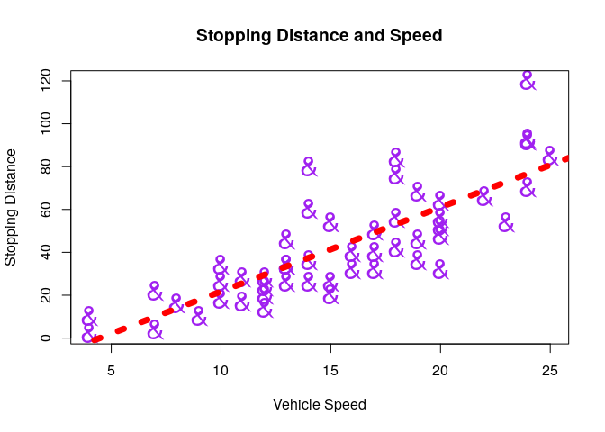

# Practical 04


## Preamble


```r
## (01) Clean up the Iris Data

# Preamble
## Install Pacman
load.pac <- function() {
  
  if(require("pacman")){
    library(pacman)
  }else{
    install.packages("pacman")
    library(pacman)
  }
  
  pacman::p_load(xts, sp, gstat, ggplot2, rmarkdown, reshape2, ggmap,
                 parallel, dplyr, plotly, tidyverse, reticulate, UsingR, Rmpfr,
                 swirl, corrplot, gridExtra, mise, latex2exp, tree, rpart)
  
}

load.pac()
 mise()
```


 
 
 
 
 
 
 
 
 
 
 
 
 
 
 
 
 
 
 
 
 
 
 
 
 
 
 
 
 
 
 
 
 
 
 
 
 
 
 
 
 
 
 
 
 
 
 
 
 

For the project it will be necessary to:

1. Generate Random Binomial Distributions
2. View elements of a matrix
3. Use:
   * Loops, and
   * Conditional Statements
4. Visualise Results

## (01) Binomial Distribution and Viewing Elements in a Matrix

### Create Binomial Values


```r
n <- 10 # Matrix Size
binom_values <- rbinom(n^2, size = 20, prob = 0.45)
```

### Create a matrix of Binomial Values


```r
(starting_point <- matrix(binom_values, nrow = 10))
```

```
##       [,1] [,2] [,3] [,4] [,5] [,6] [,7] [,8] [,9] [,10]
##  [1,]   10   10    9   11   10   11    8    7    5     5
##  [2,]   11   10    8   10   10   10    6    7   15    11
##  [3,]   12    8   11    9    9    8   11   10    8    11
##  [4,]   13   10   10    5    8    9    6   11   10    10
##  [5,]    8    8    9   13   12   10   10    9    5     7
##  [6,]   10   10   10   11    8   12    6   11    8    11
##  [7,]   12    9   10    9   12   10    8   11    8    12
##  [8,]    8   10    8   10   11   10    8   10    6    11
##  [9,]    7   12    7    8   11    5   11    9   10    10
## [10,]    8   12   12    9    9    7   13   10    8    11
```

#### Looping through a matrix


```r
for (r in 1:nrow(starting_point)) {
  for (c in 1:ncol(starting_point)) {
      cat(starting_point[r,c])
  }
 cat("\n")
}
```

```
## 101091110118755
## 11108101010671511
## 128119981110811
## 1310105896111010
## 88913121010957
## 10101011812611811
## 1291091210811812
## 8108101110810611
## 712781151191010
## 812129971310811
```

## (02) Visualise Data Based on a Condition

### Create the Conditional Matrix

In order to visualise a matrix based on a condition it is necessary to create a truth matrix, there are two ways to do this, the ordinary way:


```r
zero <- starting_point>10
```

and with nested `for` loops, which may be necessary for some certain tasks:


```r
for (r in 1:nrow(starting_point)) {
  for (c in 1:nrow(starting_point)) {
    if (starting_point[r, c] < 10) {
      zero[r, c] <- 1
    }
  }
}
zero
```

```
##       [,1] [,2] [,3] [,4] [,5] [,6] [,7] [,8] [,9] [,10]
##  [1,]    0    0    1    1    0    1    1    1    1     1
##  [2,]    1    0    1    0    0    0    1    1    1     1
##  [3,]    1    1    1    1    1    1    1    0    1     1
##  [4,]    1    0    0    1    1    1    1    1    0     0
##  [5,]    1    1    1    1    1    0    0    1    1     1
##  [6,]    0    0    0    1    1    1    1    1    1     1
##  [7,]    1    1    0    1    1    0    1    1    1     1
##  [8,]    1    0    1    0    1    0    1    0    1     1
##  [9,]    1    1    1    1    1    1    1    1    0     0
## [10,]    1    1    1    1    1    1    1    0    1     1
```

### Plot the Conditional Matrix

#### Base Plot

The base plot involves using `par` to set graphical parameters to to initialise a blank canvas, rotating the matrix 90 degrees clockwise and then passing that rotated matrix to the `image()` function:


```r
# Create a Plotting Region
par(pty = "s", mai = c(0.1, 0.1, 0.4, 0.1))

# Rotate matrix 90-degrees clockwise.
rotate <- function(x) {
    t(apply(x, 2, rev))
}

# create the image
image(rotate(zero), col = c(3, 6), axes = FALSE, frame.plot = TRUE, main = "Values > 10")
```


##### Rotation
It is necessary to rotate the matrix 90 degrees clockwise before passing it to the `image()` function in order for it to line up correctly, this is achieved by reversing the order of the columns (rotating around a horizontal line) and then rotating around the line y=x or `#1 = #2`.


```r
vals <- c()

for (r in 1:5) {
    for (c in 1:5) {
        vals <- c(vals, paste0(c, ",", r))
    }
}

(dummy_mat <- matrix(vals, nrow = sqrt(length(vals))))
```

```
##      [,1]  [,2]  [,3]  [,4]  [,5] 
## [1,] "1,1" "1,2" "1,3" "1,4" "1,5"
## [2,] "2,1" "2,2" "2,3" "2,4" "2,5"
## [3,] "3,1" "3,2" "3,3" "3,4" "3,5"
## [4,] "4,1" "4,2" "4,3" "4,4" "4,5"
## [5,] "5,1" "5,2" "5,3" "5,4" "5,5"
```

```r
rotate(dummy_mat)
```

```
##      [,1]  [,2]  [,3]  [,4]  [,5] 
## [1,] "5,1" "4,1" "3,1" "2,1" "1,1"
## [2,] "5,2" "4,2" "3,2" "2,2" "1,2"
## [3,] "5,3" "4,3" "3,3" "2,3" "1,3"
## [4,] "5,4" "4,4" "3,4" "2,4" "1,4"
## [5,] "5,5" "4,5" "3,5" "2,5" "1,5"
```

The image function will allocate values along the cartesian plane:

* from (0, 0) along the $x$ - axis and then
* from (0, 1) along the $x$ -axis and then 
* from (0, 2) along the $x$ -axis and so on
* ...

but the values will be read as vertical columns (say the matrix has 5 rows as above):

* from [1,1] to [5, 1]
* from [2,1] to [5, 2]
* from [3,1] to [5, 3]
* ...

This has the effect of the matrix being plotted at a rotation of 90 degrees ACW and hence the input data must be rotated 90 degrees CW.


#### Using `ggplot2` 

Generally to make a heatmat in ggplot2, use the following syntax:


```r
set.seed(8398)
x       <- LETTERS[1:10]
y       <- paste("var", 1:10)
data    <- expand.grid("x" = x, "y" = y)
data$z  <- factor(sample(1:2, 100, replace = TRUE))
data %>% head()
```

```
##   x     y z
## 1 A var 1 1
## 2 B var 1 1
## 3 C var 1 2
## 4 D var 1 1
## 5 E var 1 1
## 6 F var 1 2
```

```r
ggplot(data, aes(x = x, y = y, fill =z)) +
  geom_tile()
```


The `expand.grid` function basically just treats `x` and `y` as the axis of a data Frame that is then transformed into a *longer* or *tidy* format.

The benefit to using `expand.grid` is that `x` and `y` will always be arranged as they would be on a cartesian plane and then the data is transformed into a tidy format.

You'll notice, if you inspect the output of `expand.grid` that the values are entered into the data frame from 'bottom-to-top, left-to-right', hence if:

* the rows of a matrix are considered the $y$ -axis, and
* the columns the $x$ -axis 

The values of the matrix would feed into the expand grid row-wise, starting from the bottom moving up, **_R_** converts matrices to vectors column-wise from left to right, so it would be necessary to rotate the matrix [90 degrees clockwise](https://www.geeksforgeeks.org/rotate-a-matrix-by-90-degree-in-clockwise-direction-without-using-any-extra-space/), this is what's done by the `rotate()` function.

When using `ggplot2` it is necessary to make sure that row and column names are ordered factors otherwise they will be plotted incorectly (i.e as floating points or out of order), So first use the `paste()` function to create nice column and row names:


```r
# Functions to Name the Rows and Columns
make_colnames <- function(mat) {
                     factor(paste("col", 1:ncol(mat)),
                            levels = paste("col", 1:ncol(mat)),
                            ordered = TRUE)
}
make_rownames <- function(mat) {
                     factor(paste("row", 1:nrow(mat)),
                            levels = paste("row", 1:nrow(mat)),
                            ordered = TRUE)
}

make_rownames_rev <- function(mat) {
                     factor(paste("row", nrow(mat):1),
                            levels = paste("row", nrow(mat):1),
                            ordered = TRUE)
}

make_ynames <- function(mat) {
                     factor(paste("y=", 1:nrow(mat)),
                            levels = paste("y=", 1:nrow(mat)),
                            ordered = TRUE)
}
make_xnames <- function(mat) {
                     factor(paste("x=", 1:ncol(mat)),
                            levels = paste("x=", 1:nrow(mat)),
                            ordered = TRUE)
}


rownames(zero) <- make_rownames(zero)
colnames(zero) <- make_colnames(zero)
```

Now plot the matrix using `expand.grid()`


```r
# Create a Cartesian Plane of column names and the rownames backwards
    # This function will then convert that table into tidy format.
data <- expand.grid("x" = make_colnames(zero), "y" = make_rownames_rev(zero))
# Rotate the Matrix 90 degrees clockwise
data$z <- as.vector(rotate(zero))

# Print the Plotted Data
zero
```

```
##        col 1 col 2 col 3 col 4 col 5 col 6 col 7 col 8 col 9 col 10
## row 1      0     0     1     1     0     1     1     1     1      1
## row 2      1     0     1     0     0     0     1     1     1      1
## row 3      1     1     1     1     1     1     1     0     1      1
## row 4      1     0     0     1     1     1     1     1     0      0
## row 5      1     1     1     1     1     0     0     1     1      1
## row 6      0     0     0     1     1     1     1     1     1      1
## row 7      1     1     0     1     1     0     1     1     1      1
## row 8      1     0     1     0     1     0     1     0     1      1
## row 9      1     1     1     1     1     1     1     1     0      0
## row 10     1     1     1     1     1     1     1     0     1      1
```

```r
ggplot(data, aes(x = x, y = y, fill =z)) +
  geom_tile()
```


##### As a Function

All together, functions to plot a matrix as a heatmap are:


```r
# Rotate matrix 90-degrees clockwise.
rotate <- function(x) {
    t(apply(x, 2, rev))
}

rotate_ACW <- function(x) {
    t(apply(x, 1, rev))
}
  


  # Create Column Names  
make_colnames <- function(matrL) {
                     factor(paste("col", 1:ncol(matrL)),
                            levels = paste("col", 1:ncol(matrL)),
                            ordered = TRUE)
}

 # Create Row Names
make_rownames <- function(matrL) {
                     factor(paste("row", 1:nrow(matrL)),
                            levels = paste("row", 1:nrow(matrL)),
                            ordered = TRUE)
}

# Create Row Names with reversed Order
make_rownames <- function(matrL) {
                     factor(paste("row", nrow(matrL):1),
                            levels = paste("row", nrow(matrL):1),
                            ordered = TRUE)
}


expand.grid_matrix <- function(mat) {
  data <- expand.grid("x" = make_colnames(mat), "y" = make_rownames_rev(mat))
  data$z <- as.vector(rotate(mat))
  
  return(data)
}

(unsquare_test_matrix <- matrix(factor(sample(1:3, 36, replace = TRUE)), nrow = 9))
```

```
##       [,1] [,2] [,3] [,4]
##  [1,] "1"  "1"  "1"  "3" 
##  [2,] "2"  "1"  "2"  "3" 
##  [3,] "1"  "2"  "3"  "2" 
##  [4,] "2"  "3"  "1"  "2" 
##  [5,] "3"  "1"  "1"  "1" 
##  [6,] "2"  "2"  "3"  "2" 
##  [7,] "1"  "2"  "2"  "3" 
##  [8,] "3"  "1"  "2"  "3" 
##  [9,] "3"  "2"  "2"  "3"
```

```r
data <- expand.grid_matrix(unsquare_test_matrix)

ggplot(data, aes(x = x, y = y, fill =z)) +
  geom_tile()
```




##### Use Data Frames (not expand.grid())
Given that the data is already in the form of a matrix, it may be more convenient (or make the plotting process easier to understand) to work with data frames, in order to do this:

  1. Reverse the direction of the columns so that columns are numbered from bottom to top (as they would be on a cartesian plane).
  2. convert the matrix to a dataframe / tibble
     + Make sure that any names are ordered factors, otherwise ggplot will rearrange them into alphabetical order.
  3. Transform the data into `long` format using `pivot_longer`.

So first use the `paste()` function to create nice column and row names:


```r
# Functions to Name the Rows and Columns
make_colnames <- function(mat) {
                     factor(paste("col", 1:ncol(mat)),
                            levels = paste("col", 1:ncol(mat)),
                            ordered = TRUE)
}
make_rownames <- function(mat) {
                     factor(paste("row", 1:nrow(mat)),
                            levels = paste("row", 1:nrow(mat)),
                            ordered = TRUE)
}

make_ynames <- function(mat) {
                     factor(paste("y=", 1:nrow(mat)),
                            levels = paste("y=", 1:nrow(mat)),
                            ordered = TRUE)
}
make_xnames <- function(mat) {
                     factor(paste("x=", 1:ncol(mat)),
                            levels = paste("x=", 1:nrow(mat)),
                            ordered = TRUE)
}
```
  
  Now implement steps 1 to 3; reverse the matrix direction, create a data frame and finally make a tidy data frame:


```r
set.seed(9832832)
zero <- zero==1

# 0. Name the Rows and Columns
  colnames(zero) <- make_colnames(zero)
  rownames(zero) <- make_rownames(zero)
    ## Row Names are reversed relative to y-axis values

# 1. Reverse the Columns
  zero_rev_col <- apply(zero, 2, rev)

# 2. Create a Data Frame
  z_tb <- as_tibble(zero_rev_col)
    # z_tb <- as.data.frame(zero_rev_col) # df is fine
  z_tb <- cbind(r = rownames(zero_rev_col), z_tb)
  
    ## Make a Column of Row Names, must be a factor.
      z_tb <- cbind("y" = make_ynames(zero), z_tb)
      
# 3. Transform the Data into a long format
z_long <- pivot_longer(z_tb, cols = names(z_tb)[-c(1,2)],
                       names_to = "x", 
                       values_to = "z")

  ## Super Important that column names are ordered Factors
        # Otherwise ggplot will rearrange
  z_long$x <- factor(z_long$x, levels = unique(z_long$x), ordered = TRUE)
    # x-value and column numbers will match 

  
# Print the Matrix
zero
```

```
##        col 1 col 2 col 3 col 4 col 5 col 6 col 7 col 8 col 9 col 10
## row 1  FALSE FALSE  TRUE  TRUE FALSE  TRUE  TRUE  TRUE  TRUE   TRUE
## row 2   TRUE FALSE  TRUE FALSE FALSE FALSE  TRUE  TRUE  TRUE   TRUE
## row 3   TRUE  TRUE  TRUE  TRUE  TRUE  TRUE  TRUE FALSE  TRUE   TRUE
## row 4   TRUE FALSE FALSE  TRUE  TRUE  TRUE  TRUE  TRUE FALSE  FALSE
## row 5   TRUE  TRUE  TRUE  TRUE  TRUE FALSE FALSE  TRUE  TRUE   TRUE
## row 6  FALSE FALSE FALSE  TRUE  TRUE  TRUE  TRUE  TRUE  TRUE   TRUE
## row 7   TRUE  TRUE FALSE  TRUE  TRUE FALSE  TRUE  TRUE  TRUE   TRUE
## row 8   TRUE FALSE  TRUE FALSE  TRUE FALSE  TRUE FALSE  TRUE   TRUE
## row 9   TRUE  TRUE  TRUE  TRUE  TRUE  TRUE  TRUE  TRUE FALSE  FALSE
## row 10  TRUE  TRUE  TRUE  TRUE  TRUE  TRUE  TRUE FALSE  TRUE   TRUE
```

```r
# Make The Heatmap
ggplot(z_long, aes(x = x, y = y, fill = z)) +
  geom_tile()
```


###### Create a Function

Now that the matrix can be converted into a tidy data frame, we'll wrap that process into a function (with vim use `va{` , `y`, `p`, `va{:s/zero/mat/g<cr>`):


```r
matrix_as_long_tib <- function(mat) {
  
# 0. Name the Rows and Columns
  colnames(mat) <- make_colnames(mat)
  rownames(mat) <- make_rownames(mat)
    ## Row Names are reversed relative to y-axis values

# 1. Reverse the Columns
  mat_rev_col <- apply(mat, 2, rev)

# 2. Create a Data Frame
  z_tb <- as_tibble(mat_rev_col)
    # z_tb <- as.data.frame(mat_rev_col) # df is fine
  z_tb <- cbind(r = rownames(mat_rev_col), z_tb)
  
    ## Make a Column of Row Names, must be a factor.
      z_tb <- cbind("y" = make_ynames(mat), z_tb)
      
# 3. Transform the Data into a long format
z_long <- pivot_longer(z_tb, cols = names(z_tb)[-c(1,2)],
                       names_to = "x", 
                       values_to = "z")

  ## Super Important that column names are ordered Factors
        # Otherwise ggplot will rearrange
  z_long$x <- factor(z_long$x, levels = unique(z_long$x), ordered = TRUE)
    # x-value and column numbers will match 
  
  return(z_long)
}

(unsquare_test_matrix <- matrix(sample(c(TRUE, FALSE), replace = TRUE, size = 6^2), nrow = 9))
```

```
##        [,1]  [,2]  [,3]  [,4]
##  [1,]  TRUE FALSE  TRUE  TRUE
##  [2,] FALSE FALSE  TRUE  TRUE
##  [3,] FALSE  TRUE  TRUE  TRUE
##  [4,]  TRUE FALSE  TRUE FALSE
##  [5,]  TRUE FALSE FALSE  TRUE
##  [6,]  TRUE  TRUE  TRUE FALSE
##  [7,]  TRUE  TRUE  TRUE FALSE
##  [8,] FALSE  TRUE FALSE  TRUE
##  [9,] FALSE  TRUE FALSE  TRUE
```

```r
# (unsquare_test_matrix <- matrix(sample(c(TRUE, FALSE), replace = TRUE, size = 6^2), nrow = 6))
#(unsquare_test_matrix <- zero)


z_long <- matrix_as_long_tib(unsquare_test_matrix)
ggplot(z_long, aes(x = x, y = y, fill = z)) +
  geom_tile()
```


