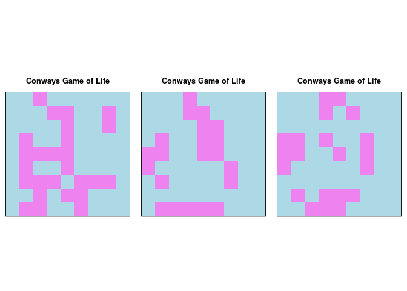

# Practical 04


## Preamble


```r
## (01) Clean up the Iris Data

# Preamble
## Install Pacman
load.pac <- function() {
  
  if(require("pacman")){
    library(pacman)
  }else{
    install.packages("pacman")
    library(pacman)
  }
  
pacman::p_load(xts, sp, gstat, ggplot2, rmarkdown, reshape2, ggmap,
               parallel, dplyr, plotly, tidyverse, reticulate, UsingR, Rmpfr,
               swirl, corrplot, gridExtra, mise, latex2exp, tree, rpart,
               rstudioapi, plot.matrix)

  
}

load.pac()
```

```
## Loading required package: pacman
```

```r
 mise()
```



## The main function

Generally we want the game of life script to run something like this:


```r
main <- function(n = 20, prob = 0.3, cycles = 100) {
  
 # Initial mat_zerorix 
  mat_zero <- rbinom(n^2, size = 1, prob) %>% matrix(nrow = n)
  
  while (cycles > 0 && sum(mat_zero)!=0 ) {
    mat_zero <- reproduction_rules(mat_zero)
    # Plot after change so when it finishes it finishes all dead
    make_matrix_plot(mat_zero) # %>% print()
    Sys.sleep(0.1)
    cycles <- cycles-1
  }
}


# main()
```

Which means that it is necessary to create functions to describe:

* `reproduction_rules()`
    + The rules that describe what the matrix will do each iteration
* `make_matrix_plot()`
    + How to plot the matrix
        + Having tried `ggplot2` and `plot.matrix` it seems pretty clear that
          I'm going to need to use the base packages simply for speed


### Reproduction Rules
These rules will depend on another matrix that I've called the *neighbour_count* transform, it is a corresponding matrix counting the number of a neighbours a given matrix element has, out of anything that's what will probably slow the code down the most so it should certainly be a seperate function.


```r
reproduction_rules <- function(mat) {
  count_mat <- neighbour_count(mat)
  mat[count_mat < 2]  <- 0 # UnderPop
  mat[count_mat > 3] <- 0  # OverPop
  mat[mat == 0 & count_mat == 3] <- 1 # Reproduce
  return(mat)
}
```

### Make Matrix Plot

Plotting the matrix is a little tricky, step by step:

1. `make_walls_dead()`
    + I was playing with the idea of encoding walls as 9's, the benefit being to be able to make more complex simulations later on
2. `par()` 
    + set up plotting parameters for an upcoming base plot, this will create a blank canvas
3. `image()`
   + Plot numbers as an image
   
  


```r
  make_matrix_plot <- function (mat) {
    mat <- make_walls_dead(mat)
    par(pty = "s", mai = c(0.1, 0.1, 0.4, 0.1))
    image(rotate(mat), col = c("lightblue", "grey", "violet"),
          axes = FALSE,
          frame.plot = TRUE,
          main = "Conways Game of Life")
  }


  rotate <- function(x) {
      t(apply(x, 2, rev))
  }
  
  
  make_walls_dead <- function(mat) {
    mat[mat==9] <- 0
    return(mat)
  }
```


#### GGPlot2
I couldn't get this to display correctly and again it was slow, this is the function I was using though:


```r
  make_matrix_ggplot <-  function(mat) {
    data <- expand.grid_matrix(mat)
    plot <- ggplot(data, aes(x = x, y = y, fill =z)) +
      geom_tile() + 
      theme(axis.text.x=element_blank()) +
      theme(axis.text.y=element_blank()) +
      scale_fill_manual(labels = c("Dead", "Alive"),
                         values = c("grey", "green")) +
      labs(title = "Conways Game of Life", x = "", y = "")
      print(plot)
  }
```


#### plot.matrix
This is a package somebody else put together, I really like it, but, it doesn't get printed out when running a `for` loop and at this stage I don't care enough to figure out why.

### What Functions are Missing

I always loose track of which functions I haven't defined yet, so sometimes it's easier to just call `main()` and see what happens:


```r
# main()
```

```
Error in neighbour_count(mat) : could not find function "neighbour_count"
```
So this clearly shows that the next missing function is `neighbour_count`.

#### Neighbour Count

So the idea of this function is to create a matrix of the corresponding counts for each entry, this is what will slow everything down, so we'll benchmark it using `sys.time()`.

this works by going through every term in a matrix and then summing the surrounding terms.

One of the reasons for seperating Surrounding Sum and Neighbour count is so I can carefully make sure that the distance of influence could be changed from 1 unit to any number of units distance.


```r
neighbour_count <- function(mat) {
  count_mat <- mat
  for (r in 1:nrow(mat)) {
    for (c in 1:ncol(mat)) {
      n <- surrounding_sum(mat, r, c)
      count_mat[r,c] <- n
    }
  }
  return(count_mat)
}
```

##### Surrounding Sum

Summing the surrounding terms is a problem that seems easy at first but quickly becomes difficult, this problem being walls, what is an elegant way to deal with walls?

One solution is to pad the matrix with 0's, this however could be slow and I'm not sure how it will scale, quick googling suggests that, in order of fastest to slowest:


```r
# Later on I may want to make a cell of distance two half as influential
  # That's why I've included the `l` (length) variable.

surrounding_sum  <- function(mat, r, c, l = 1) {
  # Pad Matrix by 1 (and increment row/column count)
  mat      <- pad_matrix(mat); r <- r+1; c <- c+1
  mat      <- make_walls_dead(mat) # Make 9s 0
  
  # Add the Neighbour Cells (subtract the cell of interest)
  sum_of_neighbours <- sum(mat[(r-l):(r+l), (c-l):(c+l)]) - mat[r,c]
  
  return(sum_of_neighbours)
}
```

What I did try was using `cbind()` and `rbind()`; this doesn't work, it's way too slow, the issue is that those functions are inefficient to begin with, running them inside a nested loop over a matrix inside the final loop is just too inefficient, a better solution

this is a lot more efficient:


```r
pad_matrix <- function(mat, l = 1) {
  # Make variables to describe starting length and width
  nr <- nrow(mat)
  nc <- ncol(mat)
  
  # What should the new sizes be?
  nr_pad <- nr + l*2 # multiply by 2 for top/bottom
  nc_pad <- nc + l*2 # multiply by 2 for top/bottom
  
  # Make a blank Matrix
  matbig <- matrix(9, nr_pad, nc_pad)
  
  # Fill the blank matrix with the original matrix accordingly
    # so we need just need to offset the matrix by:
        # l+1 so it starts filing from l and stops at nr + l
  matbig[ (l+1):(nr + l), (l+1):(nc + l)] <- mat
  
  return(matbig)
  
}
```

###### Sanity Check

An easy way to sanity check whether this is working is to generate a few random matrices and pad them:


```r
rmat <- function(){
  matrix(rint(30), nrow = rint()/10+  + 2, ncol = rint()/10 + 2)
}

rint <- function(n=1) {
  sample(1:99, n, replace = TRUE)
}

(random_mat <- rmat())
```

```
## Warning in base::matrix(...): data length [30] is not a sub-multiple or multiple
## of the number of rows [11]
```

```
##       [,1] [,2] [,3] [,4] [,5]
##  [1,]   67   57   70   95   96
##  [2,]   17   93   26   19   23
##  [3,]    1   49   63    4   17
##  [4,]   95   96   88   13   15
##  [5,]   19   23   50   76   83
##  [6,]    4   17   65   57   27
##  [7,]   13   15   77   36   58
##  [8,]   76   83    1   69   47
##  [9,]   57   27   67   57   70
## [10,]   36   58   17   93   26
## [11,]   69   47    1   49   63
```

```r
random_mat %>% pad_matrix()
```

```
##       [,1] [,2] [,3] [,4] [,5] [,6] [,7]
##  [1,]    9    9    9    9    9    9    9
##  [2,]    9   67   57   70   95   96    9
##  [3,]    9   17   93   26   19   23    9
##  [4,]    9    1   49   63    4   17    9
##  [5,]    9   95   96   88   13   15    9
##  [6,]    9   19   23   50   76   83    9
##  [7,]    9    4   17   65   57   27    9
##  [8,]    9   13   15   77   36   58    9
##  [9,]    9   76   83    1   69   47    9
## [10,]    9   57   27   67   57   70    9
## [11,]    9   36   58   17   93   26    9
## [12,]    9   69   47    1   49   63    9
## [13,]    9    9    9    9    9    9    9
```


### Conclusion

If you run this in an IDE that displays the ouput in the same window like **_R_** *Studio* does you will have a little animation of to the right-side.


```r
layout(matrix(1:3, nrow =1))
main(n = 9, cycles = 3)
```

<!-- -->

