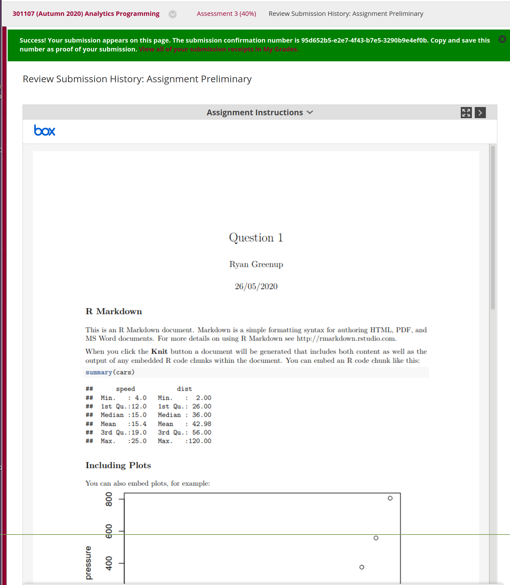

# Preamble
## Load Packages

```{r, results = FALSE}
## (01) Clean up the Iris Data

# Preamble
## Install Pacman
load.pac <- function() {
  
  if(require("pacman")){
    library(pacman)
  }else{
    install.packages("pacman")
    library(pacman)
  }
  
  pacman::p_load(xts, sp, gstat, ggplot2, rmarkdown, reshape2, ggmap,
                 parallel, dplyr, plotly, tidyverse, reticulate, UsingR, Rmpfr,
                 swirl, corrplot, gridExtra, mise, latex2exp, tree, rpart, knitr,
                 bookdown, tidyverse, tidyr)
  
}

load.pac()
```

## Knitr Configuration
### Make Chunks verbose
```{r, results = FALSE}
knitr::opts_chunk$set(echo = TRUE, eval = TRUE)
```

### Set Figure Locations
```{r opts, results = FALSE}
knitr::opts_chunk$set(
  fig.path = "figure/"
)
```


# Question 1
## d. Submission Receipt
The submission receipt for the preliminary assessment is provided as a screenshot at figure \ref{fig:chunk-label} and the recipt number is:

>`95d652b5-e2e7-4f43-b7e5-3290b9e4ef0b`

```{r chunk-label, out.width="80%", fig.cap="Receipt from preliminary submission"}

```

## e. Set Variables

```{r}
studentname <- "Ryan Greenup"
studentno   <- 17805315 
```

## f. Print Variables
### i. Show the Code Without the Results

```{r results=FALSE, echo = TRUE, eval = FALSE}
print(studentname)
print(studentno)
```

### ii. Show the Evaluated Output in the Document

```{r results=TRUE, echo = FALSE, eval = TRUE}
print(studentname)
print(studentno)
```

### ii. Show the Evaluated Output and corresponding code in the Document

```{r results=TRUE, echo = TRUE, eval = TRUE}
print(studentname)
print(studentno)
```

# Question 2 
## 1. Write a function that takes a vector of numbers as its input data and randomly picks 10% of thenumbers, then writes that subsample into a new vector
the `sample` function can be used to take a sample from a vector:

```{r}
subsample <- function(vec) {
  n <- length(vec)
  sample(vec, size = 0.1*n, replace = FALSE) 
                           ## For a bootstrap replace should be TRUE
}

```

## 2. Test your function by creating a vector of 1000 random samples from a normal distribution withmean 1 and standard deviation 2, and then sampling 100 numbers from it.
The `rnorm` function can be used to generate normally distributed values and passing this to the previously defined `subsample` function will extract a random sample of 10% of the values:

```{r}
norm_values <- rnorm(n = 1000, mean = 1, sd = 2)
(norm_ss <- subsample(norm_values))
```

## 3. Output the mean and standard deviation of the 100-number subsample
```{r}
rbind(c(
  "Mean"   = mean(norm_ss),
  "StdDev" = sd(norm_ss))
  )
```

## 4. Call the function 100 times to get 100 different 100-number subsamples of the same 1000-numbervector as used above, calculate their means and standard deviations, and then plot histograms of themeans and standard deviations of the subsamples.

First resample the vector of values 100 times and produce a matrix using `replicate`[^1]:
```{r}
## Resample the Values
boot_vals <- replicate(100, {
  subsample(norm_values)
})
```
Each Column of the output matrix corresponds to a seperate sample, so in order to get the mean and sd of each sample the `apply` function can be used, specifying the `MARGIN` argument as `2` in order to denote function operating column-wise.

```{r}
## Collumns correspond to the sample number and the rows to obsevations
## 
## Calculate the mean values
sample_means <- apply(boot_vals, 2, mean)

## Calculate the STD Dev
sample_sd    <- apply(boot_vals, 2, sd)
```

In order to plot the histograms it is first necessary to manipulate the data such that it is in a `tidy` format, this can be done by using the `tidyr` package, then the histograms can be plotted using `ggplot2`.

```{r}
data <- data.frame(means = sample_means, sds = sample_sd)
tidy_data <- tidyr::pivot_longer(cols = c(means, sds), data = data, names_to = "Parameter")
tidy_data$Parameter <- factor(tidy_data$Parameter, labels = c("Mean", "SD"), ordered = FALSE)
tidy_data

ggplot(tidy_data, aes(x = value, fill = Parameter, y = ..density..)) +
  geom_histogram(col = "black", binwidth = 0.1) +
  facet_grid(. ~ Parameter, scales = "free_x") +
  theme_bw()  +
  labs(x = "Value", y = "Density",
       title = TeX('Bootstrapped Descriptive statistics from $X \\sim \\textit{N} (2,1)$'))
##  stat_function(fun = dnorm, args = list(mean = mean(data$means),
##                                         sd = sd(data$means)))

```

# Question 3
## 1. Display the image in a plot.
## 2. Plot only the red colour plane.
> The JPEG image comprises separate images (or “planes”) in the three primary colours, Red, Greenand Blue. Plot only the Red colour plane.
## 3. Plot a histogram of the Red values of all the pixels in the image.
## 4. Plot the red, green and blue pixel values of all the pixels in a horizontal line across the middle of theimage (i.e. all pixels with a vertical index of 256).
# Question 4
## a.Imimtate a sequence of Dice Rolls
> Try to imitate a sequence of dice rolls. Create a vector of numbers (1, 2, 3, 4, 5, 6), of length 51. Beas random as you can. Do this before you read the rest of the question. (Or, get someone else to doit.) Print your sequence.My fake sequence: 132654544213651245523511251656545222161524366215433
## b. Devise a test to real dice-rolling, 
> Can we devise a test to distinguish between the fake dice-rolling and real dice-rolling, i.e. a trulyrandom process? One method is based on the observation that people tend to put fewer runs ofnumbers in their sequences than you find in random sequences. Write code to count the number ofruns of 1 (i.e. each number that is not followed by the same number), 2 (i.e. 2 consecutive numbersthe same), 3 and 4.
## c.How many runs of each length would we get if the data were truly random? 
> How many runs of each length would we get if the data were truly random? Write a loop to simulate105sets of 51 tosses, storing the number of runs of each length (1, 2, 3, 4). Plot the histogram of runs(i.e. total number of runs of each length added up over al

[^1]: `replicate` is a wrapper for `sapply` and is usually quicker than using a loop, loops using a dynamic vector are often slow, `replicate` has the added benefit that it is not necessary to define a static vector either.
