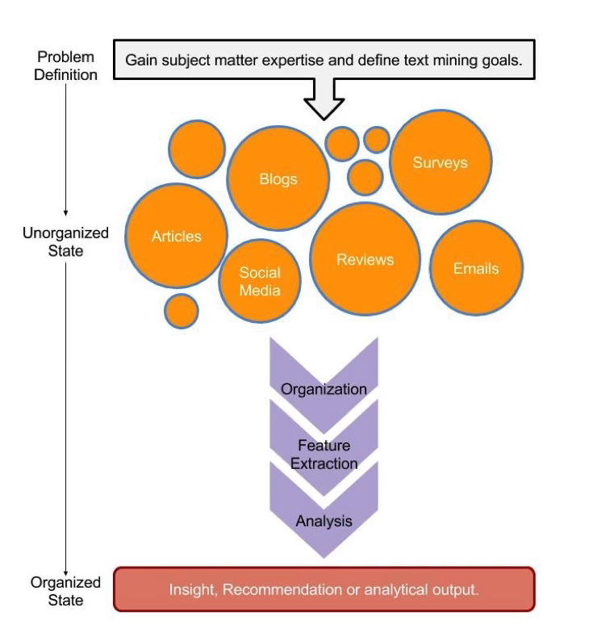
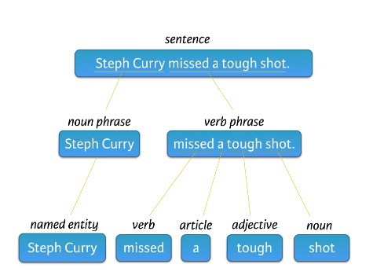
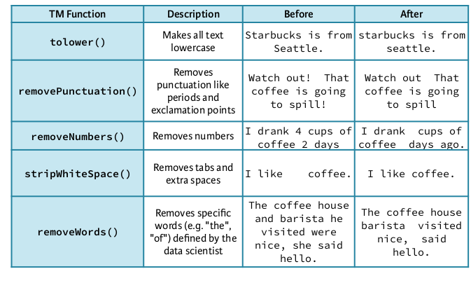

[[toc]]

# Text Mining Using Bag of Words 

Refer to the [Slides here](../../../MD/attachments/DataSci/TextMining/TextminingBagWordsCh1.pdf)

## Preamble

The following code will set up a nice working environment:


```{r setup, include=FALSE, echo = FALSE, warning = FALSE, fig.align="center"}
# Remember in vim, :setfoldmethod=manual and zfaf to fold
# Code chunks thatnks to
# Plug 'coachshea/vim-textobj-markdown'
#' First check that pacman is installed and install it if it isn't

if (require("pacman")) {
  library("pacman")
}else{
  install.packages("pacman")
  library("pacman")
}

#'Now use pacman to load everything you're going to want

pacman::p_load(xts, sp, gstat, ggplot2, rmarkdown, reshape2, ggmap, mise,
               parallel, dplyr, plotly, tidyverse, qdap, tm, SnowballC)

#'in order to make sure this script can stand on it's own two
#'feet I'll make sure to clear everything that's ungood

mise()

MyVim <- function(){
  library(rstudioapi)
  system(paste("kitty -e nvim ", rstudioapi::getSourceEditorContext()$path, "& disown"))
}


Myema <- function(){
  library(rstudioapi)
  #system(paste("ema", rstudioapi::getSourceEditorContext()$path, "& disown"))
  system(paste("emacsclient --create-frame", rstudioapi::getSourceEditorContext()$path, "& disown"))
}

MyEmacs <- function(){
  library(rstudioapi)
  #system(paste("ema", rstudioapi::getSourceEditorContext()$path, "& disown"))
  system(paste("/usr/bin/env XLIB_SKIP_ARGB_VISUALS=1 emacs", rstudioapi::getSourceEditorContext()$path, "& disown"))
}

naut <- function(){
  library(rstudioapi)
  system(paste("nautilus ", rstudioapi::getSourceEditorContext()$path, "& disown"))
}
	       

```


## (01) Jumping into Text Mining with bag of words

### What is text Mining

#### General outline

The idea of text mining is to reduce the amount of information, often there is
too much information to work with. The goal is to reduce information and
highlight what's important.

A Text mining work-flow looks like this:



There is a work-flow to follow:

1. Define the problem and specific goals
2. Identify the text to be collected
3. Organize the text
4. Extract Features from the text
5. Analyse the Text
6. Make a Conclusion


#### Types of Text Mining Strategies

##### Semantic parsing

This is based on word syntax, you are interested in:

1. Word type
2. Word Order



Semantic parsing follows a tree structure to break up the text and apply tags to
the text, such as adjective, part of a sentence, name etc.

So semantic parsing is feature rich because there are a lot of output variables.

##### Bag of Words
The bag of words method does not care about word type or order and instead words
are just attributes of the document.

[This Course](https://campus.datacamp.com/courses/intro-to-text-mining-bag-of-words/jumping-into-text-mining-with-bag-of-words?ex=1)
is only concerned with the bag of words method, later courses in the
[Text mining skill Track](https://www.datacamp.com/tracks/text-mining-with-r)
deal with semantic parsing.

### Quick Taste of Text Mining
Some times it is sufficient to look at word frequency only, for example:

```{r}
text <- "Text mining usually involves the process of structuring the input text. The overarching goal is, essentially, to turn text into data for analysis, via application of natural language processing (NLP) and analytical methods."

new_text <- "DataCamp is the first online learning platform that focuses on building the best learning experience specifically for Data Science. We have offices in New York, London and Belgium and to date, we trained over 3.8 million (aspiring) data scientists in over 150 countries. These data science enthusiasts completed more than 185 million exercises. You can take free beginner courses, or subscribe for $29/month to get access to all premium courses."

# Load qdap
library(qdap)

# Print new_text to the console
new_text

# Find the 10 most frequent terms: term_count
term_count <- freq_terms(new_text, 4)
summary(term_count)
 
head(term_count)

# Plot term_count
plot(term_count)

# Plot Using GGPlot2
## Col (use this)
 ggplot(data = term_count, aes(x = WORD, y = FREQ, col = -FREQ, fill = WORD)) +
    geom_col() +
    guides(col = FALSE, fill = FALSE)
    
    
```

it's easy to tell that this is bag of words not semantic because the type of words isn't considered by the function that was used.

### Getting Started

A corpus is a collection of documents, so first it is necessary to load in data and determine which columns correspond to features.
When importing data it is important to specify `stringsAsFactors = FALSE` because otherwise the `read.csv()` function will import `character` strings as `factor` levels.

```{r}
tweets <- read.csv("~/Dropbox/Notes/DataSci/0DataSets/TextMining/coffee.csv",
    stringsAsFactors = FALSE)
str(tweets)
# isolate the text
coffee_tweets <- tweets$text
```

Now that the data is loaded in as a vector, it is necessary to convert the vector containing the text into a `corpus` data type. a `corpus` is a collection of documents but **_R_** recognizes it as a data type. 

A corpus can be stored as a *volatile corpus* in memory as `VCorpus` as well as *Permanent corpus* which is saved to disk as `PCorpus` 

to make a *volatile Corpus* **_R_** needs to interpret each element from the vector of text `coffee_tweets` as a as a document, the `tm` package provides `source`  functions to do that:

```{r}
library(tm)
coffee_source <- tm::VectorSource(coffee_tweets)
coffee_source  %>% head()
```

Now that the vector is a source object it needs to be passed to `tm::VCorpus()` in order to create a *volatile corpus* object:

> The `VCorpus` object is a nested list, at each index there is a `PlainTextDocument` object which is a list containing text data known as `content` and some medadata known as `meta`, so in order to access the 15th document you would use `coffee_corpus[[15]]` and then the `content` or `meta` could be accessed with `[1]` or `[2]`.  

```{r}
# Make the Corpus Object
coffee_corpus <- tm::VCorpus(coffee_source)

# Print the object
print(coffee_corpus)

# Print the 15th tweet
print(coffee_corpus[[15]])[1]

# or use content()
NLP::content(coffee_corpus[[15]])
```

### Make a VCorpus from a data Frame

If the text data is in a data frame you just use the `DataframeSource()` rather than extracting the vector. The data must have a specific structure:

* Column **One** must be called `doc_id` and each row must have a unique string.
* Column **two** must be called `text` with `UTF-*` encoding
* All following columns will be metadata.

```{r}
# Create a dummy data frame
example_text <- data.frame(doc_id = 1:3, text = c("Text mining is fun", "Text analysis provides insights", "qdap and tm are used in text mining"), author = c("John", "Jim", "Bill"), date = c(1514953399, 1514866998, 1514680598)) 
example_text

# Create a text Source File
df_source <- tm::DataframeSource(example_text)
class(df_source) 
head(df_source) 

# Create a Volatile Corpus
df_corpus <- tm::VCorpus(df_source)
print(df_corpus)

# Examine the Meda Data 
NLP::meta(df_corpus)
```

### Cleaning and Preprocessing Text

Now that we have a corpus we need to start cleaning up the raw data



The *bag of words* text mining approach is such that cleaning helps to aggregate terms, for example it makes sense for the words `mine` , `miner`  and `mining` to all simply be considered as the word `mine`.

Common preprocessing functions inlcude:

* `base::tolower()` 
* `tm::removePunctuation()` 
* `tm::removeNumbers()` 
* `tm::stripWhitespace()` 

```{r}
text <- "<b>She</b> woke up at       6 A.M. It\'s so early!  She was only 10% awake and began drinking coffee in front of her computer."

# Make lowercase
tolower(text)

# Remove punctuation
tm::removePunctuation(text)

# Remove numbers
tm::removeNumbers

# Remove whitespace
tm::stripWhitespace(text)

# Convert it from HTML to LaTeX
if (grep(pattern = '<b>', x = text)) {
    textTeX <- text
    textTeX <- gsub(pattern = '<br>' , replacement = "\\\\"  , textTeX)
    textTeX <- gsub(pattern = '<b>'  , replacement = "\\\textbf{", textTeX)
    textTeX <-  gsub(pattern = '</b>', replacement = "}"     , textTeX)
    # Huh % is hard
    textTeX <-  gsub(pattern = '%', replacement = "\\\\%"     , textTeX)
    print(textTeX)
}

```

### Cleaning with `qdap`

the `qdap` package offers other text cleaning functions:

* `bracketX()` 
  * will remove text within brackets
* replace_number()
  * turn numbers into words
* replace_abbreviation()
  * Create Full text from abbreviations.
* replace_contraction()
* replace_symbols()
  * turn words into symbols


```{r}
text <- "Text mining usually involves the process of structuring the input text. The overarching goal is, essentially, to turn text into data for analysis, via application of natural language processing (NLP) and analytical methods."

## text is still loaded in your workspace

# Remove text within brackets
qdap::bracketX(text.var = text)

# Replace numbers with words
qdap::replace_number(text)

# Replace abbreviations
qdap::replace_abbreviation(text)

# Replace contractions
qdap::replace_contraction(text)

# Replace symbols with words
qdap::replace_symbol(text)
```


### All about Stop Words
Some words are frequent but more or less meaningless with respect to the *bag of words* method, these words include things like `I`, `the`, `will` et cetera.

Another example is a word for which meaning has already been accounted, in this case all the tweets are to do with `coffee` , so it will occur at a high rate of frequency and will demean any other possible insights that might be drawn from this analysis.

new words can be removed by using the vector `all_stops`: 

```{r}
text <- "Text mining usually involves the process of structuring the input text. The overarching goal is, essentially, to turn text into data for analysis, via application of natural language processing (NLP) and analytical methods."

# List standard English stop words
tm::stopwords("en")

# Print text without standard stop words
tm::removeWords(text, stopwords("en"))

# Add "coffee" and "bean" to the list: new_stops
new_stops <- c("coffee", "bean", stopwords("en"))

# Remove stop words from text
tm::removeWords(text, new_stops)
```

### Intro to word stemming and stem completion

the `tm`  package provides the `stemDocument()` function to get to a word's root.
This function either:

* `character` vector -->  `character` vector`character` vector
* `PlainTextDocument` --> `PlainTextDocument`  

Then `stemCompletion()` can be used to reconstruct the words back into a known term.
`stemCompletion()` accepts a character vector and a completion dictionary.

```{r}
library(SnowballC)
# Create complicate
complicate <- c("complicated", "complication", "complicatedly") 

# Perform word stemming: stem_doc
stem_doc <- tm::stemDocument(complicate)

# Create the completion dictionary: comp_dict
comp_dict <- "complicate"

# Perform stem completion: complete_text 
complete_text <- tm::stemCompletion(stem_doc, comp_dict)


# Print complete_text
complete_text
```

### Word stemming and stem completion on a sentence
Sentences are considered by **_R_** as a single character vector, before word stemming can be used it is necessary to split the sentence up into multiple words:

```{r}
text_data <- "In a complicated haste, Tom rushed to fix a new complication, too complicatedly."

# Remove punctuation: rm_punc
rm_punc <- tm::removePunctuation(text_data)

# Create character vector: n_char_vec
n_char_vec <- unlist(strsplit(rm_punc, split = " "))

# Perform word stemming: stem_doc
stem_doc <- tm::stemDocument(n_char_vec)

# Create the completion Dictionary
comp_dict  <- c("In", "a", "complicate", "haste", "Tom", "rush", "to", "fix", "new", "too")

# Print stem_doc
stem_doc

# Re-complete stemmed document: complete_doc
complete_doc <- tm::stemCompletion(stem_doc, comp_dict)

# Print complete_doc
complete_doc
```


### Apply preprocessing steps to a corpus

the `tm`  package provides the `tm_map()`  function to apply cleaning functions to an entire corpus, making the cleaning steps easier. It takes two argumens:

1. A `corpus` object
2. A cleaning function (like `removeNumbers()` 
   * If cleaning functions come from base **_R_** or `qdap` rather than `tm` it is necessary to wrap them in `content_transformer()`.

It is often more appropriate to write this is a function and then call the function.

```{r}
clean_corpus <- function (corpus) {
    # Remove Punctuation
    corpus <- tm_map(corpus, removePunctuation)

    # Transform to Lower Case
    corpus <- tm_map(corpus, content_transformer(tolower))

    # Add more Stopwords
    corpus <- tm_map(corpus, removeWords, words = c(stopwords("en"), "coffee", "mug"))

    # Strip Whitespace
    corpus <- tm_map(corpus, stripWhitespace)

    return(corpus)
}

clean_corp <- clean_corpus(df_corpus)
print(clean_corp[[2]])
```

### The TDM and DTM

With the text in a clean form it is necessary to give it structure, as far as *bag of text* text mining is concenerned, either the: 

* Term Document Matrix (TDM), OR
* Document Term Matrix (DTM)
  * These are useful when you want to preserve time series for chronological data.

is used.

Think **Row**-**Col**-Matrix, where a term is extracted word and the column is the document (i.e. the tweet).

A TDM looks like this:

| **Tweet 1** | **Tweet 2** | **Tweet 3** | **Tweet 4** |
| ---         |         --- |         --- |         --- |
| **Term 1**  |           0 |           0 |           0 |
| **Term 2**  |           1 |           1 |           0 |
| **Term 3**  |           1 |           1 |           0 |
| **Term 4**  |           0 |           0 |           3 |
| **Term 5**  |           0 |           0 |           1 |

A DTM looks like this:

| **Term 1**  | **Term 1** | **Term 2** | **Term 3** | **Term 4** | **Term 5** |
| ---         |        --- |        --- |        --- |        --- |        --- |
| **Tweet 1** |          2 |          1 |          1 |          0 |          0 |
| **Tweet 2** |          0 |          1 |          1 |          0 |          0 |
| **Tweet 3** |          0 |          1 |          0 |          0 |          0 |
| **Tweet 4** |          0 |          0 |          0 |          3 |          1 |

They can be created by using either the `TermDocumentMatrix`  or `DocumentTermMatrix` functions.

The `qdap` package relies on the word frequency matrix, but this is less popular and so wont be used. it's basically just a matrix with only one column.

#### Application to Coffee Dataset
So now we'll apply this to the coffee dataset by first importing the data and arranging the columns

```{r}
# Load the Data Set
coffee <- read.csv(file = "../../0DataSets/TextMining/coffee.csv",
		   stringsAsFactors = FALSE) 

# Investigate the Data
str(coffee)
names(coffee)


# Move the text column
text_num <- grep("text", names(coffee))
coffee <- coffee[,c(text_num, (1:ncol(coffee)[-text_num]))]
names(coffee)

# Move the id column
column_id_num <- grep("id", names(coffee))
coffee <- coffee[,c(column_id_num, (1:ncol(coffee))[-column_id_num])]
names(coffee) <- c("doc_id", names(coffee)[-1])
names(coffee)
```

Now the data frame can be made a source and then a VCorpus:

```{r}
coffee_source <- tm::DataframeSource(coffee)
coffee_corpus <- tm::VCorpus(coffee_source)
print(coffee_corpus)
```

Now we will reclean it by using the previous function (remember `*`  jumps to a previous documnent):

```{r}
clean_corp <- clean_corpus(coffee_corpus)
```

Now we can create the document term matrix.

```{r}
# Create the document-term matrix from the corpus
coffee_dtm <- tm::DocumentTermMatrix(clean_corp)
coffee_tdm <- tm::TermDocumentMatrix(clean_corp)

# Print out coffee_dtm data
coffee_dtm

# Convert coffee_dtm to a matrix
coffee_m <- as.matrix(coffee_dtm)

# Print the dimensions of coffee_m
dim(coffee_m)

# Review a portion of the matrix to get some Starbucks
 # so documents 25 to 35, columns matching star or bucks.
coffee_m[25:35, c("star", "starbucks")]
```


## (2) Word Clouds and More Interesting Visuals

## Common Text Mining Visuals

### Frequent Terms with `TM` 

First create the coffee *Term Document Matrix*:


```{r}
# Create the document-term matrix from the corpus
coffee_dtm <- tm::DocumentTermMatrix(clean_corp)
coffee_tdm <- tm::TermDocumentMatrix(clean_corp)
```
Now convert the `tdm` to a matrix: 

```{r}
coffee_m <- as.matrix(coffee_tdm)
str(coffee_m)
## summary(coffee_m)
## head(coffee_m)
```

Now in order to get the overall frequency of terms, take the sum of each row, which will give the total number of a term and then sort that by frequency


```{r}
# Calculate the row sums of coffee_m
term_frequency <- rowSums(coffee_m, na.rm=FALSE, dims = 1)

# Sort term_frequency in decreasing order
term_frequency <- sort(x = term_frequency, decreasing = TRUE)
```

Now view the top 10 most common Words

```{r}
head(term_frequency, 10)
```

Now plot a barchart of the 10 most common words

```{r}
barplot(term_frequency[1:5], col = "tan", las = 2)
```

This can also be done in ggplot2:

>note that by default GGPlot2 will arrange the names by alphabetical order, to prevent this it is necessary to make sure that the the names are an `ordered` `factor` by using `df$name <- factor(df$name, levels=df$name, ordered=TRUE`, it doesn't matter whether this is specified before or after the order is applied, when the tibble is printed in should say `<ord>` as opposed to `<chr>` or `<fct>`. 

```{r}
# Create a Tibble
term_frequency.Tib <- tibble::enframe(term_frequency)

# Order the Tibble
## Using  Base Functions
term_frequencyDF <- data.frame("names" = names(term_frequency), "value" = term_frequency)
head(term_frequencyDF)
term_frequency.Tib$name <- factor(term_frequencyDF$name, levels = term_frequencyDF$name[order(term_frequencyDF)], ordered = TRUE)
print(term_frequency.Tib)

## Using dplyr Arrange
term_frequency.Tib <- tibble::enframe(term_frequency)
term_frequency.Tib <- dplyr::arrange(term_frequency.Tib, desc(value))
term_frequency.Tib$name <- factor(term_frequency.Tib$name, ordered = TRUE, levels = term_frequency.Tib$name)
term_frequency.Tib

### Using dplyr Group by
# Sort the first few terms of the Tibble
# sort(x = term_frequency.Tib[1:10,]$value, decreasing=TRUE)
#term_frequency_Desc <- term_frequency.Tib[1:10,] %>% group_by(value)

# Use GGplot2 To plot them

ggplot(data = term_frequency.Tib[1:10,], aes(x = name, y = value)) +
       geom_col(col = "IndianRed", fill = "lightBlue") +
       theme_bw()
   labs(x = "Word", y = "Frequency", title = "Frequency of Word Use")

# If you do have trouble creating ordered factors an ugly hack to force the order is:

#ggplot(data = term_frequency_Desc, aes(x = reorder(name, -value), y = value)) +
#       geom_col(col = "IndianRed", fill = "lightBlue") +
#       theme_bw()
#   labs(x = "Word", y = "Frequency", title = "Frequency of Word Use")

```


## (3) Adding to Text-Mining Skills

## (4) Battle of the Tech Giants 


