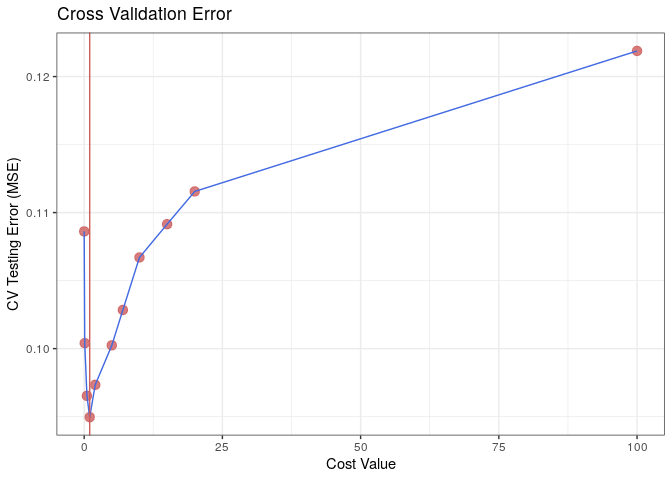

# (Wk 8) Introduction to Data Science
Material of Tue 23 April 2019, week 8

## Heading 1

### Part A ; Classificatoin Variable


```r
autoTB <- as_tibble(Auto)
autoTB <- dplyr::mutate(autoTB, EfficientQ =  ifelse(autoTB$mpg < median(autoTB$mpg), 0, 1) )
```

### Fit an SVM

#### Fit the Model
The model may be fitted by using the `e1071::svm` function, make sure to specify:

* `kernel = "linear"`
  - In order to have a linear kernel
* `cost = ...`
  - In order to have some parameter to measure the cost of a value violating the delineating hyperplane.
* `scale = TRUE`
  - Because the various predictive features have differing units of measurement
    - `cylinders` is integer
    - `displacement` is CC or CubInch
    - `acceleration` is m/s/s 
    - etc.
  - It is necessary to scale them to mean of 0 and sd of 1.


```r
library(e1071)

svm(formula = EfficientQ ~.-mpg, data = autoTB, kernel = "linear", cost = 10, scale = TRUE)
```

```
## 
## Call:
## svm(formula = EfficientQ ~ . - mpg, data = autoTB, kernel = "linear", 
##     cost = 10, scale = TRUE)
## 
## 
## Parameters:
##    SVM-Type:  eps-regression 
##  SVM-Kernel:  linear 
##        cost:  10 
##       gamma:  0.003215434 
##     epsilon:  0.1 
## 
## 
## Number of Support Vectors:  308
```

#### Use various values of Cost
In order to consider various cost parameters use the `e1071::tune()` function similarly to the `svm` function but omit the `cost` parameter and instead assign the `ranges` parameter a list containing a vector of `cost` values.

It will be necessary to titrate the cost values in order to reach the most appropriate value, by default the `tune` method applied 10-Fold CV.


```r
SVM.CV <- e1071::tune(method = svm, EfficientQ ~.-mpg, data = autoTB, kernel = "linear", ranges = list(cost = c(0.001, 0.1, 0.5, 1, 2, 5, 7, 10, 15, 20, 100)))

svmCVError <- SVM.CV %>% summary()
```


##### Plot the CV Errors


```r
CV.tb <- as_tibble(svmCVError$performances)
best          <- as.numeric(svmCVError[2])
costBestIndex <- CV.tb[["error"]] == best
bestCost      <- CV.tb[["cost"]][costBestIndex]


ggplot(data = CV.tb, aes(x = cost, y = error)) + 
  geom_point(size = 3, col = "IndianRed", alpha = 0.8) +
  geom_line(col = "RoyalBlue") +
  labs(x = "Cost Value", y = "CV Testing Error (MSE)", title = "Cross Validation Error") +
  theme_bw() +
  geom_vline(xintercept = bestCost, col = "IndianRed")
```

<!-- -->

##### Revise the Error

We can do better than that so we will choose values on the interval [0.5, 1.5]


```r
SVM.CV <- e1071::tune(method = svm, EfficientQ ~.-mpg, data = autoTB, kernel = "linear", ranges = list(cost = seq(from = 0.5, to = 1.5, length.out = 10)))

svmCVError <- SVM.CV %>% summary()
```


```r
CV.tb <- as_tibble(svmCVError$performances)
best          <- as.numeric(svmCVError[2])
costBestIndex <- CV.tb[["error"]] == best
bestCost      <- CV.tb[["cost"]][costBestIndex]


ggplot(data = CV.tb, aes(x = cost, y = error)) + 
  geom_point(size = 3, col = "IndianRed", alpha = 0.8) +
  geom_line(col = "RoyalBlue") +
  labs(x = "Cost Value", y = "CV Testing Error (MSE)", title = "Cross Validation Error") +
  theme_bw() +
  geom_vline(xintercept = bestCost, col = "IndianRed")
```

<!-- -->

The best cost parameter corresponds to an expected model error of 0.31 .

## (c) Differing Kernels

When using non-linear kernels be very mindful to specify gamma in the model and in tuning.

### Radial

Leave the gamma between 1 and 5 and adjust the cost, the summary will return the best performing values as determined by 10-fold cross-validation.


```r
SVM.CV <- e1071::tune(method = svm, EfficientQ ~.-mpg, data = autoTB, kernel = "radial", ranges = list(gamma = seq(from = 1, to = 7, length.out = 10),   cost = seq(from = 0.5, to = 15 , length.out = 10)))

svmCVError <- SVM.CV %>% summary()
```


```r
CV.tb <- as_tibble(svmCVError$performances)
best          <- as.numeric(svmCVError[2])
costBestIndex <- CV.tb[["error"]] == best
bestCost      <- CV.tb[["cost"]][costBestIndex]

CV.tb
```

```
## # A tibble: 100 x 4
##    gamma  cost  error dispersion
##    <dbl> <dbl>  <dbl>      <dbl>
##  1  1      0.5 0.0999    0.0125 
##  2  1.67   0.5 0.197     0.00949
##  3  2.33   0.5 0.243     0.0181 
##  4  3      0.5 0.259     0.0216 
##  5  3.67   0.5 0.267     0.0225 
##  6  4.33   0.5 0.272     0.0228 
##  7  5      0.5 0.276     0.0231 
##  8  5.67   0.5 0.279     0.0234 
##  9  6.33   0.5 0.283     0.0237 
## 10  7      0.5 0.285     0.0240 
## # … with 90 more rows
```

```r
ggplot(data = CV.tb, aes(x = cost, y = error, col = gamma)) + 
  geom_point(size = 3, col = "IndianRed", alpha = 0.8) +
  geom_line(col = "RoyalBlue") +
  labs(x = "Cost Value", y = "CV Testing Error (MSE)", title = "Cross Validation Error") +
  theme_bw() +
  geom_vline(xintercept = bestCost, col = "IndianRed")
```

<!-- -->

### Polynomial


```r
SVM.CV <- e1071::tune(method = svm, EfficientQ ~.-mpg, data = autoTB, kernel = "polynomial", ranges = list(cost = seq(from = 0.5, to = 1.5, length.out = 25)))

svmCVError <- SVM.CV %>% summary()
```


```r
CV.tb <- as_tibble(svmCVError$performances)
best          <- as.numeric(svmCVError[2])
costBestIndex <- CV.tb[["error"]] == best
bestCost      <- CV.tb[["cost"]][costBestIndex]


ggplot(data = CV.tb, aes(x = cost, y = error)) + 
  geom_point(size = 3, col = "IndianRed", alpha = 0.8) +
  geom_line(col = "RoyalBlue") +
  labs(x = "Cost Value", y = "CV Testing Error (MSE)", title = "Cross Validation Error") +
  theme_bw() +
  geom_vline(xintercept = bestCost, col = "IndianRed")
```

<!-- -->

### Best Performing Kernel


