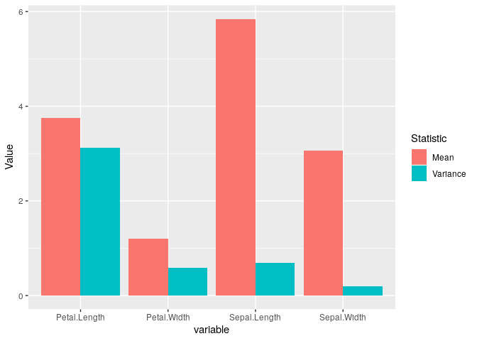
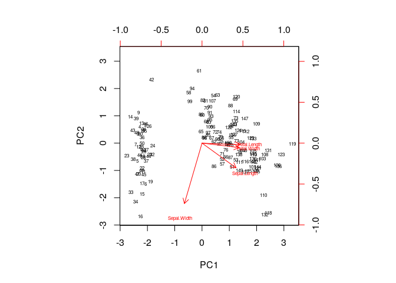
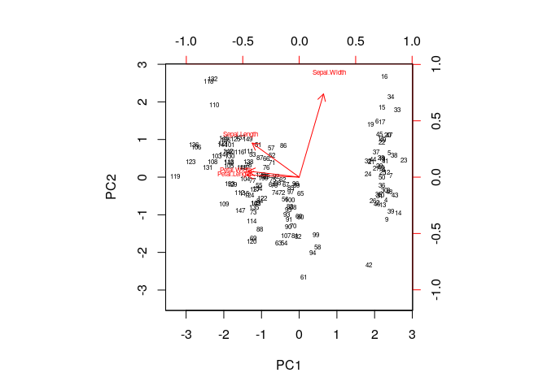
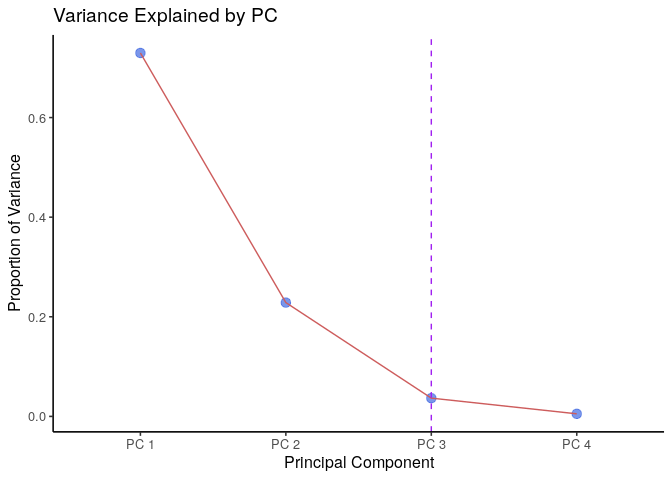
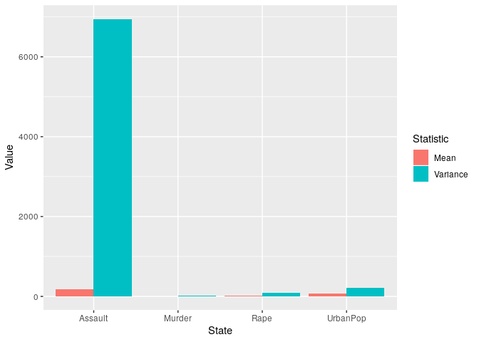
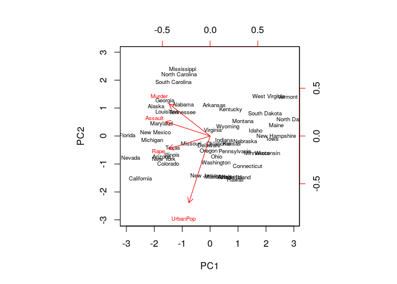
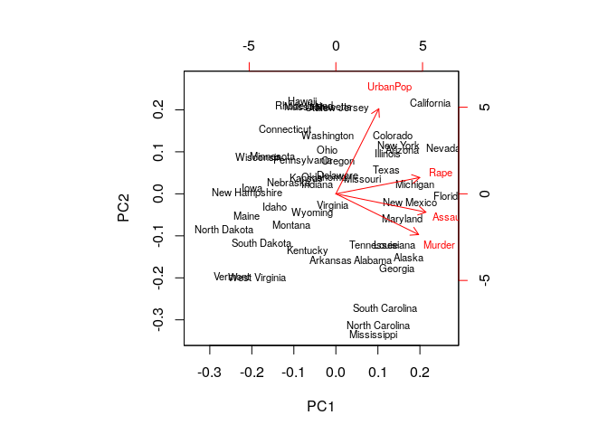
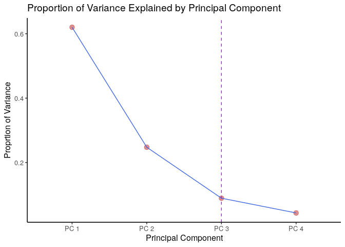

# (Wk 10) Introduction to Data Science
Material of Tue 13 May 2019, week 11

## Iris Data

### Load and inspect the Data Set

```r
irisTB <- as_tibble(iris)
head(iris)
```

```
##   Sepal.Length Sepal.Width Petal.Length Petal.Width Species
## 1          5.1         3.5          1.4         0.2  setosa
## 2          4.9         3.0          1.4         0.2  setosa
## 3          4.7         3.2          1.3         0.2  setosa
## 4          4.6         3.1          1.5         0.2  setosa
## 5          5.0         3.6          1.4         0.2  setosa
## 6          5.4         3.9          1.7         0.4  setosa
```

```r
#str(iris)
#summary(iris)
#dim(iris)
```

This data set has 4 predictive features and a categorical output variable that represents the plant species.

The mean values may be returned by using the `summary()` command:


```r
#means <- summary(iris)[4,-5]
means <- data.frame(SL = mean(irisTB[["Sepal.Length"]]), SW = mean(irisTB[["Sepal.Width"]]), PL = mean(irisTB[["Petal.Length"]]), PW = mean(irisTB[["Petal.Width"]])) 
vars <- data.frame(SL = var(irisTB[["Sepal.Length"]]), SW = var(irisTB[["Sepal.Width"]]), PL = var(irisTB[["Petal.Length"]]), PW = var(irisTB[["Petal.Width"]])) 
           
desc.stats <- rbind(means, vars)
desc.stats
```

```
##          SL        SW       PL        PW
## 1 5.8433333 3.0573333 3.758000 1.1993333
## 2 0.6856935 0.1899794 3.116278 0.5810063
```
### Descriptive Statistics


```r
desc.stats <- data.frame(
Mean = apply(irisTB[-5], 2, mean), # 1 is rows, 2 is cols p. 401 ISL TB
Variance = apply(irisTB[-5], 2, var) # 1 is rows, 2 is cols p. 401 ISL TB
)
desc.stats$variable <- row.names(desc.stats)

descStatsTidy <- pivot_longer(desc.stats, cols = c(Mean, Variance), names_to = "Statistic", values_to = "Value")

ggplot(descStatsTidy, aes(x = variable, y = Value, fill = Statistic)) +
  geom_col(position = "dodge")
```

<!-- -->

The mean values will be adjusted and centred at 0 by default when performing PCA, however, the differing amounts of variance that occurs across the variables will cause most of the principal components to be driven by `petal.length` because of it's high variance as opposed to `sepal.width`, for this reason the variance needs to be scaled so only the variance between the variables are considered; this can be specified with the parameter `scale = TRUE`.

### Perform a Principal Component Analysis
When performing PCA, remember to pull out any predictive variables.


```r
irisTB <- irisTB[-5]
pca.mod <- prcomp(irisTB, scale = TRUE)
pca.mod
```

```
## Standard deviations (1, .., p=4):
## [1] 1.7083611 0.9560494 0.3830886 0.1439265
## 
## Rotation (n x k) = (4 x 4):
##                     PC1         PC2        PC3        PC4
## Sepal.Length  0.5210659 -0.37741762  0.7195664  0.2612863
## Sepal.Width  -0.2693474 -0.92329566 -0.2443818 -0.1235096
## Petal.Length  0.5804131 -0.02449161 -0.1421264 -0.8014492
## Petal.Width   0.5648565 -0.06694199 -0.6342727  0.5235971
```

### Display the Principal Component Loading vectors
The loading vectors correspond to the `rotation` matrix in the model:


```r
print(pca.mod$rotation, digits = 2)
```

```
##                PC1    PC2   PC3   PC4
## Sepal.Length  0.52 -0.377  0.72  0.26
## Sepal.Width  -0.27 -0.923 -0.24 -0.12
## Petal.Length  0.58 -0.024 -0.14 -0.80
## Petal.Width   0.56 -0.067 -0.63  0.52
```

These values are the $\phi_{i,j}$ that are used to create the linear combination that represents the Principal Component line in the $n$ dimensional space, so for example $\phi_{3, 2}$ will be the 3rd feature, 2nd principal component, $\phi$ value and will also correspond to (row, col) = (3,2) in the above matrix.


The first two principal components will be:

* $i$ is the observation
* $j$ is the feature
* $m$ is the Principal Component.
* $\phi_{j, m}$ is the $m$th principal component of the $j$th feature
* $z_{i,m}$ is the $m$th principal compoenent for the $i$th observations
  - In this case $m$ is like a new feature and $i$ is the new feature.
* $x_{i,j}$ is the $i$th observation for the $j$th feature.
* $x_{i,j}$ \approx \sum^n_{m=1} \left[ z_{i,m} \cdot \phi_{j,m} \right]$
  - The trick to remembering the rows columns etc. is that it will be all explained by alphabetical order, e.g. $\phi_{j,m} \in \Phi$ is a matrix with the features up/down as rows and the PC's as left/right cols.

### Return the first to Principal Components


$$
\begin{align}
&\textbf{PC1:} \\
Z_{1} &= \begin{bmatrix} SL_i & SW_i & PL_i & PW_i \end{bmatrix} \times \begin{bmatrix} 0.52 \\ -0.26 \\ 0.58 \\ 0.56 \end{bmatrix} \\
& = 0.52 \cdot SL_i - 0.26 \cdot SW_i +0.58 \cdot PL + 0.56 \cdot PW \\
\ \\
\ \\

&\textbf{PC2:} \\
Z_{2} &= \begin{bmatrix} SL_i & SW_i & PL_i & PW_i \end{bmatrix} \times \begin{bmatrix} -0.37 \\ -0.92 \\ -0.02 \\ -0.07 \end{bmatrix} \\
&= -0.377 \cdot SL_i - 0.92 \cdot SW_i -0.02  \cdot PL -0.07 \cdot PW
\end{align}
$$
### Draw the biplot
make sure to specify the `scale=0` argument, this ensures that the arrows are scaled to represent the loadings; other values for `scale` give slightly different biplots with different interpretations.

```r
biplot(pca.mod, scale = 0, cex = 0.5)
```

<!-- -->

```r
#ggbiplot(pca.mod, scale = 0, cex = 0.5, )
```

### (9) Rotate the Plot and Compare
The principle components are identical if they are positive or negative, so the plot may be rotated:


```r
pca.modR <- pca.mod
pca.modR$rotation <- -pca.mod$rotation 
pca.modR$x <- -pca.mod$x

biplot(pca.modR, scale = 0, cex = 0.5)
```

<!-- -->

This plot is identical, it's merely been rotated 180 degrees.

### (10) Discuss and graph the proportion of variance explained by the principal components


```r
pcaVar <- pca.mod$sdev^2
pcaVarpr <- pcaVar/sum(pcaVar)
pcaVarpr <- enframe(pcaVarpr)
# pcaVarpr <-  dplyr::rename(pcaVarpr,
#                            "Principal.Component" = name,
#                            "Proportion.Variance" = value
#                            )

names(pcaVarpr) <- c("Principal.Component", "Proportion.Variance") # This gives a warning

for (i in 1:nrow(pcaVarpr)) {
  pcaVarpr[["Principal.Component"]][i] <- paste("PC", i)
}


ggplot(data = pcaVarpr, aes( x = Principal.Component, y = Proportion.Variance, group = 1)) +
  geom_point(size = 3, alpha = 0.7, col = "RoyalBlue")  +
  geom_line(col = "IndianRed") +
  labs(x = "Principal Component", y = "Proportion of Variance", title = "Variance Explained by PC") +
  theme_classic2() +
  geom_vline(xintercept = 3, col = "purple", lty = 2)
```

<!-- -->

```r
print(pcaVarpr, digits = 1)
```

```
##   Principal.Component Proportion.Variance
## 1                PC 1               0.730
## 2                PC 2               0.229
## 3                PC 3               0.037
## 4                PC 4               0.005
```

This shows that the 3rd principal component explains over 96% of the variation within the data and hence the first two principal components would be sufficient to describe the data.


## Question 2: Using USArrest dataset built-in R.
### 1. Install the package “base” and attach the dataset “USArrests”.

```r
library(base); head(USArrests)
```

```
##            Murder Assault UrbanPop Rape
## Alabama      13.2     236       58 21.2
## Alaska       10.0     263       48 44.5
## Arizona       8.1     294       80 31.0
## Arkansas      8.8     190       50 19.5
## California    9.0     276       91 40.6
## Colorado      7.9     204       78 38.7
```

```r
Crim <- as_tibble(USArrests)
row.names(Crim) <- row.names(USArrests)
```

```
## Warning: Setting row names on a tibble is deprecated.
```

### 2. Give a short description of the dataset.

This is a data set with 4 predictive features describing crime rates and the proportion of residents within an urban population across various states of the US.

### 3/4. Examine the mean/variance of the variables in the dataset.


```r
dStatsCrim <- data.frame(
Mean = apply(Crim, 2, mean),
Variance = apply(Crim, 2, var)
)
dStatsCrim$State <- row.names(dStatsCrim)

dStatsCrimTidy <- pivot_longer(dStatsCrim, cols = c("Mean", "Variance"), names_to = "Statistic", values_to = "Value")

ggplot(dStatsCrimTidy, aes(x = State, y = Value, fill = Statistic)) +
  geom_col( position = 'dodge')
```

<!-- -->

Assault has a very large amount of variance and would hence would have most of the effect on the Principal Components merely owing to how varied the data is, instead the data should be scaled to a SD of 1 and mean of 0, this can be specified with the `scale = TRUE` parameter.


### 5. Perform Principal Component Analysis for USArrests.


```r
pcaCrimMod <- prcomp(Crim, scale = TRUE)
```

### 6. Display and explain the principal component loading vectors for the given dataset.
The principal component loading vectors may be returned by the `rotation` data frame from within the model:


```r
print(pcaCrimMod$rotation, digits = 2)
```

```
##            PC1   PC2   PC3    PC4
## Murder   -0.54  0.42 -0.34  0.649
## Assault  -0.58  0.19 -0.27 -0.743
## UrbanPop -0.28 -0.87 -0.38  0.134
## Rape     -0.54 -0.17  0.82  0.089
```

These are the coefficients used to create linear combinations of the predictive features in order to maximise the variance in creating the Principal Component lines.

### 7. Give the first two Principal components using loading parameters in part 6.

$$
\begin{align}
&\textbf{PC1:} \\
Z_{1} &= \begin{bmatrix} SL_i & SW_i & PL_i & PW_i \end{bmatrix} \times \begin{bmatrix} -0.54 \\ -0.58 \\ -0.28 \\ -0.54 \end{bmatrix} \\
& = -0.54 \cdot SL_i - 0.58 \cdot SW_i -0.28 \cdot PL - 0.54 \cdot PW \\
\ \\
\ \\

&\textbf{PC2:} \\
Z_{2} &= \begin{bmatrix} SL_i & SW_i & PL_i & PW_i \end{bmatrix} \times \begin{bmatrix} 0.42 \\ 0.19 \\ -0.87 \\ -0.17 \end{bmatrix} \\
&= 0.42 \cdot SL_i + 0.19 \cdot SW_i -0.87  \cdot PL -0.17 \cdot PW
\end{align}
$$

### 8. Draw the biplot and interpret it.

```r
biplot(pcaCrimMod, scale = 0, cex = 0.6)
```

<!-- -->

### 9. Rotate the graph and compare the results.
The direction of the Principal Component is non unique, the plot may be rotated by 180 degrees and still be identical, for example:


```r
pcaCrimModR          <- pcaCrimMod
pcaCrimModR$rotation <- -pcaCrimMod$rotation
pcaCrimModR$x        <- -pcaCrimMod$x
biplot(pcaCrimModR, cex = 0.7)
```

<!-- -->


### 10. Explain the proportion of variance explained by each PCs using graph and summarise your results.


```r
pcaVarCrim <- pcaCrimMod$sdev^2
pcaVarCrimProp <- pcaVarCrim/sum(pcaVarCrim)
pcaVarCrimProp <- enframe(pcaVarCrimProp)
names(pcaVarCrimProp) <- c("Principal.Component", "Proportion.Variance")
  
  for (i in 1:nrow(pcaVarCrimProp)) {
    
    pcaVarCrimProp[["Principal.Component"]][i] <- paste("PC", i)
    
  }

ggplot(pcaVarCrimProp, aes(x = Principal.Component, y = Proportion.Variance, group = 1)) +
         geom_point(col = "IndianRed", size = 3, alpha = 0.7) +
      geom_line(col = "royalBlue") +
  theme_classic2() +
  labs(x = "Principal Component", y = "Proprtion of Variance", title = "Proportion of Variance Explained by Principal Component") +
  geom_vline(xintercept = 3, col = "purple", lty = 2)
```

<!-- -->

```r
print(pcaVarCrimProp, digits = 2)    
```

```
##   Principal.Component Proportion.Variance
## 1                PC 1               0.620
## 2                PC 2               0.247
## 3                PC 3               0.089
## 4                PC 4               0.043
```

Over 90% of the data is explained by the first 3 principal components and hence the data may be sufficiently explained by those PC's as predictive features.


