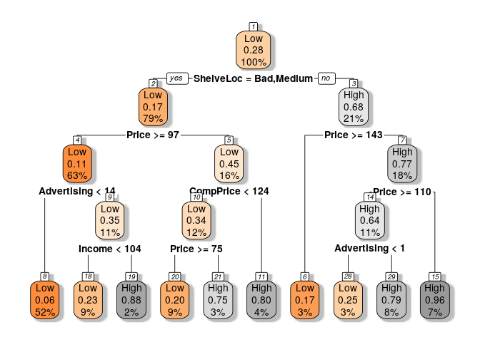
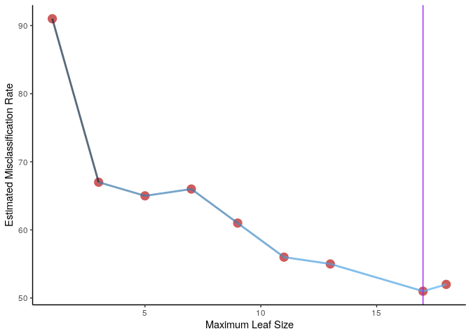
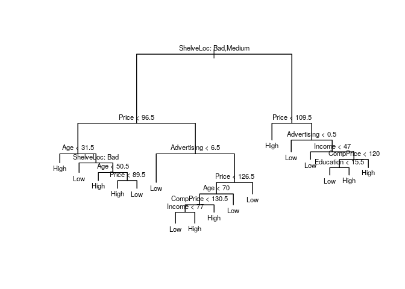
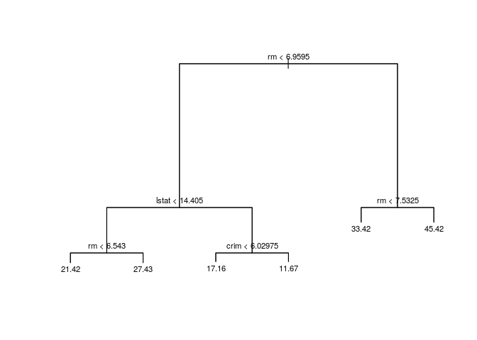
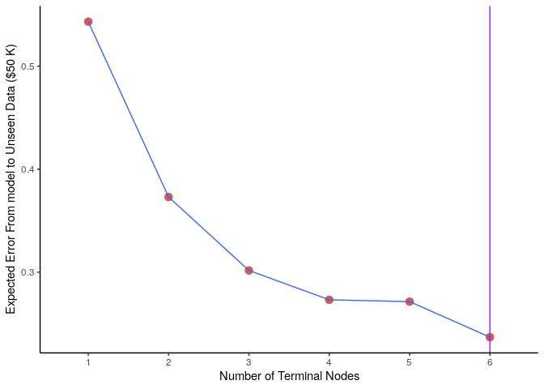
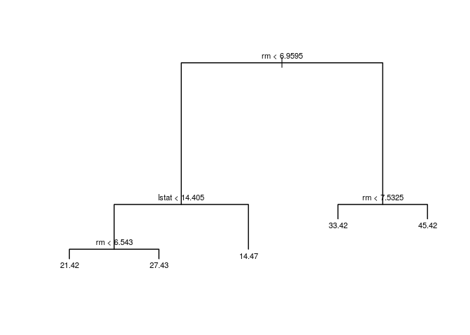
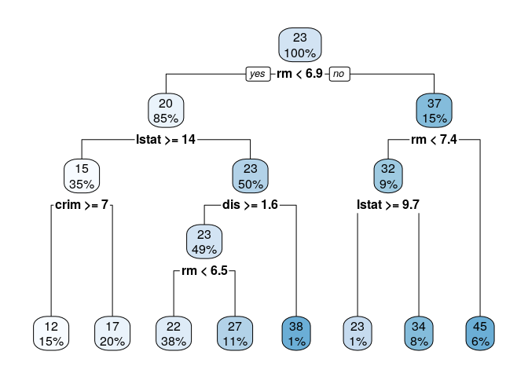

<!--  https://github.com/rstudio/rmarkdown/issues/1453#issuecomment-425327570 How to use echo       --> 


# (Wk 6) Tree Based Methods
Material of Tue 30 August 2019, week 6

## Classification Trees

Let's see what variables are predictive of high car sales, the number of sales is continuous, in order to fit a classification tree we will construct a binary variable.

When using `tree` the response variable MUST be a factor, be mindful of that.

When transforming columns to factors:

* Don't use `as.factor` because it doesn't allow specifying order
* Use tibbles because theyll tell you whether or not the column is ordered
* feed the column into `factor()`, specify the `levels = c()` in ascending order, specify `ordered = TRUE`


### Preview the data:


```r
CSeat.tb <- as_tibble(Carseats)


thresh <- (mean(CSeat.tb$Sales)+0.5*sd(CSeat.tb$Sales)) %>% round()

CSeat.tb$CatSales <- ifelse(CSeat.tb$Sales > thresh, "High", "Low")
CSeat.tb$CatSales <- factor(x = CSeat.tb$CatSales, levels = c("Low", "High"), ordered = TRUE)


CSeat.tb <- CSeat.tb[,c(12, 2:11)]
    
  # Anotherway to reorder
    dplyr::select(CSeat.tb, CatSales, everything())
```

```
## # A tibble: 400 x 11
##    CatSales CompPrice Income Advertising Population Price ShelveLoc   Age
##    <ord>        <dbl>  <dbl>       <dbl>      <dbl> <dbl> <fct>     <dbl>
##  1 High           138     73          11        276   120 Bad          42
##  2 High           111     48          16        260    83 Good         65
##  3 High           113     35          10        269    80 Medium       59
##  4 Low            117    100           4        466    97 Medium       55
##  5 Low            141     64           3        340   128 Bad          38
##  6 High           124    113          13        501    72 Bad          78
##  7 Low            115    105           0         45   108 Medium       71
##  8 High           136     81          15        425   120 Good         67
##  9 Low            132    110           0        108   124 Medium       76
## 10 Low            132    113           0        131   124 Medium       76
## # … with 390 more rows, and 3 more variables: Education <dbl>,
## #   Urban <fct>, US <fct>
```


### Fit

Now let's use all of the data to create a classification tree of the sales category.

Remember that we can use `.` to represent all the variables of a data frame;


* If `Sales` was still in the data frame we could pull it out by prefixing it with `-` but I think that's awfully confusing, instead I would recommend specifying a subset that pulls out undesired columns or just making another dataframe, it's way too easy to make a mistake like that IMO


```r
CatSalesModTree <- tree(formula = CatSales ~ ., data = as.data.frame(CSeat.tb))
CatSalesModTree
```

```
## node), split, n, deviance, yval, (yprob)
##       * denotes terminal node
## 
##   1) root 400 476.200 Low ( 0.71750 0.28250 )  
##     2) ShelveLoc: Bad,Medium 315 291.800 Low ( 0.82540 0.17460 )  
##       4) Price < 96.5 62  85.370 Low ( 0.54839 0.45161 )  
##         8) Age < 31.5 6   0.000 High ( 0.00000 1.00000 ) *
##         9) Age > 31.5 56  75.040 Low ( 0.60714 0.39286 )  
##          18) ShelveLoc: Bad 22  17.530 Low ( 0.86364 0.13636 )  
##            36) CompPrice < 123.5 17   0.000 Low ( 1.00000 0.00000 ) *
##            37) CompPrice > 123.5 5   6.730 High ( 0.40000 0.60000 ) *
##          19) ShelveLoc: Medium 34  46.660 High ( 0.44118 0.55882 )  
##            38) Age < 50.5 11   6.702 High ( 0.09091 0.90909 ) *
##            39) Age > 50.5 23  30.790 Low ( 0.60870 0.39130 )  
##              78) Price < 89.5 12  15.280 High ( 0.33333 0.66667 ) *
##              79) Price > 89.5 11   6.702 Low ( 0.90909 0.09091 ) *
##       5) Price > 96.5 253 171.800 Low ( 0.89328 0.10672 )  
##        10) Advertising < 6.5 142  21.020 Low ( 0.98592 0.01408 )  
##          20) CompPrice < 151 131   0.000 Low ( 1.00000 0.00000 ) *
##          21) CompPrice > 151 11  10.430 Low ( 0.81818 0.18182 ) *
##        11) Advertising > 6.5 111 118.400 Low ( 0.77477 0.22523 )  
##          22) Price < 126.5 65  83.200 Low ( 0.66154 0.33846 )  
##            44) Age < 70 52  70.850 Low ( 0.57692 0.42308 )  
##              88) CompPrice < 130.5 37  45.030 Low ( 0.70270 0.29730 )  
##               176) Income < 77 19   7.835 Low ( 0.94737 0.05263 ) *
##               177) Income > 77 18  24.730 High ( 0.44444 0.55556 ) *
##              89) CompPrice > 130.5 15  17.400 High ( 0.26667 0.73333 )  
##               178) Advertising < 13.5 9  12.370 High ( 0.44444 0.55556 ) *
##               179) Advertising > 13.5 6   0.000 High ( 0.00000 1.00000 ) *
##            45) Age > 70 13   0.000 Low ( 1.00000 0.00000 ) *
##          23) Price > 126.5 46  22.180 Low ( 0.93478 0.06522 )  
##            46) CompPrice < 149.5 41   9.403 Low ( 0.97561 0.02439 ) *
##            47) CompPrice > 149.5 5   6.730 Low ( 0.60000 0.40000 ) *
##     3) ShelveLoc: Good 85 106.300 High ( 0.31765 0.68235 )  
##       6) Price < 109.5 28   8.628 High ( 0.03571 0.96429 ) *
##       7) Price > 109.5 57  78.580 High ( 0.45614 0.54386 )  
##        14) Advertising < 0.5 19  19.560 Low ( 0.78947 0.21053 )  
##          28) CompPrice < 131.5 10   0.000 Low ( 1.00000 0.00000 ) *
##          29) CompPrice > 131.5 9  12.370 Low ( 0.55556 0.44444 ) *
##        15) Advertising > 0.5 38  45.730 High ( 0.28947 0.71053 )  
##          30) Income < 47 11  14.420 Low ( 0.63636 0.36364 ) *
##          31) Income > 47 27  22.650 High ( 0.14815 0.85185 )  
##            62) CompPrice < 120 10  13.460 High ( 0.40000 0.60000 )  
##             124) Education < 15.5 5   5.004 Low ( 0.80000 0.20000 ) *
##             125) Education > 15.5 5   0.000 High ( 0.00000 1.00000 ) *
##            63) CompPrice > 120 17   0.000 High ( 0.00000 1.00000 ) *
```

```r
nrow(CSeat.tb)
```

```
## [1] 400
```

```r
CatSalesModTree %>% summary()
```

```
## 
## Classification tree:
## tree(formula = CatSales ~ ., data = as.data.frame(CSeat.tb))
## Variables actually used in tree construction:
## [1] "ShelveLoc"   "Price"       "Age"         "CompPrice"   "Advertising"
## [6] "Income"      "Education"  
## Number of terminal nodes:  22 
## Residual mean deviance:  0.3897 = 147.3 / 378 
## Misclassification error rate: 0.09 = 36 / 400
```

### Plot the Model {.tabset}

#### Base

This summary is next to useless so let's plot it, when plotting it it is necessary to call `text` afterwards in order order to have lables:


```r
plot(CatSalesModTree)
text (CatSalesModTree, pretty = 0, cex = 0.6)
```

<!-- -->

```r
# #
# CatSalesModTree.rpart <- rpart(formula = CatSales ~ ., data = CSeat.tb)
# rpart.plot(CatSalesModTree.rpart, box.palette="RdBu", shadow.col="gray", nn=TRUE)
```

#### Use `rpart` 
The base plot looks truly awful, instead I would recommend using the `rpart` package, it creates a tree model using identical syntax to `tree` and then you can call `rpart.plot` directly over the model and it will work.

Be mindful that the `tree` package will split the data until each node has less than 20 observations, whereas the 'rpart' package automatically performs 10-fold cross validation [^rpart], the ratio contained in the plot is the ratio of terms satisfying the specified condition and the percentage is the percentage of all observations thence contained [^rpvig]

[^rpvig]: Refer to the [rpart Vignette](http://www.milbo.org/rpart-plot/prp.pdf)

[^rpart]: [rpart.control](https://www.rdocumentation.org/packages/rpart/versions/4.1-15/topics/rpart.control) has a default list entry of `xval=10` which corresponds to the number of CV folds.


```r
#plot(CatSalesModTree)
#text (CatSalesModTree, pretty = 0, cex = 0.6)

CatSalesModTree.rpart <- rpart(formula = CatSales ~ ., data = CSeat.tb)
rpart.plot(CatSalesModTree.rpart, box.palette="OrGy", shadow.col="gray", nn=TRUE)
```

<!-- -->

I have no clue if an `rpart` tree object behaves well so I'm just going to use one for plotting and the other for modelling up until I have time to look into them.


### Evaluate the tree by using a validation Split

In order to very quickly evaluate the performance of this model, split the data and use the model on unseen data.


```r
train <- sample(1:nrow(Carseats), 200)

#Create the Categorical variable

CSeat <-  Carseats
CSeat$CatSales <- ifelse(Carseats$Sales < round(mean(Carseats$Sales)), "Low", "High")
CSeat$CatSales <- factor(CSeat$CatSales, levels = c("Low", "High"), ordered = TRUE)

#Create the model on the training data only
carseats.tree <- tree(CatSales ~ ., data = CSeat[train,names(CSeat) != "Sales"])
 # plot(carseats.tree) ;text(carseats.tree, pretty = 0, cex = 0.6)

carseats.tree.rpart <- rpart(CatSales ~ ., data = CSeat[train,-1], model = TRUE) # Model = True stops later errors
#rpart.plot(carseats.tree.rpart, nn = TRUE)

# Create Predictions on the testing data
test.pred <- predict(object = carseats.tree, newdata = CSeat[-train,], type = "class" )

# Filter out the observations in the testing data
test.obs <- CSeat$CatSales[-train]

# Now create the confusion Matrix
  # This package prevents making mistakes
  conf.mat <-   caret::confusionMatrix(data = test.pred, reference = test.obs)
  # This could otherwise be created by using, always go prediction, reference as a standard
  table("prediction" = test.pred, "reference" = test.obs)
```

```
##           reference
## prediction Low High
##       Low   68   25
##       High  27   80
```

The Misclassification Rate for unseed testing data is 26.0% which is reasonably low, suggesting that the accuracy of this model is acceptable, particularly because this models primary purpose is interetability not predictive capacity.


### Tree Pruning
This model may be overfit, it is necessary instead to determine whether or not to 'prune' the tree, that is reduce the model flexibility by reducing the number of nodes at the end of the tree. So, in this case, the number of nodes at the end of the tree is an indicator of the model flexibility, by default, the `tree` package creates nodes by choosing a threshold that minimises the RSS until the number of observations in each node is 20.

The problem with this strategy is that the model may be overfit, it may be to flexible and the results will suffer from very little model bias but far too much variance.

The process of reducing flexibility in order to improve the model by balancing bias and variation is called 'pruning'.

In order to prune the tree the best strategy to implement is 10-fold cross validation, fourtunately this is all built in and we don't really have to think about it, the `cv.tree()` function will do it automatically.

#### Using the the `cv.tree()` package
The `cv.tree` package minimises the deviance by default, the texbook provides ^[classref] that the misclassification rate is preferable if preiction accuracy of the final purened tree is the goal, deviance is an analogy to RSS in the classification sence [^devstack], but this is outside the scope of this unit. 

In order to specify to `cv.tree` that the cross validation process should aim to minimise the '**misclassification rate**' rather than the '**deviance**' specify the function as `prune.misclass` to `cv.tree()`; be super careful, because we are changing the function, the `dev` output in the list will NOT be deviance, the values will be misclassificaiton


[^devstack]: [What is Deviance](https://stats.stackexchange.com/a/6610)


[^classreff]: At p. 312, Chapter 8.1.2, of ISL


```r
set.seed(3)
 tree.mod.cv <- cv.tree(object = carseats.tree, FUN = prune.misclass)
# tree.mod.cv <- cv.tree(object = CatSalesModTree, FUN = prune.misclass)
names(tree.mod.cv)[2] <- "misclassification"

tree.mod.cv #%>% str()
```

```
## $size
## [1] 18 17 13 11  9  7  5  3  1
## 
## $misclassification
## [1] 52 51 55 56 61 66 65 67 91
## 
## $k
## [1] -Inf  0.0  1.0  1.5  2.5  3.0  4.0  5.5 20.0
## 
## $method
## [1] "misclass"
## 
## attr(,"class")
## [1] "prune"         "tree.sequence"
```

This gives us a correspondence between the limiting size of the final node (which is inversely proportional to the flexibility of the model) and the expected misclassification rate on testing data. 

Because this is Cross Validation, the error will be an estimation of error unseen by the model, hence the size that reflects the minimum value should be returned.

#### Plot the Testing Error


```r
nodeSize <- factor(tree.mod.cv$size, ordered = TRUE)
cv.error <- tibble(nodeSize = tree.mod.cv$size, error = tree.mod.cv$misclassification)

minval <- cv.error[cv.error$error<=min(cv.error$error),]
minNode <- min(minval$nodeSize)

ggplot(cv.error, aes(x = nodeSize, y = error), groups = 1) +
  geom_point(size = 4, col = "IndianRed") +
  geom_line(alpha = 0.7, aes(col = -error), lwd = 1, show.legend = FALSE) + 
  labs(y = "Estimated Misclassification Rate", x = "Maximum Leaf Size", ttitle = "Cross Validation of Tree Model") +
  geom_vline(xintercept = minNode, col = "purple") +
#  geom_hline(yintercept = minval$error) +
  theme_classic()
```

<!-- -->

The plot suggests that the minimum misclassification rate for this model will occur when the nodesize is limited to 17.

#### Prune the Tree

Prune the tree by using the `prune.misclass` function:


```r
Cars.Clas.prunce.cv <- prune.misclass(CatSalesModTree, best = minNode)
plot(Cars.Clas.prunce.cv)
text(Cars.Clas.prunce.cv, pretty = 0, cex = 0.7)
```

<!-- -->

#### Asess the pruned model against the test data

Compare the model returned by CV to the unseen testing data:


```r
test.preds <- predict(object = Cars.Clas.prunce.cv, newdata = CSeat[-train, -1], type = "class")
test.obs   <- CSeat[-train, -1]$CatSales

cfConfMat <- confusionMatrix(data = test.preds, reference = test.obs)
mcr <- 1-cfConfMat$overall[1]
```

from this it can be determined that the misclassification rate for this pruned model is now 26.0%


This tree represents the best trade off between a model with too much variance and a model with too much bias.

## Regression Trees

Consider the `Boston` Data set:


```r
# kable(head(Boston))
head(Boston)
```

```
##      crim zn indus chas   nox    rm  age    dis rad tax ptratio  black
## 1 0.00632 18  2.31    0 0.538 6.575 65.2 4.0900   1 296    15.3 396.90
## 2 0.02731  0  7.07    0 0.469 6.421 78.9 4.9671   2 242    17.8 396.90
## 3 0.02729  0  7.07    0 0.469 7.185 61.1 4.9671   2 242    17.8 392.83
## 4 0.03237  0  2.18    0 0.458 6.998 45.8 6.0622   3 222    18.7 394.63
## 5 0.06905  0  2.18    0 0.458 7.147 54.2 6.0622   3 222    18.7 396.90
## 6 0.02985  0  2.18    0 0.458 6.430 58.7 6.0622   3 222    18.7 394.12
##   lstat medv
## 1  4.98 24.0
## 2  9.14 21.6
## 3  4.03 34.7
## 4  2.94 33.4
## 5  5.33 36.2
## 6  5.21 28.7
```

```r
# kabstr(Boston)
# dim(Boston)
# summary(Boston)
```

This data set is a measurement of the crime rate throughout the Boston area.

### Seperate training Data
Split the data into a training and test set in order to evaulate the difference caused by the cross validation technique


```r
set.seed(1)
train = sample(1:nrow(Boston), size = 0.52*nrow(Boston))
names(Boston)
```

```
##  [1] "crim"    "zn"      "indus"   "chas"    "nox"     "rm"      "age"    
##  [8] "dis"     "rad"     "tax"     "ptratio" "black"   "lstat"   "medv"
```

### Fit a Regression Tree to the Training Data

In order to fit the regression tree to the training data use the train variable as a subset:


```r
bost.mod.tree <- tree(formula =medv ~., data = Boston, subset = train)
# summary(bost.mod.tree)
plot(bost.mod.tree)
text(bost.mod.tree, pretty = 0, cex = 0.7)
```

<!-- -->

#### Evalueate the Performance


```r
modSum <- summary(bost.mod.tree)
rss <- modSum$dev
rmse <- sqrt(modSum$dev/length(length(bost.mod.tree$y)))
rmsernd <- signif(rmse, 1) * 1000
leaves <- summary(bost.mod.tree)$size
```

This model has 6 terminal nodes, the performance of this model can be evaulated by measuring the ***RSSS*** which is evaulated by the mode, this provides that the average distance from data point to model prediction is $\pm$ 50 K USD.

### Prune the tree with CV

#### Perform Cross Validation


```r
cvvals <- cv.tree(object = bost.mod.tree, K = 10)
error <- sqrt(cvvals$dev)/length(bost.mod.tree$y)
TermNodes <- factor(x = cvvals$size, ordered = TRUE)

dvdf <- tibble(TermNodes, error) 


#Return the best number of leaves
minerror <- min(dvdf$error)
optn <- min(dvdf$TermNodes[dvdf$error==minerror]) #There could be multiple optimum values
```

#### Visualise the validaiton Error


```r
ggplot(dvdf, aes(x = TermNodes, y = error, group = 1)) +
  geom_point(col = "IndianRed", size = 3) +
  geom_line(col = "RoyalBlue") +
  geom_vline(xintercept = as.numeric(optn), col = "purple") +
  theme_classic() +
  labs(y = "Expected Error From model to Unseen Data ($50 K)", x = "Number of Terminal Nodes")
```

<!-- -->

The model suggests that the appropriate number of terminal nodes to choose is 6 and hence the model ought to be left unchanged, however we will prune it for the sake of practice

#### Prune the Tree
In order to prune the tree use the `prune.tree` function and specify `best=` as the desired number of leaves:


```r
prun.reg.mod <- prune.tree(tree = bost.mod.tree, best = 5)
plot(prun.reg.mod)
text(prun.reg.mod, pretty = 0, cex = 0.7)
```

<!-- -->

### Using rpart

This could have all been done in one call to rpart like so, however here the data is not split in order to create a more accurate model.


```r
BosnonSyn <- Boston
bosTree <- rpart(formula = medv ~ ., data = Boston)
rpart.plot(bosTree)
```

<!-- -->

```r
nicenames <- c("Crime Rate", "Large Zoning Proportion", "Proportion of Industry", "Near River?", "NO Polution Level PPM", "Number of Rooms", "Proportion of 'Old' Buildings", "Distance to CBD's", "Accessability of Highway", "Tax Rate", "Ratio of Teachers", "Number of Residents of African-Americans Descent", "Property Value")
```


