# (Wk 11) Introduction to Data Science
Material of Fri 04 Oct 2019, week 11

## Question 01: Using iris dataset built in R.
### Part (a): k-means clustering
Discuss and/or consider scaling the data:

```r
iris.sc <- iris
iris.sc[,1:4] <- scale(iris[,1:4])
iris.sc.input <- iris.sc[,1:4]

data.frame(
"means"=apply(iris[,1:4], 2, mean), #2 means rows, 1 means cols
"sd"=apply(iris[,1:4], 2, sd)
) %>% print(,digits = 2)
```

```
##              means   sd
## Sepal.Length   5.8 0.83
## Sepal.Width    3.1 0.44
## Petal.Length   3.8 1.77
## Petal.Width    1.2 0.76
```

In this case we we will scale the data because the petal width is much smaller than all other measurements.


#### 1. Cluster the dataset into 2 groups using k-means clustering.
Ensure to use a sufficiently large `nstart` in order to get the model that coresponds to the minimimum RSS value.

```r
irisKM.mod <- kmeans(iris.sc.input, centers = 2, nstart = 100)
```
#### 2. Draw a plot to visualize the clusters

```r
# Make the Data
groupPred <- factor(irisKM.mod$cluster, levels = c(1,2), ordered = FALSE)
iris$KMpred <- groupPred

# Plot the Data
ggplot(iris, aes(y = Sepal.Length, x = Sepal.Width, col = KMpred)) +
  geom_point() +
  labs(col = "Predicted\nGroup",
       caption = "Ellipses represent 90% Normal confidence levels,
       predictions made using K-means algorithm with 2 classes") +
  stat_ellipse(level = 0.9) +
  theme_cowplot()
```

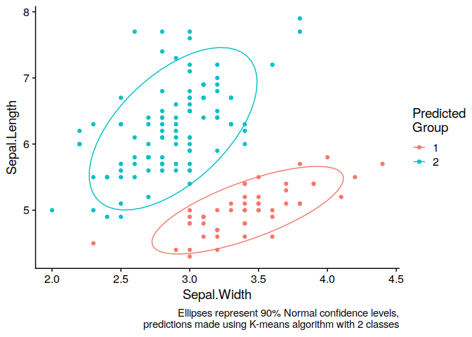<!-- -->

It would be more appropriate to use PCA to first reduce the dimensions in order to better consider the petal length and width.


```r
# Create the model

PCA.mod.iris <- prcomp(x = iris.sc.input)
PCADF <- PCA.mod.iris$x %>% as_tibble()

#Put the predicted groups on the end
PCADF$KM2Pred <- groupPred

#Draw the Plot
ggplot(PCADF, aes(y = PC1, x = PC2, col = KM2Pred)) +
  geom_point() +
  labs(col = "Predicted\nGroup",
       caption = "First two Principle Components of Iris Data,\n
       Ellipses represent 90% Normal confidence levels, \n
       predictions made using K-means algorithm with 2 classes") +
  stat_ellipse(level = 0.9) +
  theme_cowplot()
```

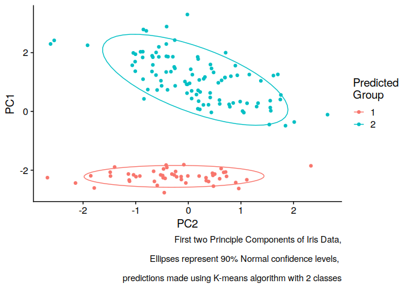<!-- -->


To better interpret the PCA Plot consider the variance of the Principle Components:


```r
## Look at the variance explained by the Principle Components


pcaVar <- PCA.mod.iris$sdev^2
pcaVarpr <- pcaVar/sum(pcaVar)
pcaVarpr <- enframe(pcaVarpr)
# pcaVarpr <-  dplyr::rename(pcaVarpr,
#                            "Principal.Component" = name,
#                            "Proportion.Variance" = value
#                            )

names(pcaVarpr) <- c("Principal.Component", "Proportion.Variance") # This gives a warning

for (i in 1:nrow(pcaVarpr)) {
  pcaVarpr[["Principal.Component"]][i] <- paste("PC", i)
}


print(pcaVarpr, digits = 1)
```

```
##   Principal.Component Proportion.Variance
## 1                PC 1               0.730
## 2                PC 2               0.229
## 3                PC 3               0.037
## 4                PC 4               0.005
```

```r
ggplot(data = pcaVarpr, aes( x = Principal.Component, y = Proportion.Variance, group = 1)) +
  geom_point(size = 3, alpha = 0.7, col = "RoyalBlue")  +
  geom_line(col = "IndianRed") +
  labs(x = "Principal Component", y = "Proportion of Variance", title = "Variance Explained by PC") +
  theme_classic2() +
  geom_vline(xintercept = 3, col = "purple", lty = 2)
```

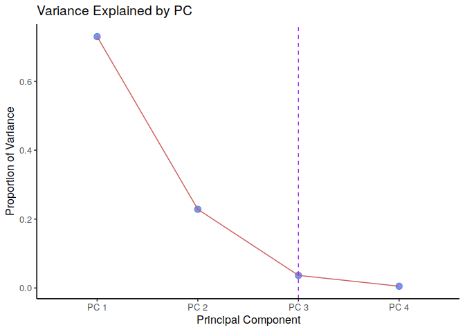<!-- -->

80% of the variance in the data is explained by the first two principal components, so it is a reasonably good visualisation of the data


#### 3. Cluster the dataset into 3 groups using k-means clustering.
It's quite suprising that the clusters look so distinct in the principal components plot from before, because in actuality we know that there should be three groups, we can model for three groups by performing:


```r
irisKM.mod <- kmeans(iris.sc.input, centers = 3, nstart = 100)

# Make the Data
groupPred <- factor(irisKM.mod$cluster, levels = c(1,2,3), ordered = FALSE)
iris$KMpred <- groupPred
groupPred %>% print()
```

```
##   [1] 3 3 3 3 3 3 3 3 3 3 3 3 3 3 3 3 3 3 3 3 3 3 3 3 3 3 3 3 3 3 3 3 3 3 3
##  [36] 3 3 3 3 3 3 3 3 3 3 3 3 3 3 3 2 2 2 1 1 1 2 1 1 1 1 1 1 1 1 2 1 1 1 1
##  [71] 2 1 1 1 1 2 2 2 1 1 1 1 1 1 1 2 2 1 1 1 1 1 1 1 1 1 1 1 1 1 2 1 2 2 2
## [106] 2 1 2 2 2 2 2 2 1 1 2 2 2 2 1 2 1 2 1 2 2 1 2 2 2 2 2 2 1 1 2 2 2 1 2
## [141] 2 2 1 2 2 2 1 2 2 1
## Levels: 1 2 3
```


#### 4. Draw a plot to visualize the clusters


```r
# Make the Data
groupPred <- factor(irisKM.mod$cluster, levels = c(1,2,3), ordered = FALSE)
iris$KMpred <- groupPred


# Plot the Data
ggplot(iris, aes(y = Sepal.Length, x = Sepal.Width, col = KMpred)) +
  geom_point() +
  labs(col = "Predicted\nGroup", caption = "Ellipses represent 90% Normal confidence levels,\n
       predictions made using K-means algorithm with 2 classes") +
  stat_ellipse(level = 0.9) +
  theme_cowplot()
```

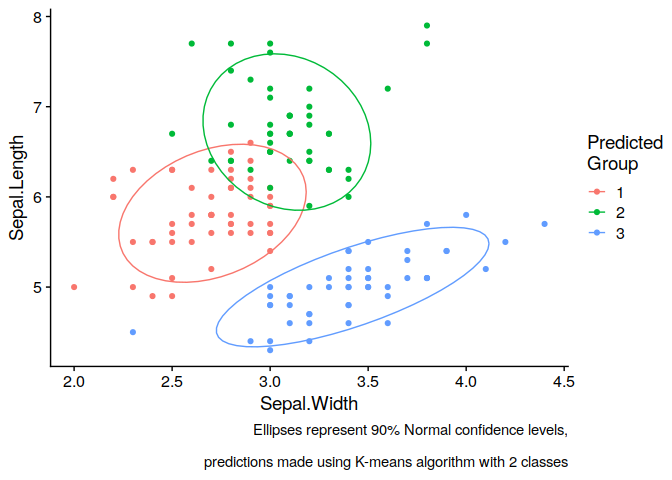<!-- -->


##### PCA Plot
It would be more appropriate to use PCA to first reduce the dimensions in order to better consider the petal length and width.


```r
# Create the model

# PCA.mod.iris <- prcomp(x = iris.sc.input)
# PCADF <- PCA.mod.iris$x %>% as_tibble()

#Put the predicted groups on the end
PCADF$KM2Pred <- groupPred

#Draw the Plot
ggplot(PCADF, aes(y = PC1, x = PC2, col = KM2Pred)) +
  geom_point() +
  labs(col = "Predicted\nGroup", caption = "First two Principle Components of Iris Data, Ellipses represent 90% Normal confidence levels, predictions made using K-means algorithm with 2 classes") +
  stat_ellipse(level = 0.9) +
  theme_cowplot()
```

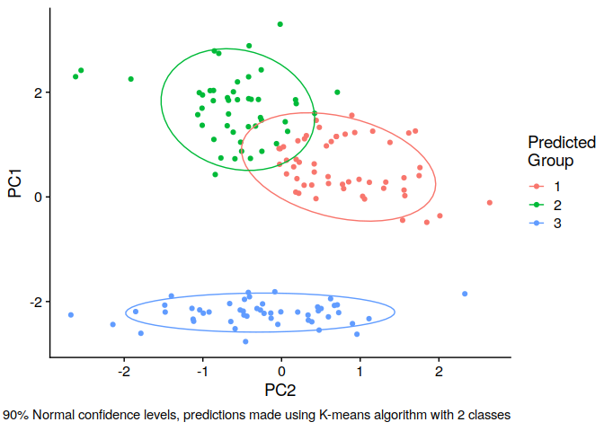<!-- -->

###### PCA biplot

The seperation isn't amazing for the plot of Sepal Length ~ Sepal Width, in order to choose which variables to use on X,Y we can use a biplot:


```r
biplot(PCA.mod.iris, cex = 0.5, scale = 0)
```

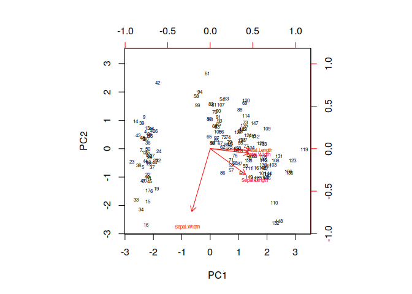<!-- -->

this biplot shows that the petal lenth and sepal width explain the most variance in the data and a more appropriate plot would be:


```r
ggplot(iris, aes(x = Sepal.Width, y = Petal.Length, col = KMpred)) +
  geom_point() +
  labs(col = "Predicted\nGroup", caption = "Ellipses represent 90% Normal confidence levels,\n
       predictions made using K-means algorithm with 2 classes") +
  stat_ellipse(level = 0.9) +
  theme_cowplot()
```

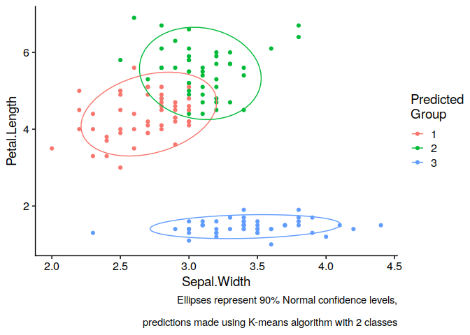<!-- -->

In order to assess all possible combination plots it would be appropriate to use tiling:
The biplot suggests that petal length and petal width will be very


```r
iris[,-5] %>%
  pivot_longer(cols = c(Sepal.Length, Sepal.Width, Petal.Width))  %>% 
  ggplot(aes(x = Petal.Length, y = value, col = KMpred)) +
  geom_point() +
  facet_grid(name ~ ., scales = 'free_y', space = 'free_y', ) +
  theme_bw() +
  stat_ellipse(level = 0.99, lty =3, lwd = 0.5)
```

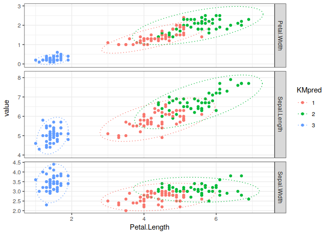<!-- -->

### Part (b): Hierarchical Clustering
#### 1. Cluster the observations using complete linkage.
The observations may be clustered using complete linkeage by using the `hclust` package (be mindful to scale the data if necessary, in this case we will):


```r
dst <- iris.sc.input %>% dist()
hc.iris.complete <- hclust(dst, method = 'complete')
```

#### 2. Cluster the observations using average and single linkage.

```r
hc.iris.average  <- hclust(dst, method = 'average')
hc.iris.single   <- hclust(dst, method = 'single')
```

##### Plot the Predictions
Now that the models have been made, by specifying the number of groups required, the function `cutree` will determine at what height to cut off the dendogram:


```r
hcPreds <- cutree(hc.iris.complete, k = 3)

# Make the Data
groupPred <- factor(hcPreds, levels = c(1,2,3), ordered = FALSE)
iris$KMpred <- groupPred


# Plot the Data
ggplot(iris, aes(y = Sepal.Length, x = Sepal.Width, col = KMpred)) +
  geom_point() +
  labs(col = "Predicted\nGroup", caption = "Ellipses represent 90% Normal confidence levels,\n
       predictions made using K-means algorithm with 2 classes") +
  stat_ellipse(level = 0.9) +
  theme_cowplot()
```

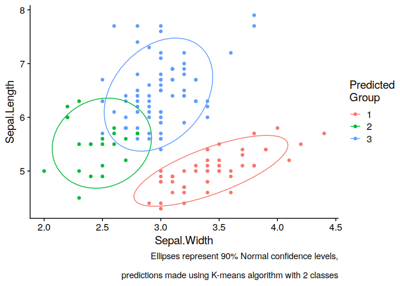<!-- -->


#### 3. Plot the dendrogram for the above clustering methods.

the `dendextend::` package can make it possible to colour dendograms:


```r
mods <- list(hc.iris.average, hc.iris.complete, hc.iris.single)


type.vec <- c("Average", "Complete", "Single")

for (hc in mods) {
 
 hc <-  hc %>%    # Comment out for base without dendextend
   as.dendrogram() %>% set("branches_k_color", k = 3) %>% 
   set("leaves_cex", 0.2)
       
 
  i <- 1
 plot(hc, sub = paste("Built Using ", type.vec[i], " Linkage"), xlab = "", cex = 0.3) 
 i <- i+1
}
```

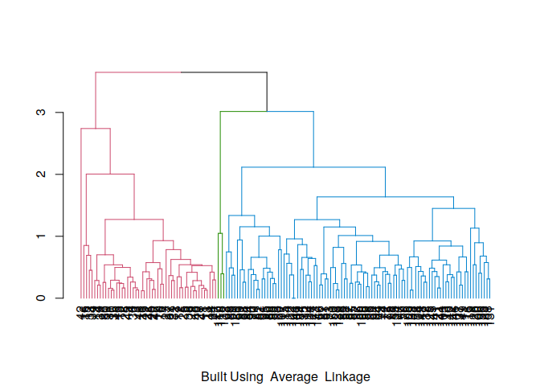<!-- -->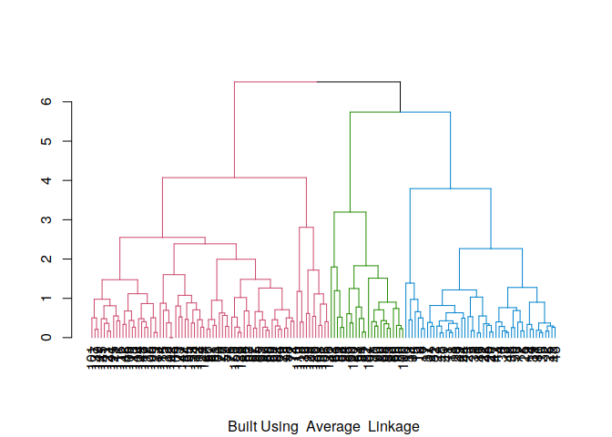<!-- -->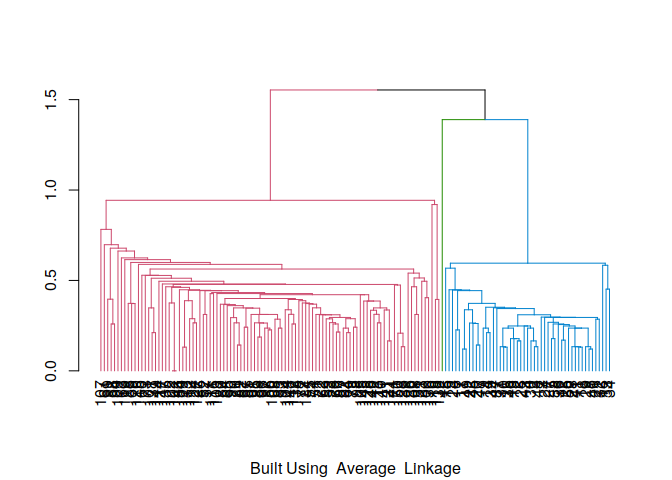<!-- -->

```r
cols = c("red", "blue", "yellow", "green")[cutree(hc.iris.average, k = 3)]
```


## Question 02:
Generate the data set using the following codes:

```r
set.seed(2)
x = matrix(rnorm(50*2), ncol = 2)
x[1:25, 1]= x[1:25, 1] + 3
x[1:25, 2] = x[1:25, 2] - 4
```

Refer to the file [containing the TB Working](./11_Practical.Rmd) `./11_PracitcalTut'


### Part (a): k-means clustering
#### 1. Cluster the data set into 2 groups using k-means clustering.
#### 2. Draw a plot to visualize the clusters
#### 3. Cluster the data set into 3 groups using k-means clustering.
#### 4. Draw a plot to visualize the clusters
#### 5. Compare the total within-cluster sum of squares when nstart = 1 to 20.
### Part (b): Hierarchical Clustering
#### 1. Cluster the observations using complete linkage.
#### 2. Cluster the observations using average and single linkage.
#### 3. Plot the dendrogram for the above clustering methods.
