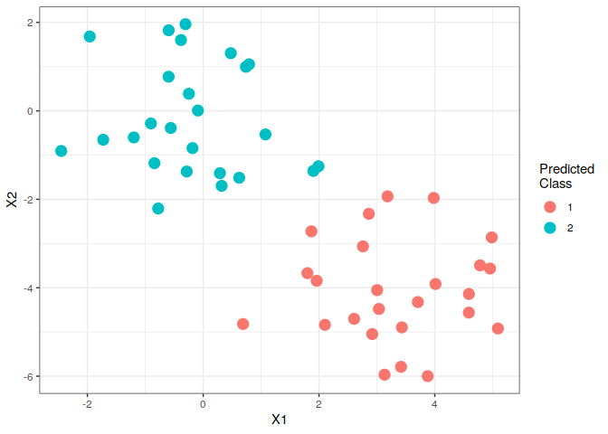
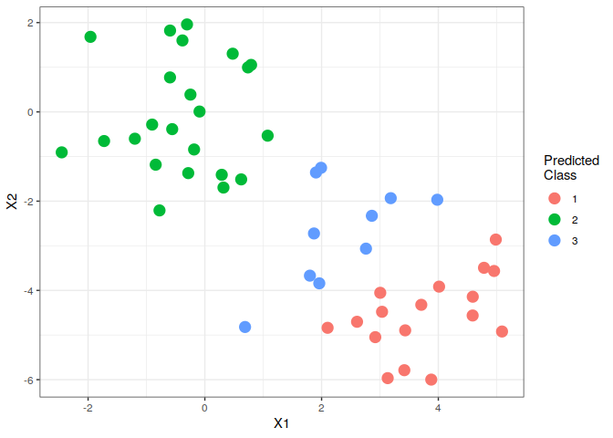
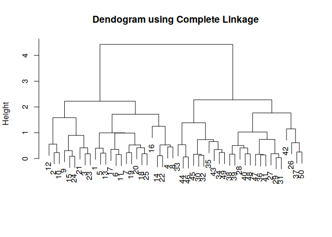
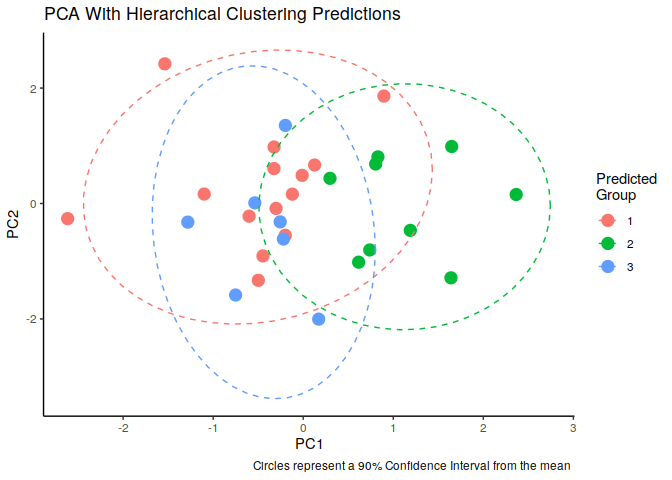

# (Wk 11) Introduction to Data Science
Material of Tue 13 May 2019, week 11

## K-Means Clustering

### 2 Groups

The `kmeans()` function performs $k$-Means Clustering in R, so first create some clustered data:


```r
set.seed(2)
x <- matrix(rnorm(50*2), ncol = 2)
x[1:25, 1] <- x[1:25, 1] + 3
x[1:25, 2] <- x[1:25, 2] - 4
```

This will mean that half of $X_1$ is 3 higher and half of $X_2$ is 4 lower.

Now in order to perform $k$-menas clustering with $K=2$:


```r
km.out <- kmeans(x, 2, nstart = 20)
```

The assignments of the 50 observatoins are contained in `$cluster`:


```r
km.out$cluster
```

```
##  [1] 1 1 1 1 1 1 1 1 1 1 1 1 1 1 1 1 1 1 1 1 1 1 1 1 1 2 2 2 2 2 2 2 2 2 2
## [36] 2 2 2 2 2 2 2 2 2 2 2 2 2 2 2
```
This can be plotted:


```r
colnames(x) <- c("X1", "X2")
x2ClustPred <- as_tibble(x)
x2ClustPred$K2Pred <- factor(km.out$cluster, levels = c(1, 2), ordered = FALSE)

ggplot(x2ClustPred, aes(x = X1, y = X2, col = K2Pred)) +
  geom_point( size = 4) +
  theme_bw() + 
  labs(col = "Predicted\nClass", main = "Classification Prediction")
```

<!-- -->

If there were more dimensions, it would then be appropriate to use PCA to reduce it to 2 dimensions and then plot the clusters like that.

#### Three Groups

In this case we knew there would be two groups because we created it like that, however when ordinarily performing unsupervised learning this wouldn't be known.

Trying three groups:


```r
set.seed(4)
km3mod <- kmeans(x, 3, nstart = 20)
#km3mod
```

This can be plotted by performing:


```r
colnames(x) <- c("X1", "X2")
x3ClustPred <- as_tibble(x)
x3ClustPred$K3Pred <- factor(km3mod$cluster, levels = c(1, 2, 3), ordered = FALSE)

ggplot(x3ClustPred, aes(x = X1, y = X2, col = K3Pred)) +
  geom_point( size = 4) +
  theme_bw() + 
  labs(col = "Predicted\nClass", main = "Classification Prediction")
```

<!-- -->

In this case the algorithm chooses points in between to represent the third class.

### Best Cluster Size
To run the `kmeans()` multiplie times with a different initial cluster the `nstart` parameter is used.

If a value of `nstart` greater than one is used then the clustering will be performed using multiple random assignments in step 1 of the K-means algorighm (p. 388) and the function will report only the best results, thes results are more likely to correspond to the minimum RSS, which is difficult to find.

So for example we can repeat the k-means and choose the distribution that most corresponds to the model that minimises the RSS by choosing a sufficiently large `nstart` value:


```r
set.seed(3)
km.out <- kmeans(x, 5, nstart = 1)
km.out$tot.withinss
```

```
## [1] 64.16453
```

```r
km.out <- kmeans(x, 5, nstart = 50)
km.out$tot.withinss
```

```
## [1] 50.89555
```

In this case observe that that be reiterating multiple times the model corresponding to the minimal RSS was found; because 'nstart' is the length of X we know it must be the minimum RSS because it tried every possible model.

Remember to set the seed because otherwise the initial cluster assignments cannot be replicated and the K-means may not be fully reproducable.


## Hierarchical Clustering

Begin by creating a 50x50 inter-observation matrix using the Euclidean distance, the `dist()` function can be used to create a matrix of distances, for example the distance from (0,0) to (3,4) is, by the pythagorean triad, 5:


```r
mat <- matrix(c(0,3,0,4), nrow = 2) 
mat
```

```
##      [,1] [,2]
## [1,]    0    0
## [2,]    3    4
```

```r
dist(mat)
```

```
##   1
## 2 5
```

applying this to the observation matrix X:


```r
dist(x[1:6])
```

```
##           1         2         3         4         5
## 2 1.0817637                                        
## 3 2.4847599 1.4029961                              
## 4 0.2334611 1.3152249 2.7182210                    
## 5 0.8166628 0.2651009 1.6680971 1.0501239          
## 6 1.0293348 0.0524289 1.4554250 1.2627960 0.2126720
```
### Scaling the Data
It may be necessary to scale the data, if so use `scale(x)`


```r
x <- scale(x)
```


### Creating the Model
now begin by clustering the observations using complete linkage using the `hclust()` function and specifying the metod as `method = 'complete'`:
Centroid is often used in genomics but cannot be easily visualised all the time, due to inverson, refer to p. 395 of TB.


```r
hc.comp <- hclust(dist(x), method = 'complete')
hc.av   <- hclust(dist(x), method = 'average')
hc.si   <- hclust(dist(x), method = 'single')
```


### Plot the Dendogram


```r
#plot(hc.comp)
plot(hc.comp, main = "Dendogram using Complete Linkage", sub="", xlab = "")
```

<!-- -->

```r
# plot(hc.av, main = "Dendogram using Complete Linkage", sub="", xlab = "")
#plot(hc.si, main = "Dendogram using Complete Linkage", sub="", xlab = "")
```

### Cluster labels
In order to return a vector with the assignment of observations the cutree function can be used


```r
cutree(hc.comp, k = 2)
```

```
##  [1] 1 1 1 1 1 1 1 1 1 1 1 1 1 1 1 1 1 1 1 1 1 1 1 1 1 2 2 2 2 2 2 2 2 2 2
## [36] 2 2 2 2 2 2 2 2 2 2 2 2 2 2 2
```

This allows us to compare the different techniques:


```r
k <- 2
diffassignments <- 
  tibble(
       "CompleteLink" = cutree(hc.comp, k),
       "AverageLink"  = cutree(hc.av,  k),
       "SingleLink"   = cutree(hc.si,  k)
   )
diffassignments %>% t() %>% print()
```

```
##              [,1] [,2] [,3] [,4] [,5] [,6] [,7] [,8] [,9] [,10] [,11]
## CompleteLink    1    1    1    1    1    1    1    1    1     1     1
## AverageLink     1    1    1    1    1    1    1    1    1     1     1
## SingleLink      1    1    1    1    1    1    1    1    1     1     1
##              [,12] [,13] [,14] [,15] [,16] [,17] [,18] [,19] [,20] [,21]
## CompleteLink     1     1     1     1     1     1     1     1     1     1
## AverageLink      1     1     1     1     1     1     1     1     1     1
## SingleLink       1     1     1     1     2     1     1     1     1     1
##              [,22] [,23] [,24] [,25] [,26] [,27] [,28] [,29] [,30] [,31]
## CompleteLink     1     1     1     1     2     2     2     2     2     2
## AverageLink      1     1     1     1     2     2     2     2     2     2
## SingleLink       1     1     1     1     1     1     1     1     1     1
##              [,32] [,33] [,34] [,35] [,36] [,37] [,38] [,39] [,40] [,41]
## CompleteLink     2     2     2     2     2     2     2     2     2     2
## AverageLink      2     1     2     2     2     2     2     2     2     2
## SingleLink       1     1     1     1     1     1     1     1     1     1
##              [,42] [,43] [,44] [,45] [,46] [,47] [,48] [,49] [,50]
## CompleteLink     2     2     2     2     2     2     2     2     2
## AverageLink      2     2     1     2     1     2     2     2     2
## SingleLink       1     1     1     1     1     1     1     1     1
```

In this case Single behaves very strangely, however it would behave better if 4 groups were specified:


```r
cutree(hc.si,  4) %>% print()
```

```
##  [1] 1 1 1 1 1 1 1 1 1 1 1 1 1 1 1 2 1 1 1 1 1 1 1 1 1 3 3 3 3 3 3 3 3 3 3
## [36] 3 3 3 3 3 3 4 3 3 3 3 3 3 3 3
```

### Correlation Based Distance
Correlation-based distance can be computed using the `as.dist()` function, which converts a square symmetric matrix into a form that makes sense for data with at least three features (since the correlatoin between any two observations with measurements on two features is always plus/minus 1):

#### Create the Distance Matrix and the Model


```r
# Create the Data with 3 Groups

x <- matrix(rnorm(30*3), ncol =3)
names(x) <- c("X1", "X2", "X3")

# Create the distance matrix using correlation-based distance
dd <- as.dist(2-cor(t(x)))

# Create the Model
hc.cor <- hclust(dd, method = 'complete')
```

#### Make a PCA Plot of the modelled Data

The groups may be visualised by reducing the dimensions with PCA


```r
# Create the predicted classes by using cutree
corDist3Preds <- cutree(hc.cor, 3)

# Create the Data Frame
hcDF <- data.frame(
  x,
  "PredGroup" = corDist3Preds
) %>% as_tibble()


# Create the PCA Model
pca.mod <- prcomp(x, scale = TRUE)

## create a DF of PCA Data
pcaDF <- data.frame(pca.mod$x) %>% as_tibble()
pcaDF$group <- factor(cutree(hc.cor, 3), levels = 1:3, ordered = FALSE)

# Plot the PCA Reduction
ggplot(pcaDF, aes(x = PC1, y=PC2, col = group)) +
  geom_point(size = 4) +
  labs(col = "Predicted\nGroup",
       title = "PCA With Hierarchical Clustering Predictions",
       caption = "Circles represent a 90% Confidence Interval from the mean ") +
  theme_classic() +
    stat_ellipse(type = 'norm', level = 0.9, lty = 2)
```

<!-- -->


