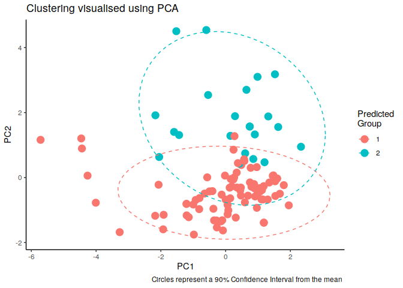
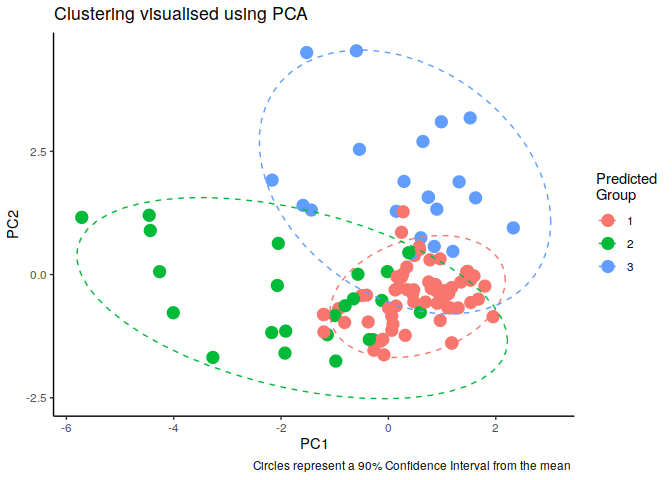
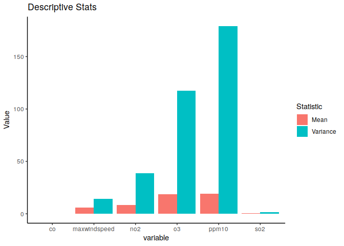

## Import the DataSets


```r
envDF <- read.csv(file = "./dataset/Envdata(2).csv", header = TRUE, sep = ",") 
knitTable(head(envDF))
```


patient_id     co   o3   no2   so2   ppm10   maxwindspeed  asthma 
-----------  ----  ---  ----  ----  ------  -------------  -------
PJY1ZY7M      0.4   20    13     0    12.9            2.1  TRUE   
PTX0ZI2D      0.1   12     6     2     4.5           13.9  TRUE   
PVX0GR6F      0.2   11     9     1    22.3            9.8  TRUE   
WOE7QE3M      0.2   33     2     0     8.7            7.2  TRUE   
WYU6CP0J      0.6    4    15     0    17.7            2.1  TRUE   
PYU6ZP0K      0.2   15    12     0    10.6           13.4  TRUE   

```r
admDF <- read.csv(file = "./dataset/Admission(3).csv", header = TRUE, sep = ",")
admDF %>% head() %>% knitTable()
```


 Serial.No.   GRE   TOEFL   Uni_R   SOP    CGPA   Chance
-----------  ----  ------  ------  ----  ------  -------
         93   298      98       2   4.0   85.29     0.34
        377   297      96       2   2.5   81.72     0.34
         59   300      99       1   3.0   70.99     0.36
         95   303      99       3   2.0   85.83     0.36
         92   299      97       3   5.0   85.83     0.38
        376   304     101       2   2.0   85.83     0.38


# Question 1

 
This Question uses the data set “Envdata”. The data represents the pollution conditions and maximum wind speed together with the prevalence of Asthma (present or absent of Asthma) associate with several patients in Victoria State. 


## Sub Question A


**a. Use K Means Clustering method and identify two clusters with K=2.**


Now in order to perform $k$-menas clustering with $K=2$ use the `kmeans` function; Be mindful to remove the response variable and the primary key:


```r
envFeat <- subset(envDF, select = -c(patient_id, asthma))
km.out <- kmeans(envFeat, 2, nstart = 20)
```

The assignments of the 50 observatoins are contained in `$cluster` and a summary of the clustering model is given by:


```r
km.out
```

```
## K-means clustering with 2 clusters of sizes 86, 22
## 
## Cluster means:
##          co       o3      no2       so2    ppm10 maxwindspeed
## 1 0.2279070 15.65116 8.395349 0.6046512 14.30000     5.805814
## 2 0.2090909 31.45455 8.136364 1.2727273 38.66364     6.072727
## 
## Clustering vector:
##   1   2   3   4   5   6   7   8   9  10  11  12  13  14  15  16  17  18 
##   1   1   1   1   1   1   1   1   1   1   2   1   1   1   1   1   1   1 
##  19  20  21  22  23  24  25  26  27  28  29  30  31  32  33  34  35  36 
##   1   1   1   1   1   1   1   1   1   1   1   1   1   2   1   2   1   1 
##  37  38  39  40  41  42  43  44  45  46  47  48  49  50  51  52  53  54 
##   1   1   1   1   1   1   2   1   1   1   1   1   2   1   1   1   1   1 
##  55  56  57  58  59  60  61  62  63  64  65  66  67  68  69  70  71  72 
##   1   2   1   1   2   1   2   1   1   1   1   1   1   1   2   1   2   1 
##  73  74  75  76  77  78  79  80  81  82  83  84  85  86  87  88  89  90 
##   2   1   1   1   1   1   1   2   1   1   2   2   1   1   2   1   2   1 
##  91  92  93  94  95  96  97  98  99 100 101 102 103 104 105 106 107 108 
##   1   1   2   1   2   2   2   1   1   2   1   1   1   1   1   2   1   1 
## 
## Within cluster sum of squares by cluster:
## [1] 13622.711  9187.442
##  (between_SS / total_SS =  39.3 %)
## 
## Available components:
## 
## [1] "cluster"      "centers"      "totss"        "withinss"    
## [5] "tot.withinss" "betweenss"    "size"         "iter"        
## [9] "ifault"
```

```r
#km.out$cluster
km2in <- km.out$tot.withinss
km2bet <- km.out$betweenss
```
## Sub Question B

b. In order to visually display the two clusters obtained in part a, plot the first two principal components and colour according to the k-means classes. 
. Compare results obtained in parts “a and b” with parts “d and e” and justify most suitable number of clusters for this data set using total within cluster variation and total between cluster variation. 

### First Perform PCA in order to reduce the dimensions of the clustering:

In order to visualise this we will plot the first two principal components, by default we will choose to scale variables:


```r
pcaEnvMod <- prcomp(envFeat, scale = TRUE)
pcaEnvMod
```

```
## Standard deviations (1, .., p=6):
## [1] 1.4587570 1.2144469 0.9637641 0.8132041 0.7254836 0.5297909
## 
## Rotation (n x k) = (6 x 6):
##                     PC1        PC2        PC3         PC4        PC5
## co           -0.5450045 0.02732184 -0.1096117 -0.31339377  0.7120811
## o3            0.3612149 0.52018122 -0.4198813  0.01863647  0.4073065
## no2          -0.6047801 0.02365796  0.1104536 -0.22452450 -0.2543653
## so2          -0.2997724 0.45848213  0.3808967  0.73427757  0.1111391
## ppm10        -0.1117122 0.69792161 -0.1372112 -0.37152683 -0.4504230
## maxwindspeed  0.3230972 0.17551320  0.7972300 -0.41692930  0.2170425
##                      PC6
## co            0.29143389
## o3           -0.50634875
## no2          -0.71159567
## so2           0.05773126
## ppm10         0.37508112
## maxwindspeed -0.09104995
```


This can be plotted:


```r
# Create the Data Frame
EnvDF <- data.frame(
  envFeat,
  "PredGroup" = km.out$cluster
) %>% as_tibble()


# Create the PCA Model
pcaEnvMod <- prcomp(envFeat, scale = TRUE)

## create a DF of PCA Data
pcaDF <- data.frame(pcaEnvMod$x) %>% as_tibble()
pcaDF$group <-  factor(km.out$cluster)

# Plot the PCA Reduction
ggplot(pcaDF, aes(x = PC1, y=PC2, col = group)) +
  geom_point(size = 4) +
  labs(col = "Predicted\nGroup",
       title = "Clustering visualised using PCA",
       caption = "Circles represent a 90% Confidence Interval from the mean ") +
  theme_classic() +
    stat_ellipse(type = 'norm', level = 0.9, lty = 2) 
```

<!-- -->

```r
  # PC11C <- sum(km.out$centers[1,]* pcaEnvMod$rotation[,1])
  # PC21C <- sum(km.out$centers[2,]* pcaEnvMod$rotation[,1])
  # PC12C <- sum(km.out$centers[1,]* pcaEnvMod$rotation[,2])
  # PC22C <- sum(km.out$centers[2,]* pcaEnvMod$rotation[,2])
```


## Sub Question C

c. Construct the misclassification table and misclassification rate and discuss the accuracy of predicting presence of Asthma.  


```r
# Now create the confusion Matrix
  # This package prevents making mistakes
#  conf.mat <-   caret::confusionMatrix(data = factor(km.out$cluster), reference = factor(envDF$asthma))
    # We don't know which cluster is truth though...

  # This could otherwise be created by using, always go prediction, reference as a standard
  k2ConfMat <- table("ClusterPred" = km.out$cluster, "Obsered" = envDF$asthma)
 k2ConfMat
```

```
##            Obsered
## ClusterPred FALSE TRUE
##           1    47   39
##           2    19    3
```

```r
(k2ConfMat[1,1] +k2ConfMat[2,2])/(sum(k2ConfMat))
```

```
## [1] 0.462963
```

```r
 1-(k2ConfMat[1,1] +k2ConfMat[2,2])/(sum(k2ConfMat)) 
```

```
## [1] 0.537037
```

```r
  conf.mat <-   caret::confusionMatrix(data = factor(!as.logical(km.out$cluster-1)), reference = factor(envDF$asthma))
  conf.mat$table
```

```
##           Reference
## Prediction FALSE TRUE
##      FALSE    19    3
##      TRUE     47   39
```

It isn't at first possible to determine the *True Positive*, *False Negative* or misclassificatoin rates because we don't necessarily know which cluster is indicative of asthma (although for a reasonably well performing model we take an educated guess), in this case most of the asthma cases co-incide with cluster 1 and so claster 1 will be taken as indicative of asthma.

The misclassification rate may be hence be calculated by taking the greater diagonal sum and dividing it by the total (presuming that the model performs better than mere chance). in this case the missclassification rate is 54%:

$$
\text{M}_c = \frac{39+ 19}{47+ 39+ 19+ 3}
$$


## Sub Question D

**d. Alternatively use K Means Clustering method to identify three clusters using K=3.** 

In order to perform $k$-means to create 3 clusters the code mearly needs to be amended for this purpose:

Now in order to perform $k$-menas clustering with $K=2$ use the `kmeans` function; Be mindful to remove the response variable and the primary key:


```r
envFeat <- subset(envDF, select = -c(patient_id, asthma))
km.out <- kmeans(envFeat, 3, nstart = 20)
```

The assignments of the 50 observatoins are contained in `$cluster` and a summary of the clustering model is given by:


```r
km.out
```

```
## K-means clustering with 3 clusters of sizes 64, 23, 21
## 
## Cluster means:
##          co        o3       no2      so2    ppm10 maxwindspeed
## 1 0.1703125 18.859375  5.718750 0.453125 12.76406     6.265625
## 2 0.3956522  6.608696 16.347826 1.043478 19.46522     4.473913
## 3 0.2000000 32.333333  7.571429 1.285714 38.84762     6.142857
## 
## Clustering vector:
##   1   2   3   4   5   6   7   8   9  10  11  12  13  14  15  16  17  18 
##   1   1   2   1   2   1   2   1   2   1   3   1   1   1   1   1   1   2 
##  19  20  21  22  23  24  25  26  27  28  29  30  31  32  33  34  35  36 
##   2   2   2   1   2   1   1   2   1   1   2   1   2   3   1   3   1   2 
##  37  38  39  40  41  42  43  44  45  46  47  48  49  50  51  52  53  54 
##   1   2   1   1   1   1   3   1   1   1   1   1   3   2   1   2   1   2 
##  55  56  57  58  59  60  61  62  63  64  65  66  67  68  69  70  71  72 
##   1   3   1   1   3   1   3   1   1   1   1   1   1   1   3   1   3   1 
##  73  74  75  76  77  78  79  80  81  82  83  84  85  86  87  88  89  90 
##   3   1   1   1   1   1   1   3   2   1   3   3   1   1   3   1   3   1 
##  91  92  93  94  95  96  97  98  99 100 101 102 103 104 105 106 107 108 
##   2   1   3   1   3   3   3   1   1   3   1   1   2   2   1   2   1   2 
## 
## Within cluster sum of squares by cluster:
## [1] 5456.977 3451.198 8665.179
##  (between_SS / total_SS =  53.3 %)
## 
## Available components:
## 
## [1] "cluster"      "centers"      "totss"        "withinss"    
## [5] "tot.withinss" "betweenss"    "size"         "iter"        
## [9] "ifault"
```

```r
#km.out$cluster
km3in  <- km.out$tot.withinss
km3bet <- km.out$betweenss
```


## Sub Question E

**e. In order to visually display the three clusters obtained in part d, plot the first two principal components and colour according to the k-means classes.**

Again merely ammending the above code to reflect three clusters:


```r
pcaEnvMod <- prcomp(envFeat, scale = TRUE)
pcaEnvMod
```

```
## Standard deviations (1, .., p=6):
## [1] 1.4587570 1.2144469 0.9637641 0.8132041 0.7254836 0.5297909
## 
## Rotation (n x k) = (6 x 6):
##                     PC1        PC2        PC3         PC4        PC5
## co           -0.5450045 0.02732184 -0.1096117 -0.31339377  0.7120811
## o3            0.3612149 0.52018122 -0.4198813  0.01863647  0.4073065
## no2          -0.6047801 0.02365796  0.1104536 -0.22452450 -0.2543653
## so2          -0.2997724 0.45848213  0.3808967  0.73427757  0.1111391
## ppm10        -0.1117122 0.69792161 -0.1372112 -0.37152683 -0.4504230
## maxwindspeed  0.3230972 0.17551320  0.7972300 -0.41692930  0.2170425
##                      PC6
## co            0.29143389
## o3           -0.50634875
## no2          -0.71159567
## so2           0.05773126
## ppm10         0.37508112
## maxwindspeed -0.09104995
```


This can be plotted:


```r
# Create the Data Frame
EnvDF <- data.frame(
  envFeat,
  "PredGroup" = km.out$cluster
) %>% as_tibble()


# Create the PCA Model
pcaEnvMod <- prcomp(envFeat, scale = TRUE)

## create a DF of PCA Data
pcaDF <- data.frame(pcaEnvMod$x) %>% as_tibble()
pcaDF$group <-  factor(km.out$cluster)

# Plot the PCA Reduction
ggplot(pcaDF, aes(x = PC1, y=PC2, col = group)) +
  geom_point(size = 4) +
  labs(col = "Predicted\nGroup",
       title = "Clustering visualised using PCA",
       caption = "Circles represent a 90% Confidence Interval from the mean ") +
  theme_classic() +
    stat_ellipse(type = 'norm', level = 0.9, lty = 2) 
```

<!-- -->

```r
  km2in
```

```
## [1] 22810.15
```

```r
  km3in
```

```
## [1] 17573.35
```

```r
  km2bet
```

```
## [1] 14784.2
```

```r
  km3bet
```

```
## [1] 20021
```

Although in this case it isn't necessarily clear what the 3rd category may be, perhaps at risk of developing asthma, an investigation into the biplot of the PC's may allow further interpretation.

## Sub Question F

**f. Compare results obtained in parts “a and b” with parts “d and e” and justify most suitable number of clusters for this data set using total within cluster variation and total between cluster variation.**

* Within Cluster Variation
 + The within cluster variation corresponding to a 2-cluster model is: 22, 810
 + The within cluster variation corresponding to a 3-cluster model is: 17, 573
* Between Cluster Variation
 + The between cluster variation corresponding to a 2-cluster model is: 14, 784
 + The between cluster variation corresponding to a 3-cluster model is: 20, 021

The 3-cluster model reduces the squared error from 22K to 17K and increases the between cluster variation from 20k to 14k, this is good evidence to suggest that there may indeed be 3 distinct groups rather than 2 and hence a 3 cluster model is chosen rather than 2.

# Question 2
** This Question uses the data set “Envdata” used in Question 1**

### Sub-Question 1
**a. Calculate the mean and the variance for each variable and discuss if scaling is necessary and justify your findings.**

Looking at the mean values and variance:


```r
desc.stats <- data.frame(
Mean = apply(envFeat, 2, mean), # 1 is rows, 2 is cols p. 401 ISL TB
Variance = apply(envFeat, 2, var) # 1 is rows, 2 is cols p. 401 ISL TB
)
desc.stats$variable <- row.names(desc.stats)

descStatsTidy <- pivot_longer(desc.stats, cols = c(Mean, Variance), names_to = "Statistic", values_to = "Value")

ggplot(descStatsTidy, aes(x = variable, y = Value, fill = Statistic)) +
  geom_col(position = "dodge") +
  theme_classic() +
  labs(title = "Descriptive Stats")
```

<!-- -->

It can Clearly be seen that the variance for particulate matter `ppm10` is extremely large and hence we will choose to scale the data.


    b. Apply scaling and derive the principal components. (R code and output)

    c. Give the Scree Plot and give the percentage variation captured by each principal component.

    d. Select the number of principal components most suitable to represent the dataset and justify your answer.

    e. Derive and give the principal component loading vectors for the given dataset and explain the results/output.

# Question 3


$$
\begin{align}
\text{H}_0: \enspace \beta = 0 \enspace \text{The Slope Parameter is not significantly different from 0} \\
\text{H}_a: \enspace \beta \neq 0 \enspace \text{The Slope Parameter \textbf{is} significantly different from 0} 
\end{align}
$$


# Use Pandoc to Create PDF


