# Question 1 

## (1) Explore the Data Set
Explore the given dataset and identify the attributes of CPU that have linear association with CPU
performance.

Load and inspect the dataset in R:


```r
cpu <- read.csv(file = "./Code/Datasets/CPU.csv", header = TRUE, sep = ",")
head(cpu)
```

```
##   CycleTime MinimumMainMemory MaximumMainMemory CacheSize
## 1       125               256              6000       256
## 2        29              8000             32000        32
## 3        29              8000             32000        32
## 4        29              8000             32000        32
## 5        29              8000             16000        32
## 6        26              8000             32000        64
##   MinimumNumberOfChannels MaximumNumberOfChannels Performance
## 1                      16                     128         198
## 2                       8                      32         269
## 3                       8                      32         220
## 4                       8                      32         172
## 5                       8                      16         132
## 6                       8                      32         318
```

```r
str(cpu)
```

```
## 'data.frame':	209 obs. of  7 variables:
##  $ CycleTime              : int  125 29 29 29 29 26 23 23 23 23 ...
##  $ MinimumMainMemory      : int  256 8000 8000 8000 8000 8000 16000 16000 16000 32000 ...
##  $ MaximumMainMemory      : int  6000 32000 32000 32000 16000 32000 32000 32000 64000 64000 ...
##  $ CacheSize              : int  256 32 32 32 32 64 64 64 64 128 ...
##  $ MinimumNumberOfChannels: int  16 8 8 8 8 8 16 16 16 32 ...
##  $ MaximumNumberOfChannels: int  128 32 32 32 16 32 32 32 32 64 ...
##  $ Performance            : int  198 269 220 172 132 318 367 489 636 1144 ...
```

```r
#dim(cpu)
#summary(cpu)
```

From the output it can be seen that this is a data set containing 6 predictive features corresponding to 1 ouput variable with 209 observations.

### Identify any Linear Relations
In order to identify any linear relations `corrplot()` may be used to consider the strength and direction of any linear correlation between variables:


```r
cpu_pretty <- cpu
names(cpu_pretty) <- c("Cycle\nPeriod", "Min\nMemory", "Max\nMemory", "Cache", "Min\nChannels", "Max\nChannels", "Performance")

corrplot(cor(cpu_pretty),method = 'ellipse', type = 'upper')
```

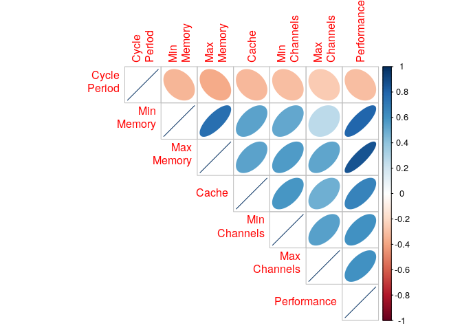

This suggests that the Maximum Main memory has a strong positive correlation with performance. In order to further assess the relationship between performance and maximum main memory a scatter plot will be drawn in order to investigate the relationships, the `pairs()` function is not ideal here because we only need to consider *Performance* as a response.

It would be possible to call a loop over various plots using the base packages but it would be more appropriate to create a *tidy* data frame and plot multiple facets using `ggplot2()`:


```r
# layout(matrix(1:6, nrow = 2))
# for (i in 1:6) {
# plot(y=cpu$Performance, x = cpu[,i], xlab = names(cpu)[i], ylab = "Performance")
# }


  # New facet label names for supp variable
pred.labs <- c("Max\nMemory", "Min\nMemory")
names(pred.labs) <- c("MaximumMainMemory", "MinimumMainMemory")


# Create the plot
# p + facet_grid(
#   dose ~ supp, 
#   labeller = labeller(dose = dose.labs, supp = supp.labs)
#   )

subset <- names(cpu_pretty)[2:3]
cpu.tidymem <- pivot_longer(data = cpu_pretty[,c("Performance",subset)], cols = subset )
pmem <- ggplot(cpu.tidymem, aes(x = value, y = Performance, col = name)) +
  geom_point() + 
  theme_bw() +
  geom_smooth(method = 'lm')+
  facet_grid(. ~ name ) +
  labs(col = "CPU \n Characteristic", x = NULL)


cpu.else <- dplyr::select(cpu_pretty, -subset)
cpu.tidyelse <- pivot_longer(data = cpu.else, cols = 1:(-1+length(cpu.else)))
pelse <- ggplot(cpu.tidyelse, aes(x = value, y = Performance, col = name)) +
  geom_point() + 
  theme_bw() +
  geom_smooth(method = 'lm')+
  facet_grid(. ~ name, scales = "free_x") + 
  labs(col = "CPU \n Characteristic", x = NULL)

grid.arrange(pmem, pelse, nrow = 2)
```


All of the variables, with the exception of `CycleTime`, are linearly correlated with performance, however the plots demonstrate a violation with the assumption of homoskedasticity.

## (2) Select the most Suitable Attribute to use for Simple Linear Regression

Many of the variables are linearly correlated with performance, however, as mentioned, the plots  violate the assumption of homoskedasticity, for this reason a $\log$ transform is used. 

The Cycle period appears to be inversely proportional to performance, it seems reasonable that cycle frequency will be proportional to performance and for this reason here a a linear model of cycle frequency (an inverse transform), will be considered as a potential attribute for Simple Linear Regression.

`MaximumMainMemory` and `MinimimMainMemory` are strongly correlated predictors and so only one of the two should be considered as a predictive feature. It can be seen from the correlation matrix that `MaximumMainMemory` is more strongly correlated with performance and so it is chosen as the potential predictive feature.


```r
# layout(matrix(1:6, nrow = 2))
# for (i in 1:6) {
# plot(y=cpu$Performance, x = cpu[,i], xlab = names(cpu)[i], ylab = "Performance")
# }

cpu_pretty$"ln(Performance)" <- log(cpu_pretty$Performance)
# names(cpu_pretty)[7] <- "ln(Performance)"


subset <- names(cpu_pretty)[2]
cpu.tidymem <- pivot_longer(data = cpu_pretty[,c("ln(Performance)",subset)], cols = subset )
pmem <- ggplot(cpu.tidymem, aes(x = value, y = `ln(Performance)`, col = name)) +
  geom_point() + 
  theme_bw() +
  geom_smooth(method = 'lm')+
  facet_grid(. ~ name ) +
  labs(col = "CPU \n Characteristic", x = NULL)


cpu.else <- dplyr::select(cpu_pretty, -subset)
cpu.tidyelse <- pivot_longer(data = cpu.else, cols = c(2,3,4))
pelse <- ggplot(cpu.tidyelse, aes(x = value, y = `ln(Performance)`, col = name)) +
  geom_point() + 
  theme_bw() +
  geom_smooth(method = 'lm')+
  facet_grid(. ~ name, scales = "free_x") + 
  labs(col = "CPU \n Characteristic", x = NULL)

grid.arrange(pmem, pelse, nrow = 2)
```

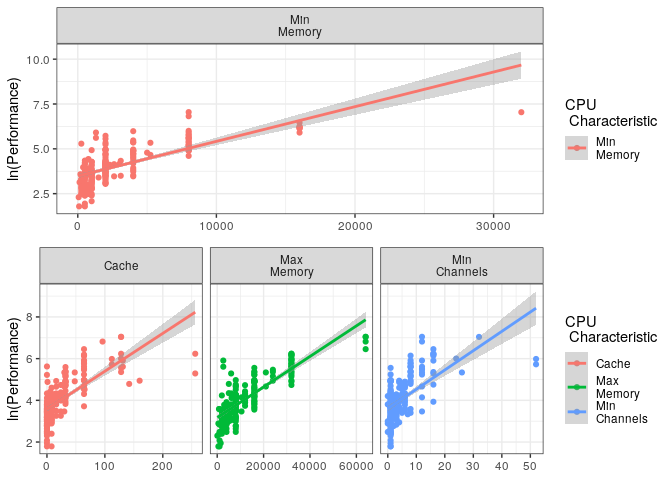


None of these plots are linear despite the transform, it would be inappropriate to fit a linear model to data that violates the underlying assumptions of linear regression, instead, consider the cpu frequency:


```r
cpu_pretty$"Root Performance" <- sqrt(cpu_pretty$Performance)
cpu_pretty$Frequency <- (1/cpu_pretty$"Cycle\nPeriod")

cpufreq <- dplyr::select(cpu_pretty, c("Performance", "ln(Performance)", "Frequency"))
cpuTidyfreq <- pivot_longer(data = cpufreq, cols = c("Performance", "ln(Performance)"), names_to = "Performance\nMeasure")


ggplot(data = cpuTidyfreq, aes(x = Frequency, y = value, col = `Performance\nMeasure`)) +
  geom_point() +
  theme_bw() +
  geom_smooth(method = 'lm') +
  facet_grid(`Performance\nMeasure` ~ ., scales = "free_y")
```

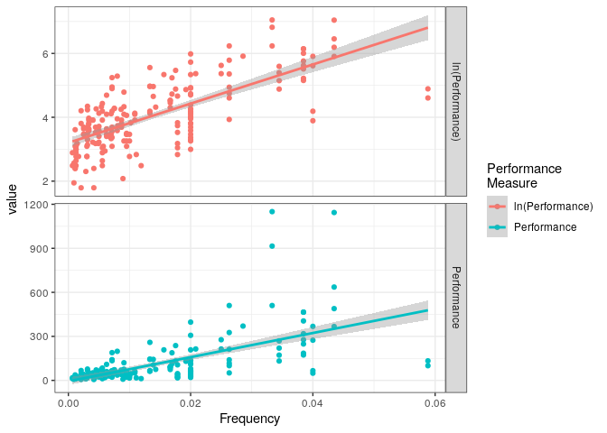<!-- -->

From this it can be seen that the frequency is far more linear than other variables after a log transform, for this reason frequency is chosen as the most suitable attribute from which to predict CPU performance with simple linear regression.

Before the log transform it is too heteroskedastic and vialotaes the assumption of normal residuals, the log transform appears to have constant variance and appears to be reasonably linear, wheareas other attributes appear to follow a concave-down and non-linear trend following the transform.

The linear model chosen is of the form:

$$
\log{\left( Y_{Perf}\right)} = \beta_0 + \beta_1 \times X_{Freq}
$$

this attribute is chosen because it is the only attribute that has a linear relationship (albeit after a log transform) and the only attribute that has constant variance from the model.

### Create the Model

The model can be created using the `lm` function, it is important to not use `I(log(Y))` in the model call, otherwise residual plots may not be generated.


```r
# Training Split
train <- sample(nrow(cpu) * 0.45)
cpu_mod.slm <- lm(formula = `ln(Performance)` ~ Frequency, data = cpu_pretty, subset = train)
val.Error <- (cpu_pretty$`ln(Performance)`[-train] - predict(object = cpu_mod.slm, newdata = cpu_pretty[-train,]))^2 %>%
  mean() %>% 
  sqrt() %>% 
  exp() %>% 
  round(3) %>% 
  paste("is the validation RMSE (expected distance from model") %>% 
  print()
```

```
## [1] "2.249 is the validation RMSE (expected distance from model"
```

```r
# Return Model
cpu_mod.slm <- lm(`ln(Performance)` ~ Frequency, data = cpu_pretty, subset = NULL)
summary(cpu_mod.slm)
```

```
## 
## Call:
## lm(formula = `ln(Performance)` ~ Frequency, data = cpu_pretty, 
##     subset = NULL)
## 
## Residuals:
##      Min       1Q   Median       3Q      Max 
## -2.20171 -0.43299  0.04276  0.48407  1.80214 
## 
## Coefficients:
##             Estimate Std. Error t value Pr(>|t|)    
## (Intercept)   3.2034     0.0769   41.66   <2e-16 ***
## Frequency    61.2591     4.2183   14.52   <2e-16 ***
## ---
## Signif. codes:  0 '***' 0.001 '**' 0.01 '*' 0.05 '.' 0.1 ' ' 1
## 
## Residual standard error: 0.7396 on 207 degrees of freedom
## Multiple R-squared:  0.5047,	Adjusted R-squared:  0.5023 
## F-statistic: 210.9 on 1 and 207 DF,  p-value: < 2.2e-16
```

Which provides that the specific model, in this case, is:

$$
\log_e\left( Y_{Perf}   \right) = 3.2034 + 61.26 \times X_{Freq}
$$

The intercept and slope are both highly significant p-values, indicating that the probability of incorrectly rejecting the null hypothesis, that there is no linear relationship between frequency and performance (presuming that the linear assumptions are valid, which they appear to be), given that the other predictive features are constant, is very low.

This model is accpeted because all the coefficients are significant, and the expected validation error is only 0.8, where as the standard deviation of the performance variable is 160. The $R$-squared value is quite poor (a measurement of the proportion of variance explained by the model), which indicates that there is potentially a better model for the data.


```r
sd(cpu$Performance)
```

```
## [1] 160.8306
```


## (3) Model the Performance using Multiple Linear Regression
From the correlation plot \@ref(fig:corrplot) it can be seen that the following are strongly postively correlated with CPU performance:

* Minimum Main Memory
* Maximum Main Memory

While the following are weakly correlated with CPU performance.

* Cache Size
* Minimum Channels
* Maximum Channels

Are weakly correlated with CPU performance.

`Cycletime` is very weakly negatively correlated with performance and may not be useful predictor of performance, however from before it is clear that frequency is indeed a strongly correlated predictor of performance and will hence be included in any predictive model.


### Collinearity
The minimum and maximum amount of memory appear to be strongly positively correlated, indicating that it may be appropriate to consider only one of those two variables in a model, similar mutlicolinearity is observed between maximum and minimum channels.

In order to assess multi-collinearity the *variance inflation factors* (*VIF*) [^tbcollin] will be calculated for every term of a linear model, a VIF value that exceeds 5 indicates a problematic amount of collinearity.

[^tbcollin]: Refer to p. 101 of TB

### Linearity
Although the *Pearson Correlation Coefficient* measures the strength of the linear relationship between variables, the data may have a non-linear tendency that may compromise the model's capacity to forecast, this can be seen from the scatter plots at \@ref(sp:corrplot), this could potentially be overcome with a concave transform, such as a log-transform, this will be considered after fitting the model by analysing the residuals.

### Feature Interaction
A cpu with a higher frequency (i.e. a lower value for `CycleTime`) may benefit more significantly from more memory and more channels, hence we will consider the following interaction terms in a mulitple linear regression:

* Max Memory and Frequency
* Max Channels and Frequency
* Max Channels, Max Memory and Frequency.

### Fit the Model
Backward elimination will be implemented in order to choose the model.

[^notstep]: https://towardsdatascience.com/stopping-stepwise-why-stepwise-selection-is-bad-and-what-you-should-use-instead-90818b3f52df


```r
cpu$Frequency <- cpu$CycleTime^-1
cpu_mod.mlm <- lm(Performance ~ . -CycleTime + I(MaximumNumberOfChannels * MaximumMainMemory * Frequency)  + I(MaximumNumberOfChannels * Frequency) + I( MaximumMainMemory * Frequency)   , data = cpu)
summary(cpu_mod.mlm)
```

```
## 
## Call:
## lm(formula = Performance ~ . - CycleTime + I(MaximumNumberOfChannels * 
##     MaximumMainMemory * Frequency) + I(MaximumNumberOfChannels * 
##     Frequency) + I(MaximumMainMemory * Frequency), data = cpu)
## 
## Residuals:
##      Min       1Q   Median       3Q      Max 
## -148.536  -12.912   -0.918   12.896  213.929 
## 
## Coefficients:
##                                                              Estimate
## (Intercept)                                                 1.194e+01
## MinimumMainMemory                                           1.327e-02
## MaximumMainMemory                                           1.602e-03
## CacheSize                                                   7.876e-01
## MinimumNumberOfChannels                                     4.696e-01
## MaximumNumberOfChannels                                    -5.654e-01
## Frequency                                                  -1.373e+03
## I(MaximumNumberOfChannels * MaximumMainMemory * Frequency)  9.272e-04
## I(MaximumNumberOfChannels * Frequency)                      7.703e+01
## I(MaximumMainMemory * Frequency)                            3.776e-02
##                                                            Std. Error
## (Intercept)                                                 6.686e+00
## MinimumMainMemory                                           1.521e-03
## MaximumMainMemory                                           6.262e-04
## CacheSize                                                   9.486e-02
## MinimumNumberOfChannels                                     6.948e-01
## MaximumNumberOfChannels                                     2.601e-01
## Frequency                                                   5.747e+02
## I(MaximumNumberOfChannels * MaximumMainMemory * Frequency)  4.511e-04
## I(MaximumNumberOfChannels * Frequency)                      3.428e+01
## I(MaximumMainMemory * Frequency)                            2.657e-02
##                                                            t value
## (Intercept)                                                  1.785
## MinimumMainMemory                                            8.722
## MaximumMainMemory                                            2.559
## CacheSize                                                    8.303
## MinimumNumberOfChannels                                      0.676
## MaximumNumberOfChannels                                     -2.174
## Frequency                                                   -2.389
## I(MaximumNumberOfChannels * MaximumMainMemory * Frequency)   2.056
## I(MaximumNumberOfChannels * Frequency)                       2.247
## I(MaximumMainMemory * Frequency)                             1.421
##                                                            Pr(>|t|)    
## (Intercept)                                                  0.0757 .  
## MinimumMainMemory                                          1.09e-15 ***
## MaximumMainMemory                                            0.0113 *  
## CacheSize                                                  1.54e-14 ***
## MinimumNumberOfChannels                                      0.5000    
## MaximumNumberOfChannels                                      0.0309 *  
## Frequency                                                    0.0178 *  
## I(MaximumNumberOfChannels * MaximumMainMemory * Frequency)   0.0411 *  
## I(MaximumNumberOfChannels * Frequency)                       0.0257 *  
## I(MaximumMainMemory * Frequency)                             0.1568    
## ---
## Signif. codes:  0 '***' 0.001 '**' 0.01 '*' 0.05 '.' 0.1 ' ' 1
## 
## Residual standard error: 38.7 on 199 degrees of freedom
## Multiple R-squared:  0.9446,	Adjusted R-squared:  0.9421 
## F-statistic:   377 on 9 and 199 DF,  p-value: < 2.2e-16
```

The least significant predictor is the variable `MinimimMainMemory`, this could be explained by intercorrelation between terms. Before proceeding the *variable inflation factor* will be considered, this can be acheived by using the `car::vif()` function on a model.


```r
library(car)
vif(cpu_mod.mlm)
```

```
##                                          MinimumMainMemory 
##                                                   4.836088 
##                                          MaximumMainMemory 
##                                                   7.488001 
##                                                  CacheSize 
##                                                   2.062585 
##                                    MinimumNumberOfChannels 
##                                                   3.115217 
##                                    MaximumNumberOfChannels 
##                                                   6.350779 
##                                                  Frequency 
##                                                   6.779859 
## I(MaximumNumberOfChannels * MaximumMainMemory * Frequency) 
##                                                  44.904601 
##                     I(MaximumNumberOfChannels * Frequency) 
##                                                  75.619039 
##                           I(MaximumMainMemory * Frequency) 
##                                                  19.576037
```

Typically a VIF above 10 indicates a problematic amount of colinearity, before we may commence with backwards elimination it will be necessary to remove colinear interaction factors and then consider combining remaining colinear factors into combined predictor.

The Interaction term of channels and frequency has the highest VIF so it will be removed first:


```r
cpu_mod.mlm <- lm(Performance ~ . -CycleTime + I(MaximumNumberOfChannels * MaximumMainMemory * Frequency) + I( MaximumMainMemory * Frequency)   , data = cpu) 
vif(cpu_mod.mlm)
```

```
##                                          MinimumMainMemory 
##                                                   4.834693 
##                                          MaximumMainMemory 
##                                                   7.295421 
##                                                  CacheSize 
##                                                   1.996105 
##                                    MinimumNumberOfChannels 
##                                                   2.092357 
##                                    MaximumNumberOfChannels 
##                                                   2.865647 
##                                                  Frequency 
##                                                   3.498502 
## I(MaximumNumberOfChannels * MaximumMainMemory * Frequency) 
##                                                   4.333099 
##                           I(MaximumMainMemory * Frequency) 
##                                                  19.421320
```

```r
# summary(cpu_mod.mlm)
```

The interaction term of `MaximumMainMemory` and `Frequency` has too high a `VIF()` factor, so that will be removed:


```r
cpu_mod.mlm <- lm(Performance ~ . -CycleTime + I(MaximumNumberOfChannels * MaximumMainMemory * Frequency)  , data = cpu) 
vif(cpu_mod.mlm)
```

```
##                                          MinimumMainMemory 
##                                                   3.169999 
##                                          MaximumMainMemory 
##                                                   4.302255 
##                                                  CacheSize 
##                                                   1.897146 
##                                    MinimumNumberOfChannels 
##                                                   2.074288 
##                                    MaximumNumberOfChannels 
##                                                   2.773799 
##                                                  Frequency 
##                                                   2.226321 
## I(MaximumNumberOfChannels * MaximumMainMemory * Frequency) 
##                                                   2.931035
```

```r
# summary(cpu_mod.mlm)
```


The VIF factors are sufficiently low, despite the correlation between maximum and minimum memory, the sufficiently low VIF values indicate that there is iinsufficient evidence to remove minimum memory on the grounds of colinearity and the term will not be  removed.

A VIF factor of 4 is still somewhat high, however it would be inappropriate to exclude either variable because having a low minimum memory is qualitatively different from having a low maximum memory, a poor configuration of CPU is indicative poor performance and hence the variables should remain unaltered.


```r
cpu_mod.mlm %>% summary()
```

```
## 
## Call:
## lm(formula = Performance ~ . - CycleTime + I(MaximumNumberOfChannels * 
##     MaximumMainMemory * Frequency), data = cpu)
## 
## Residuals:
##      Min       1Q   Median       3Q      Max 
## -158.832  -11.365   -1.345   13.350  226.565 
## 
## Coefficients:
##                                                              Estimate
## (Intercept)                                                 1.689e+00
## MinimumMainMemory                                           1.431e-02
## MaximumMainMemory                                           1.862e-03
## CacheSize                                                   8.004e-01
## MinimumNumberOfChannels                                     1.429e+00
## MaximumNumberOfChannels                                    -1.708e-01
## Frequency                                                  -1.693e+02
## I(MaximumNumberOfChannels * MaximumMainMemory * Frequency)  1.988e-03
##                                                            Std. Error
## (Intercept)                                                 4.944e+00
## MinimumMainMemory                                           1.246e-03
## MaximumMainMemory                                           4.800e-04
## CacheSize                                                   9.200e-02
## MinimumNumberOfChannels                                     5.734e-01
## MaximumNumberOfChannels                                     1.738e-01
## Frequency                                                   3.331e+02
## I(MaximumNumberOfChannels * MaximumMainMemory * Frequency)  1.165e-04
##                                                            t value
## (Intercept)                                                  0.342
## MinimumMainMemory                                           11.485
## MaximumMainMemory                                            3.879
## CacheSize                                                    8.700
## MinimumNumberOfChannels                                      2.492
## MaximumNumberOfChannels                                     -0.983
## Frequency                                                   -0.508
## I(MaximumNumberOfChannels * MaximumMainMemory * Frequency)  17.062
##                                                            Pr(>|t|)    
## (Intercept)                                                0.733031    
## MinimumMainMemory                                           < 2e-16 ***
## MaximumMainMemory                                          0.000142 ***
## CacheSize                                                  1.19e-15 ***
## MinimumNumberOfChannels                                    0.013498 *  
## MaximumNumberOfChannels                                    0.326994    
## Frequency                                                  0.611711    
## I(MaximumNumberOfChannels * MaximumMainMemory * Frequency)  < 2e-16 ***
## ---
## Signif. codes:  0 '***' 0.001 '**' 0.01 '*' 0.05 '.' 0.1 ' ' 1
## 
## Residual standard error: 39.14 on 201 degrees of freedom
## Multiple R-squared:  0.9428,	Adjusted R-squared:  0.9408 
## F-statistic: 473.1 on 7 and 201 DF,  p-value: < 2.2e-16
```

The term `Frequency` is not significant and so it will be removed from the model:


```r
cpu_mod.mlm <- lm(Performance ~ . -Frequency -CycleTime + I(MaximumNumberOfChannels * MaximumMainMemory * Frequency)  , data = cpu) 
#vif(cpu_mod.mlm)
 summary(cpu_mod.mlm)
```

```
## 
## Call:
## lm(formula = Performance ~ . - Frequency - CycleTime + I(MaximumNumberOfChannels * 
##     MaximumMainMemory * Frequency), data = cpu)
## 
## Residuals:
##     Min      1Q  Median      3Q     Max 
## -158.42  -11.51   -1.13   14.02  222.10 
## 
## Coefficients:
##                                                              Estimate
## (Intercept)                                                 0.7551310
## MinimumMainMemory                                           0.0141224
## MaximumMainMemory                                           0.0018003
## CacheSize                                                   0.7946907
## MinimumNumberOfChannels                                     1.3862559
## MaximumNumberOfChannels                                    -0.1589160
## I(MaximumNumberOfChannels * MaximumMainMemory * Frequency)  0.0019897
##                                                            Std. Error
## (Intercept)                                                 4.5817350
## MinimumMainMemory                                           0.0011895
## MaximumMainMemory                                           0.0004635
## CacheSize                                                   0.0911478
## MinimumNumberOfChannels                                     0.5661210
## MaximumNumberOfChannels                                     0.1719460
## I(MaximumNumberOfChannels * MaximumMainMemory * Frequency)  0.0001163
##                                                            t value
## (Intercept)                                                  0.165
## MinimumMainMemory                                           11.873
## MaximumMainMemory                                            3.884
## CacheSize                                                    8.719
## MinimumNumberOfChannels                                      2.449
## MaximumNumberOfChannels                                     -0.924
## I(MaximumNumberOfChannels * MaximumMainMemory * Frequency)  17.109
##                                                            Pr(>|t|)    
## (Intercept)                                                0.869256    
## MinimumMainMemory                                           < 2e-16 ***
## MaximumMainMemory                                          0.000139 ***
## CacheSize                                                  1.03e-15 ***
## MinimumNumberOfChannels                                    0.015190 *  
## MaximumNumberOfChannels                                    0.356474    
## I(MaximumNumberOfChannels * MaximumMainMemory * Frequency)  < 2e-16 ***
## ---
## Signif. codes:  0 '***' 0.001 '**' 0.01 '*' 0.05 '.' 0.1 ' ' 1
## 
## Residual standard error: 39.07 on 202 degrees of freedom
## Multiple R-squared:  0.9427,	Adjusted R-squared:  0.941 
## F-statistic: 553.9 on 6 and 202 DF,  p-value: < 2.2e-16
```

The term `MaximumNumberOfChannels` is not significant and so it will be removed from the model:


```r
cpu_mod.mlm <- lm(Performance ~ . -MaximumNumberOfChannels -Frequency -CycleTime + I(MaximumNumberOfChannels * MaximumMainMemory * Frequency)  , data = cpu) 
#vif(cpu_mod.mlm)
 summary(cpu_mod.mlm)
```

```
## 
## Call:
## lm(formula = Performance ~ . - MaximumNumberOfChannels - Frequency - 
##     CycleTime + I(MaximumNumberOfChannels * MaximumMainMemory * 
##     Frequency), data = cpu)
## 
## Residuals:
##      Min       1Q   Median       3Q      Max 
## -155.673  -11.509   -0.239   13.303  224.823 
## 
## Coefficients:
##                                                              Estimate
## (Intercept)                                                -7.778e-01
## MinimumMainMemory                                           1.449e-02
## MaximumMainMemory                                           1.770e-03
## CacheSize                                                   7.722e-01
## MinimumNumberOfChannels                                     1.193e+00
## I(MaximumNumberOfChannels * MaximumMainMemory * Frequency)  1.930e-03
##                                                            Std. Error
## (Intercept)                                                 4.269e+00
## MinimumMainMemory                                           1.122e-03
## MaximumMainMemory                                           4.621e-04
## CacheSize                                                   8.782e-02
## MinimumNumberOfChannels                                     5.261e-01
## I(MaximumNumberOfChannels * MaximumMainMemory * Frequency)  9.685e-05
##                                                            t value
## (Intercept)                                                 -0.182
## MinimumMainMemory                                           12.913
## MaximumMainMemory                                            3.829
## CacheSize                                                    8.793
## MinimumNumberOfChannels                                      2.269
## I(MaximumNumberOfChannels * MaximumMainMemory * Frequency)  19.930
##                                                            Pr(>|t|)    
## (Intercept)                                                0.855630    
## MinimumMainMemory                                           < 2e-16 ***
## MaximumMainMemory                                          0.000171 ***
## CacheSize                                                  6.24e-16 ***
## MinimumNumberOfChannels                                    0.024350 *  
## I(MaximumNumberOfChannels * MaximumMainMemory * Frequency)  < 2e-16 ***
## ---
## Signif. codes:  0 '***' 0.001 '**' 0.01 '*' 0.05 '.' 0.1 ' ' 1
## 
## Residual standard error: 39.05 on 203 degrees of freedom
## Multiple R-squared:  0.9425,	Adjusted R-squared:  0.941 
## F-statistic:   665 on 5 and 203 DF,  p-value: < 2.2e-16
```


All Model terms are now significant so the model is accepted as a potential model.

### Find the Best Model
Backward elimination will not necessarily return the optimal model, instead the method of *best subset selection* should be used, which involves choosing the best variables corresponding to a given model size by way of the training error and then determining the best model size using an adjusted-measurement of training error, 10-fold cross-validation could also be used, however there exists the possibility that no single model performs significantly better and it would be more appropriate to instead consider using lasso regression, this is outside the scope of this work and so instead the simplest model that performs the best with respect to adjusted training error measurements will be accepted.

#### Use the best subset selection


```r
allMLM <- regsubsets(Performance ~ . -CycleTime, cpu)
allMLMSum <- summary(allMLM)
```

 Now take the the AIC, BIC and adjusted R-squared values as an estimate of the model error


```r
ErrorCrit <- tibble("preds" = (1:(ncol(cpu)-2)), "adjrsq" = allMLMSum$adjr2, "bic" = allMLMSum$bic, "cp"= allMLMSum$cp)
ErrorCritSTD <- ErrorCrit
ErrorCritSTD$adjrsq <- -(ErrorCritSTD$adjrsq-mean(ErrorCritSTD$adjrsq))/sd(ErrorCritSTD$adjrsq)
ErrorCritSTD$bic <- (ErrorCritSTD$bic-mean(ErrorCritSTD$bic))/sd(ErrorCritSTD$bic)
ErrorCritSTD$cp <- (ErrorCritSTD$cp-mean(ErrorCritSTD$cp))/sd(ErrorCritSTD$cp)


allMLMSum$adjr2
```

```
## [1] 0.7435259 0.7981760 0.8444189 0.8567846 0.8563690 0.8557426
```

```r
ErrorCrit.tidy <- pivot_longer(data = ErrorCrit, cols = c(adjrsq, bic, cp), names_to = "adjTrError")
ErrorCrit.tidy <- pivot_longer(data = ErrorCritSTD, cols = c(adjrsq, bic, cp), names_to = "adjTrError")


ErrorCrit.tidy$adjTrError[ErrorCrit.tidy$adjTrError=="adjrsq"] <- "Adjusted R-Squared"
ErrorCrit.tidy$adjTrError[ErrorCrit.tidy$adjTrError=="bic"] <- "BIC"
ErrorCrit.tidy$adjTrError[ErrorCrit.tidy$adjTrError=="cp"] <- "Cp"

ggplot(ErrorCrit.tidy, aes(x= preds, y = value, col = adjTrError)) + 
  geom_point(size = 4) +
  geom_line() + 
  labs(x = "Number of Predictors" , y = "Standardised Training RSS" , col = "Adjusted Training Error", title = "Model Performance Given Parameters") +
  theme_classic() +
  geom_vline(xintercept = which.min(allMLMSum$bic), col = "IndianRed")
```

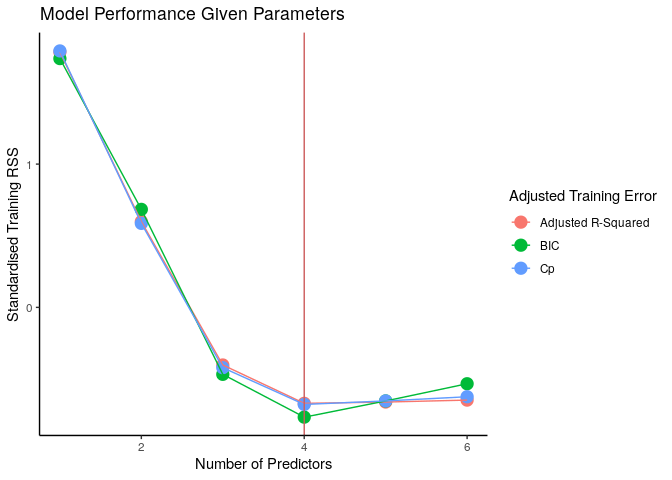<!-- -->

This demonstrates that the best performing linear regression is the model with 4 predictors, the predictors being:


```r
coef(allMLM, 4) %>% signif(2)
```

```
##             (Intercept)       MinimumMainMemory       MaximumMainMemory 
##                -41.0000                  0.0150                  0.0053 
##               CacheSize MaximumNumberOfChannels 
##                  0.5900                  1.4000
```

and hence the model would be:


```r
best.Mod.mlm <- lm(Performance ~ MinimumMainMemory + MaximumMainMemory + CacheSize + MaximumNumberOfChannels, cpu)
summary(best.Mod.mlm)
```

```
## 
## Call:
## lm(formula = Performance ~ MinimumMainMemory + MaximumMainMemory + 
##     CacheSize + MaximumNumberOfChannels, data = cpu)
## 
## Residuals:
##     Min      1Q  Median      3Q     Max 
## -186.73  -26.08    8.27   26.99  402.87 
## 
## Coefficients:
##                           Estimate Std. Error t value Pr(>|t|)    
## (Intercept)             -40.982864   6.041898  -6.783 1.25e-10 ***
## MinimumMainMemory         0.014887   0.001815   8.202 2.61e-14 ***
## MaximumMainMemory         0.005330   0.000645   8.263 1.79e-14 ***
## CacheSize                 0.587097   0.135764   4.324 2.39e-05 ***
## MaximumNumberOfChannels   1.436179   0.210954   6.808 1.08e-10 ***
## ---
## Signif. codes:  0 '***' 0.001 '**' 0.01 '*' 0.05 '.' 0.1 ' ' 1
## 
## Residual standard error: 60.86 on 204 degrees of freedom
## Multiple R-squared:  0.8595,	Adjusted R-squared:  0.8568 
## F-statistic: 312.1 on 4 and 204 DF,  p-value: < 2.2e-16
```


$$
Y_{\textsf{Perf}} = -40 + 0.015\times \textsf{MinMem}  + 0.0053 \times \textsf{MaxMem} + 0.59\times \textsf{Cache} + 1.4\times \textsf{MaxChannels}
$$

Despite the high performance of frequency for simple linear regression, suprisingly, it is not a factor in the model, moreover, despite the anticipated correlation between minimum memory and maximum memory they are both factors in the best performing model, this is suprising, however we will next consider interaction between memory and frequency to see if that is a non-colinear and significant term.

### Consider interaction terms

We may now wish to consider the interactoin term frequency and memory, as it stands to reason that higher memory may offer more performance for a cpu that has a higher frequency, moreover the three way interaction term was significant previously and so an interaction term will by considered:


```r
Int.Mod <- lm(Performance ~ -CycleTime + MinimumMainMemory + MaximumMainMemory + CacheSize + MaximumNumberOfChannels + MaximumMainMemory:Frequency:MaximumNumberOfChannels, data = cpu)

#vif(Int.Mod)
newBIC <- (Int.Mod) %>% BIC()
origBIC <- summary(regsubsets(Performance ~ . -CycleTime, cpu))$bic[4]
```

Adding the interaction term increased the adjusted training error from -383.5184961 to 2161.5715357 and hence this interaction term is rejected on the grounds that it does not improve the model performance on unseen data as predicted by the BIC value.

Hence the accepted linear model remains unchanged.

## (d) Model Diagnostics

The model should only be accepted if the residuals are normally distributed, otherwise the error in the model will not be consistent across the domain of the data, the model diagnostics may be previewed by using `plot()` over the model:


```r
layout(matrix(1:4, nrow = 2))
plot(best.Mod.mlm)
```

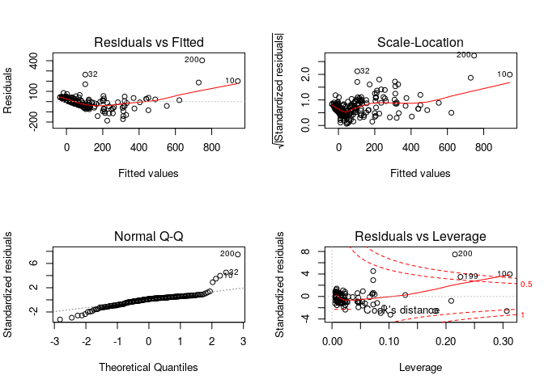<!-- -->


These plots are fairly poorly generated and so a better option would be to use ggplot2.

### ggplot2
An implementation for `ggplot2()` to plot model diagnostics has already been diagnosed.[^RajuRimal]

[^RajuRimal]: https://rpubs.com/therimalaya/43190


```r
diagPlot<-function(model){
    p1<-ggplot(model, aes(.fitted, .resid))+geom_point(col = "IndianRed")
    p1<-p1+stat_smooth(method="loess", col = "Purple")+geom_hline(yintercept=0, col="red", linetype="dashed")
    p1<-p1+xlab("Fitted values")+ylab("Residuals")
    p1<-p1+ggtitle("Residual vs Fitted Plot")+theme_bw()
    
    p2<-ggplot(model, aes(qqnorm(.stdresid)[[1]], .stdresid))+geom_point(col = "IndianRed",na.rm = TRUE)
    p2<-p2+geom_abline(slope = 1, intercept = 0)+xlab("Theoretical Quantiles")+ylab("Standardized Residuals")
    p2<-p2+ggtitle("Normal Q-Q")+theme_bw()
    
    p3<-ggplot(model, aes(.fitted, sqrt(abs(.stdresid))))+geom_point(col = "IndianRed",na.rm=TRUE)
    p3<-p3+stat_smooth(method="loess",col = "Purple" , na.rm = TRUE)+xlab("Fitted Value")
    p3<-p3+ylab(expression(sqrt("|Standardized residuals|")))
    p3<-p3+ggtitle("Scale-Location")+theme_bw()
    
    p4<-ggplot(model, aes(seq_along(.cooksd), .cooksd))+geom_bar(stat="identity", position="identity")
    p4<-p4+xlab("Obs. Number")+ylab("Cook's distance")
    p4<-p4+ggtitle("Cook's distance")+theme_bw()
    
    p5<-ggplot(model, aes(.hat, .stdresid))+geom_point(col = "IndianRed", aes(size=.cooksd), na.rm=TRUE)
    p5<-p5+stat_smooth(method="loess",col = "Purple" , na.rm=TRUE)
    p5<-p5+xlab("Leverage")+ylab("Standardized Residuals")
    p5<-p5+ggtitle("Residual vs Leverage Plot")
    p5<-p5+scale_size_continuous("Cook's Distance", range=c(1,5))
    p5<-p5+theme_bw()+theme(legend.position="bottom")
    
    p6<-ggplot(model, aes(.hat, .cooksd))+geom_point(col = "IndianRed", na.rm=TRUE)+stat_smooth(method="loess",col = "Purple" , na.rm=TRUE)
    p6<-p6+xlab("Leverage hii")+ylab("Cook's Distance")
    p6<-p6+ggtitle("Cook's dist vs Leverage hii/(1-hii)")
    p6<-p6+geom_abline(slope=1, intercept = 0, color="gray", linetype="dashed")
    p6<-p6+theme_bw()
    
    return(list(rvfPlot=p1, qqPlot=p2, sclLocPlot=p3, cdPlot=p4, rvlevPlot=p5, cvlPlot=p6))
}
```


```r
diagArray <- function(model){
grid.arrange(
diagPlot(model)$rvfPlot,
diagPlot(model)$qqPlot,
diagPlot(model)$rvlevPlot,
diagPlot(model)$cvlPlot)
}

diagArray(best.Mod.mlm)
```

<!-- -->

The residuals appear somewhat non-normal in the plot of the fitted values against the model residuals, there appears to be a concave up pattern in the residuals across the fitted values, the normal QQ plot appears to deviate significantly from the line and there appears to be values with high points of leverage.

It appears that the assumption of normally distributed residuals may be violated.

## (5) Transform the data to overcome diagnostic issues.

An appropriate transform for the data in order to adress the non-normality of the residuals would be a concave transform of the response.


```r
cpu$rootPerformance <- sqrt(cpu$Performance)

hist <- ggplot(cpu, aes(x = Performance)) +
  geom_histogram(binwidth = 80) +
  theme_classic() +
  labs(y = "Observations", title = "Histogram of Performance")

loghist <- ggplot(cpu, aes(x = rootPerformance)) +
  geom_histogram(binwidth = 1) +
  theme_classic() +
  labs(y = "Observations", title = "Histogram of Performance", x = "Root-Performance")


ggarrange(hist, loghist, ncol = 2)
```

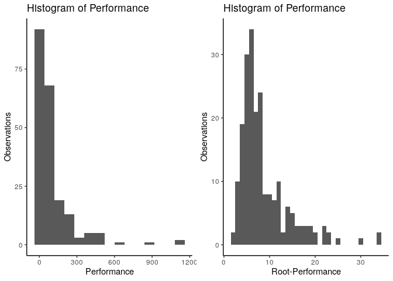<!-- -->

This clearly demonstrates log-normal response data, hence a log-transform may be appropriate, however a log-transform significantly compromises the normality of the residuals across the fitted data, and hence a root-transform is used instead:


```r
best.Mod.mlm <- lm(rootPerformance ~ MinimumMainMemory + MaximumMainMemory + CacheSize + MaximumNumberOfChannels, cpu)

diagArray(best.Mod.mlm)
```

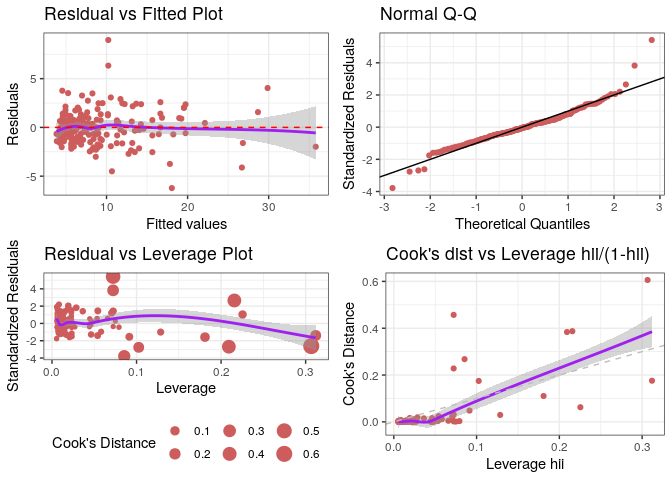<!-- -->


The residuals, following the transform, are sufficiently normal in order to accept the model, although the model appears to have a few points of high leverage.

The optimal multiple linear regression model is hence:

$$
Y_{\textsf{Perf}} = -40 + 0.015\times \textsf{MinMem}  + 0.0053 \times \textsf{MaxMem} + 0.59\times \textsf{Cache} + 1.4\times \textsf{MaxChannels}
$$


# Question 2
## (1) Choose an appropriate polynomial attribute
Select the most suitable attribute of CPU that can be used to predict accurately the performance of CPU using Polynomial Regression.


### Consider Cycle Time
The plot at \@ref(fig:sp) shows a very strong non-linear, possibly directly inversely proprtional, relationship between CycleTime and performance, for this reason it will be considered as an attribute for a polynomial model.

By the nature of the strong visual relationship between Cycle Time and  performance, it will be considered as a potential attribute to predict CPU performance using a polynomial model.

Create the various models

```r
set.seed(2)
maxdeg <- 15

modsCT <- vector(mode = "list", length = maxdeg)
modsCT[[1]] <- glm(Performance ~ I(1/CycleTime), data = cpu)
names(modsCT)[1] <- "Hyperbolic"

for(i in 1:maxdeg){
modsCT[[i+1]] <-  glm(Performance ~ poly(CycleTime, i, raw = TRUE), data = cpu)
names(modsCT)[i+1] <- paste("Degree ", i)
}
```

Perform cross Validation across the models


```r
CycTime_CrossValDF <- tibble("Model" = factor(names(modsCT), levels = names(modsCT), ordered = TRUE), "CVError" = rep(NA, maxdeg+1))


CycTime_CrossValDF[(1), "CVError"] <- sqrt(cv.glm(data = cpu, glmfit = modsCT[[1]], K = 10)$delta[1])
for (i in 1:(maxdeg)) {
  CycTime_CrossValDF[(i+1), "CVError"] <- sqrt(cv.glm(data = cpu, glmfit = modsCT[[(i+1)]], K = 10)$delta[1])
}
```


Now plot the CV Error


```r
ggplot(data = CycTime_CrossValDF, aes(x = factor(Model, ordered = TRUE), y = CVError, group = 1)) +
  geom_point(col = "IndianRed", size = 5) +
geom_line(col = "Purple") +
  theme_classic() + 
  labs(x = "Polynomial Model", y = "Expected Testing Error", title = "Cross Validation for Cycle Time") +
  geom_vline(xintercept =  1, col = "RoyalBlue") +
  geom_vline(xintercept = which.min(CycTime_CrossValDF[[ "CVError"]]), col = "brown") +
  theme(axis.text.x = element_text(angle = 90, hjust = 1))
```

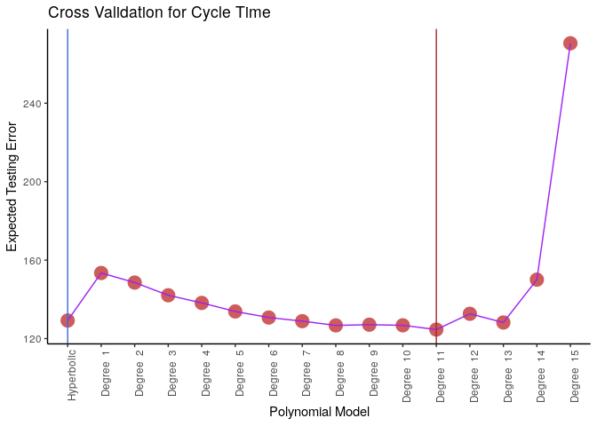<!-- -->

```r
#which.min(CycTime_CrossValDF[[ "CVError"]])
```

Although the Cycle Time performs well as a predictive feature within a polynomial model of a high degree, the simplest model that performs equallyas well is the hyperbolic model. The simpler model should be accepted because the higher degree of the model will increase the variance of the model without significantly improving the performance of the model. When Cycle time is chosen as the best attribute to model the performance of the cpu, the hyperbolic model is the optimal model:

$$
Y_{Perf} = \frac{8229.468}{X_{CycTime}}
$$

However a hyperbola is not a polynomial curve, but a *rational* curve.

### Choose the best performing variable

However it may be such that cycle time is not the most appropriate variable, in order to determine the best single attribute  that may be used to predict performance by way of a polynomialmodel the *best attributes* algorithm may be extended:

1. For all predictors:
  - Fit all hyperbolic, linear and 2nd to nth degree polynomial models using only a sinle predictor, choose the predictor that returns the lowest training error
  - Repeat for all Predictors
2. Select a single bestmodel from among the hyperbolic, linear and polynomial models by using cross validation.

This resulting model will be the best performing model given the constraints that it must be a polynomial model with only a single attribute.

#### Implement the Algorithm
Set the seed, create a tibble and create a data frame in which to store the best predictors:


```r
# Questoin 2 Scratch ------------------------------------------------------
set.seed(31415)


mdg <- 9 # Maximum Degree to Consider in Question 2

cpu <- as_tibble(cpu)
predictors <- select(cpu, c( "CycleTime", "MinimumMainMemory", "MaximumMainMemory", "CacheSize", "MinimumNumberOfChannels", "MaximumNumberOfChannels"))
names(cpu)
```

```
## [1] "CycleTime"               "MinimumMainMemory"      
## [3] "MaximumMainMemory"       "CacheSize"              
## [5] "MinimumNumberOfChannels" "MaximumNumberOfChannels"
## [7] "Performance"             "Frequency"              
## [9] "rootPerformance"
```

```r
BestPred <- data.frame("Degree" = 1:(mdg+1), "BestAttribute" = rep(NA, (mdg+1)))
```

Now create a loop to determine the best attribute for each corresponding model:


```r
# Lin to 6th deg


BestPred <- data.frame("Degree" = 1:(mdg+1), "BestAttribute" = rep(NA, (mdg+1)))

for (j in (1:mdg)) {
  
RSSVals <- data.frame(names(predictors), "RSS" = 1:length(predictors))
  for (i in 1:length(predictors)) {
    
    RSSVals[i,2] <- (glm(cpu$Performance ~ poly(as_vector(predictors[i]), j))$residuals)^2 %>% sum()
    
  }

BestPred[j,2] <-  as.character(RSSVals[which.min(RSSVals[,2]),1][1])
}

# Hyperbolic

RSSVals <- data.frame(names(predictors), "RSS" = 1:length(predictors))
for (i in 1:length(predictors)) {
  
  RSSVals[i,2] <- (glm(cpu$Performance ~ (1/as_vector(predictors[i])))$residuals)^2 %>% sum()
  
}

BestPred$Degree[(mdg+1)] <- -1
BestPred[(mdg+1),2] <-  as.character(RSSVals[which.min(RSSVals[,2]),1][1])

BestPred
```

```
##    Degree     BestAttribute
## 1       1 MaximumMainMemory
## 2       2 MaximumMainMemory
## 3       3 MaximumMainMemory
## 4       4 MaximumMainMemory
## 5       5 MaximumMainMemory
## 6       6 MaximumMainMemory
## 7       7 MaximumMainMemory
## 8       8 MaximumMainMemory
## 9       9 MaximumMainMemory
## 10     -1         CycleTime
```

## (2) Use 10-fold CV to Select the Optimal Model
Now that we have the best attribute for any given model, we may use cross validation in order to decide upon the best model, first however create a list of models and a data frame in which to store the CV errors:


```r
# Now I have to perform cross validation on every model
## Create a list of models

### Create the model names
modnames <- rep(NA, (mdg+1))
for (i in (1:(mdg+1))) {
 modnames[i] <- paste("Degree ", i) 
  
}
modnames[mdg+1] <- "Hyperbolic"

### Create the list of Models
mods <- vector(mode = "list", length = length(modnames))
names(mods) <- modnames

### Assign the models

for (i in 1:mdg) {
 mods[[i]] <-  glm(formula = paste("Performance ~ ", BestPred[i,2]), data = cpu)
}

mods[[(mdg+1)]] <- glm(Performance ~ I(1/CycleTime), data = cpu)


## Use the list to perform Cross Validation

### Make a data frame to track the expected error
BestPred$CVError <- rep(NA, nrow(BestPred))
```

Now actually perform the 10-fold cross validation error:


```r
### Compute the CV Error
for (r in 1:nrow(BestPred)) {
BestPred[r,3] <- sqrt(cv.glm(data = cpu, glmfit = mods[[r]], K = 10)$delta[1])
}
```

Now clean up the names and plot the cross validation Errors:


```r
BestPred$names <- names(mods)
BestPred <- arrange(.data = BestPred, sort.by = Degree)
names(BestPred)[2] <- "Best Attribute"


ggplot(BestPred, aes(x = factor(Degree, labels = BestPred$names, ordered = TRUE), y = CVError, group = 1)) + 
  geom_point(aes(shape = `Best Attribute`, col = `Best Attribute`),  size = 5) +
  geom_line() +
  theme_classic()  +
  labs(x = "Model Type",
       y = TeX("Estimated Testing Error $\\pm $ Performance"),
       title = "Cross Validation of Different Models") +
  geom_vline(xintercept = which.min(BestPred$CVError))+
  theme(axis.text.x = element_text(angle = 90, hjust = 1))
```

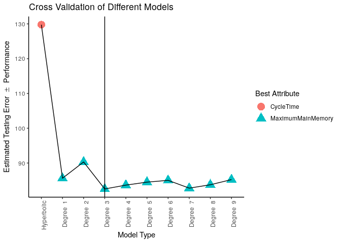<!-- -->

If leave-one out CV is performed the optimal model will also be found to be a 3rd degree polynomial, hence the best polynomial model, using only one attribute, is a 3rd degree polynomial using `MaximumMainMemory`:


```r
bestPoly <- lm(Performance ~ poly(MaximumMainMemory, 3), cpu)
summary(bestPoly)
```

```
## 
## Call:
## lm(formula = Performance ~ poly(MaximumMainMemory, 3), data = cpu)
## 
## Residuals:
##     Min      1Q  Median      3Q     Max 
## -325.93  -22.30   -9.03   10.59  333.19 
## 
## Coefficients:
##                             Estimate Std. Error t value Pr(>|t|)    
## (Intercept)                  105.617      4.579  23.067   <2e-16 ***
## poly(MaximumMainMemory, 3)1 2001.742     66.194  30.240   <2e-16 ***
## poly(MaximumMainMemory, 3)2  684.557     66.194  10.342   <2e-16 ***
## poly(MaximumMainMemory, 3)3  -79.978     66.194  -1.208    0.228    
## ---
## Signif. codes:  0 '***' 0.001 '**' 0.01 '*' 0.05 '.' 0.1 ' ' 1
## 
## Residual standard error: 66.19 on 205 degrees of freedom
## Multiple R-squared:  0.833,	Adjusted R-squared:  0.8306 
## F-statistic:   341 on 3 and 205 DF,  p-value: < 2.2e-16
```

so the model is:

$$
Y_{Perf} = 106 + 2002 \times \textsf{Mem} + 685 \times \textsf{Mem}^2 -80 \times \textsf{Mem}^3
$$

## (3) Comment on the Accuracy of the Model
The expected RMSE of the model on unseen data is approximately 82.5 as determined by 10-fold Cross Validation, so it would be expected that this model will make predictions with an expected error of 82.5, this is significantly less than the standard deviation of the CPU performance and so the model would be expected to perform significantly better than mere chance. 

## (4) Model Diagnostics

The residuals of the best performing model may be considered thusly:


```r
diagArray(bestPoly)
```

<!-- -->

The residuals appear to be bunched up to the left, however there is no clear pattern in them, although they do not necessarily look normally distributed, the normal q-q plot has a wave to it and so the distribution of the residuals would hence correspond to a 'fat-tailed' distribution.

The residual plots are not sufficiently non-normal to reject the model on grounds of non-normal residuals. Hence the attribute `MaximumMainMemory` is accepted as the most suitable attribute for the most optimal single variable polynomial regression, as measured by 10-fold Cross Validation.


# Question 3 - Wine Trees


## (1) Create a test and training set
Divide the dataset into Training set with 4000 observations and assign rest of the observations into
Test set. [Use set.seed as 10 to generate same randomness.]

The data set may be imported and a training set indexed thusly:


```r
set.seed(10)

#Import the data
wine <- as_tibble(read.csv(file = "./Code/Datasets/Wine.csv", header = TRUE, sep = ","))
glimpse(wine)
```

```
## Observations: 4,898
## Variables: 12
## $ WineQuality        <int> 6, 6, 6, 6, 6, 6, 6, 6, 6, 6, 5, 5, 5, 7, 5, …
## $ FixedAcidity       <dbl> 7.0, 6.3, 8.1, 7.2, 7.2, 8.1, 6.2, 7.0, 6.3, …
## $ VolatileAcidity    <dbl> 0.27, 0.30, 0.28, 0.23, 0.23, 0.28, 0.32, 0.2…
## $ CitricAcid         <dbl> 0.36, 0.34, 0.40, 0.32, 0.32, 0.40, 0.16, 0.3…
## $ ResidualSugar      <dbl> 20.70, 1.60, 6.90, 8.50, 8.50, 6.90, 7.00, 20…
## $ Chlorides          <dbl> 0.045, 0.049, 0.050, 0.058, 0.058, 0.050, 0.0…
## $ FreeSulfurDioxide  <dbl> 45, 14, 30, 47, 47, 30, 30, 45, 14, 28, 11, 1…
## $ TotalSulfurDioxide <dbl> 170, 132, 97, 186, 186, 97, 136, 170, 132, 12…
## $ Density            <dbl> 1.0010, 0.9940, 0.9951, 0.9956, 0.9956, 0.995…
## $ PH                 <dbl> 3.00, 3.30, 3.26, 3.19, 3.19, 3.26, 3.18, 3.0…
## $ Sulphates          <dbl> 0.45, 0.49, 0.44, 0.40, 0.40, 0.44, 0.47, 0.4…
## $ Alcohol            <dbl> 8.8, 9.5, 10.1, 9.9, 9.9, 10.1, 9.6, 8.8, 9.5…
```

```r
# Create a training set
train <- sample(1:(nrow(wine)), size = 4000)
wine.test  <- slice(wine, -train)
wine.train <- slice(wine, train)
```


## (2) Build a decision tree
A decision tree may be constructed by using the following code:

```r
wine.tree <- tree(WineQuality ~ ., wine.train)
summary(wine.tree)
```

```
## 
## Regression tree:
## tree(formula = WineQuality ~ ., data = wine.train)
## Variables actually used in tree construction:
## [1] "Alcohol"           "VolatileAcidity"   "FreeSulfurDioxide"
## Number of terminal nodes:  5 
## Residual mean deviance:  0.5788 = 2312 / 3995 
## Distribution of residuals:
##    Min. 1st Qu.  Median    Mean 3rd Qu.    Max. 
## -3.5890 -0.3856  0.1013  0.0000  0.6144  3.6140
```

```r
paste("SD of Quality: ", sd(wine$WineQuality))
```

```
## [1] "SD of Quality:  0.885638574967831"
```

```r
paste("Average Wine Quality: ", mean(wine$WineQuality))
```

```
## [1] "Average Wine Quality:  5.87790935075541"
```


reducing the number of terminal nodes (known as 'pruning' the tree) may elicit better performance from the model, this ideal number of terminal nodes may be considered by using cross validation:


```r
wine.treeCV <- cv.tree(wine.tree)

WineCVError <- tibble("Nodes" = wine.treeCV$size, "RSS" = wine.treeCV$dev, "MSE" = (wine.treeCV$dev)/length(train), "RMSE" = sqrt((wine.treeCV$dev)/length(train)))

ggplot(WineCVError, aes(x = Nodes, y = RMSE, group = 1)) +
  geom_point(col = "#B223F5", size = 5) +
  geom_line(col = "#DBA0D6") +
  theme_classic2() +
  labs(title = "Cross Validation Error", y = TeX("Expected Error $ \\left(E ( \\epsilon) \\right)$"), caption = "RMSE is an estimation of the mean residual value, hence it is expressed that RMSE is the expected model error") +
  geom_vline(xintercept = as.integer(summary(wine.treeCV)[1,1]), col = c("#AB0FFF")) +
  geom_hline(yintercept = min(WineCVError$RMSE), col = c("#AB0FFF")) +
  annotate(geom = "text", y = (min(WineCVError$RMSE)+sd(WineCVError$RMSE)), x = (4), label = paste("SD of Error: ", signif(min(WineCVError$RMSE), 3))) 
```

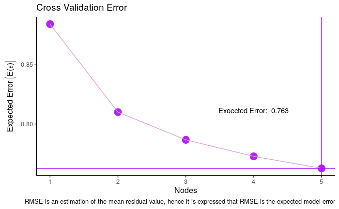<!-- -->

This suggests that the model initially used, with 5 nodes, is the best performing model, hence a 5-node tree model is accepted:


```r
plot(wine.tree)
text(wine.tree, pretty = 1, cex = 0.75)
```

<!-- -->

### Superior plot
A superior plot (and automatic cross-validation) may be produced by using the `rpart()` function:


```r
WineModTree.rpart <- rpart(formula = WineQuality~ ., data = wine.train)
WineModTree.plot  <- rpart.plot(WineModTree.rpart, box.palette="OrGy", shadow.col="gray", nn=TRUE)
```

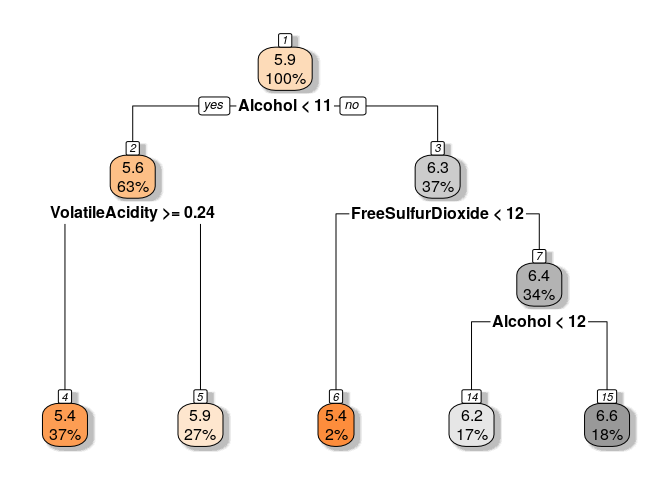

### Significant Attributes

 It can be oveserved from \@ref(fig: tree) that in creating this model only the measurements of acohol, volatile acidity and free sulfur dioxide are found to be significant, the mean square error (MSE) of this model (errounesly listed as deviance by this package) is 0.58, which is a reasonably low training error, given that this is significantly lower than the standard deviation of the wine quality which is 0.89 with an average wine quality value of 5.9.

## (3) Model Performance
#### Comparison to testing data


```r
wineTreePreds.test <- predict(object = wine.tree, newdata = wine.test)

rmse <- function(pred, obs){
  if(require("tidyverse")){
    (pred-obs)^2 %>% mean %>% sqrt()
  } else{
    print("Install Tidyverse first")
  }
}

wineTree.rmse <- rmse(pred = wineTreePreds.test, obs = wine.test$WineQuality)
```

### Comment on the Error
Cross validation provides that the expected error by using this model is 0.77 units of quality, the same expected error value is returned from fitting the model to testing data, the standard deviation (i.e. the expected difference between values of wine quality) is about 0.89, so this model is expected, by cross validation, to perform better than mere chance.


## (4) Build a categorical decision tree

First create a factor of variables for high and low wine quality


```r
wine$WineCat <- ifelse(wine$WineQuality > 6, "high", "low")
wine$WineCat <- factor(x = wine$WineCat, levels = c("low", "high"), ordered = TRUE, nmax = 2)

wine.test  <- slice(wine, -train)
wine.train <- slice(wine, train)
```

the tree model may be constructed thusly:


```r
wineCat.tree <- tree(WineCat ~ . -WineQuality, wine.train)
# plot(wineCat.tree)
# text(wineCat.tree, pretty = 1, cex = 0.75)
```


A better performing model may be found by 'pruning' the tree, showing preference for a model that reduces the misclassification rate for cross validation (as opposed to cost complexity pruning):


```r
wineCat.treeCV <- cv.tree(object = wineCat.tree, FUN = prune.misclass, K = 10)

wineCat.treeCV
```

```
## $size
## [1] 6 5 3 1
## 
## $dev
## [1] 835 835 837 857
## 
## $k
## [1] -Inf  0.0  3.5 10.5
## 
## $method
## [1] "misclass"
## 
## attr(,"class")
## [1] "prune"         "tree.sequence"
```

```r
summary(wineCat.tree)
```

```
## 
## Classification tree:
## tree(formula = WineCat ~ . - WineQuality, data = wine.train)
## Variables actually used in tree construction:
## [1] "Alcohol"         "VolatileAcidity"
## Number of terminal nodes:  6 
## Residual mean deviance:  0.8307 = 3318 / 3994 
## Misclassification error rate: 0.2065 = 826 / 4000
```


```r
WineCatCVError <- tibble("Nodes" = as.numeric(wineCat.treeCV$size), "MisClas" = wineCat.treeCV$dev/length(train))
WineCatCVError <- arrange(WineCatCVError, Nodes)

WineCatCVError <- tibble("Nodes" = factor(x = WineCatCVError[[ "Nodes"]], levels = WineCatCVError[[ "Nodes"]], ordered = TRUE), "MisClas" = WineCatCVError[[ "MisClas"]])
bestNode <- WineCatCVError[[ "Nodes"]][which.min(WineCatCVError[["MisClas"]])]
bestMisclas <- WineCatCVError[[ "MisClas"]][bestNode]

ggplot(WineCatCVError, aes(x = Nodes, y = MisClas, group = 1)) +
  geom_point(col = "#B223F5", size = 5) +
  geom_line(col = "#DBA0D6") +
  theme_classic2() +
  labs(title = "Cross Validation Error", y = "Misclassificatoin Rate", caption = "Misclassification Rate is a measurement of the expected frequency of misclassification as determined by Cross Validation") +
  geom_vline(xintercept = as.integer(bestNode), col = c("#AB0FFF")) +
  geom_hline(yintercept = bestMisclas, col = c("#AB0FFF")) +
  annotate(geom = "text", y = bestMisclas+sd(WineCatCVError$MisClas), x = (1.1+3), label = paste("Misclassification Rate: \n", signif(min(WineCatCVError$MisClas), 3))) 
```

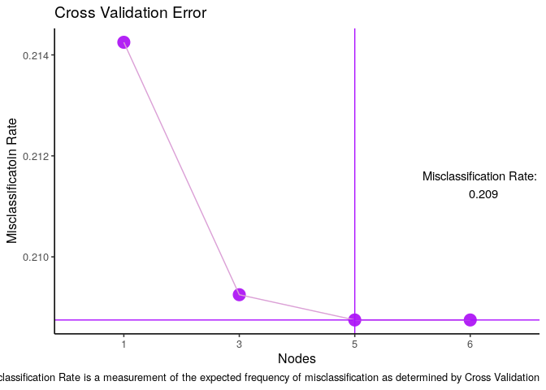<!-- -->

The expected misclassification rate on unseen data for this model, as predicted by Cross Validatoin, will be minised by choosing five nodes and hence the model will be pruned from six to five terminal nodes, this can be acheived by using the `prune.misclass()` function:


```r
wineCat.tree.prune <- prune.misclass(wineCat.tree, best = bestNode)
plot(wineCat.tree.prune)
text(wineCat.tree.prune, pretty = 1, cex = 0.75)
```

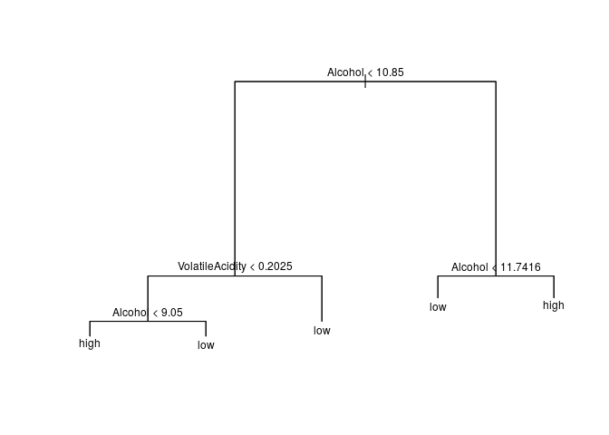<!-- -->


##### (5) Comment on the performance of the model

the model can used to on the testing data in order to assess the rate of misclassification:


```r
WineTreeCatPreds <- predict(object = wineCat.tree.prune, newdata = wine.test, type = "class")
WineTestObs <- wine.test$WineCat


# Now create the confusion Matrix
  # This package prevents making mistakes
  conf.mat <-   caret::confusionMatrix(data = WineTreeCatPreds, reference = WineTestObs)
  conf.mat
```

```
## Confusion Matrix and Statistics
## 
##           Reference
## Prediction low high
##       low  591  107
##       high 101   99
##                                           
##                Accuracy : 0.7684          
##                  95% CI : (0.7394, 0.7956)
##     No Information Rate : 0.7706          
##     P-Value [Acc > NIR] : 0.5813          
##                                           
##                   Kappa : 0.3381          
##                                           
##  Mcnemar's Test P-Value : 0.7288          
##                                           
##             Sensitivity : 0.8540          
##             Specificity : 0.4806          
##          Pos Pred Value : 0.8467          
##          Neg Pred Value : 0.4950          
##              Prevalence : 0.7706          
##          Detection Rate : 0.6581          
##    Detection Prevalence : 0.7773          
##       Balanced Accuracy : 0.6673          
##                                           
##        'Positive' Class : low             
## 
```

```r
  # This could otherwise be created by using, always go prediction, reference as a standard
  mis.mat <- table("prediction" = WineTreeCatPreds, "reference" = WineTestObs)
    mcr <- signif((mis.mat[1,2]+mis.mat[2,1])/sum(mis.mat),2)
    mcr
```

```
## [1] 0.23
```


The misclassification error rate on the testing data is 23%, this is comparable with what was predicted via cross validation which returned 20.65%, this misclassification rate corresponds to a tree model trained to minimise the cross validation misclassification rate (as opposed to cost-complexity).

This misclassification rate is quite high, however for the trade off of interpretability, this is still an acceptable model. It's very interesting that a good wine is essenitally synonymous with a strong wine.


# Question 4
## (1) Design a Support Vector Machine
### Create a categorical Variable
Classify CPU performance as an ordered factor with levels of `high` and `low`:


```r
cpu <- select(cpu, -rootPerformance, -Frequency)
cpu$Performance <- if_else(cpu$Performance > 500, "high", "low")
cpu$Performance <- factor(cpu$Performance, c("low", "high"), ordered = TRUE)
```


### Create the SVM
#### Support Vector Classifier
A support Vector Classifier can be constructed with a linear kernel by using the `svm` function:


```r
set.seed(3)
cpu.svm <- svm(Performance ~ ., data = cpu, kernel = "linear", cost = 10, scale = FALSE)
```

Cross validation can used in order to determine the best cost value via the `e1071::tune()` function, the cost is, to a degree, a measure of model flexibility and so there will be an optimal cost value, for non-linear kernel's differeng gamma values may be considered as well and hence they will be included in a function call:


```r
makeSVM <- function(formula = Performance ~ ., data = cpu, kernel = "linear", plotQ = TRUE){
# cpu.svm <- svm(Performance ~ ., data = cpu, kernel = "linear", cost = 10, scale = FALSE)

tune.cpu <- tune(method = svm, train.x = formula, data = data, kernel = kernel, ranges = list(cost = seq(from = 0.0001, to = 10, length.out = 50)), gamma = c(0.5, 1, 2, 3, 4))
summary(tune.cpu)
CVErrors <- as_tibble(summary(tune.cpu)[[7]])
CVErrors$error <- (CVErrors$error)

bestcost <- CVErrors$cost[CVErrors$error<=min(CVErrors[[ "error"]])][1]

tuneplot <- ggplot(CVErrors, aes(x = cost, y = error)) +
  geom_point(col = "#B223F5", size = 1) +
  geom_line(col = "#DBA0D6") +
  theme_classic2() +
  labs(title = "Cross Validation estimation of Error given Cost Parameter", y = "Error", x = "Cost", caption = paste("The optimal cost parameter appears to occur at a cost value of", signif(bestcost, 2))) +
  geom_hline(yintercept = (as.numeric(summary(tune.cpu)[2])), col = c("#AB0FFF")) + 
  geom_vline(xintercept = bestcost, col = c("#AB0FFF"))


if (plotQ) {
 return(tuneplot) 
} else {
  return(c("ErrorRate" = (as.numeric(summary(tune.cpu)[2]))))
}


}

# Consider using `kernlab::ksvm()`

makeSVM()
```

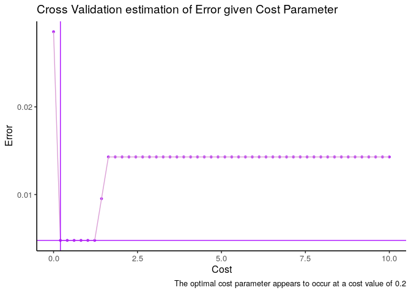<!-- -->

Using Cross Validation it may be determined that the best cost value for a linear kernel is 0.21.


### Compare Different types of kernels

In order to compare the performance of the different type of SVM kernel's a loop can be constructed and the expected testing error, as determined by cross validation, may be compared:


```r
models <- list("linear", "polynomial", "radial", "sigmoid")
KerDF <- tibble("Kernel" = c("Linear", "Polynomial", "Radial", "Sigmoid"), "CVError" = rep(NA, 4))


i <- 1
for (mod in models){
KerDF[i, 2] <- makeSVM(kernel = mod, plotQ = FALSE)
i <- i+1 
}

#KerDF

ggplot(KerDF, aes(x = Kernel, y = CVError, fill = Kernel)) +
  geom_col(alpha = 0.5) + 
  theme_bw() +
  labs(x = "Kernel Model", y = "Expected Misclassification Rate", title = "Cross Validated Errors for SVM Models")
```

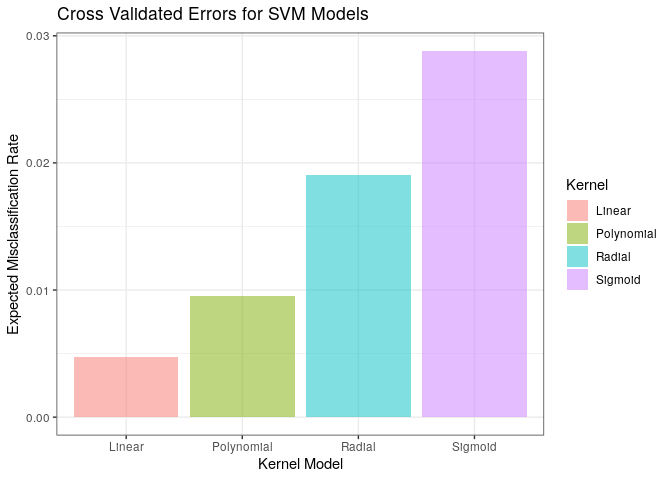<!-- -->

The linear Model appears to have the lowest expected training error as determined by 10-fold cross validation, hence the linear SVM model is accepted as the optimal SVM model with a cost parameter of 0.21:


```r
cpu.svm <- svm(Performance ~ ., data = cpu, kernel = "linear", cost = 10, scale = FALSE)

tune.cpu <- tune(method = svm, train.x = Performance ~ ., data = cpu, kernel = "linear", ranges = list(cost = seq(from = 0.0001, to = 2, length.out = 30)))
#summary(tune.cpu)

summary(tune.cpu$best.model)
```

```
## 
## Call:
## best.tune(method = svm, train.x = Performance ~ ., data = cpu, 
##     ranges = list(cost = seq(from = 1e-04, to = 2, length.out = 30)), 
##     kernel = "linear")
## 
## 
## Parameters:
##    SVM-Type:  C-classification 
##  SVM-Kernel:  linear 
##        cost:  0.2069862 
## 
## Number of Support Vectors:  7
## 
##  ( 3 4 )
## 
## 
## Number of Classes:  2 
## 
## Levels: 
##  low high
```

The 
### Optimal SVM


because the `svm()` function works for more than linear kernels, it is not simple to return the coefficients of a linear decision boundary [^svmdatacamp], in order to have this returned there is some more work.

[^svmdatacamp]: [Data Camp SVM](https://www.datacamp.com/community/tutorials/support-vector-machines-r)


## What is the peformance?

The error provided by the `e1071` package when applied to categorical data is the misclassification rate, hence the expected misclassification rate, as determined by 10-fold cross validation, is 1/200, making this a very accurate model for predicting whether or not a cpu is above or below 500, however, this is a very broad category and the polynomial model previously had an expected error of aproximately 100 units of performance, meaning that we would probably expect the polynomial model to perform just as well in this situation as the SVM. 


