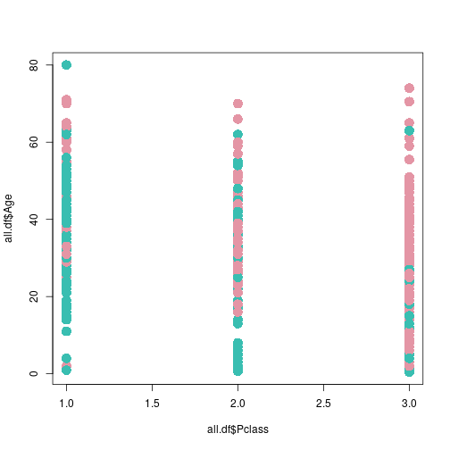
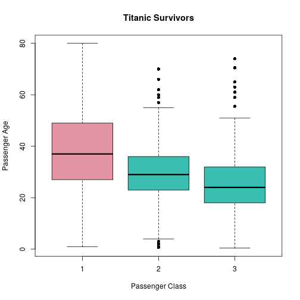
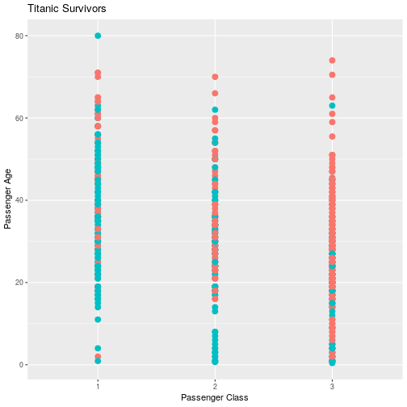

#Preamble
##Load in the packages

```r
##Load Packages
if(require('pacman')){
  library('pacman')
}else{
  install.packages('pacman')
  library('pacman')
}

pacman::p_load(ggmap, plotly, EnvStats, ggplot2, GGally, corrplot, dplyr, tidyr,
               stringr, reshape2, cowplot, ggpubr, tidyverse, reshape2, ggplot2,
               rmarkdown, dplyr, plotly, rstudioapi, wesanderson, RColorBrewer,
               colorspace)
```


```r
#Load data
all.df <- read.csv("../0DataSets/titanictrain.csv", TRUE, ",")
```

#View the Data

```r
head(all.df)
```

```
##   PassengerId Survived Pclass
## 1           1        0      3
## 2           2        1      1
## 3           3        1      3
## 4           4        1      1
## 5           5        0      3
## 6           6        0      3
##                                                  Name    Sex Age SibSp
## 1                             Braund, Mr. Owen Harris   male  22     1
## 2 Cumings, Mrs. John Bradley (Florence Briggs Thayer) female  38     1
## 3                              Heikkinen, Miss. Laina female  26     0
## 4        Futrelle, Mrs. Jacques Heath (Lily May Peel) female  35     1
## 5                            Allen, Mr. William Henry   male  35     0
## 6                                    Moran, Mr. James   male  NA     0
##   Parch           Ticket    Fare Cabin Embarked
## 1     0        A/5 21171  7.2500              S
## 2     0         PC 17599 71.2833   C85        C
## 3     0 STON/O2. 3101282  7.9250              S
## 4     0           113803 53.1000  C123        S
## 5     0           373450  8.0500              S
## 6     0           330877  8.4583              Q
```

#Create Plots
Consider how the passenger age and class affects the probability
of survival for a passenger, plots for this can be created thusly:

##Base Plot
In the Base package a scatter plot with continuous values or a 
boxplot with discrete values can be created thusly:
###Continous Scatter Plot

```r
plot(x = all.df$Pclass, y = all.df$Age, data = all.df, col = PlotCol.vec[all.df$Survived + 1], pch = 16, cex = 2)
```

```
## Warning in plot.window(...): "data" is not a graphical parameter
```

```
## Warning in plot.xy(xy, type, ...): "data" is not a graphical parameter
```

```
## Warning in axis(side = side, at = at, labels = labels, ...): "data" is not
## a graphical parameter

## Warning in axis(side = side, at = at, labels = labels, ...): "data" is not
## a graphical parameter
```

```
## Warning in box(...): "data" is not a graphical parameter
```

```
## Warning in title(...): "data" is not a graphical parameter
```


###Categorical Box Plot

```r
###Create Categorical Factors
all.df$Pclass <- as.factor(all.df$Pclass)
all.df$Survived <- as.factor(all.df$Survived)
###Create the Plot (Box Plot)
PlotCol.vec <- rainbow_hcl(2)
plot(x = all.df$Pclass, y = all.df$Age, data = all.df,
     col = PlotCol.vec[all.df$Survived], pch = 16,
     xlab = "Passenger Class", ylab = "Passenger Age",
     main = "Titanic Survivors")
```


##ggplot2
GGplot may create more aesthetically pleasing plots:

```r
##Numeric
all.df <- read.csv("titanictrain.csv", TRUE, ",")
```

```
## Warning in file(file, "rt"): cannot open file 'titanictrain.csv': No such
## file or directory
```

```
## Error in file(file, "rt"): cannot open the connection
```

```r
ggplot(all.df, aes(x = Pclass, y = Age, col = Survived)) +
  geom_point(lwd = 3) +
  guides(col = FALSE) +
  labs(title = "Titanic Survivors", x = "Passenger Class", y = "Passenger Age")
```

```
## Warning: Removed 177 rows containing missing values (geom_point).
```



```r
  #This is undesirable because the legend isn't done with discrete variables

##Factors

###Create Categorical Factors
all.df$Pclass <- as.factor(all.df$Pclass)
all.df$Survived <- as.factor(all.df$Survived)

ggplot(all.df, aes(x = Pclass, y = Age, col = Survived)) +
  geom_point(lwd = 4) +
  labs(title = "Titanic Survivors", x = "Passenger Class", y = "Passenger Age") +
  scale_color_discrete(labels = c("Perished", "Survived"), name = "Passenger Fate")
```

```
## Warning: Removed 177 rows containing missing values (geom_point).
```


