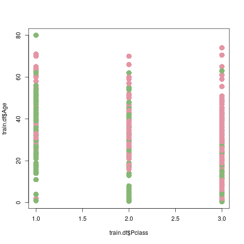
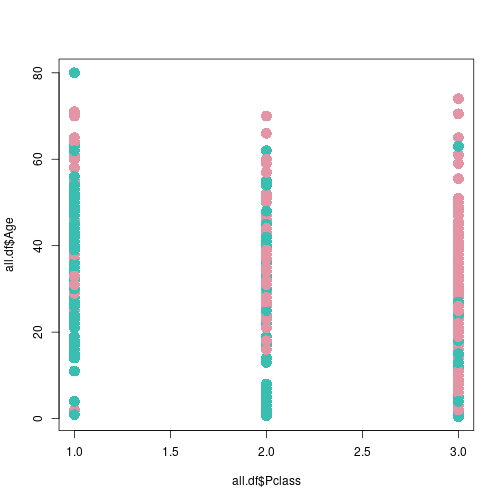
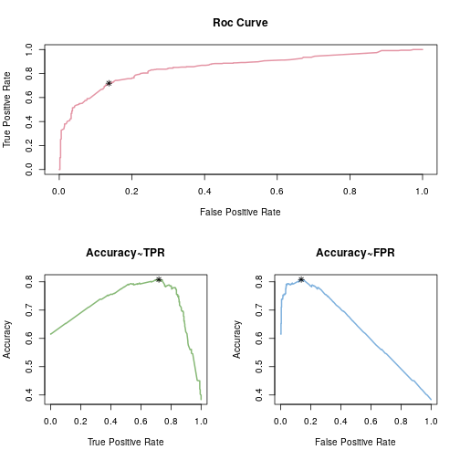
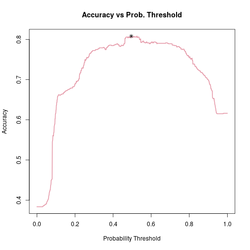

#Preamble
##Load in the packages
First load in in the necessary packages:


```r
if(require('pacman')){
    library('pacman')
  }else{
    install.packages('pacman')
    library('pacman')
  }
  
  pacman::p_load(ggmap, plotly, EnvStats, ggplot2, GGally, corrplot, dplyr,
                 tidyr, stringr, reshape2, cowplot, ggpubr, reshape2, ggplot2,
                 rmarkdown, dplyr, plotly, rstudioapi, wesanderson, RColorBrewer)
```


##Load in the Dataset
Load in the dataset and replace the missing data with the mean values


```r
# Load Dataset ------------------------------------------------------------

train.df <- read.csv(file = "../0DataSets/titanictrain.csv", TRUE, ",")

##Replace missing values with mean value

train.df$Age[is.na(train.df$Age)] <- mean(train.df$Age, na.rm = TRUE)
```


#Visualise the Data
It can be useful to visualise the data before creating a model

#Base Plot
Using Base Package plots the following visualisations can be created:
##Numeric


```r
PlotCol.vec <- rainbow_hcl(3)
plot(x = train.df$Pclass, y = train.df$Age, col = PlotCol.vec[train.df$Survived + 1], pch = 16, cex = 2)
```



##Factors
To plot with factors we will first need to create categorical variables

```r
train.df$Pclass <- as.factor(train.df$Pclass)
train.df$Survived <- as.factor(train.df$Survived)


###Create the Plot (Box Plot)
PlotCol.vec <- rainbow_hcl(2)
plot(x = train.df$Pclass, y = train.df$Age, data = train.df,
     col = PlotCol.vec[train.df$Survived], pch = 16,
     xlab = "Passenger Class", ylab = "Passenger Age",
     main = "Titanic Survivors")
```




#GGplot
*GGPlot2* can create prettier plots:


```r
###Create Categorical Factors
train.df$Pclass <- as.factor(train.df$Pclass)
train.df$Survived <- as.factor(train.df$Survived)


ggplot(train.df, aes(x = Pclass, y = Age, col = Survived)) +
  geom_point(lwd = 4) +
  labs(title = "Titanic Survivors", x = "Passenger Class", y = "Passenger Age") +
  scale_color_manual(name="Passenger Fate",
                     labels=c("Survived", "Perished"),
                     values=rainbow_hcl(2))
```


# Model Selection
First we will create various models to predict survival using a logistic 
regression model

##Create the Models


```r
twovar.mod  <- glm(Survived ~ Age + Pclass, family = binomial(link = "logit"),
                   data = train.df) 
fourvar.mod <- glm(Survived ~ I(Age>13) + Age + Pclass + Sex,
                   family = binomial(link = "logit"), data = train.df) 
quad.mod    <- glm(Survived ~ I(Age^2) + Pclass + Parch,
                   family = binomial(link = "logit"), data = train.df)
```


##Select the Best Model

Next we will favour the model with the lowest AIC value (although we could go through the process of using Training and Validation errors but that's a lot of effort):


```r
##Select the lowest AIC
ModAIC.vec <- c(summary(twovar.mod)$aic, summary(fourvar.mod)$aic,
                summary(quad.mod)$aic) 
mod <- switch(EXPR = which.min(ModAIC.vec), twovar.mod, fourvar.mod, quad.mod) 
print("Best fit: ") ; print(mod$call)
```

```
## [1] "Best fit: "
```

```
## glm(formula = Survived ~ I(Age > 13) + Age + Pclass + Sex, family = binomial(link = "logit"), 
##     data = train.df)
```


##Store the Modelled Probability in the dataframe


```r
pred <- predict(mod, type = 'response')
train.df$SurvivalProb <- pred
train.df <- train.df[,c(1, 2,13,3:12)]
```


#Use the ROC curve to select a probability threshold
Different probability thresholds will give different prediction values (as classified from the probability), this will give different rates of false positives and true positives for various threshold values. \\
Note that *Ground Truth* refers to the observed value (e.g. survived/perished)


##Create Functions to compute TruePos and FalsePos Rates
A ROC curve is a plot of the TruePos rate against the FalsePos rate, it is used to determine
the best threshold value for making a prediction from a probability.


###Sensitivity
The sensitivity is the same as the True Positive Rate:

```r
sensitivity <- function(probability, observation, threshold){
  
  PredObs <- ifelse(probability < threshold, 0, 1)
  #sensitivity is the rate of true positives, so (no of True Pos)/(no. of obs pos)
  TruePosPred.n <- sum(as.numeric(PredObs == 1) * as.numeric(observation == 1)) 
      #No. of true observations predictived to be true
  ObsPos.n <- sum(observation == 1)
  return(TruePosPred.n/ObsPos.n)
}
```

###Specificity
The Specificity is the same as the True Negative Rate


```r
specificity <- function(probability, observation, threshold){
        PredObs <- ifelse(probability < threshold, 0, 1)
        #sensitivity is the rate of true positives, so (no of True Pos)/(no. of obs pos)
        TrueNegPred.n <- sum(as.numeric(PredObs == 0) * as.numeric(observation == 0)) 
            #No. of true observations predictived to be true
        ObsPos.n <- sum(observation == 0)
        return(TrueNegPred.n/ObsPos.n)
        } #observation and ground_truth are synonymous
```

###TruePosRate
This is the same as sensitivity, but for the sake of clarity:

```r
tpr <- sensitivity
```

###FalsePosRate
This is equivalant to (1-specificity), so we will use the 
specificity function to define this one.

```r
fpr <- function(probability, observation, threshold){
  specificity.val <- specificity(probability, observation, threshold)
  return(1 - specificity.val)
} 
```

###Accuracy
This is the measurment of the accuracy of the predictions

```r
acc <- function(probability, observation, threshold){
  
 PredObs <- ifelse(probability < threshold, 0, 1)
 TrueNegPred.n <- sum(as.numeric(PredObs == 0) * as.numeric(observation == 0)) 
 TruePosPred.n <- sum(as.numeric(PredObs == 1) * as.numeric(observation == 1)) 
 totalpop <- nrow(train.df)
 return((TrueNegPred.n+TruePosPred.n)/totalpop)
}
```

###(Sensitivity + Specificity)
This is a measurment of how correct the predictions are:

```r
cpredr <- function(probability, observation, threshold){
  specificity.val <- specificity(probability, observation, threshold)
  sensitivity.val <- sensitivity(probability, observation, threshold)
  return(sensitivity.val + specificity.val)
} 
```

##Creating the ROC Dataframe
For every different *Probability Threshold* there are differing 
rates of FalsePos and TruePos (and hence also sensitivity, specificity,
TrueNegRate, FalseNegRate, Accuracy etc.).

This can be expressed in a dataframe, which will be created
using a loop:


```r
##Compute ROC values
  #The ROC values are the truepos rate and falsepos rate that 
  #occur for various threshold values, they can be calculated with a loop:

  ###Create various threshold values
  steps <- 10^3
  threshold <- seq(0,1, length.out = steps)
  ###Create the dataframe
  roc.df <- data.frame("Threshold" = 0, "FalsePosR" = 0, "TruePosR" = 0,
                       "CorrectPredRate" = 0, "Accuracy" = 0)
    ####The loop will run faster if the dataframe is already the correct size
      #NRows is steps and NCol 4
      roc.df[nrow(roc.df)+steps,] <- NA
  ###Create the dataframe
      for(i in 1:steps){
        roc.df[i, "Threshold"] <- threshold[i]
        roc.df[i, "FalsePosR"] <- fpr(train.df$SurvivalProb, train.df$Survived, threshold[i])
        roc.df[i, "TruePosR"] <- tpr(train.df$SurvivalProb, train.df$Survived, threshold[i])
        roc.df[i, "CorrectPredRate"] <- cpredr(train.df$SurvivalProb, train.df$Survived, threshold[i])
        roc.df[i, "Accuracy"] <- acc(train.df$SurvivalProb, train.df$Survived, threshold[i])
        
      }
  
      ###Inspect the ROC Values
      head(roc.df)
```

```
##     Threshold FalsePosR TruePosR CorrectPredRate  Accuracy
## 1 0.000000000         1        1               1 0.3838384
## 2 0.001001001         1        1               1 0.3838384
## 3 0.002002002         1        1               1 0.3838384
## 4 0.003003003         1        1               1 0.3838384
## 5 0.004004004         1        1               1 0.3838384
## 6 0.005005005         1        1               1 0.3838384
```


##Select a threshold value

There are a few ways to use these values to decide on a probability threshold
for example, taking the threshold corresponding to the maximum
value of any of the following would be a reasonable choice for the 
probability threshold:

* *TruePosRate* - *FalsePosRate*
* *Sensitivity* + *Specificity*
* $\text{Accuracy} =  \frac{\text{TruePosRate} + \text{TrueNegRate}}{\text{No. of Observations}}$

In this case we will use Accuracy, but the lecture notes use
(specificity + Sensitivity), in this case it doesn't
matter because the threshold values are the same.


```r
      ###Select the best Threshold value
      best.roc.acc <- roc.df[which.max(roc.df$Accuracy), ]
      best.roc.spsaddsns <- roc.df[which.max(roc.df$Accuracy), ]
      
      best.roc.df <- as.data.frame(matrix(nrow = 2, ncol = ncol(best.roc.spsaddsns)))
      best.roc.df[1,] <- best.roc.spsaddsns
      best.roc.df[2,] <- best.roc.acc
      names(best.roc.df) <- names(best.roc.acc)
      
      best.roc.df
```

```
##   Threshold FalsePosR  TruePosR CorrectPredRate  Accuracy
## 1 0.4954955  0.136612 0.7192982        1.582686 0.8080808
## 2 0.4954955  0.136612 0.7192982        1.582686 0.8080808
```

##Plot the ROC Curve

###Base Plot


```r
cols.vec <- rainbow_hcl(3)
layout(matrix(nrow = 2, data = c(1,2,1,3)))
plot(y = roc.df$TruePosR, x = roc.df$FalsePosR, type = 'l',
     xlab = "False Positive Rate", ylab = "True Positive Rate",
     main = "Roc Curve", col = cols.vec[1], lwd = 2)
i <- which.max(roc.df$Accuracy) 
points(roc.df$FalsePosR[i], roc.df$TruePosR[i], pch = 8)
#text(roc.df$FalsePosR[i], roc.df$TruePosR[i], paste("threshold = ", signif(roc.df$Threshold[i],2)), pos = 8)
plot(y = roc.df$Accuracy,
     x = roc.df$TruePosR,
     type = 'l', xlab = "True Positive Rate",
     ylab = "Accuracy", main = "Accuracy~TPR",
     col = cols.vec[2], lwd = 2)
points(y = roc.df$Accuracy[i], x = roc.df$TruePosR[i], pch = 8)
plot(y = roc.df$Accuracy, x = roc.df$FalsePosR,
     type = 'l', xlab = "False Positive Rate",
     ylab = "Accuracy", main = "Accuracy~FPR", col = cols.vec[3], lwd = 2)
points(y = roc.df$Accuracy[i], x = roc.df$FalsePosR[i], pch = 8)
```




```r
plot(y = roc.df$Accuracy, x = roc.df$Threshold, type = 'l', xlab = "Probability Threshold", ylab = "Accuracy", main = "Accuracy vs Prob. Threshold", col = cols.vec[1], lwd = 2)
i <- which.max(roc.df$Accuracy) 
points(roc.df$Threshold[i], roc.df$Accuracy[i], pch = 8)
```



###ggplot2

```r
  ##ggplot
ggplot(data = roc.df, aes( x = FalsePosR)) +
  geom_line(data = roc.df, aes(x = FalsePosR, y = TruePosR, col = Accuracy)) +
  geom_point(aes(x = roc.df$FalsePosR[i], y = roc.df$TruePosR[i]),
             col = "IndianRed", size = 6) +
  annotate("text", x = roc.df$FalsePosR[i]+0.2,
           y = roc.df$TruePosR[i],
           label = paste("Threshold = ",
                         round(roc.df$Threshold[i], 3)))
```

```
## Error in annotate("text", x = roc.df$FalsePosR[i] + 0.2, y = roc.df$TruePosR[i], : unused arguments (x = roc.df$FalsePosR[i] + 0.2, y = roc.df$TruePosR[i], label = paste("Threshold = ", round(roc.df$Threshold[i], 3)))
```

```r
  labs(x = "False Positive Rate",
       y = "True Positive Rate", title = "ROC Curve")
```

```
## $x
## [1] "False Positive Rate"
## 
## $y
## [1] "True Positive Rate"
## 
## $title
## [1] "ROC Curve"
## 
## attr(,"class")
## [1] "labels"
```

###Plotly
A 3d visualisation really drives the point home:


```r
  ##Plotly
obs.plotly <- plot_ly(roc.df, x = ~FalsePosR, y = ~TruePosR, z = ~Accuracy, color = ~Threshold) %>%
  add_markers() %>%
  layout(title = "Observed Values", scene = list(xaxis = list(title = 'False Positive Rate'),
                      yaxis = list(title = 'True Positive Rate'),
                      zaxis = list(title = 'Accuracy ((TPR+TNR)/TotalPop)')))

obs.plotly
```

```
## Warning: Ignoring 1 observations
```

```
## TypeError: Attempting to change the setter of an unconfigurable property.
## TypeError: Attempting to change the setter of an unconfigurable property.
```


#Assess the Model Performance with the Test Set

##Load the Dataset


```r
test.df <- read.csv(file = "titanictrain.csv", header = TRUE, sep = ",")
```

```
## Warning in file(file, "rt"): cannot open file 'titanictrain.csv': No such
## file or directory
```

```
## Error in file(file, "rt"): cannot open the connection
```

```r
  #Make as Factors
  test.df$Pclass <- as.factor(train.df$Pclass)
```

```
## Error in test.df$Pclass <- as.factor(train.df$Pclass): object 'test.df' not found
```

```r
  test.df$Survived <- as.factor(train.df$Survived)
```

```
## Error in test.df$Survived <- as.factor(train.df$Survived): object 'test.df' not found
```

##Predict Probabilities
Use the model to find the probabilites corresponding to the survival rate 
in the testdata


```r
test.df$prob <- predict(mod, newdata = test.df, type = 'response')
```

```
## Error in predict.lm(object, newdata, se.fit, scale = 1, type = if (type == : object 'test.df' not found
```

##Create Predictions
Use the probabilites to create predictions


```r
test.df$pred <- ifelse(test.df$prob <   best.roc.spsaddsns$Threshold, 0, 1)
```

```
## Error in ifelse(test.df$prob < best.roc.spsaddsns$Threshold, 0, 1): object 'test.df' not found
```


```r

  #Assess the Model Accuracy
rate <- mean(na.omit(test.df$pred == test.df$Survived))


paste("Thus the model created from training data predicts survival on the test set at a success rate of", signif(rate*100, 3), "%") %>% print()i
```

```
## Error: <text>:6:144: unexpected symbol
## 5: 
## 6: paste("Thus the model created from training data predicts survival on the test set at a success rate of", signif(rate*100, 3), "%") %>% print()i
##                                                                                                                                                   ^
```

