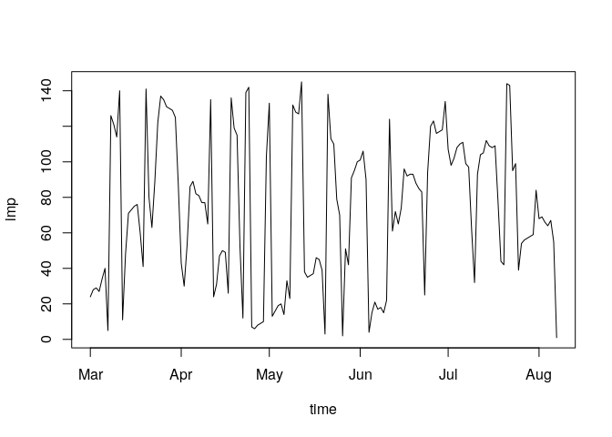
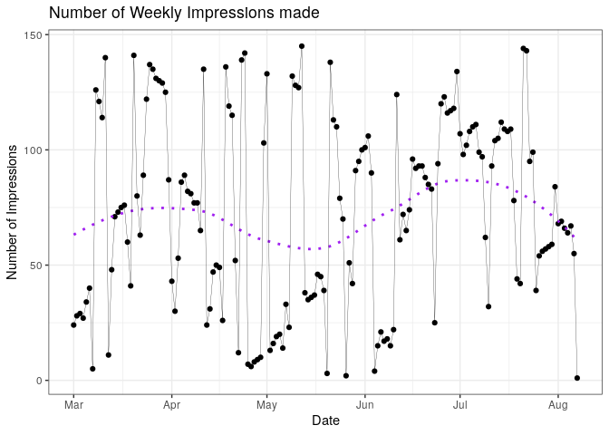
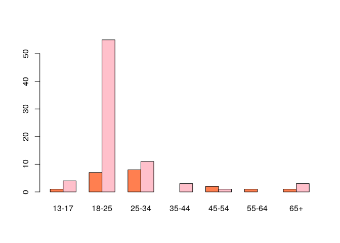
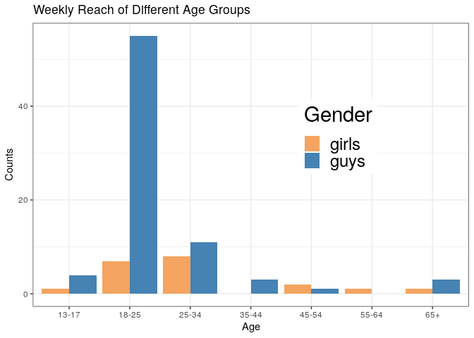

# (04) Simple Exposure Analysis

## Preamble


```r
# Preamble

## Install Pacman
load.pac <- function() {
  
  if(require("pacman")){
    library(pacman)
  }else{
    install.packages("pacman")
    library(pacman)
  }
  
    pacman::p_load(xts, sp, gstat, ggplot2, rmarkdown, reshape2, ggmap,
                 parallel, dplyr, plotly, tidyverse, reticulate, UsingR, Rmpfr,
                 swirl, corrplot, gridExtra, mise, latex2exp, tree, rpart, lattice,
                 coin, primes, epitools, maps, clipr, ggmap)
  
  
   mise()
}

load.pac()
```

```
## Loading required package: pacman
```



```r
# load(file = "~/Notes/DataSci/ThinkingAboutData/TAD.rdata")
# load(file = "./TAD.rdata")
```


```r
knitr::opts_chunk$set(
  fig.path = "./figure/"
)
```

# Using **_R_**


```r
Metrics <- read.csv(file = "/home/ryan/Notes/DataSci/0DataSets/Metrics.csv")
dg      <- read.csv(file = "/home/ryan/Notes/DataSci/0DataSets/WeeklyReachDemog.csv")
Likes   <- read.csv(file = "/home/ryan/Notes/DataSci/0DataSets/LifetimeLikesByGenderAge.csv")

# str(Metrics)
```

## Date Conversion


```r
dates <- Metrics[-1,1]
dates <- strptime(x = dates, format = "%m/%d/%y")
```

## Numeric Conversion


```r
(reach   <- Metrics[,15]) %>% class
```

```
## [1] "factor"
```

```r
reach    <- as.numeric(reach)
wk_reach <- as.numeric(Metrics[-1, 16])
```

## Plot Weekly Total Impressions


```r
wkimp <- as.numeric(Metrics[-1,56])
imp_df <- data.frame(time = dates, imp = wkimp)
plot(imp ~ time, imp_df, type = 'l')
```

<!-- -->

This type of data would be better encoded as an `xts` object, however that means that it will be a matrix not a data frame, in order to pass this to `ggplot2` there are two functions provided by `zoo` (`xts` is built on top of `zoo`) that deal with this:

* `autoplot`
  + This is basically just a call to ggplot2 with all the permutations built it.
* `fortify`
  + this will make a data frame from the data.


```r
library(xts)
imp_xts <- xts(wkimp, order.by = dates)
autoplot(imp_xts, geom = "point") +
    theme_bw() +
    stat_smooth(se = FALSE, col = "purple", lty = 3) +
    geom_line(size = 0.1) +
    labs(x = "Date",
         y = "Number of Impressions",
         title = "Number of Weekly Impressions made")
```

```
## `geom_smooth()` using method = 'loess' and formula 'y ~ x'
```

<!-- -->

## Likes and Reach


```r
tab <- matrix(as.numeric(dg[22, 3:16]), nrow = 2, byrow = 2)
dimnames(tab) <- list(c("Female", "Male"),
                      c("13-17", "18-25", "25-34", "35-44","45-54", "55-64", "65+"))

barplot(tab, col=c("coral", "pink"), beside = TRUE)
```

<!-- -->

### Using GGPlot2


```r
tab_tb <- as_tibble(t(tab))
tab_tb <- cbind(demographic = colnames(tab), tab_tb)
tab_tb <- pivot_longer(tab_tb, cols = c("Female", "Male"))

ggplot(tab_tb, aes(x = demographic, fill = name, y = value)) +
    geom_col(position = "dodge") +
    guides(fill = guide_legend("Gender")) +
    labs(x = "Age", y = "Counts", title =
                                      "Weekly Reach of Different Age Groups") +
    scale_fill_manual(values = c("#F4a460", "#4682b4"),
                      labels = c("girls", "guys")) +
    theme_bw() +
    theme(legend.position = c(0.7, 0.6),
          legend.text = element_text(size = 18),
          legend.title = element_text(size = 22))
```

```
## Warning: Removed 2 rows containing missing values (geom_col).
```

<!-- -->

# Chi Test

Given the table:

|   | A | B | C |
| X | 2 | 1 | 1 |
| Y | 1 | 3 | 1 |
 
 Simulate a Chi Distribution:
 
 
## First Enter the Observed Values
 

```r
vals <- data.frame(A = c(2,1), B = c(1,3), C = c(1,1))
vals <- as.matrix(vals)
```

### Calculate the Chi Stat


```r
n <- sum(vals)
p <- vals/n
o <- vals
e <- rowSums(o) %o% colSums(o) / n

chi_obs <- sum((e-o)^2/e)
```


## Simulate More Values

The null hypothesis is that both observations have the same distribution of features, this means we could either use `rep` in order to regerate a table of values or simply use a *multinomial* distribution to simulate a random uniform draw with those corresponding probabilities.

The frequency at which these simulated values have a $\chi^2$ distance more extreme than our observed $\chi^2$ value is the false positive rate, which is the expected probability of rececting the null hypothesis under the assumption it was actually true.

Another thing to note, because **_R_** is consistent in the way that a
vector is vertical and that matricies are a combination of vectors stacked *'top to bottom, left to right'*
there is no need to convert to and from matrices because the individual elements will line up.


```r
n <- sum(vals)
p <- vals/sum(vals)

sim_chi <- replicate(10^3, { 
  
  ## Simulate some Values Assuming the Null Hypothesis is true
    ## A Little like rolling dice assuming:
           ## that the features are equal in prob across observations
  obs_sim <- rmultinom(n = 1, size = n, prob = p)
  
  ## Determine What the Expected Value would be found to be
  e <- rowSums(obs_sim) %o% colSums(obs_sim) / n
  
  ## Determine What the Chi Value would be found to be
  (chi_sim <- (e-obs_sim)^2/n)
  
}
)

mean(sim_chi>chi_obs)
```

```
## [1] 0
```

So the p-value would be about 1%, the number of times that the null hypothesis is rejected when it was true owing to mere chance is 1% of the time in these simulations, that is a sufficiently small risk of a null hypothesis to justify rejecting the null hypothesis.

### Using Built in

The Built in $\chi^2$ tool could also be used, for example for the tab data:


```r
tab[is.na(tab)] <- mean(tab, na.rm = TRUE)
chisq.test(tab)
```

```
## Warning in chisq.test(tab): Chi-squared approximation may be incorrect
```

```
## 
## 	Pearson's Chi-squared test
## 
## data:  tab
## X-squared = 26.683, df = 6, p-value = 0.000166
```

In this case the probability of a false positive is quite low and so the null hypothesis is rejected.

 
# Challenge


```r
# Make XTS
dg_dates <- strptime(dg$Date, format = "%m/%d/%y")
dg_xts <- xts(dg[,-c(1:2)], order.by = dg_dates)

# Extract all Male and Female
fem <- grep(pattern = "F.*", x = names(dg_xts))
mal <- grep(pattern = "M.*", x = names(dg_xts))

# Extract April 
ap <- dg_xts["2013-04"]
ap[is.na(ap)] <- 0

# Extract May
may <- dg_xts["2013-05"]
may[is.na(may)] <- 0


male_april   <- ap[,mal] %>% sum
female_april <- ap[,fem] %>% sum
male_may     <- may[,mal] %>% sum
female_may  <- may[,fem] %>% sum

# Make matrix
dist_df <- data.frame(april = c(male_april, female_april), may = c(male_may, female_may))
rownames(dist_df) <- c("male", "female")
dist_mat <- as.matrix(dist_df)

# Perform Chi Test
chisq.test(dist_mat)
```

```
## 
## 	Pearson's Chi-squared test with Yates' continuity correction
## 
## data:  dist_mat
## X-squared = 1.8266, df = 1, p-value = 0.1765
```

The $p$ value is about 17%, this is too high to reject the null hypothesis and the conlcusion would be that there is insufficient evidence to suggest that there is a change difference between male and female use for April and May.


