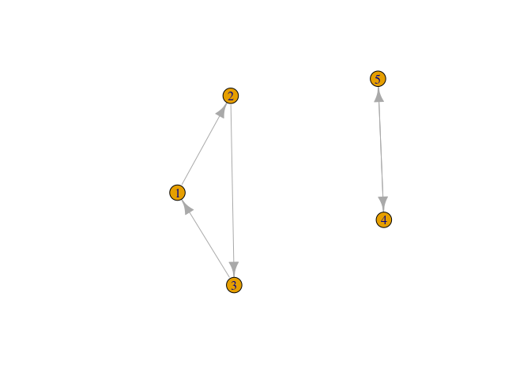

# (08) Graphs 2 - Page Rank

## Preamble etc.
### Load Packages
First load all the packages


```r
# Load Packages -----------------------------------------------------------

if (require("pacman")) {
  library(pacman)
} else{
  install.packages("pacman")
  library(pacman)
}
```

```
## Loading required package: pacman
```

```r
pacman::p_load(xts, sp, gstat, ggplot2, rmarkdown, reshape2, ggmap, parallel,
               dplyr, plotly, tidyverse, reticulate, UsingR, Rmpfr, swirl,
               corrplot, gridExtra, mise, latex2exp, tree, rpart, lattice, coin,
               primes, epitools, maps, clipr, ggmap, twitteR, ROAuth, tm,
               rtweet, base64enc, httpuv, SnowballC, RColorBrewer, wordcloud,
               ggwordcloud, igraph)

mise()
```



## Random Walk on an Undirected Graph
Look at the following graph:


```r
g1 <- igraph::graph.formula(1 -2, 1 - 3, 1 - 4, 2 - 3)
plot(g1)
```

<!-- -->

Say we are interested in the state distribution of that graph, in order to get
that we will:

1. Get the Adjacency Matrix
2. Turn that into the *Transition Probability Matrix*
3. Use that to find the State Distribution

### Get the Adjacency Matrix


```r
A  <- igraph::get.adjacency(g1)
print(A)
```

```
## 4 x 4 sparse Matrix of class "dgCMatrix"
##   1 2 3 4
## 1 . 1 1 1
## 2 1 . 1 .
## 3 1 1 . .
## 4 1 . . .
```

### Transition Probability Matrix
The Transition Probability Matrix is the adjacency matrix with all columns scaled so that they sum to 1.


```r
adj_to_prob  <- function(matrix) {
  apply(matrix, 2, normalise)
}

normalise  <- function(x) {
    x <- x/sum(x)
}

T <- adj_to_prob(A)
```

### Stationary Distribution using the Power Method
The transition probability matrix is the probability of reaching any vertex from
another. If we started at vertex 1, the probability of being on any given vertex is:

|         | V1 | V2 | V3 | v4 |
|---------|----|----|----|----|
| $P_{1}$ | 1  | 0  | 0  | 0   |

If a random step was taken onto any other vertex, the probability of landing on any vertex would be:


$$\begin{aligned}
\begin{bmatrix}
    0 & 0.5 & 0.5 & 1 \\
    0.3^. & 0 & 0.5 & 0 \\
    0.3^. & 0.5 & 0 & 0 \\
    0.3^. & 0 & 0 & 0
\end{bmatrix}
\begin{bmatrix} 1 \\ 0 \\ 0 \\ 0 \end{bmatrix}  &=
\begin{bmatrix} 0 \times 1 &+ 0 \times 0.5 &+  0 \times  0.5 &+  0 \times  1 \\
    0.3^. \times  1 &+  0 \times  0 &+  0.5 \times  0 &+  0 \times  0 \\
0.3^. \times 1 &+  0.5 \times  0 &+  0 \times  0 &+  0 \times  0 \\
0.3^. \times 1 &+  0 \times  0 &+  0 \times 0 &+  0 \times 0 \end{bmatrix} \\
&= \begin{bmatrix} 0 \\ 0.3^. \\ 0.3^. \\ 0.3^. \end{bmatrix}
\end{aligned}$$

This means that in **_R_**, in order to calculate the $n$ th term in the
sequence, it is sufficient to multiply the transition and probability matrices.

This is a linear recurrence relation, I forget how, but we know that it's going
to be convergent, re-read [these Notes](/home/ryan/Dropbox/Studies/#Notes/MathModelling/MathModNotes.pdf), in order to determine what it's
going to converge to, it is possible to use a loop (later we'll use the eigen value method).


```r
euclid_distance <- function(v1, v2) {
    d <- dist(rbind(v1,
                    as.vector(v2)),
                method = "euclid")
    as.numeric(d)
}


stat_dist_mat <- function(start, trans) {
  p_old <- start
  p_new <- as.vector(trans %*% p_old)
  while (euclid_distance(p_new, as.vector(T %*% p_old))) {
    p_old <- p_new
    p_new <- as.vector(T %*% p_old )
  }
  p_new
}

p <- c(1, 0, 0, 0)
stat_dist_mat(p, T)
```

```
## [1] 0.0000000 0.3333333 0.3333333 0.3333333
```

We can also compute the stationary distribution using the eigenvalue decomposition

Recall that the eigenvalue is such that:

 $$
\lambda\vec{v} = \vec{A}\vec{v}
 $$

 In our case we want a vector $\vec{p}$ that satisfies:

$$
\mathbf{T}\vec{p} = 1 \times \vec{p}
$$

So we are really just looking for an eigenvector of $\mathbf{T}$ that corresponds to an eigenvalue of 1.

We can do this in **_R_** thusly:


## Random Walk on a Directed Graph
A random walk on a directed graph is pretty much the same, you just have to follow the directions, so consider the following graph:


```r
gd1 = graph.formula(1-+2, 1-+3, 1-+4, 4-+3, 2-+3, 3-+1)
plot(gd1)
```

<!-- -->

use the `adjacency` function to get the adjacency matrix of `gd1`, the matrix tells you where a row can travel to, from row to column, however we need to transpose the matrix so that the matrix reads from  column to row:


```r
t(as.matrix(get.adjacency(gd1)))
```

```
##   1 2 3 4
## 1 0 0 1 0
## 2 1 0 0 0
## 3 1 1 0 1
## 4 1 0 0 0
```
### Compute the Stationary distribution
In order to do this we can just use the eigenvalue decomposition, we want the eigen vector corrsponding to an eigen value of 1:


```r
adj_to_prob  <- function(matrix) {
  apply(matrix, 2, normalise)
}

normalise  <- function(x) {
    x <- x/sum(x)
}

A <- t(as.matrix(get.adjacency(gd1)))
T <-adj_to_prob(A)
eigen(T)
```

```
## eigen() decomposition
## $values
## [1]  1.000000e+00+0.000000e+00i -5.000000e-01+6.454972e-01i
## [3] -5.000000e-01-6.454972e-01i -1.103971e-18+0.000000e+00i
## 
## $vectors
##              [,1]                  [,2]                  [,3]             [,4]
## [1,] 0.6708204+0i  0.7071068+0.0000000i  0.7071068+0.0000000i  6.071532e-19+0i
## [2,] 0.2236068+0i -0.1767767-0.2282177i -0.1767767+0.2282177i -7.071068e-01+0i
## [3,] 0.6708204+0i -0.3535534+0.4564355i -0.3535534-0.4564355i -5.551115e-17+0i
## [4,] 0.2236068+0i -0.1767767-0.2282177i -0.1767767+0.2282177i  7.071068e-01+0i
```

```r
p <- eigen(T)$vectors[,1]
(p <- p/sum(p))
```

```
## [1] 0.375+0i 0.125+0i 0.375+0i 0.125+0i
```

This graph is ergodic because we can find a path from each vertex to every other vertex.

### Non Ergodic Graphs

```r
gd2 = graph.formula(1-+2, 2-+3, 4-+3, 3-+1)
plot(gd2)
```

<!-- -->

```r
A <- t(as.matrix(get.adjacency(gd2)))
T <-adj_to_prob(A)
eigen(T)
```

```
## eigen() decomposition
## $values
## [1] -0.5+0.8660254i -0.5-0.8660254i  1.0+0.0000000i  0.0+0.0000000i
## 
## $vectors
##                 [,1]            [,2]          [,3]             [,4]
## [1,]  0.5773503+0.0i  0.5773503+0.0i -0.5773503+0i  2.355139e-16+0i
## [2,] -0.2886751-0.5i -0.2886751+0.5i -0.5773503+0i -7.071068e-01+0i
## [3,] -0.2886751+0.5i -0.2886751-0.5i -0.5773503+0i  1.177569e-16+0i
## [4,]  0.0000000+0.0i  0.0000000+0.0i  0.0000000+0i  7.071068e-01+0i
```

```r
p <- eigen(T)$vectors[,1]
(p <- p/sum(p))
```

```
## [1]  0.0000e+00+2.600154e+15i  2.2518e+15-1.300077e+15i
## [3] -2.2518e+15-1.300077e+15i  0.0000e+00+0.000000e+00i
```


```r
gd3 = graph.formula(1+-2, 2-+3, 2-+4, 4-+3, 3-+1)
plot(gd3)
```

<!-- -->

```r
A <- t(as.matrix(get.adjacency(gd3)))
T <-adj_to_prob(A)
## eigen(T)

## p <- eigen(T)$vectors[,1]
## (p <- p/sum(p))
```


```r
gd4 = graph.formula(1-+2, 2-+3, 3-+1, 4+-+5)
plot(gd4)
```

<!-- -->

```r
A <- t(as.matrix(get.adjacency(gd4)))
T <-adj_to_prob(A)
eigen(T)
```

```
## eigen() decomposition
## $values
## [1] -0.5+0.8660254i -0.5-0.8660254i  1.0+0.0000000i -1.0+0.0000000i
## [5]  1.0+0.0000000i
## 
## $vectors
##                 [,1]            [,2]         [,3]          [,4]          [,5]
## [1,]  0.5773503+0.0i  0.5773503+0.0i 0.0000000+0i  0.0000000+0i -0.5773503+0i
## [2,] -0.2886751-0.5i -0.2886751+0.5i 0.0000000+0i  0.0000000+0i -0.5773503+0i
## [3,] -0.2886751+0.5i -0.2886751-0.5i 0.0000000+0i  0.0000000+0i -0.5773503+0i
## [4,]  0.0000000+0.0i  0.0000000+0.0i 0.7071068+0i -0.7071068+0i  0.0000000+0i
## [5,]  0.0000000+0.0i  0.0000000+0.0i 0.7071068+0i  0.7071068+0i  0.0000000+0i
```

```r
p <- eigen(T)$vectors[,1]
(p <- p/sum(p))
```

```
## [1]  0.0000e+00+2.600154e+15i  2.2518e+15-1.300077e+15i
## [3] -2.2518e+15-1.300077e+15i  0.0000e+00+0.000000e+00i
## [5]  0.0000e+00+0.000000e+00i
```

So it looks like non-ergodic graphs have complex stationary distributions.

## Page Rank

The *PageRank* algorithm, developed by *Google* uses the random surfer model to ensure that there is an ergodic transition probability matrix from any directed graph.

To obtain *PageRank*:

1. Obtain the directed graph probability transition matrix
2. Create the random jump matrix `J`
3. Combine the `T` and `J` to obtain a matrix `M`
4. Normalise the columns of `M` to obtain an ergodic transition probability matrix.

Consider the graph `gd2` from above:


```r
gd2 = graph.formula(1-+2, 2-+3, 4-+3, 3-+1)
plot(gd2)
```

<!-- -->

```r
A <- t(as.matrix(get.adjacency(gd2)))
T <-adj_to_prob(A)
```
there are 4 vertices so a random jump matrix will be a 4*4 matrix with 1/4's:


```r
(J <- matrix(rep(1/4, 4*4), 4, 4))
```

```
##      [,1] [,2] [,3] [,4]
## [1,] 0.25 0.25 0.25 0.25
## [2,] 0.25 0.25 0.25 0.25
## [3,] 0.25 0.25 0.25 0.25
## [4,] 0.25 0.25 0.25 0.25
```

Matrices `T` and `J` can be combined using $\alpha$:


```r
alpha = 0.8
(M = alpha * T + (1-alpha) * J)
```

```
##      1    2    3    4
## 1 0.05 0.05 0.85 0.05
## 2 0.85 0.05 0.05 0.05
## 3 0.05 0.85 0.05 0.85
## 4 0.05 0.05 0.05 0.05
```

Essentially $\alpha$ is the probability of following a random link as opposed to a random jump, that's what this model does, it assumes that there isn't a small non-zero probability of reaching an inaccessible location.

Then just like before we make the columns relative to 1:


```r
adj_to_prob(M)
```

```
##      1    2    3    4
## 1 0.05 0.05 0.85 0.05
## 2 0.85 0.05 0.05 0.05
## 3 0.05 0.85 0.05 0.85
## 4 0.05 0.05 0.05 0.05
```

This made no difference though because they already summed to 1, now we can just calculate the stationary distribution via eigenvalue decomposition:


```r
eigen(M)
```

```
## eigen() decomposition
## $values
## [1]  1.000000e+00+0.000000e+00i -4.000000e-01+6.928203e-01i
## [3] -4.000000e-01-6.928203e-01i -3.306409e-18+0.000000e+00i
## 
## $vectors
##               [,1]                        [,2]                        [,3]
## [1,] 0.57256936+0i -5.773503e-01+0.000000e+00i -5.773503e-01+0.000000e+00i
## [2,] 0.54877427+0i  2.886751e-01+5.000000e-01i  2.886751e-01-5.000000e-01i
## [3,] 0.60231323+0i  2.886751e-01-5.000000e-01i  2.886751e-01+5.000000e-01i
## [4,] 0.09071878+0i -8.864549e-18+1.418121e-17i -8.864549e-18-1.418121e-17i
##                  [,4]
## [1,]  0.000000e+00+0i
## [2,] -7.071068e-01+0i
## [3,] -4.658165e-16+0i
## [4,]  7.071068e-01+0i
```

```r
eigen(M)$vectors[,1] %>% as.double()
```

```
## [1] 0.57256936 0.54877427 0.60231323 0.09071878
```


