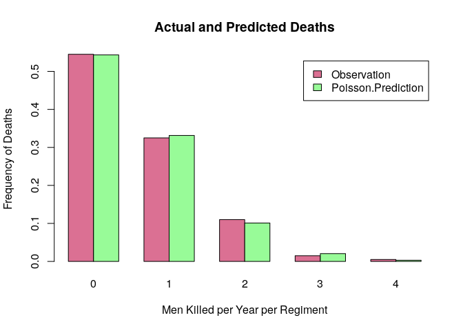
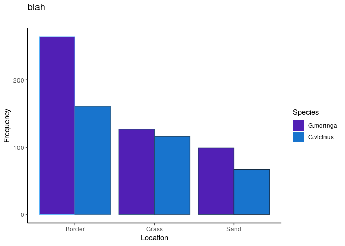
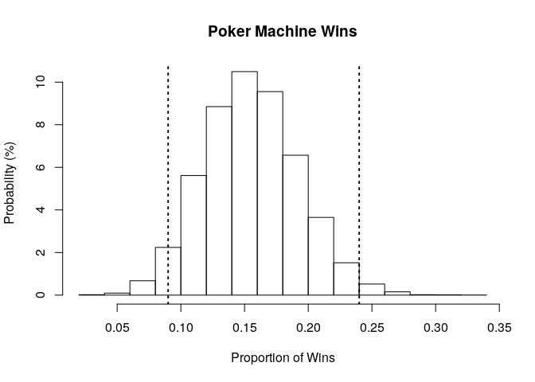

# Randomness

## Preamble


```r
load.pac <- function() {
  
  if(require("pacman")){
    library(pacman)
  }else{
    install.packages("pacman")
    library(pacman)
  }
  
  pacman::p_load(xts, sp, gstat, ggplot2, rmarkdown, reshape2, ggmap,
                 parallel, dplyr, plotly, tidyverse, reticulate, UsingR, Rmpfr)
  
}

load.pac()
```

```
## Loading required package: pacman
```


## (1) Compute tables of $\pi$ digits
First it is necessary to have some digits of pi, we'll just take a dataset:


```r
pi_Dig <- UsingR::pi2000[-1]
write.csv(pi_Dig, file = "./piDigits.csv", quote = FALSE, row.names = FALSE)
pi_Tibble <- tibble::enframe(piDig)
```

```
## Error in tibble::enframe(piDig): object 'piDig' not found
```

```r
tibble::remove_rownames(pi_Tibble)
```

```
## Error in is.data.frame(.data): object 'pi_Tibble' not found
```

```r
pi_Tibble <- pi_Tibble$value
```

```
## Error in eval(expr, envir, enclos): object 'pi_Tibble' not found
```

```r
head(pi_Tibble)
```

```
## Error in head(pi_Tibble): object 'pi_Tibble' not found
```
### using the `Rmpfr` package

An alternative is to use the Rmpfr package deals with handling numbers of arbitrary precision, this requires the `GMP C` library to be installed, so the package will be something like `libbmp-dev` and should be in the repos for `apt` or `pacman -S` or whatever:


```bash
apt list libgmp3-dev
apt list libgmp
apt list libmpfr-dev


apt list libgmp3-dev libgmp libmpfr-dev

```

```
## 
## WARNING: apt does not have a stable CLI interface. Use with caution in scripts.
## 
## Listing...
## libgmp3-dev/bionic,bionic,now 2:6.1.2+dfsg-2 amd64 [installed]
## 
## WARNING: apt does not have a stable CLI interface. Use with caution in scripts.
## 
## Listing...
## 
## WARNING: apt does not have a stable CLI interface. Use with caution in scripts.
## 
## Listing...
## libmpfr-dev/bionic,bionic,now 4.0.1-1 amd64 [installed]
## 
## WARNING: apt does not have a stable CLI interface. Use with caution in scripts.
## 
## Listing...
## libgmp3-dev/bionic,bionic,now 2:6.1.2+dfsg-2 amd64 [installed]
## libmpfr-dev/bionic,bionic,now 4.0.1-1 amd64 [installed]
```


Rather than specifying significant figures the package works with bits of precision, so for example a base 10 number like 8 can be represented with 3 bits of information because $2^3=8$.

if 1000 decimal places were required, the number of bits would be the number of binary values necessary to represent that same value:

$$\begin{aligned}
2^{\textsf{bits}} &= 10^{\textsf{digits}} \\
\iff \textsf{bits} &= \textsf{digits} \times \log_{2}{}{\left(  10\right) }\\
\end{aligned}$$


```r
library(Rmpfr)
diglength <- 2000 

precision <- diglength*log2(10)
precision <- ceiling(precision)
piVal <- Rmpfr::Const("pi", precision)
print(Rmpfr::Const("pi", 12*log2(10)))
```

```
## 1 'mpfr' number of precision  39   bits 
## [1] 3.141592653592
```

In order to extract the value use `substring()` in order to create substrings of the values. 


```r
piVal      <- format(piVal)
pi_Digits  <- substring(text = piVal, first = 1:diglength, last = 1:diglength)[3:diglength] #%>% as.numeric()
pi_Digits  <- substring(text = piVal, first = 1:diglength, last = 1:diglength)[3:diglength] %>% as.integer()
pi_Digits <- as.vector(pi_Digits)
#pi_Digits <- factor(pi_Digits, levels = 0:9, ordered = TRUE)
```

A histogram of which may be generated:


```r
table(pi_Digits)
```

```
## pi_Digits
##   0   1   2   3   4   5   6   7   8   9 
## 181 212 207 188 195 205 200 197 202 211
```

```r
table(pi_Digits) %>% barplot
```


The problem with a histogram is that it will combine The first two frequencies in a way that is incorrect in this context, it only seems to do it with the pi digits though for some reason


```r
hist(pi_Digits, breaks = seq(from = 0, to = 9, by = 1)) %>% summary()
```

```
##          Length Class  Mode     
## breaks   10     -none- numeric  
## counts    9     -none- numeric  
## density   9     -none- numeric  
## mids      9     -none- numeric  
## xname     1     -none- character
## equidist  1     -none- logical
```

```r
axis(side = 1, at = seq(0, 9, 1), labels = seq(0, 9, 1))
axis(2,pos = -9)
```


```r
random_Uniform <- runif(2000, 0, 9)
hist(random_Uniform)
axis(side = 1, at = seq(0, 9, 1), labels = seq(0, 9, 1))
axis(2,pos = -9)
```


A better alternative is to use ggplot2


```r
pi_DigitsDF <- tibble::enframe(pi_Digits)

HistPlot <- function (DataFrame, heading) {
ggplot(data = DataFrame, aes(x = value, fill = value)) +
#       geom_histogram(binwidth = 1, fill = "lightblue", col = "red") +
       geom_histogram(bins = 10, fill = "lightblue", col = "red") +
       theme_classic() +
       scale_x_continuous(breaks = seq(0, 10, 1)) +
       labs(x = "Decimal Value", y = "Frequency",
	    title = heading)
    
}

HistPlot(pi_DigitsDF, "Distribution of Digits of Pi" )
```


### Using Power Series

Using integration by parts, it can be shown that:

$$\begin{aligned}
\int^{b}_{0} \frac{1}{1+ x^2}  \mathrm{d}x&= \arctan\left( b \right) \enspace : \quad b \in\left( \mathbb{R}^+\cap 0 \right)  \\
 \implies  \int^{1}_{0} \frac{1}{1+ x^2}  \mathrm{d}x&= \arctan\left( 1 \right) \\
 \implies  \int^{1}_{0} \frac{1}{1+ x^2}  \mathrm{d}x&= \arctan\left( 1 \right) \\
\end{aligned}$$
Transforming into a a power series with some other magic:

$$\begin{aligned}
\implies  \pi &= 4 \times \sum^\infty_{n=0}\left[ \frac{\left( - 1 \right) ^k}{2k+ 1}   \right] 
\end{aligned}$$

The problem with this is that the convergence is too slow to be useful:

$$\begin{aligned}
\frac{1}{2k+ 1} \leq 10^{100}  \implies  k\geq 10^{100} \times \frac{1}{2} - 1
\end{aligned}$$

presuming 1 sum per cycle at 5 GHz this would take well in excess of the age of the universe.
There are ways to speed it up but it's all well outside scope


## (4) Evaluate Distribution of pi Digits

In order to evaluate whether or not the digits of pi appear uniformally distriuted first consider the first 50 digits:

### First 50 Digits of pi


```r
count <- table(pi_Digits[1:50])
rss   <- (table(pi_Digits[1:50])-50/10)^2

piDigErrorDF        <- data.frame(0:9, as.vector(count), as.vector(rss))
names(piDigErrorDF) <- c("value", "Count", "SquareError")

print(piDigErrorDF)
```

```
##    value Count SquareError
## 1      0     2           9
## 2      1     5           0
## 3      2     5           0
## 4      3     8           9
## 5      4     4           1
## 6      5     5           0
## 7      6     4           1
## 8      7     4           1
## 9      8     5           0
## 10     9     8           9
```

```r
SSE <- sum(piDigErrorDF$SquareError)

print(paste("The Sum of Squared Errors is", SSE))
```

```
## [1] "The Sum of Squared Errors is 30"
```

```r
HistPlot(pi_DigitsDF[1:50,], "Distribution of first 50 Digits of Pi")
```


### First 200 Digits of Pi


```r
count <- table(pi_Digits[1:200])
rss   <- (table(pi_Digits[1:200])-200/10)^2

piDigErrorDF        <- data.frame(0:9, as.vector(count), as.vector(rss))
names(piDigErrorDF) <- c("value", "Count", "SquareError")

print(piDigErrorDF)
```

```
##    value Count SquareError
## 1      0    19           1
## 2      1    20           0
## 3      2    24          16
## 4      3    19           1
## 5      4    22           4
## 6      5    20           0
## 7      6    16          16
## 8      7    12          64
## 9      8    25          25
## 10     9    23           9
```

```r
SSE <- sum(piDigErrorDF$SquareError)

print(paste("The Sum of Squared Errors is", SSE))
```

```
## [1] "The Sum of Squared Errors is 136"
```

```r
HistPlot(pi_DigitsDF[1:200,], "Distribution of first 200 Digits of Pi")
```


### First 500 Digits of Pi


```r
count <- table(pi_Digits[1:500])
rss   <- (table(pi_Digits[1:500])-500/10)^2

piDigErrorDF        <- data.frame(0:9, as.vector(count), as.vector(rss))
names(piDigErrorDF) <- c("value", "Count", "SquareError")

print(piDigErrorDF)
```

```
##    value Count SquareError
## 1      0    45          25
## 2      1    59          81
## 3      2    54          16
## 4      3    50           0
## 5      4    53           9
## 6      5    50           0
## 7      6    48           4
## 8      7    36         196
## 9      8    53           9
## 10     9    52           4
```

```r
SSE <- sum(piDigErrorDF$SquareError)

print(paste("The Sum of Squared Errors is", SSE))
```

```
## [1] "The Sum of Squared Errors is 344"
```

```r
HistPlot(pi_DigitsDF[1:500,], "Distribution of first 500 Digits of Pi")
```


### Random Sample of pi Digits

In **_R_** sampling something with repetition is referred to replacing, so to count or sample something with repetition specify `replace = TRUE`.
 Recall the counting Formulas:

 | selection | ordered | unordered |
 | --- | --- | --- |
 | With Repetition | $n^m$ | $\binom{m+n-1}{n}$ |
 | Without Repetition | $n_{(m)}$ | $\binom{n}{m}$ |
 
 Where:
 
 * $\binom{n}{m} =\frac{m_(k)}{k!}=\frac{m!}{k!(m-k)!}$
 * $n_{(m)}=\frac{n!}{(n-m)!}$
 * $n! = n \times (n-1) \times (n-2) \times 2 \times 1$

In order to randomly sample the digits of Pi:


```r
index <- sample(1:diglength, size = 200)
print(table(pi_Digits[index]))
```

```
## 
##  0  1  2  3  4  5  6  7  8  9 
## 25 23 16 17 14 25 15 18 16 31
```

```r
HistPlot(pi_DigitsDF[index,], "Distribution of first 50 Digits of Pi")
```



This can be repeated multiple times:


```r
library(gridExtra)
```

```
## 
## Attaching package: 'gridExtra'
```

```
## The following object is masked from 'package:dplyr':
## 
##     combine
```

```r
library(tidyverse)

PlotList <- list()
for (i in 1:6) {
index <- sample(1:diglength, size = 200)
PlotList[[i]] <- HistPlot(pi_DigitsDF[index,],
			  paste("Distribution of a random sample of \n 200 Digits of Pi from the first", diglength))
}

# arrangeGrob(grobs = PlotList, layout_matrix = matrix(1:6, nrow = 3))
grid.arrange(grobs = PlotList, layout_matrix = matrix(1:6, nrow = 3))
```


## (5) Uniformally Distributed Values

### 50 Digits


```r
x <- runif(50, 0, 9) %>% round()
x <- sample(0:9, replace = TRUE, size = 50)
xDF <- tibble::enframe(x)

count <- table(x[1:50])
rss   <- (table(x[1:50])-50/10)^2

ErrorDF        <- data.frame(0:9, as.vector(count), as.vector(rss))
names(ErrorDF) <- c("value", "Count", "SquareError")

print(piDigErrorDF)
```

```
##    value Count SquareError
## 1      0    45          25
## 2      1    59          81
## 3      2    54          16
## 4      3    50           0
## 5      4    53           9
## 6      5    50           0
## 7      6    48           4
## 8      7    36         196
## 9      8    53           9
## 10     9    52           4
```

```r
SSE <- sum(piDigErrorDF$SquareError)

print(paste("The Sum of Squared Errors is", SSE))
```

```
## [1] "The Sum of Squared Errors is 344"
```

```r
HistPlot(xDF[1:50,], "Distribution of a uniform random sample of 50 digits")
```


### 200 Digits


```r
x <- runif(200, 0, 9) %>% round()
x <- sample(0:9, replace = TRUE, size = 200)
xDF <- tibble::enframe(x)

count <- table(x[1:200])
rss   <- (table(x[1:200])-200/10)^2

ErrorDF        <- data.frame(0:9, as.vector(count), as.vector(rss))
names(ErrorDF) <- c("value", "Count", "SquareError")

print(piDigErrorDF)
```

```
##    value Count SquareError
## 1      0    45          25
## 2      1    59          81
## 3      2    54          16
## 4      3    50           0
## 5      4    53           9
## 6      5    50           0
## 7      6    48           4
## 8      7    36         196
## 9      8    53           9
## 10     9    52           4
```

```r
SSE <- sum(piDigErrorDF$SquareError)

print(paste("The Sum of Squared Errors is", SSE))
```

```
## [1] "The Sum of Squared Errors is 344"
```

```r
HistPlot(xDF[1:200,], "Distribution of a uniform random sample of 200 digits")
```


### 500 Digits


```r
x <- runif(500, 0, 9) %>% round()
x <- sample(0:9, replace = TRUE, size = 500)
xDF <- tibble::enframe(x)

count <- table(x[1:500])
rss   <- (table(x[1:500])-500/10)^2

ErrorDF        <- data.frame(0:9, as.vector(count), as.vector(rss))
names(ErrorDF) <- c("value", "Count", "SquareError")

print(piDigErrorDF)
```

```
##    value Count SquareError
## 1      0    45          25
## 2      1    59          81
## 3      2    54          16
## 4      3    50           0
## 5      4    53           9
## 6      5    50           0
## 7      6    48           4
## 8      7    36         196
## 9      8    53           9
## 10     9    52           4
```

```r
SSE <- sum(piDigErrorDF$SquareError)

print(paste("The Sum of Squared Errors is", SSE))
```

```
## [1] "The Sum of Squared Errors is 344"
```

```r
HistPlot(xDF[1:500,], "Distribution of a uniform random sample of 500 digits")
```


## (6) Repeat for multiple larger digits
I did 50, 200 and 500 for all of them.

## (7) Pairs of Digits
Let's consider pairs of digits and their distribution:


```r
library(Rmpfr)
diglength <- 2000*2*10

precision <- diglength*log2(10)
precision <- ceiling(precision)
piVal <- Rmpfr::Const("pi", precision)
print(Rmpfr::Const("pi", 12*log2(10)))
```

```
## 1 'mpfr' number of precision  39   bits 
## [1] 3.141592653592
```

In order to extract the value use `substring()` in order to create substrings of the values. 


```r
piVal      <- format(piVal); class(piVal)
```

```
## [1] "character"
```

```r
pi_Digits  <- substring(text = piVal, first = seq(from = 1, to = diglength, by = 2), last = seq(from = 2, to = (diglength-1), by = 2))[3:(diglength/2)-1] %>% as.numeric()
pi_Digits  <- as.vector(pi_Digits)
#pi_Digits <- factor(pi_Digits, levels = 0:9, ordered = TRUE)
```

A histogram of which may be generated:


```r
table(pi_Digits)
```

```
## pi_Digits
##   0   1   2   3   4   5   6   7   8   9  10  11  12  13  14  15  16  17  18  19  20  21  22  23  24  25  26  27  28  29  30  31  32  33  34 
## 187 224 185 214 196 180 192 212 184 222 214 212 183 218 209 190 190 176 214 201 195 210 191 197 178 219 219 184 193 193 186 207 187 177 209 
##  35  36  37  38  39  40  41  42  43  44  45  46  47  48  49  50  51  52  53  54  55  56  57  58  59  60  61  62  63  64  65  66  67  68  69 
## 212 162 204 182 222 184 201 179 201 191 219 204 212 206 206 198 196 212 217 208 191 207 205 209 187 199 192 234 197 226 196 186 210 183 222 
##  70  71  72  73  74  75  76  77  78  79  80  81  82  83  84  85  86  87  88  89  90  91  92  93  94  95  96  97  98  99 
## 202 228 185 212 175 181 215 204 205 180 221 195 182 195 196 227 204 214 203 208 207 188 175 195 223 194 201 168 208 199
```

```r
table(pi_Digits) %>% barplot
```




A better alternative is to use ggplot2, count the bins carefully, 00 is it's own bin and so we would expect 99+1 bins overall


```r
pi_DigitsDF <- tibble::enframe(pi_Digits)

HistPlot <- function (DataFrame, heading) {
ggplot(data = DataFrame, aes(x = value, fill = value)) +
#       geom_histogram(binwidth = 1, fill = "lightblue", col = "red") +
       geom_histogram(bins = 100, fill = "lightblue", col = "red") +
       theme_classic() +
       scale_x_continuous(breaks = seq(0, 10, 1)) +
       labs(x = "Decimal Value", y = "Frequency",
	    title = heading)
    
}

HistPlot(pi_DigitsDF, "Distribution of Digits of Pi" )
```



This distribution looks mostly uniform, let's push it by doing a significantly larger analysis of pi:


```r
library(Rmpfr)
diglength <- 2000*2*10*10

precision <- diglength*log2(10)
precision <- ceiling(precision)
piVal <- Rmpfr::Const("pi", precision)
print(Rmpfr::Const("pi", 12*log2(10)))
```

```
## 1 'mpfr' number of precision  39   bits 
## [1] 3.141592653592
```

In order to extract the value use `substring()` in order to create substrings of the values. 


```r
piVal      <- format(piVal); class(piVal)
```

```
## [1] "character"
```

```r
pi_Digits  <- substring(text = piVal, first = seq(from = 1, to = diglength, by = 2), last = seq(from = 2, to = (diglength-1), by = 2))[3:(diglength/2)-1] %>% as.numeric()
pi_Digits  <- as.vector(pi_Digits)
#pi_Digits <- factor(pi_Digits, levels = 0:9, ordered = TRUE)
```

A histogram of which may be generated:


```r
table(pi_Digits)
```

```
## pi_Digits
##    0    1    2    3    4    5    6    7    8    9   10   11   12   13   14   15   16   17   18   19   20   21   22   23   24   25   26   27 
## 1977 1963 2008 2119 2006 2009 2025 2038 2010 2016 2008 2088 1984 2068 2023 1980 1898 1968 2102 2052 1910 1987 1943 1927 2032 1967 2000 2130 
##   28   29   30   31   32   33   34   35   36   37   38   39   40   41   42   43   44   45   46   47   48   49   50   51   52   53   54   55 
## 1994 2015 1987 1948 2063 2023 1961 2038 1971 2076 1884 2041 1969 1938 1975 1969 1947 2029 2018 2040 1968 2053 2022 1977 2030 1999 2047 2056 
##   56   57   58   59   60   61   62   63   64   65   66   67   68   69   70   71   72   73   74   75   76   77   78   79   80   81   82   83 
## 2002 2072 2038 2044 2078 1999 2021 1994 1983 1961 1933 2102 1924 1934 1949 2009 1975 2004 2112 1970 2111 1917 1955 1923 1977 2018 1989 2016 
##   84   85   86   87   88   89   90   91   92   93   94   95   96   97   98   99 
## 1987 2003 2010 2040 2003 1952 1965 1970 1920 1986 2089 1961 1962 1970 1940 1954
```

```r
table(pi_Digits) %>% barplot
```


A better alternative is to use ggplot2, count the bins carefully, 00 is it's own bin and so we would expect 99+1 bins overall


```r
pi_DigitsDF <- tibble::enframe(pi_Digits)

HistPlot <- function (DataFrame, heading) {
ggplot(data = DataFrame, aes(x = value, fill = value)) +
#       geom_histogram(binwidth = 1, fill = "lightblue", col = "red") +
       geom_histogram(bins = 100, fill = "lightblue", col = "red") +
       theme_classic() +
       scale_x_continuous(breaks = seq(0, 10, 1)) +
       labs(x = "Decimal Value", y = "Frequency",
	    title = heading)
    
}

HistPlot(pi_DigitsDF, "Distribution of Digits of Pi" )
```


