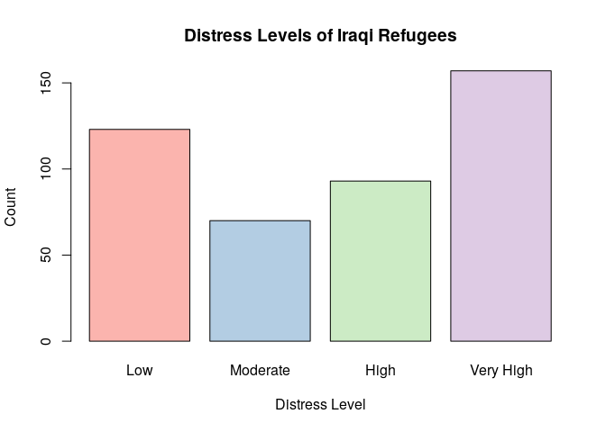

# (02) Chi Distribution

## Preamble


```r
load.pac <- function() {
  
  if(require("pacman")){
    library(pacman)
  }else{
    install.packages("pacman")
    library(pacman)
  }
  
  pacman::p_load(xts, sp, gstat, ggplot2, rmarkdown, reshape2, ggmap, wesanderson,
                 parallel, dplyr, plotly, tidyverse, reticulate, UsingR, Rmpfr, latex2exp,
                 mise)
  
#  devtools::install_github("tidyverse/tidyverse")
}

load.pac()
```

```
## Loading required package: pacman
```

```r
mise()
```




## Wellness Data (Difference From Control)

### (01) Enter Data

Now be really careful here, make sure that the column names you choose are:

* [Syntactically Correct](https://rdrr.io/r/base/make.names.html) [^style]
  + Style Guides recommend lower case, `snake_case` for variable and function names (using nouns in the prior and verbs in the latter), this would include vectors.
    + Try to avoid using dots, the S3 scheme for defining classes uses `.`'s so you might end up with a confusing method like `as.data.frame.data.frame()`
    + I'm using camelCase for DF column names in order to distinguish them from variables and make them clearer inside `ggplot` as opposed to `snake_case`.
* Spelt correctly
  + You will need matching column names in order to use things like `pivot_longer` etc.
* Short enough to type in without making a spelling Mistake
  + Same as above, remenber axis-titles and so forth are distinct from data frame names.
  
  [^style]: [Style Guide](http://r-pkgs.had.co.nz/style.html)


```r
iraqi = c(123, 70, 93, 157)
names(iraqi) = c("low", "moderate", "high", "veryHigh")
head(iraqi)
```

```
##      low moderate     high veryHigh 
##      123       70       93      157
```

```r
str(iraqi)
```

```
##  Named num [1:4] 123 70 93 157
##  - attr(*, "names")= chr [1:4] "low" "moderate" "high" "veryHigh"
```

### BarPlot

#### Base Plot


```r
barplot(iraqi)
```

<!-- -->

#### GGPlot2

##### Tidy Data

This can be done in ggplot2, but first a `tidy` data frame needs to be constructed. Tidy data satisfies the following three rules:

1. Each variable will have it's own column
2. Each ovservation will have it's own row
3. Each Value will have it's own cell.

A tidy data frame somewhat depends on context, for example:

* If only the refugees were sampled, the data would be structured where: 
    + Observations would be:
        + Low
        + Medium
        + High
    + Variables would be:
        + Count
* If Multiple populations were sampled, for example the Australian population and the iraqi populations, the tidy data frame may be such that:
    + Observations would be:
        + Australia
        + Iraqi
    + variables would be:
        + Count
        + Distress Level
* If Individuals were classified into a distress category, the corresponding tidy data frame would be:
    + Observations would be:
        + Individuals
    + variables would be:
        + Country of Origin/Residence
        + Distress Level
        
##### Make the Plot


```r
#pivot_longer(data = iraqi, cols = names(iraqi))
iraqi.tidy <- melt(iraqi, value.name = "Count") %>% as_tibble(rownames = "Distress")
iraqi.tidy
```

```
## # A tibble: 4 x 2
##   Distress Count
##   <chr>    <dbl>
## 1 low        123
## 2 moderate    70
## 3 high        93
## 4 veryHigh   157
```

```r
# Base
#barplot(height = iraqi.tidy$Count, names.arg = iraqi.tidy$Distress)

# GGPlot2
ggplot(data = iraqi.tidy, mapping = aes(x = Distress, y = Count)) + 
  geom_col()
```

<!-- -->

##### Fix the Order of the Plot
In making this plot you may observe that the order of the plot has been made to be alphabetical, the order of the data frame has been disregarded. 

This is desirable and expected behaviour, the values of distress have not been correctly encoded, they need to be encoded as ordered factors in order to be ordered, unordered factors may as well be placed in alphabetical order.


```r
iraqi.tidy <- melt(iraqi, value.name = "Count") %>% as_tibble(rownames = "Distress")
iraqi.tidy$Distress <- factor(iraqi.tidy$Distress, levels = iraqi.tidy$Distress, ordered = TRUE)
iraqi.tidy
```

```
## # A tibble: 4 x 2
##   Distress Count
##   <ord>    <dbl>
## 1 low        123
## 2 moderate    70
## 3 high        93
## 4 veryHigh   157
```

```r
# Base
fillCols <- RColorBrewer::brewer.pal(nrow(iraqi.tidy), name = "Pastel1")
barplot(height = iraqi.tidy$Count, names.arg = c("Low", "Moderate", "High", "Very High"), col = fillCols, main = "Distress Levels of Iraqi Refugees", xlab = "Distress Level", ylab = "Count")
```

<!-- -->

```r
# GGPlot2
ggplot(data = iraqi.tidy, mapping = aes(x = Distress, y = Count)) + 
  geom_col(mapping = aes(col = Count, fill = Distress)) + 
  theme_classic() +
  labs(title = "Distress Levels of Iraqi Refugees") +
  guides(col = FALSE)
```

<!-- -->

### (02) Enter the AIHW Data

The *Australian Institute of Health and Wellness* data are as follows:


```r
aihw <- c("low" = 70.65, "moderate" = 18.5, "high" = 7.41, "veryHigh" = 3.43)
aihw.tidy <- tibble::enframe(aihw) # %>% cbind(aihw, iraqi)
names(aihw.tidy) <- c("Distress", "Count")
aihw.tidy$Distress <- factor(x = aihw.tidy$Distress, levels = aihw.tidy$Distress, ordered = TRUE)
aihw.tidy
```

```
## # A tibble: 4 x 2
##   Distress Count
##   <ord>    <dbl>
## 1 low      70.6 
## 2 moderate 18.5 
## 3 high      7.41
## 4 veryHigh  3.43
```

#### Combine all Observations

Ideally all the data should be combined into a single data set, be mindful that `pivot_longer()` is gonna complain if columns with the same name have different data types, so make sure to remember to re-class categories as factors rather than factors.:


```r
# First add a variable that can be used to distinguish the two Data Sets
iraqi.tidy$Region <- "Iraq"
aihw.tidy$Region <- "Australia"
# Combine the Data Sets
all.tidy <- rbind(iraqi.tidy, aihw.tidy) 
all.tidy 
```

```
## # A tibble: 8 x 3
##   Distress  Count Region   
##   <ord>     <dbl> <chr>    
## 1 low      123    Iraq     
## 2 moderate  70    Iraq     
## 3 high      93    Iraq     
## 4 veryHigh 157    Iraq     
## 5 low       70.6  Australia
## 6 moderate  18.5  Australia
## 7 high       7.41 Australia
## 8 veryHigh   3.43 Australia
```

```r
all.tidy$Distress <- factor(all.tidy$Distress, levels = iraqi.tidy$Distress, ordered = TRUE)

# Use Pivot Wider in order to make the column names the Region and the variable the count
all.wide <- pivot_wider(data = all.tidy, names_from = Region, values_from = Count)
all.wide
```

```
## # A tibble: 4 x 3
##   Distress  Iraq Australia
##   <ord>    <dbl>     <dbl>
## 1 low        123     70.6 
## 2 moderate    70     18.5 
## 3 high        93      7.41
## 4 veryHigh   157      3.43
```

#### Plot the aihw Data


```r
# Base Plot

fillCols <- RColorBrewer::brewer.pal(nrow(iraqi.tidy), name = "Pastel2")
barplot(height = all.wide$Australia, names.arg = c("Low", "Moderate", "High", "Very High"), col = fillCols, main = "Distress Levels of Iraqi Refugees", xlab = "Distress Level", ylab = "Count")
```

<!-- -->

```r
## ggplot2
ggplot(data = all.tidy, mapping = aes(x = Distress, y = Count, fill = Region, col = Count)) +
  geom_col(position = "dodge") +
  guides(col = FALSE) +
  theme_classic() +
  labs(title = "Distress of Refugees", subtitle = "", y = "Frequency")
```

<!-- -->

### (03) Determine Expected Frequency

#### Hypothesis

1. $H_0 \enspace : \quad$ The Refugee Distress Categories will have frequencies equal to Australia
2. $H_a \enspace : \quad$ There will be a difference between the categories

Assuming that the null hypothesis is true, the expected frequency of the categories can be deterimed:

$$
\textsf{e} = 443 \times \frac{\texttt{aihw}}{100}
$$

```r
all.wide$IraqExpected <- all.wide$Australia * (sum(all.wide$Iraq)/100)

# Rename the Column to reflect expected and observed frequencies

## using Dplyer
all.wide %>% 
  dplyr::rename(
    IraqObserved = Iraq
  )
```

```
## # A tibble: 4 x 4
##   Distress IraqObserved Australia IraqExpected
##   <ord>           <dbl>     <dbl>        <dbl>
## 1 low               123     70.6         313. 
## 2 moderate           70     18.5          82.0
## 3 high               93      7.41         32.8
## 4 veryHigh          157      3.43         15.2
```

```r
## using Base Functions
names(all.wide)[names(all.wide)=="Iraq"] <- "IraqObserved"

# Print the DataFrame
all.wide
```

```
## # A tibble: 4 x 4
##   Distress IraqObserved Australia IraqExpected
##   <ord>           <dbl>     <dbl>        <dbl>
## 1 low               123     70.6         313. 
## 2 moderate           70     18.5          82.0
## 3 high               93      7.41         32.8
## 4 veryHigh          157      3.43         15.2
```


### (04)Compute the Chi-Squared Distance

The *Chi-Squared* ($\chi^2$) statistic is the squared distance from the the expected and observed values to the expected value:

$$
\chi^2 = \sum^n_{i=1} \left[ \frac{(o-e)^2}{e} \right]
$$

This can be done readily in **_R_**:


```r
o <- all.wide$IraqObserved
e <- all.wide$IraqExpected

all.wide$ChiDist <- ((o-e)^2/e)
ChiStat <- sum(all.wide$ChiDist)
ChiStat
```

```
## [1] 1550.75
```

And returns the value $\chi^2 \approx 1551$

### (05) Similate the Counts

A distribution with multiple categories of different probabilities is a **multinomial** distribution and can be simulated:


```r
rmultinom(n = 1, size = 443, prob = aihw/100)
```

```
##          [,1]
## low       294
## moderate   96
## high       34
## veryHigh   19
```

```r
# A more Rigurous simulation by averaging various other simulations
average_sim_count      <- rmultinom(n = 10000, size = 443, prob = aihw/100) %>% rowMeans()
all.wide$IraqSimulated <- average_sim_count 
all.wide
```

```
## # A tibble: 4 x 6
##   Distress IraqObserved Australia IraqExpected ChiDist IraqSimulated
##   <ord>           <dbl>     <dbl>        <dbl>   <dbl>         <dbl>
## 1 low               123     70.6         313.   115.           313. 
## 2 moderate           70     18.5          82.0    1.74          82.0
## 3 high               93      7.41         32.8  110.            32.9
## 4 veryHigh          157      3.43         15.2 1323.            15.2
```

```r
# Building a Confidence Interval for the true mean given this Distribution
# The confidence interval is meaningless really, it can be made arbitrarily small by
# making n sufficietnly large, this is just to illustrate confidence intervals for
# population means given a sample of sample means.
sd_sim_count      <- rmultinom(n = 1000, size = 443, prob = aihw/100) %>% apply(MARGIN = 1, sd) # 1 is row, 2 is column

# Calculate the t-statistic for 95%
t <- qt(p = 0.95, df = 999)

data.frame(
  averageSimCount = average_sim_count,
  sdSimCount = sd_sim_count,
  lowerConfidenceForMean= round(average_sim_count - t * (sd_sim_count)/sqrt(1000)),
  upperConfidenceForMean = round(average_sim_count + t * (sd_sim_count)/sqrt(1000))
)
```

```
##          averageSimCount sdSimCount lowerConfidenceForMean
## low             312.8671   9.625521                    312
## moderate         82.0428   8.326730                     82
## high             32.8985   5.549175                     33
## veryHigh         15.1916   3.750165                     15
##          upperConfidenceForMean
## low                         313
## moderate                     82
## high                         33
## veryHigh                     15
```

Or this could be simulated by using the `sample()` function:


```r
frequency <- sample(1:4, 443, replace = TRUE, prob=all.wide$Australia) %>%
  table %>% 
  tibble::enframe()

names(frequency) <- c("Distress", "Count")
frequency$Distress <- names(iraqi)
frequency
```

```
## # A tibble: 4 x 2
##   Distress Count  
##   <chr>    <table>
## 1 low      323    
## 2 moderate  68    
## 3 high      40    
## 4 veryHigh  12
```

### (06) Put Everything together

So the idea is, in order to test the hypothesis that there is no difference we will set up a hypothesis test.

The test statistic will be the total squared distance relative to the expected value for the distribution, this is known as the $\chi ^2$ value.

If we can:

* Assume the null hypothesis is true 
    + (no difference between the number of iraqi counts and the number of `aihw` counts)
* With only 5% probability of getting a false positive under this assumption

then we will reject the null hypothesis that they are the same and accept that there is a significant difference between the distribution of distress in the iraqi population. 
   + (this necessarily show that the iraqi refugees are more distressed, merely that the distribution is different from the Australian distribution in such a way that would be unlikely to be a false positive assuming they were identical.)
   
In order to evaluate this, We can take a random sample of values that are distributed with the same frequency as the `aihw` data and measure how often the corresponding $\chi^2$ value of the sampled values exceed that of the observed values for the iraqi values, under the assumption that the iraqi values are distributed at the same frequency of the `aihw`, this would amount to a False Positive for a difference.

Creating many chi statistics, comparing them and repeating gives a false positive rate:


```r
# Calcualate the iraqi Chi Stat
e <- aihw/100 * sum(iraqi)
o <- iraqi
iraqi_chi <- sum((e-o)^2/e)

# Simulate the False Positive Rate for data following the Aus Distribution
n <- 10^3 # Simulation Length
FalsePosVec <- vector(length = n)
for (i in 1:n) {
 # e <- rmultinom(1, 443, aihw/100)
  e <-  sample(1:4, 443, replace = TRUE, prob=aihw) %>%  table
  o <- aihw
#  o <- iraqi
  sim_chi <- sum((e-o)^2/e )
  # Assume null hypotheses, this means we assume the iraqi distance does not exceed the sim distance
  # The number of times it does exceed is:
      # the probability of a false positive assuming the null hypothesis is correct
           # this is the p-value.
  FalsePosQ <- !(iraqi_chi < sim_chi) #(assuming null hypothesis means assuming iraqi distance leq to  sim)
                                     # The number of positives will be the FPR and indicative of 
                                     # the p-value)
  FalsePosVec[i] <- FalsePosQ
}

pval <- mean(FalsePosVec)
print(pval)
```

```
## [1] 1
```

This could be made more efficient by using `replicate` rather than a `for` loop (`replicate` is to **_R_** as `Table[]` is to *Mathematica*):


```r
e <- aihw/100 * sum(iraqi)
o <- iraqi
iraqi_chi <- sum((e-o)^2/e)

FalsePosCount <- replicate(10^4, expr = {
  o <- rmultinom(n = 1, size = sum(iraqi), prob = aihw)
  sim_chi <- sum((e-o)^2/e)
  !(iraqi_chi < sim_chi)
})

mean(FalsePosCount)
```

```
## [1] 1
```

This returns a value of 1, indicating that the probability of a false positive, assuming that the data was randomly sampled following the probabilities of the proportions of the Australian populatation, is effectively 1, thus the null hypothesis should be rejected and the alternative hypothesis accepted.

### (07) Use the InBuilt Chi-Square Statistic

The chi-squared value that would correspond to a false positive rate like in the above simulation, may be determined by integrating the appropriate probability density function:

$$
\begin{aligned}
f_n\left( x \right)= \frac{1}{2^{\frac{n}{2}} \cdot  \Gamma\left( \frac{n}{2} \right)} \cdot  x^{\frac{n}{2} -  1}\cdot  e^{- \frac{x}{2}}
\end{aligned}
$$

where the mean and variance are $n$ and $2n$ respectively; $\Gamma\left( x \right)$ is the gamma function it's very similar to the factorial function ($x!$):

$$\begin{aligned}
x! &= \Gamma\left( x+ 1 \right)\\
x! &= x \cdot  \Gamma\left( x \right)\\
\Gamma\left( n \right)&= \left( n- 1 \right)!, \qquad \forall n \in \mathbb{Z} \setminus \mathbb{Z}^- \\
\Gamma\left( z \right) &= \int_{0}^{\infty}\left(  \left( \# \right)^{z- 1}\cdot  e^{-\left( \# \right)} \right) \mathrm{d} \left( \# \right), \qquad z \in \mathbb{C} \wedge \Re\left( z \right)>0
\end{aligned}$$

This doesn't seem quick to solve, plugging it into *Mathematica* gives:

```wolfram
Integrate[ 1/2^(n/2*Gamma[n/2])*x^(n/2 - 1)*e^(-x/2), {x, 0, \[Infinity]}]
```

```
ConditionalExpression[(2^(1/2 - (3 Sqrt[\[Pi]])/4) Sqrt[\[Pi]])/ Log[e]^(3/2), Re[Log[e]] > 0]
 ```
 
 $$
\int^{\infty}_0\frac{1}{2^{\frac{n}{2}} \cdot  \Gamma\left( \frac{n}{2} \right)} \cdot  x^{\frac{n}{2} -  1}\cdot  e^{- \frac{x}{2}} \enspace \mathrm{d}x =   \frac{2^{\frac{1}{2}-\frac{3 \sqrt{\pi }}{4}} \sqrt{\pi }}{\log ^{\frac{3}{2}}(e)} 
 $$

Howerver inside **_R_** this is all built into the `pchisq()` function and the null hypothesis may be evaluated without necessarily undertaking the simulation. 

#### Evaluate Test Statistic Using Chi Statistic

The probability of a false positive, assuming that the null hypothesis is true can be determined directly from the critical values of the Chi-Statistic.


```r
# the null hypothesis is that there is no difference, the
# probability of detecting a difference will be the upper tail and would be the p-value
pchisq(q = iraqi_chi, df = (length(aihw)-1), lower.tail = FALSE)
```

```
## [1] 0
```

It isn't even necessary to calculate the $\chi^2$ value, this is built into **_R_** and can be done all at once:


```r
chisq.test(x = iraqi, p = aihw, rescale.p = TRUE)
```

```
## 
## 	Chi-squared test for given probabilities
## 
## data:  iraqi
## X-squared = 1550.6, df = 3, p-value < 2.2e-16
```

As opposed to using the $\chi^2$ distribution, it is possible to use a *Monte Carlo* simulation all in one line as well:


```r
chisq.test(x = iraqi, p = aihw, rescale.p = TRUE, simulate.p.value = TRUE, B = 10^3)
```

```
## 
## 	Chi-squared test for given probabilities with simulated p-value (based
## 	on 1000 replicates)
## 
## data:  iraqi
## X-squared = 1550.6, df = NA, p-value = 0.000999
```

I can't think of any reason to use the monte carlo simulation over the density distribution though


## Eels Data (Comparison of Two Populations)

### (1) Enter the Data

The data can be entered as a data frame or a matrix, the prior will be better for plotting and visualisation but the latter may be the expected format for various built in functions:


```r
# Create Vectors
g_moringa <- c("BoRdeR" = 264,"GraSs" = 127,"SaNd" = 99)
g_vicinus <- c("BoRder" = 161,"GraSs" = 116,"SaNd" = 67)
    # Capitals to emphasise change later with dimnames

# Create a Matrix
eel_Mat <- rbind(g_moringa, g_vicinus)
dimnames(eel_Mat) <-  list(species = c("G.moringa", "G.vicinus"),
                           location = c("Border", "Grass", "Sand")
                           )


# Create a Data Frame
eel_DF  <- eel_Mat %>%
  as_tibble() %>%
  add_column("Species" = factor(rownames(eel_Mat))) %>%
  dplyr::select(Species, Border, Grass, Sand)

eel_DF # %>% kable()
```

```
## # A tibble: 2 x 4
##   Species   Border Grass  Sand
##   <fct>      <dbl> <dbl> <dbl>
## 1 G.moringa    264   127    99
## 2 G.vicinus    161   116    67
```

#### Plot the Data

In order to plot the data a tidy data frame needs to be made using `tidyr::pivot_longer()` or `reshape2::melt()`.
A custom colour pallet can be specified using the following layers [^ggplotColLayer]:

[^ggplotColLayer]: [ggplot2 colors : How to change colors automatically and manually? - Easy Guides - Wiki - STHDA](http://www.sthda.com/english/wiki/ggplot2-colors-how-to-change-colors-automatically-and-manually)


* Discrete Data
  + `scale_fill_manual()`
    + to change the fill of the object
  + `scale_color_manual()`
    + to change the colour of the **outline** of the object
  + Using Built in Palletes:
    + `RColorBrewer`
      + `scale_fill_brewer(palette="Dark2")`
      + `scale_color_brewer(palette="Dark2")`
    + `wesanderson`
      + `scale_fill_manual(values=wes_palette(n=3, name="GrandBudapest"))`
      + `scale_color_(values=wes_palette(n=3, name="GrandBudapest"))`
* Continuous Data
  + `scale_color_gradient(low="blue", high="red")` 
    + Color is the outline, so think Scatter Plot
    + To Have a Diverging Pallet:
      + `scale_color_gradient2`(midpoint=mid, low="blue", mid="white", high="red", space ="Lab" )
    + To have a pallet of n different colours (in this example 7:
      + `scale_color_gradientn(colours = rainbow(7))`
  + `scale_fill_gradient()` 
    + Fill is the filling so think Histogram

scale_color_gradient(low="blue", high="red")

      

```r
# Create a Tidy Data Frame

## Using Pivot Longer from `tidyverse` (dev git repo)
eel_DF_Tidy <- pivot_longer(data = eel_DF,
                            cols = names(eel_DF[,-1]),
                            names_to = "Location",
                            values_to = "Count") 

eel_DF_Tidy$Species <- factor(eel_DF$Species)
eel_DF_Tidy$Location <- factor(eel_DF_Tidy$Location)

## Using Melt from `reshape2`
melt(eel_DF, ) %>% dplyr::rename("Location" = variable,
                               "Count" = value)
```

```
## Using Species as id variables
```

```
##     Species Location Count
## 1 G.moringa   Border   264
## 2 G.vicinus   Border   161
## 3 G.moringa    Grass   127
## 4 G.vicinus    Grass   116
## 5 G.moringa     Sand    99
## 6 G.vicinus     Sand    67
```

```r
    # Instead of using dplyr I could have used `variable.name=`...,
        # just done for reference

## ggplot2
violetBluePallet <- c("#511FB5", "dodgerblue3", "#e31a1c")
ggplot(data = eel_DF_Tidy,
       mapping = aes(x = Location,
                     y = Count,
                     fill = Species,
                     col = Count)) +
  geom_col(position = "dodge") +
  guides(col = FALSE) +
  theme_classic() +
  labs(title = "blah", subtitle = "", y = "Frequency") +
  scale_fill_manual(values=violetBluePallet)
```

<!-- -->


### (2) Expected Values

In this case the two hypothesis are:

* $H_0: \quad$ the two species are distriuted with the same frequency
  + So the proportion in both areas is assumed to be equal
    + Given this assumption we may take the proportion of the total number
      of observations that occur in this area and this will be equal to averaging the proportions
      of each species that occur in the two areas.
* $H_a: \quad$ there is a difference between the distribution of the two frequencies


Under the assumption that both species have the same distribution (i.e. assume $\mathrm{H}_0$ is true) each term $x_{ij}$ will have an expected frequency of $f = \frac{1}{n} \cdot   \sum^{2}_{i= 1}   \left[x_i \right]$ and hence the expected count would be the frequency multiplied by the total number of observed species:

$$\begin{aligned}
    x_{ij}&= f \cdot  \sum^{3}_{j= 1}   \left[ x_{ij} \right] \\
&=  \frac{1}{n} \cdot   \sum^{2}_{i= 1}   \left[x_i \right] \cdot  \sum^{3}_{j= 1}   \left[ x_{ij} \right] 
\end{aligned}$$

so the resulting matrix of counts would be:

$$\begin{aligned}
    \begin{bmatrix} 490 \\ 344 \end{bmatrix}  
    \times 
    \begin{bmatrix} 0.5 & 0.29 & 0.2 \end{bmatrix}  \\
    = \begin{bmatrix} 250 & 143 & 98 \\
    175 & 100 & 68 \end{bmatrix} 
\end{aligned}$$


Assuming that the null hypothesis is true, the expected distribution between areas could be calculated by using matrix multiplcication:


```r
species_counts       <-  rowSums(eel_Mat)
location_proportions  <- colSums(eel_Mat)/sum(eel_Mat)
 
# Now Perform matrix Multiplication
 species_counts      
```

```
## G.moringa G.vicinus 
##       490       344
```

```r
 location_proportions 
```

```
##    Border     Grass      Sand 
## 0.5095923 0.2913669 0.1990408
```

```r
 as.matrix(species_counts) %*% t(as.matrix(location_proportions)) 
```

```
##             Border    Grass     Sand
## G.moringa 249.7002 142.7698 97.52998
## G.vicinus 175.2998 100.2302 68.47002
```

This is actually the definition of the outer product; the [*Outer Product*](https://en.wikipedia.org/wiki/Outer_product#Definition) is defined as:


$$
\mathbf{u} \otimes \mathbf {v} =\mathbf {u} \mathbf {v} ^{\textsf {T}}={\begin{bmatrix}u_{1}\\u_{2}\\u_{3}\\u_{4}\end{bmatrix}}{\begin{bmatrix}v_{1}&v_{2}&v_{3}\end{bmatrix}}={\begin{bmatrix}u_{1}v_{1}&u_{1}v_{2}&u_{1}v_{3}\\u_{2}v_{1}&u_{2}v_{2}&u_{2}v_{3}\\u_{3}v_{1}&u_{3}v_{2}&u_{3}v_{3}\\u_{4}v_{1}&u_{4}v_{2}&u_{4}v_{3}\end{bmatrix}}.
$$
In **_R_** vectors [^vecspace] of length $m$ are treated as $m \times 1$ matrices as can be observed by evaluating `as.matrix(1:3)` and `t(as.matrix(1:3))`, this means that the outer product of two vectors will be equivalent to:


$$
\mathbf {u} \otimes \mathbf {v} =\mathbf {A} ={\begin{bmatrix}u_{1}v_{1}&u_{1}v_{2}&\dots &u_{1}v_{n}\\u_{2}v_{1}&u_{2}v_{2}&\dots &u_{2}v_{n}\\\vdots &\vdots &\ddots &\vdots \\u_{m}v_{1}&u_{m}v_{2}&\dots &u_{m}v_{n}\end{bmatrix}}
$$


[^vecspace]: In this context a matrix is vector in the sense that matrices can be used to satisfy the axiom of vector addition for a Vector Space, refer to 4.2 of R Larson's *Linear Algebra* 7th ed.


So the expected occurence rate of the species would be:


```r
# Determine how many species there are
species_counts       <-  rowSums(eel_Mat)
species_proportions <-  rowSums(eel_Mat)/n
# Determine the area proportions
location_proportions  <- colSums(eel_Mat)/sum(eel_Mat)

# Calculate the expected distribution of that number for those proportions
expected_counts <- base::outer(species_counts, location_proportions) 

print(list(species_counts, location_proportions, expected_counts, base::outer(location_proportions, species_counts) ))
```

```
## [[1]]
## G.moringa G.vicinus 
##       490       344 
## 
## [[2]]
##    Border     Grass      Sand 
## 0.5095923 0.2913669 0.1990408 
## 
## [[3]]
##             Border    Grass     Sand
## G.moringa 249.7002 142.7698 97.52998
## G.vicinus 175.2998 100.2302 68.47002
## 
## [[4]]
##        G.moringa G.vicinus
## Border 249.70024 175.29976
## Grass  142.76978 100.23022
## Sand    97.52998  68.47002
```

or if you're willing to remember that:

$$
e_{ij} = \frac{\sum{[\textsf{row}]} * \sum{[\textsf{col}]}}{n}
$$


```r
e <- matrix(1:6, nrow = 2)
  for (i in 1:nrow(eel_Mat)) {
    for (j in 1:ncol(eel_Mat)) {
      e[i,j] <- colSums(eel_Mat)[j] * rowSums(eel_Mat)[i] / n
    }
  }
```


### (3) Simulate The Values

The game plan here is to:

1. Assume that the null hypothesis is true:
  + The observations are distributed equally across features:
    + $e_{ij} = \sum \left[ \textsf{rows} \times  \right] \sum \left[ \textsf{cols}  \right]    \times \frac{1}{n}$
2. Randomly sample values at the same probability
  + given this simulated observation, determine what the expected
    distribution would be determined to be assuming that the null
    hypothesis was true.
  + Determine what the corresponding $\chi^2$ value is.
  + the number of times that this simulated $\chi^2$ value is
    greater than the observed $\chi^2$ value is
    the _**F**alse **P**ositive **R**ate_

#### Sample a Single Value

In order to simulate the values we need simulate data distributed at given probabilities, this is known as a multinomial distribution, it's essentially rolling a really oddly lopsided die that matches the probabilities specified.

From that sample it is necessary to calculate what we would determine the expected distribution to be assuming that the null hypothesis was true:


```r
overall_proportion <- expected_counts/sum(expected_counts)

# Presuming that R's internal structure is consistent
rmultinom(n = 1, size = sum(eel_Mat), prob = overall_proportion) %>% matrix(ncol = 3, nrow = 2)
```

```
##      [,1] [,2] [,3]
## [1,]  260  145   94
## [2,]  164  110   61
```

```r
# Presuming it's not
dist_prob <- overall_proportion %>% as.vector
obs_sim   <- rmultinom(n = 1, size = sum(eel_Mat), prob = dist_prob) %>% matrix(ncol = 3, nrow = 2)
e_sim     <- 1/n*outer(X = rowSums(obs_sim), colSums(obs_sim))

print(list(obs_sim, e_sim), 1)
```

```
## [[1]]
##      [,1] [,2] [,3]
## [1,]  263  139  102
## [2,]  173   97   60
## 
## [[2]]
##      [,1] [,2] [,3]
## [1,]  220  119   82
## [2,]  144   78   53
```

```r
## Sanity Check
#1:6 %>% matrix(nrow = 2, ncol =3) %>% as.vector() 
#1:6 %>% as.matrix() %>% as.vector() %>% matrix(nrow = 2, ncol =3)
#1:6 %>% as.matrix() %>% as.vector() %>% matrix(nrow = 2, ncol =3) %>% as.vector()
#1:6 %>% as.matrix() %>% as.vector() %>% matrix(nrow = 2, ncol =3) %>% as.vector() %>% matrix(nrow = 2, ncol =3)
```

If this was repeated many times over, the number of times that the $\chi^2$ statistic was sufficiently extreme to reject the null hypothesis would represent the false positive rate, which would be an acceptable estimate for the probability of a type I error, the $p$-value:

> The probability of rejecting the null hypothesis under the assumption that it is true (i.e. under the assumption that there is no true effect). Careful, this is different from the false discovery rate

This simulation is under the assumption that the null hypothesis is true and that the two populations are distributed equally, so the null hypothesis assumes that:

$$
\begin{aligned}
&\mathrm{H}_0:\quad \chi^2_{obs} < \chi^2_{sim} \\
\end{aligned}
$$

A False Positive would be an observation that violates that assumption, if the probability of a false positive, the $p$ -value:

* Sufficiently small, the null hypothesis will be rejected.
* too high the null hypothesis will not be rejected.

#### Simulate Samples of that frequency

Calculate the Chi Distribution for the observations which will become the test statistic:


```r
# Create expected and observed vectors
e <- expected_counts
o <- eel_Mat
n <- sum(eel_Mat)
 
chi_obs <- sum((e-o)^2/e)

#obs_sim   <- rmultinom(n = 1, size = sum(eel_Mat), prob = dist_prob) %>% matrix(ncol = 3, nrow = 2)
```


The idea of the simulation is to generate observations at the proportion assumed by the null hypothesis and reduce these matrices to corresponding $\chi^2$ values.


Simulate samples at the same proportion and sample the $\chi^2$ statistic:


```r
# Simulate distribution
    # Use `Replicate` not `for` because it's faster

dist_prob <- overall_proportion %>% as.vector
  # I could also have used rmultinom to sample the split of the population across two species
  # Then split those species amont locations
  # or made two samples of the species and location dist and then used `table()`

sim_chi_vec <- replicate(10^4, {
  
  ## Simulate Samples
obs_sim   <- rmultinom(n = 1, size = sum(eel_Mat), prob = dist_prob) %>% matrix(ncol = 3, nrow = 2)
  
  ## Calculate the expected values from the sample
    ## Assuming the null hypothesis that both rows are equal.
e <- outer(rowSums(obs_sim), colSums(obs_sim))/n

  ## Calculate the Chi Squared Statistic
sim_chi <- sum((e-obs_sim)^2/e)
sim_chi
  
})
```

If a simulated distribution had a $\chi^2$ value more extreme than the observation, the null hypothesis would be rejected, the simulation was generated under circumstanes where the null hypothesis was true and so this would be a false positive or a *Type I Error*.

The rate of false positives is an estimator for the probability of commiting a Type I error (the $p$ -value), this can be calculated:


```r
calculate_p_value <- function() {
  mean(falsepos())
}

  falsepos <- function() {
    # If the critical value was our observation, would the simulation be less extreme?
      # If not this is a false positive
    # If the simulated value is more extreme than the 
    !(sim_chi_vec > chi_obs)
    sim_chi_vec > chi_obs
  }

p <- calculate_p_value()

paste("The Probability of rejecting the null hypothesis, assuming that it was true (i.e. detecting a false positive assuming there is no difference between species) is", p) %>% print()
```

```
## [1] "The Probability of rejecting the null hypothesis, assuming that it was true (i.e. detecting a false positive assuming there is no difference between species) is 0.0425"
```

```r
"This is too high and so the null hypothesis is not rejected." %>% print()
```

```
## [1] "This is too high and so the null hypothesis is not rejected."
```

Hence the probability of rejecting the null hypothesis when it is true is quite small, the $p$ -value is less than 5% and so the null hypothesis is rejected and the alternative hypothesis, that the species are distributed differently is accepted.

This can be visualised in a histogram:


```r
# Plot a Histogram

  ## Base Plot
  myhist <- hist(sim_chi_vec, breaks = 50) 
```

<!-- -->

```r
  plot(myhist, col = ifelse(myhist$mid<6, "white", "lightblue"), 
       main= latex2exp::TeX("Simulated $\\chi^2$ Distances"),
       freq = FALSE, 
       xlab = TeX("$\\chi^2$ distance"))
  abline(v = chi_obs, col = "Indianred", lty = 2, lwd = 3)
```

<!-- -->

```r
    # Conditional Colour: # https://stat.ethz.ch/pipermail/r-help/2008-July/167936.html

  ## GGPlot2

    ### Make a Tidy Data Frame
    chi_vals_Tib <- tibble::enframe(sim_chi_vec)
    chi_vals_Tib$name[sim_chi_vec<chi_obs] <- "TruePos"
    chi_vals_Tib$name[sim_chi_vec>chi_obs] <- "FalsePos"
    
    ### Plot the Data
    ggplot(data = chi_vals_Tib, mapping = aes(x = value))+
      geom_histogram(binwidth = 0.4, col = "white", aes(fill = name)) +
      theme_classic() +
      guides(fill = guide_legend("Conclustion\nStatus")) +
      geom_vline(xintercept = chi_obs, lty = 3, col = "purple") +
      scale_fill_manual(values = c("indianred", "lightblue"),
                        labels = c("False Positive / Type I", "True Positive")
                        ) +
      labs(title = latex2exp::TeX("Simulated $\\chi^2$ Values")) +
      scale_x_continuous(limits = c(0, 11.5))
```

```
## Warning: Removed 29 rows containing non-finite values (stat_bin).
```

```
## Warning: Removed 4 rows containing missing values (geom_bar).
```

<!-- -->


### (4) Use the Chi Squared Distribution

The $p$-value is a function of:

* The degrees of freedom
  + $\mathsf{d.f. = (\mathsf{rows}-1) \times (\mathsf{cols}-1)}$
* The $\chi^2$ value

So the probability of rejecting the null hypothesis, under the assumption that it is true can be determined using a predefined function.

#### Monte Carlo Simulation


```r
chisq.test(x = eel_Mat, simulate.p.value = TRUE, B = 10^4)
```

```
## 
## 	Pearson's Chi-squared test with simulated p-value (based on 10000
## 	replicates)
## 
## data:  eel_Mat
## X-squared = 6.2621, df = NA, p-value = 0.0449
```

#### Analytic Function

```r
chisq.test(eel_Mat)
```

```
## 
## 	Pearson's Chi-squared test
## 
## data:  eel_Mat
## X-squared = 6.2621, df = 2, p-value = 0.04367
```

### Summary

To determine whether or not the two species are distributed differently:


```r
matrix(c(264, 161, 127, 116, 99, 67), nrow = 2) %>% chisq.test()
```

```
## 
## 	Pearson's Chi-squared test
## 
## data:  .
## X-squared = 6.2621, df = 2, p-value = 0.04367
```


## Other Examples

### (1) Daily Frequency

ABC bank has determined the following counts of ATM use, is there any evidence to suggest that the spread is not equal?

| Mon | Tues | Wed | Thur | Fri | 
| --- | ---| --- | --- | --- | 
| 253 | 197 | 204 | 279 | 267 |

#### Hypothesis

1. $H_0:\quad x_1 = x_2 = ... x_5$
2. $H_a:\quad x_i \neq x_j \enspace \exists i,j \in \left\{1,2,3,4,5\right\}$

#### Rejection Region


```r
atm_usage <- c(253, 197, 204, 279, 267)
chisq.test(x = atm_usage)
```

```
## 
## 	Chi-squared test for given probabilities
## 
## data:  atm_usage
## X-squared = 23.183, df = 4, p-value = 0.0001164
```

```r
chisq.test(x = atm_usage, simulate.p.value = TRUE, B = 10^3)
```

```
## 
## 	Chi-squared test for given probabilities with simulated p-value (based
## 	on 1000 replicates)
## 
## data:  atm_usage
## X-squared = 23.183, df = NA, p-value = 0.000999
```

The $p$ -value is less than 5% and so the null hypothesis is rejected and it is concluded that the usage differs between days of usage.


### (2) Mendellian Genetics

Clasp you hands together. Which thumb is on top? Everyone has two copies of a gene which
determines which thumb is most comfortable on top, the variants can be labelled L and R, an
individual is either LL, LR, or RR. Counts of 65 children found,

| LL | LR | RR |
|----|----|----|
| 14 | 31 | 20 |

According to Mendelian genetics 25% should be LL, 50% LR and 25% RR.
Use chisq.test to see if the data is consistent with this hypothesis.

#### Hypotheses

1. $H_0:\quad \mathsf{LL}=\mathsf{RR}=0.25; \enspace \mathsf{LR}=0.5$
2. $H_a:\quad$ The distribution differs from 0.25, 0.25, 0.5.

#### Rejection Region

In order to deal with this type of hypothesis, it is necessary to pass the probabilities to the function as a seperate argument:


```r
gene_hand <- c(14, 31, 20)
chisq.test(gene_hand, p = c(0.25, 0.5, 0.25))
```

```
## 
## 	Chi-squared test for given probabilities
## 
## data:  gene_hand
## X-squared = 1.2462, df = 2, p-value = 0.5363
```

The $p$ -value is 50%, this indicates that the probability of rejecting the null hypothesis, if it was true and hence commiting a Type I error is quite high.

Hence the null hypothesis is not rejected and it is concluded that:

* There is insufficient evidence to reject the hypothesis that the hand usage are distributed in a way consistent with *Mendellian* genetics.


### (3) Political Opinion
300 adults were asked whether school teachers should be given more freedom to punish unruly
students. The following results were obtained?

|       | In Favour | Against | No Opinion |
| ---   |       --- |     --- | ---        |
| Men   |        93 |      70 |         12 |
| Women |        87 |      32 |          6 |


Do men and women have the same distribution of opinions?

#### Rejection Region

By default a Chi-Squared test in **_R_** will compare whether or not rows (observations) in a matrix have the same distribution.

This is distinct from Question 2 above where the question was:

* Is the observation distributed at the speciefied frequency

In this case the question is:

* Are the two cases distributed with the same frequency
  * Assuming that they are means that the true distribution will be the mean value of the two observations.


```r
opinion_punish <- matrix(c(93, 87, 70, 32, 12, 6), nrow = 2)

chisq.test(opinion_punish)
```

```
## 
## 	Pearson's Chi-squared test
## 
## data:  opinion_punish
## X-squared = 8.2528, df = 2, p-value = 0.01614
```

The $p$ -value is 2% indicating the probability of rejecting the null-hypothesis if it were true is quite low, hence the null hypothesis is rejected and it is concluded that men and women have differing distributions of opinions.

### (4) Medical Efficacy

Two drugs are administered to patients to treat the same disease.

|        | Cured | Not Cured |
| ---    |   --- | ---       |
| Drug A |    44 |        16 |
| Drug B |    18 |        22 |

Are the drugs equally effective?

#### Rejection Region

This is the same as the eels or men/women problem, the drugs are rows / observations of different classes and the columns will be the outcome of the treatment:


```r
drug_effect <- matrix(c(44, 18, 16, 22), nrow = 2)
rownames(drug_effect) <- c("Drug A", "Drug B")
colnames(drug_effect) <- c("Cured", "Not Cured")

chisq.test(drug_effect)
```

```
## 
## 	Pearson's Chi-squared test with Yates' continuity correction
## 
## data:  drug_effect
## X-squared = 7.0193, df = 1, p-value = 0.008064
```

The p-value is <1% indicating that the probability of rejecting the null hypothesis, under the assumption that it is true, is very small.

Hence the null hypothesis is rejected and it is concluded that the drugs differ in effectiveness.


