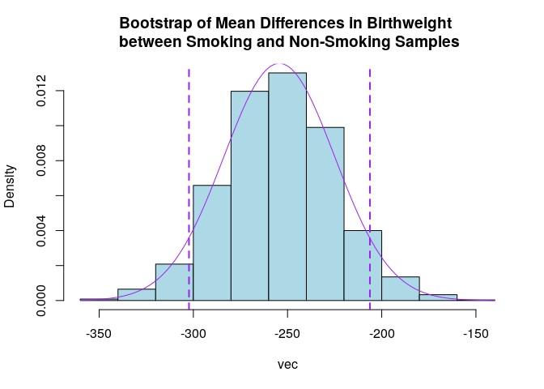

# (03) Comparison of Samples
## Preamble


```r
# Preamble
## Install Pacman
load.pac <- function() {
  if (require("pacman")) {
    library(pacman)
   }else{
    install.packages("pacman")
    library(pacman)
  }
  pacman::p_load(xts, sp, gstat, ggplot2, rmarkdown, reshape2, ggmap, parallel,
                  dplyr, plotly, tidyverse, reticulate, UsingR, Rmpfr, swirl,
                  corrplot, gridExtra, mise, latex2exp, tree, rpart, lattice,
                  rstudioapi)
  
  mise()
}

load.pac()
```

```
## Loading required package: pacman
```



```r
load(file = "./TAD.rdata")
```


Load the Data


```r
(birthwt <- as_tibble(read.csv(file = "./0datasets/birthwt.csv", header = TRUE, sep = ",")))
```

```
## # A tibble: 1,226 x 2
##      bwt smoke
##    <int> <fct>
##  1  3429 no   
##  2  3229 no   
##  3  3657 yes  
##  4  3514 no   
##  5  3086 yes  
##  6  3886 no   
##  7  3943 no   
##  8  3771 no   
##  9  3429 no   
## 10  4086 yes  
## # … with 1,216 more rows
```

```r
 # Always use doubles / numeric unless the data is legitamately
   # restricted to the integers, it will break functions ( and so it should)
birthwt$bwt <- as.numeric(birthwt$bwt)

birthwt$smoke <- c(FALSE, TRUE)[birthwt$smoke]

summary(birthwt)
```

```
##       bwt         smoke        
##  Min.   :1571   Mode :logical  
##  1st Qu.:3114   FALSE:742      
##  Median :3429   TRUE :484      
##  Mean   :3415                  
##  3rd Qu.:3743                  
##  Max.   :5029
```

```r
str(birthwt)
```

```
## Classes 'tbl_df', 'tbl' and 'data.frame':	1226 obs. of  2 variables:
##  $ bwt  : num  3429 3229 3657 3514 3086 ...
##  $ smoke: logi  FALSE FALSE TRUE FALSE TRUE FALSE ...
```

```r
dim(birthwt)
```

```
## [1] 1226    2
```

```r
nrow(birthwt)
```

```
## [1] 1226
```

```r
ncol(birthwt)
```

```
## [1] 2
```


## Smoking and Birth Weight
### Summarise Data
#### Table


```r
table(birthwt$smoke)
```

```
## 
## FALSE  TRUE 
##   742   484
```

```r
table(birthwt$smoke) %>% barplot(main = "Birth Weight and Smoking")
```

<!-- -->

#### Barplot


```r
desc_stats <- function(x) {
  mean(x)
  median(x)
  var(x)
  sd(x)
}

(desc_stats <- data.frame(
mean = apply(birthwt, 2, mean),
median = apply(birthwt, 2, median),
var = apply(birthwt, 2, var),
sd = apply(birthwt, 2, sd)
))
```

```
## # A tibble: 2 x 4
##       mean median        var      sd
##      <dbl>  <dbl>      <dbl>   <dbl>
## 1 3415.      3429 270498.    520.   
## 2    0.395      0      0.239   0.489
```

##### Range


```r
range(birthwt$bwt)
```

```
## [1] 1571 5029
```

```r
range(birthwt$bwt) %>% diff()
```

```
## [1] 3458
```

```r
max(birthwt$bwt) - min(birthwt$bwt)
```

```
## [1] 3458
```

###### Quantile

The quantile function returns $x$ -axis values corresponding to a what proportion of the data is specified, so for example, for a standard normal distribution $\mathcal{N}~\left( 0, 1 \right)$, 2.5% of the observations lie below 2 and another 2.5% lie above 2.


```r
quantile(rnorm(1000), 0.025)
```

```
##      2.5% 
## -1.900635
```

```r
quantile(birthwt$bwt, 0.25)
```

```
##  25% 
## 3114
```

```r
quantile(birthwt$bwt, 0.75)
```

```
##  75% 
## 3743
```

###### Inter-Quartile Range

This can be calculated thusly:


```r
IQR(birthwt$bwt)
```

```
## [1] 629
```


For normally distributed data we would expect:

$$
\textsf{IQR} = 1.349 \times \sigma
$$

Remember tha the normal distribution is modelled using calculus:

$$
\begin{aligned}
f(x) &= - \sqrt{\frac{k}{2\pi}}  \cdot   e^{k\cdot  \frac{\left( x- \mu \right)^2}{2}} \\
    f\left( x \right)&= \sqrt{\frac{1}{2\pi}}\cdot  \sum^{\infty}_{n= 0}   \left[\frac{ \left( - \frac{1}{2}z^2 \right)^n}{n!} \right]  \\
\int f\left( x \right) \mathrm{d}x &= \frac{1}{\sqrt{2\pi} }\int \sum^{\infty}_{n= 0}   \left[ \frac{\left( - \frac{1}{2}z^2 \right)^n}{n!} \right]  \mathrm{d}z \\
&= \frac{1}{\sqrt{2\pi} }\cdot  \sum^{\infty}_{n= 0}   \left[ \int \frac{\left( - 1 \right)^{- 1}z^{2n}}{2^n\cdot  n!} \mathrm{d}z  \right] \\
&= \frac{1}{\sqrt{2\pi} }\cdot  \sum^{\infty}_{n= 0}   \left[ \frac{\left( - 1 \right)^n \cdot  z^{2n+ 1}}{2^n\left( 2n+  1 \right)n!} \right] 
\end{aligned}
$$


#### Histograms

A histogram would offer a better understanding of the data:


```r
x <- birthwt$bwt
hist(birthwt$bwt, main = "Histogram of Birth Weight Given Smoking", col = "lightblue", border = "indianred", freq = FALSE)
```

<!-- -->

```r
# curve(dnorm(x, mean(x), sd(x)), add = TRUE)
```

Adding a Density urve is extremely difficult in base plot, it's so much easier to use ggplot2:


```r
birthwt_pretty <- birthwt
birthwt_pretty$smoke <- ifelse(birthwt$smoke, "Smoking", "non\nSmoking")

hist <- ggplot(birthwt_pretty, aes(x = bwt, fill = smoke, col = "black", y = ..density..)) +
         theme_classic() + 
         labs(x = "Birth Weight", y = "Density")

plots <- list()

# Dodge
plots[[1]] <- hist + geom_histogram(position = "dodge2", col = "blue", binwidth = 300)

# Overlay
plots[[2]] <-  hist + geom_histogram(binwidth = 300, col = "black")

# Single Histogram
plots[[3]] <- hist + geom_histogram(binwidth = 300, col = "black", aes(group = 1), fill = "lightblue") 

# Facet Grid (i.e. Split Chart)
 plots[[4]] <- hist + geom_histogram(binwidth = 300, col = "black") +
         facet_grid(. ~ smoke) +
         guides(fill = FALSE)

  
  # Colour it
  # Make a Facet Grid
  # Add a Density Curve
```


```r
layout <- matrix(c(1, 1, 2, 3, 4, 4), byrow = TRUE, nrow = 3)
# arrangeGrob(grobs = plots, layou_tmatrix = layout)
grid.arrange(grobs = plots, layout_matrix = layout)
```

<!-- -->


#### Splitting the Data Up

The `aggregate()` function can split up data by a specified variable given a `formula`:


```r
bwt_form <- bwt~smoke

# Formula as a variable
aggregate(bwt_form, birthwt, mean)
```

```
## # A tibble: 2 x 2
##   smoke   bwt
##   <lgl> <dbl>
## 1 FALSE 3516.
## 2 TRUE  3260.
```

```r
# Otherwise
aggregate(bwt~smoke, birthwt, sd)
```

```
## # A tibble: 2 x 2
##   smoke   bwt
##   <lgl> <dbl>
## 1 FALSE  497.
## 2 TRUE   517.
```

```r
aggregate(bwt~smoke, birthwt, median)
```

```
## # A tibble: 2 x 2
##   smoke   bwt
##   <lgl> <dbl>
## 1 FALSE  3514
## 2 TRUE   3286
```
It would also be possible to do this manually but it's actually quite tricky:
> Tibble's will always remain as tibble's when a column is extracted and will not yield to `as.vector()`, it is necessary to instead use the `dplyr::pull()` function or first conver the tibble to a matrix.


```r
matrix(
  c(
"Mean_Smokers"  = as.matrix(birthwt)[birthwt$smoke==1,"bwt"] %>% mean(),
"Mean_NonSmoke" = as.matrix(birthwt)[birthwt$smoke==0,"bwt"] %>% mean()
))
```

```
##          [,1]
## [1,] 3260.285
## [2,] 3515.639
```


#### Split Charts

##### Base

Split Charts are essentially a `facet grid` of two historgrams corresponding to a variable, the can be generated using the `lattice` library which is usually bundled with base **_R_**: 


```r
library(lattice)
histogram(~bwt|smoke, data = birthwt)
```

<!-- -->


##### GGPlot2 

This was shown previously:


```r
# Facet Grid

ggplot(birthwt_pretty, aes(x = bwt, fill = smoke, col = "black", y = ..density..)) +
         geom_histogram(binwidth = 300, col = "black") +
         facet_grid(. ~ smoke) +
         guides(fill = FALSE) +
         theme_classic() + 
         labs(x = "Birth Weight", y = "Density")
```

<!-- -->

#### Box Plots

##### Base 
This is varily easy if the data is such that one variable is a factor/logical, the syntax uses a `formula`, so in this case `Y ~ X` would by *birthweights depends on smoking* [^1]:

[^1]: As opposed to smoking depending on birthweight.

###### Vertical


```r
birthwt_pretty <- birthwt
birthwt_pretty$smoke <- ifelse(birthwt$smoke, "Smoking", "Non-Smoking")
boxplot(bwt ~ smoke, birthwt_pretty,
        col = "lightblue", main = "Comparison of Birthweight Given Smoking",
        xlab = "", ylab = "Birth Weight", cex = 2, pch = 3)
```

<!-- -->

###### Horizontal


```r
birthwt_pretty <- birthwt
birthwt_pretty$smoke <- ifelse(birthwt$smoke, "Smoking", "Non-Smoking")
boxplot(bwt ~ smoke, birthwt_pretty,
        col = "lightblue", main = "Comparison of Birthweight Given Smoking",
        xlab = "", ylab = "Birth Weight", cex = 2, pch = 3, horizontal = TRUE)
```

<!-- -->

##### GGPlot2


```r
ggplot(birthwt, aes(x = smoke, y = bwt, fill = smoke)) +
  geom_boxplot(show.legend = FALSE) +
  scale_x_discrete(labels = c("Non\nSmoking", "Smoking")) + 
  theme_classic() + 
  labs(x = "", y = "Birth Weight", title = "Comparison of Birthweight Given Smoking Habits")
```

<!-- -->

### Difference in Means


```r
(birthwt_agg <- aggregate(bwt ~ smoke, data = birthwt, FUN = mean))
```

```
## # A tibble: 2 x 2
##   smoke   bwt
##   <lgl> <dbl>
## 1 FALSE 3516.
## 2 TRUE  3260.
```

```r
# Diff is the difference like the delta or the derivative in calculus or real anlysis so X2-X1
 # this represents the change from those that smoke to those that dont

# yes - no
diff(birthwt_agg$bwt)
```

```
## [1] -255.3537
```

In order to simulate a test statistic consider the difference in the mean values, under the null hypothesis this would be zero.

#### Simulation

Under the Null Hypothesis the Birth Weight is identical regardless of smoking
status, so the simulation would simply consider random permutations of smoking
across the birth weights.

The number of times the birthwt is lower in the observation that that expected
by chance is the rate of false positives, the expected value of which is the
p-value:

> recall that the false positive rate is the rate at which false positives occur
> from all negative responses, i.e. the rate of false positives assuming that
> the null hypothesis is true.


```r
smoke.sim <- birthwt
smoke.sim$smoke <- sample(birthwt$smoke, replace = FALSE)

(smoke.sim_agg <- aggregate(bwt ~ smoke, smoke.sim, mean))
```

```
## # A tibble: 2 x 2
##   smoke   bwt
##   <lgl> <dbl>
## 1 FALSE 3427.
## 2 TRUE  3397.
```

```r
# yes - no
diff(smoke.sim_agg$bwt)
```

```
## [1] -29.57357
```

A False Positive occurs when the random value is even more extreme than what we observed, this measures the frequency of false positives for this observation, i.e. the p-value corresponding to this sample.

#### Replicate the Simulation

Replicate uses a `apply` and automatically creates a vector (statically not
dynamicall), so it's usually better to use than a for loop.


```r
## Create the Simulation

sim_diff <- birthwt
# smoke.sim <- birthwt
simulation <- function() {
  replicate(n = 10^3, expr = {
    comparison()
  }
 )
}

comparison <- function(){
smoke.sim$smoke <- sample(birthwt$smoke, replace = FALSE)
smoke.sim_agg   <- aggregate(bwt ~ smoke, smoke.sim, mean)

diff(smoke.sim_agg$bwt) 
}

# using Abs is a good healthy sanity check
obs     <- aggregate(bwt ~ smoke, birthwt, FUN = mean) %>%
  pull(bwt) %>%
  diff() %>%
  abs()*-1

simdata <- simulation()
simdata.tb <- tibble::enframe(simdata, value = "Weight")
```


##### Create a Histogram


```r
# Plot a Histogram
  ## Base
   ### Be mindful to set xlim
simdata %>% hist(main = "Expected Difference in Birthweights\n Assuming No Population Difference",
                 xlim = c(-abs(obs), abs(obs)))
abline(v = obs)
```

<!-- -->

```r
## ggplot
ggplot(data = simdata.tb, aes(x = Weight, y = ..density..)) +
    geom_histogram(fill = "#Eea2ad", col = "#1e90ff" ) +
    theme_bw() +
    labs(y = "Frequency", title = "Simulated Samples Under null hypothesis") +
    # Use aes() to make legend
    geom_vline(lwd = 0.8, lty = 2, aes(xintercept = obs, col = "Observation")) +
    scale_color_manual(name = "Observation", values = c(Observation= "#D02090", mean = "red"), label = "Observed Value")
```

```
## `stat_bin()` using `bins = 30`. Pick better value with `binwidth`.
```

<!-- -->


##### P-value

The rate at which our observation exceeds the simulation (which is performed under the assumption that there is no difference) is the false positive rate, this is the expected value of the p-value.

The p-value is the probability of a type 1 error, the probability of rejecting the null hypothesis, under the assumption that it is true.


```r
(pval <- mean(sim_diff < obs))
```

```
## [1] 0
```

Hence the probability of asserting that:

  * smoking decreases birthweight

Assuming that smoking caused no difference, is too small to detect and hence we conlude that smoking decreases birthweight.


### Simulating Data (All Together)


```r
## Create the Simulation
smoke.sim <- birthwt
sim_diff <- replicate(n = 10 ^ 3, expr = {
  # Shuffle the Smoking Status
  smoke.sim$smoke <- sample(birthwt$smoke, replace = FALSE)
  # Aggregate the average Value
  smoke.sim_agg   <- aggregate(bwt ~ smoke, smoke.sim, mean)
  
  # Determine the Difference
  diff(smoke.sim_agg$bwt) 
})

# Select for a data frame; Pull out a vector
obs <- aggregate(bwt ~ smoke, birthwt, mean) %>%
  pull(bwt) %>%
  diff()

# How often is a value equally extreme observed?
# Question on Two Sided vs One Sided

pval <- mean(sim_diff < -obs)
```

## A note on Hypotheses Formation

The null hypothesis $H_0$ is always that the two populations, as indicated by the mean value of the sample statistic, is zero, this is independent of the alternative hypothesis.

The alternative hypothesis depends entirely on the direction of the teststatistic, if the false positives are tested for above below or both above/below determines the whether or not the alternative hypothesis is upper/lower tail or two-sided.


## Challenge Data


## East and West

### What is the average difference?


```r
# attach(salesEW) # (would warn me (but don't use the variable assignments it makes,
                   # that's asking for trouble, but do use the autocomplete)
names(salesEW)
```

```
## [1] "sales"  "office"
```

```r
xbar_obs <- aggregate(sales ~ office, data = salesEW, FUN = mean)[,2] %>% diff() %>% abs() 
```

### What is the simulated average difference


```r
  sales_shuffle <- salesEW
xbar_sim <- replicate(10^3, {
  sales_shuffle$office <- sample(salesEW$office)
  aggregate(sales ~ office, sales_shuffle, mean)[,2] %>% diff() # NEVER Abs Here it doesn't make sense!%>% abs
})
```

### What is the P-Value


```r
#How often is the simulated difference really negative?
p_12 <- mean(xbar_sim < -xbar_obs) + mean(xbar_sim > xbar_obs)
#How often is the simulated difference really Positive?
p_12 <-mean(xbar_sim > xbar_obs)

# Putting them together what's the total FPR for any difference?

(pval <- mean(xbar_sim < -xbar_obs) + mean(xbar_sim > xbar_obs))
```

```
## [1] 0.055
```

Hence the probability of incorrectly asserting there is a difference in sales between the two locations (assumint there isn't one) is about 5% and so the the null hypothesis is rejected and it is concluded that there is indeed a difference in sales between the two offices.

### Plot the Data


```r
ggplot(salesEW, aes(x = office, y = sales)) +
  geom_boxplot()
```

<!-- -->


## Spiders


```r
load(file = "~/Notes/DataSci/ThinkingAboutData/TAD.rdata")
spider <- read.csv(file = "./0datasets/Spider.csv")
str(spider)
```

```
## 'data.frame':	24 obs. of  2 variables:
##  $ Group  : Factor w/ 2 levels "Picture","Real Spider": 1 1 1 1 1 1 1 1 1 1 ...
##  $ Anxiety: int  30 35 45 40 50 35 55 25 30 45 ...
```

```r
attach(spider)
```


```r
g <- diff(aggregate(Anxiety ~ Group, spider, mean)$Anxiety)
g0 <- replicate(10^3, {
  groupShuf <- sample(spider$Group)
  diff(aggregate(Anxiety~groupShuf, spider, mean)$Anxiety)
})

(pVal <- mean(g0 > g))
```

```
## [1] 0.049
```

```r
detach(spider)
```

## Knit Doc


```r
# 
# if (require(rmarkdown)) {
#   render("name.md", md_document(preserve_yaml = TRUE, toc = TRUE))
# }
# 
#   # Use the Rstudio API to get the working directory
#   current_path <- getActiveDocumentContext()$path
#  
  

#rmarkdown::_document
```


