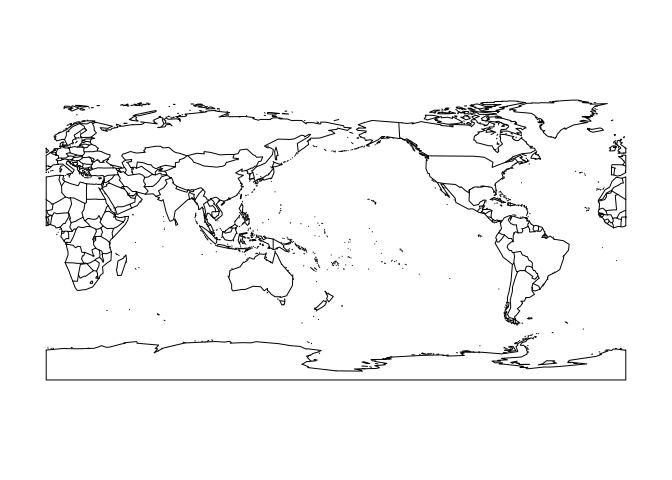

# (05) Mapping Disease

## Preamble


```r
# Preamble

## Install Pacman
load.pac <- function() {
  
  if(require("pacman")){
    library(pacman)
  }else{
    install.packages("pacman")
    library(pacman)
  }
  
    pacman::p_load(xts, sp, gstat, ggplot2, rmarkdown, reshape2, ggmap,
                 parallel, dplyr, plotly, tidyverse, reticulate, UsingR, Rmpfr,
                 swirl, corrplot, gridExtra, mise, latex2exp, tree, rpart, lattice,
                 coin, primes, epitools, maps, clipr, ggmap)
  
  
   mise()
}

load.pac()
```


 
 
 
 
 
 
 
 
 
 
 
 
 
 
 
 
 
 
 
 
 
 
 
 
 
 
 
 
 
 
 
 
 
 
 
 
 
 
 
 
 
 
 
 
 
 
 
 
 

```r
load(file = "~/Notes/DataSci/ThinkingAboutData/TAD.rdata")
load(file = "./TAD.rdata")
```


```r
knitr::opts_chunk$set(
  fig.path = "./figure/"
)
```


## Binomial Distribution
A random variable is Binomial if it represents the count of the number of
successes from $n$ trials and $p$ is the probability of success.

### Simulation and Probabilities
In order to simulate, for example, a coin toss:


```r
library(tidyverse)
sample(c("H", "T"), size = 3, replace = TRUE, prob = c(1,1))
```

```
## [1] "H" "H" "H"
```

```r
## Count the number of heads
sum(sample(c("H", "T"), size = 3, replace = TRUE, prob = c(1,1))=="H")
```

```
## [1] 3
```

```r
## This can be automated with `rbinom`
rbinom(n = 2,size = 3, prob = 0.5) 
```

```
## [1] 2 3
```

where:

* The output is the number of Successes
* `size` is the size of teh experiment, i.e. the number of repetitions (i.e. coin flips)
* `n` is how many numbers you want to get back, each corresponding to  a
  repeated simulation.


We can also use counting formulas like $\binom{m}{n}$ via `choose(m,n)`. See
[Counting Formulas](/home/ryan/Dropbox/Notes/MD/Mathematics/DiscreteMathematics/Counting_Formulas.md) generally.

#### Density
The density rather than the count of the binomial distribution can also be simulated.

So for example the probability of getting 0, 1, 2 or 3 heads out of 3 coin
tosses is:


```r
dbinom(x = 1:3, size = 3, prob = 0.5)
```

```
## [1] 0.375 0.375 0.125
```
### Mean and Variance
In theory the summary statistics of a binomial distribution are:

|                       | Mean | Variance  |
|-----------------------|------|-----------|
| Binomial Distribution | $np$ | $np(1-p)$ |

Where:

* $n$ is the number of repetitions
  + in **_R_** this is `size` because `n` is already being used for the output
    vector length.

This can be verified by doing:


```r
primes::generate_primes(min = 12, max = 99) # Two primes ensures p, n and (1-p)
```

```
##  [1] 13 17 19 23 29 31 37 41 43 47 53 59 61 67 71 73 79 83 89 97
```

```r
                                        # are relatively prime
n <- 29
p <- 0.43

(rbinom(n = 100000, size = n, prob = p) %>% mean() /p) %>% signif(2)
```

```
## [1] 29
```

```r
(rbinom(n = 10000, size = n, prob = p) %>% var()  / (n * (1-p)))  %>% signif(2)
```

```
## [1] 0.43
```
### Hypothesis test for a Difference in Proportional

Let's say that we make the following observation:

* *Trump County* has 12/100 with a disease
* *Clinton County* has 188/1000 with a disease

A Chi-Square Distribution can be used to compare the proportions.


```r
## Make a Table
dis_df <- data.frame("Trump" = c(12, 100-12), "Clinton" = c(188, 1000-188))
dis_mat <- as.matrix(dis_df)

dimnames(dis_mat) <- list(
    c("Disease", "No Disease"),
    c("Trump", "Clinton")
)
dis_mat
```

```
##            Trump Clinton
## Disease       12     188
## No Disease    88     812
```

```r
## Perform the Chi Test
chisq.test(dis_mat)
```

```
## 
## 	Pearson's Chi-squared test with Yates' continuity correction
## 
## data:  dis_mat
## X-squared = 2.3872, df = 1, p-value = 0.1223
```

```r
chisq.test(t(dis_mat))
```

```
## 
## 	Pearson's Chi-squared test with Yates' continuity correction
## 
## data:  t(dis_mat)
## X-squared = 2.3872, df = 1, p-value = 0.1223
```

This shows the probability of rejecting the null hypothesis when it is true
(i.e. asserting that there is a difference between counties when there is in
fact not) is still too high of a risk at 12%, hence there is not enough evidence
to reject the null hypothesis that there is no difference between counties.

#### Pesticide Question

If a type of pesticide:

* kills 13 out of 20 male budworms
* kills 10 out of 20 female budworks

1. The proportion of each gender killed?
2. Is there evidence the proportion killed by this pesticide at this dose is
   different for each gender?
   

```r
male <- c(13, 20-13)
female <- c(10, 20-10)

bug <- matrix(c(male, female), ncol = 2)
dimnames(bug) <- list(c("dead", "alive"), c("male", "female"))
bug
```

```
##       male female
## dead    13     10
## alive    7     10
```

```r
chisq.test(bug)
```

```
## 
## 	Pearson's Chi-squared test with Yates' continuity correction
## 
## data:  bug
## X-squared = 0.40921, df = 1, p-value = 0.5224
```


1. The Proportion of Male Budworms killed is:
  + $\frac{13}{20} = 0.65$ for Males
  + $\frac{10}{20} = 0.5$ for Females
2. In this case, the probability of concluding that there is a difference
   between genders when there is in fact no difference is sufficiently small
   (p=5.2) to reject the null hypothesis and assert that there is indeed a
   difference between genders.
    + The sample size is quite small so a larger sample is justified.
    
## Poisson Distribution
The [_Poisson_ distribution](https://en.wikipedia.org/wiki/Poisson_distribution) is appropriate where values are:

* integer values that may occur in interval of time
  + e.g. the number of call outs completed in one day
* Events are independent, i.e. the occurrence of one event does not effect the probability of another event
* The average rate of events occurring is independent from other occurences 
* Events cannot overlap
  + So the number of callouts in one day is fine
  + The number of phone calls isn't because if two calls are recieved at the
    same time they either overlap or the other phone call is rejected in lieu of
    the first one meaning that the phone calls are not independent.

### Horse Kicks

The number of deaths caused by a horse kick in a given regiment per year is
[(Bortkiewics, 1898)](http://www.mun.ca/biology/scarr/smcPoisson_distributions.html):

| Deaths per Year Per Regiment | Deaths | Poisson Expectation ($\frac{\lambda^k d^{-\lambda}}{k!}$) |
|                          --- |    --- |                                                       --- |
|                            0 |    109 |                                                     108.7 |
|                            1 |     65 |                                                      66.3 |
|                            2 |     22 |                                                      20.2 |
|                            3 |      3 |                                                       4.1 |
|                            4 |      1 |                                                       0.6 |
|                           5+ |      0 |                                                       0.1 |

This can be plotted in **_R_**:


```r
horsekick        <- c(109, 65, 22, 3, 1)
names(horsekick) <- 0:4
print(horsekick)
```

```
##   0   1   2   3   4 
## 109  65  22   3   1
```

```r
barplot(horsekick, col = "grey")
```

<!-- -->

```r
hk_tb <- tibble::enframe(horsekick, name = "Year", value = "Deaths")

bp <- ggplot(hk_tb, aes(x = Year, y = Deaths, fill = Deaths)) +
    geom_col() +
    scale_fill_gradient(high = "#D02090", low = "#1c86ee") +
    theme_bw() +
    labs(title = "Deaths by Horsekick", subtitle = "In any Regiment") +
    guides(fill = FALSE)

bp
```

<!-- -->

#### Mean Value

In order to determine the average number of deaths over the period of years
(this is weird because the data set is weird, don't pay mind to it).


```r
sum((0:4)*horsekick)/sum(horsekick)
```

```
## [1] 0.61
```

### Simulation and Poisson Probabilities
Poisson Values can be simulated, If a delivery driver has 3 jobs every day, a
month,  in no particular order might look like this:


```r
rpois(30, lambda = 3)
```

```
##  [1] 1 3 4 6 0 6 0 5 2 2 5 5 4 3 4 2 2 1 1 2 1 4 2 1 2 1 4 1 0 0
```
but maybe we would have to consider different days as different poisson distributions?

#### Return Probability density

If we wanted to know the probability of a delivery driver getting a various
number of jobs:


```r
dpois(0:6, lambda = 3) %>% round(1)
```

```
## [1] 0.0 0.1 0.2 0.2 0.2 0.1 0.1
```

This means that the Horsekick data can be predicted and visualised:


```r
lambda = sum(0:4*horsekick)/sum(horsekick)
obs <- horsekick/200
pred <- dpois(0:4, lambda)

horse_df  <- data.frame("Year" = 0:4, "Observation" = obs, "Poisson Prediction" = pred)
horse_mat <- as.matrix(horse_df)[,-1]
horse_mat <- t(horse_mat)

barplot(horse_mat, beside = TRUE,
        col = c("PaleVioletRed", "PaleGreen"),
        legend = TRUE,
        main = "Actual and Predicted Deaths",
        xlab = "Men Killed per Year per Regiment",
        ylab = "Frequency of Deaths")
```

<!-- -->

```r
horse_tib <- pivot_longer(horse_df, cols = c(Observation, Poisson.Prediction), names_to = "Source")
## Using GGplot2
ggplot(horse_tib, aes(x = Year, y = value, fill = Source)) +
    geom_col(position = 'dodge') +
    labs(x = "Deaths per Year Per Regiment",
         y = "Probability/Frequency of Deaths",
         title = "Model of Deaths by Horse-kick") +
    guides(fill = guide_legend("Measurement")) +
    scale_fill_manual(values = c("Sienna3", "Cornsilk3"),
                      labels = c("Observation", "Prediction\n\t(Poisson)")) +
    theme_bw() +
    theme(legend.position = c(0.7, 0.6),
          legend.text = element_text(size = 18),
          legend.title = element_text(size = 22))
```

<!-- -->


### WWII Example 

During the Second World war, England was divided into 576 0.25*0.25 km squares,
the number of V-bomb strikes per square was:

| Number of Strikes |   0 |   1 |   2 |   3 |   4 | 5 |
| ---               | --- | --- | --- | --- | --- | --- |
| Number of Squares | 229 | 211 |  93 |  35 |   7 | 1 |

Hence the Strikes per Square can be calculated:

| Number of Strikes  |   0 |     1 |    2 |    3 |   4 |   5 |  II |     15 |
| ---                | --- |   --- |  --- |  --- | --- | --- | --- |    --- |
| Number of Squares  | 229 |   211 |   93 |   35 |   7 |   1 |  II |    576 |
| Strikes per Square |   0 | 1/211 | 2/93 | 3/35 | 4/7 |   5 |  II | 15/576 |

And hence the average number of strikes is

#### Calculate the Average value

The average value of strikes per square is:


```r
strikes_df   <- data.frame("N.Strikes" = 0:5, "squares" = c(229, 211, 93, 35, 7, 1))
strikes_mat <- as.matrix(strikes_df)

# Average Strikes per square
lambda <- sum(0:5 * strikes_mat[,2])/576
```

Plot the Frequencies and Predictions


```r
obs  <- strikes_df$squares
pred <- dpois(0:5, lambda) * 576

plot_mat <- rbind("Observations" = obs, "Predictions" = pred)
colnames(plot_mat) <- 0:5

barplot(plot_mat, beside = TRUE,
        legend.text = TRUE,
        col = c("LightCoral", "LightGoldenrodYellow"),
        main = "Rocket Bomb Strikes in London")
```

<!-- -->

Using `ggplot2`:


```r
strikes_df$pred <- dpois(0:5, lambda)*576

(strikes_tb <- pivot_longer(strikes_df, cols = c(squares, pred)))
```

```
## # A tibble: 12 x 3
##    N.Strikes name     value
##        <int> <chr>    <dbl>
##  1         0 squares 229   
##  2         0 pred    228.  
##  3         1 squares 211   
##  4         1 pred    211.  
##  5         2 squares  93   
##  6         2 pred     98.1 
##  7         3 squares  35   
##  8         3 pred     30.4 
##  9         4 squares   7   
## 10         4 pred      7.06
## 11         5 squares   1   
## 12         5 pred      1.31
```

```r
ggplot(strikes_tb, aes(y = value, x = N.Strikes, fill = name)) +
    geom_col(position = "dodge") +
    labs(x     = "Number of Strikes",
         y     = TeX("No. of 0.25m$^2$ Regions Struck"),
         title = "South London V-bomb Strikes") +
    guides(fill = guide_legend("Measurement")) +
    scale_fill_brewer(palette = "Dark2",
                      labels = c("Prediction", "Observation")) +
    theme_bw()
```

<!-- -->


## Confidence Intervals
Confidence Intervals can be produced using bootstrapping or a simulating the distribution.
### Bootsrap Confidence Intervals
#### Binomial
##### Seeds
If it was observed that 15 seeds germinate in a sample of 20, bootstrap a
confidence interval for the proportion of seeds germinating.


```r
## Generate 1000 Examples of germinating seeds
obs <- c(0, 0, 0, 0, 0, 1, 1, 1, 1, 1, 1, 1, 1, 1, 1, 1, 1, 1, 1, 1)
x <- replicate(1000, {
    sum(sample(obs, replace = TRUE, size = 20)==1)
})

x <- rbinom(n = 10000, size = 20, prob = 15/20)
p <- x/20
quantile(p, c(0.025, 0.975))
```

```
##  2.5% 97.5% 
##  0.55  0.90
```
###### Plot the Histogram


```r
dens_hist <- function(vec, main = paste(""), col = "purple", fill = "lightblue") {
## Make the Histogram
    hist(vec, freq = FALSE, col = fill, main = main)
    c_int <- quantile(x = vec, c(0.05, 0.95))
## Plot the Curve
    x <- 1:2000
    curve(dnorm(x = x, mean = mean(vec), sd = sd(vec)), add = TRUE, col = col)
    abline(v = c_int[1], col = col, lwd = 2, lty = 2)
    abline(v = c_int[2], col = col, lwd = 2, lty = 2)
}
dens_hist(x)
```

<!-- -->

```r
print("test")
```

```
## [1] "test"
```
##### Bud Worms
<a id="budworms"></a>

A confidence interval for the number of budworms can be generated using `rbinom()`:


```r
## Create a Binomial Sample
x <- rbinom(n = 1000, size = 20, prob = 13/20)
p <- x/20
hist(p, main = "Male Bud Worms", xlab = "Extermination Proportion")
abline(v = quantile(p, 0.05), lwd = 2, lty = 3)
abline(v = quantile(p, 0.95), lwd = 2, lty = 3)
```

<!-- -->


```r
x <- rbinom(n = 1000, size = 20, prob = 10/20)
p <- x/20
hist(p, main = "Female Bud Worms", xlab = "Extermination Proportion")
abline(v = quantile(p, 0.025), lwd = 2, lty = 3)
abline(v = quantile(p, 0.875), lwd = 2, lty = 3)
```

<!-- -->

##### Poker Machine
A poker machine is meant to return a win 20% of the time (In NSW the requirement is that the machine gives back 90% of every dollar). Out  100 tries a win is recorded 16 times. Find a 95% confidence interval for the proportion of wins.

Because we should be using a Bar plot not a histogram the scale will be weird, instead set the `size` of the `rbinom` to 100 and have the y-axis represent the percentage of success probability. To do this properly it is necessary to use a barplot and/org `ggplot + geom_col`.


```r
x <- rbinom(n = 10^4, size = 100, prob = 16/100)
p <- x/100
hist(p, main = "Poker Machine Wins", xlab = "Proportion of Wins", freq = FALSE, ylab
     = "Probability (%)")
abline(v = quantile(p,0.025), lwd = 2, lty = 3)
abline(v = quantile(p,0.975), lwd = 2, lty = 3)
```

<!-- -->
#### Poisson

In order to return a confidence interval for the average number of kicks, expand the table into an observation counts, resample from it and then take  mean value:


```r
## Turn the horsekick table into an observation list
obs <- rep(0:4, horsekick) ## Replicate according to table of counts

n <- 10^4  # size of Bootstrap

x <- replicate(n, {
    resamp <- sample(obs, replace = TRUE)
    mean(resamp)
})

# barplot(table(x)*10/n, col = "lightblue", border = "white", xlab = "Sample Mean Value of Death by HorseKick", ylab = "Probability of Population Mean")

hist(x)
abline(v = quantile(x, 0.025), lwd = 2, lty = 3)
abline(v = quantile(x, 0.975), lwd = 2, lty = 3)
```

<!-- -->

#### Approximate Confidence Intervals

##### Binomial

Approximate confidence intervals can be generated by using the `epitools` package.


```r
library(epitools)

epitools::binom.approx(15, 20) #Approx ConfInt for Binomial for 15 out of 20
```

```
##    x  n proportion     lower     upper conf.level
## 1 15 20       0.75 0.5602273 0.9397727       0.95
```

```r
## BudWorms
binom.approx(13,20, conf.level = 0.975)
```

```
##    x  n proportion     lower     upper conf.level
## 1 13 20       0.65 0.4109462 0.8890538      0.975
```

```r
binom.approx(10,20)
```

```
##    x  n proportion     lower     upper conf.level
## 1 10 20        0.5 0.2808694 0.7191306       0.95
```

```r
binom.approx(20, 100)
```

```
##    x   n proportion     lower     upper conf.level
## 1 20 100        0.2 0.1216014 0.2783986       0.95
```
##### Poisson


```r
# HorseKick
n_kicks <- sum(0:4*horsekick) # Number of Men killed by a HorseKick
n_men   <- sum(horsekick)     # Number of men killed each year per regiment
epitools::pois.approx(x = sum((0:4)*horsekick), 200)
```

```
##     x  pt rate     lower     upper conf.level
## 1 122 200 0.61 0.5017575 0.7182425       0.95
```

```r
# Rocket Bombs
n_strikes <- sum(0:5*strikes_mat[,2])
n_squares <- sum(strikes_mat[,2])
pois.approx(n_strikes, n_squares)
```

```
##     x  pt      rate     lower    upper conf.level
## 1 535 576 0.9288194 0.8501144 1.007524       0.95
```

Plot the Frequencies and Predictions


```r
obs  <- strikes_df$squares
pred <- dpois(0:5, lambda) * 576

plot_mat <- rbind("Observations" = obs, "Predictions" = pred)
colnames(plot_mat) <- 0:5

barplot(plot_mat, beside = TRUE,
        legend.text = TRUE,
        col = c("LightCoral", "LightGoldenrodYellow"),
        main = "Rocket Bomb Strikes in London")
```

<!-- -->

Using `ggplot2`:


```r
strikes_df$pred <- dpois(0:5, lambda)*576

(strikes_tb <- pivot_longer(strikes_df, cols = c(squares, pred)))
```

```
## # A tibble: 12 x 3
##    N.Strikes name     value
##        <int> <chr>    <dbl>
##  1         0 squares 229   
##  2         0 pred    228.  
##  3         1 squares 211   
##  4         1 pred    211.  
##  5         2 squares  93   
##  6         2 pred     98.1 
##  7         3 squares  35   
##  8         3 pred     30.4 
##  9         4 squares   7   
## 10         4 pred      7.06
## 11         5 squares   1   
## 12         5 pred      1.31
```

```r
ggplot(strikes_tb, aes(y = value, x = N.Strikes, fill = name)) +
    geom_col(position = "dodge") +
    labs(x     = "Number of Strikes",
         y     = TeX("No. of 0.25m$^2$ Regions Struck"),
         title = "South London V-bomb Strikes") +
    guides(fill = guide_legend("Measurement")) +
    scale_fill_brewer(palette = "Dark2",
                      labels = c("Prediction", "Observation")) +
    theme_bw()
```

<!-- -->


## Confidence Intervals
Confidence Intervals can be produced using bootstrapping or a simulating the distribution.
### Bootsrap Confidence Intervals
#### Binomial
##### Seeds
If it was observed that 15 seeds germinate in a sample of 20, bootstrap a
confidence interval for the proportion of seeds germinating.


```r
## Generate 1000 Examples of germinating seeds
obs <- c(0, 0, 0, 0, 0, 1, 1, 1, 1, 1, 1, 1, 1, 1, 1, 1, 1, 1, 1, 1)
x <- replicate(1000, {
    sum(sample(obs, replace = TRUE, size = 20)==1)
})

x <- rbinom(n = 10000, size = 20, prob = 15/20)
p <- x/20
quantile(p, c(0.025, 0.975))
```

```
##  2.5% 97.5% 
##  0.55  0.90
```
###### Plot the Histogram


```r
dens_hist <- function(vec, main = paste(""), col = "purple", fill = "lightblue") {
## Make the Histogram
    hist(vec, freq = FALSE, col = fill, main = main)
    c_int <- quantile(x = vec, c(0.05, 0.95))
## Plot the Curve
    x <- 1:2000
    curve(dnorm(x = x, mean = mean(vec), sd = sd(vec)), add = TRUE, col = col)
    abline(v = c_int[1], col = col, lwd = 2, lty = 2)
    abline(v = c_int[2], col = col, lwd = 2, lty = 2)
}
dens_hist(x)
```

<!-- -->

```r
print("test")
```

```
## [1] "test"
```
##### Bud Worms
<a id="budworms"></a>

A confidence interval for the number of budworms can be generated using `rbinom()`:


```r
## Create a Binomial Sample
x <- rbinom(n = 1000, size = 20, prob = 13/20)
p <- x/20
hist(p, main = "Male Bud Worms", xlab = "Extermination Proportion")
abline(v = quantile(p, 0.05), lwd = 2, lty = 3)
abline(v = quantile(p, 0.95), lwd = 2, lty = 3)
```

<!-- -->


```r
x <- rbinom(n = 1000, size = 20, prob = 10/20)
p <- x/20
hist(p, main = "Female Bud Worms", xlab = "Extermination Proportion")
abline(v = quantile(p, 0.025), lwd = 2, lty = 3)
abline(v = quantile(p, 0.875), lwd = 2, lty = 3)
```

<!-- -->

##### Poker Machine
A poker machine is meant to return a win 20% of the time (In NSW the requirement is that the machine gives back 90% of every dollar). Out  100 tries a win is recorded 16 times. Find a 95% confidence interval for the proportion of wins.

Because we should be using a Bar plot not a histogram the scale will be weird, instead set the `size` of the `rbinom` to 100 and have the y-axis represent the percentage of success probability. To do this properly it is necessary to use a barplot and/org `ggplot + geom_col`.


```r
x <- rbinom(n = 10^4, size = 100, prob = 16/100)
p <- x/100
hist(p, main = "Poker Machine Wins", xlab = "Proportion of Wins", freq = FALSE, ylab
     = "Probability (%)")
abline(v = quantile(p,0.025), lwd = 2, lty = 3)
abline(v = quantile(p,0.975), lwd = 2, lty = 3)
```

<!-- -->
#### Poisson

In order to return a confidence interval for the average number of kicks, expand the table into an observation counts, resample from it and then take  mean value:


```r
## Turn the horsekick table into an observation list
obs <- rep(0:4, horsekick) ## Replicate according to table of counts

n <- 10^4  # size of Bootstrap

x <- replicate(n, {
    resamp <- sample(obs, replace = TRUE)
    mean(resamp)
})

# barplot(table(x)*10/n, col = "lightblue", border = "white", xlab = "Sample Mean Value of Death by HorseKick", ylab = "Probability of Population Mean")

hist(x)
abline(v = quantile(x, 0.025), lwd = 2, lty = 3)
abline(v = quantile(x, 0.975), lwd = 2, lty = 3)
```

<!-- -->

#### Approximate Confidence Intervals

##### Binomial

Approximate confidence intervals can be generated by using the `epitools` package.


```r
library(epitools)

epitools::binom.approx(15, 20) #Approx ConfInt for Binomial for 15 out of 20
```

```
##    x  n proportion     lower     upper conf.level
## 1 15 20       0.75 0.5602273 0.9397727       0.95
```

```r
## BudWorms
binom.approx(13,20, conf.level = 0.975)
```

```
##    x  n proportion     lower     upper conf.level
## 1 13 20       0.65 0.4109462 0.8890538      0.975
```

```r
binom.approx(10,20)
```

```
##    x  n proportion     lower     upper conf.level
## 1 10 20        0.5 0.2808694 0.7191306       0.95
```

```r
binom.approx(20, 100)
```

```
##    x   n proportion     lower     upper conf.level
## 1 20 100        0.2 0.1216014 0.2783986       0.95
```
##### Poisson


```r
# HorseKick
epitools::pois.approx(x = (0:4)*horsekick, 200)
```

```
##    x  pt  rate        lower      upper conf.level
## 0  0 200 0.000 0.0000000000 0.00000000       0.95
## 1 65 200 0.325 0.2459913259 0.40400867       0.95
## 2 44 200 0.220 0.1549953486 0.28500465       0.95
## 3  9 200 0.045 0.0156005402 0.07439946       0.95
## 4  4 200 0.020 0.0004003602 0.03959964       0.95
```

## Choropleth maps

Plots can be drawn of various regions using the `maps` package, for example a world map focused on the pacific ocean:


```r
# help(package = maps)
map("world2")
```

<!-- -->

There is also the built in data set `state.x77` than we can use:


```r
head(state.x77)
```

```
##            Population Income Illiteracy Life Exp Murder HS Grad Frost   Area
## Alabama          3615   3624        2.1    69.05   15.1    41.3    20  50708
## Alaska            365   6315        1.5    69.31   11.3    66.7   152 566432
## Arizona          2212   4530        1.8    70.55    7.8    58.1    15 113417
## Arkansas         2110   3378        1.9    70.66   10.1    39.9    65  51945
## California      21198   5114        1.1    71.71   10.3    62.6    20 156361
## Colorado         2541   4884        0.7    72.06    6.8    63.9   166 103766
```

To generate a choropleth map, match names to map names:


```r
state_names <- map("state", plot = FALSE)$name
only_names  <- sapply(strsplit(state_names, ":"), "[", 1)
index    <- match(only_names, tolower(state.name))
index[8] <- 47
```

Then assign some colours:


```r
col_vec <- function(x, lowcol = "white", highcol = "red") {
  rgb(colorRamp(c(lowcol, highcol))((x-min(x))/(max(x)-min(x))),
      maxColorValue = 255)[index]
}
```

Then draw the map:


```r
map('state', fill = TRUE, col = col_vec(state.x77[,"HS Grad"], "black", "green"))
```

<!-- -->

#### Frost


```r
map('state', fill = TRUE, col = col_vec(state.x77[,"Frost"], "white", "blue"))
```

<!-- -->

#### Literacy


```r
map("state", fill = TRUE, col = col_vec(state.x77[,"Murder"], "white", "black"))
```

<!-- -->
#### Murder


```r
write_clip(colnames(state.x77)[3])

map("state", fill = TRUE, col = col_vec(state.x77[,"Illiteracy"], "purple", "orange"))
```

<!-- -->


### Using ggmap


```r
library("ggmap")

us <- c(left = -125, bottom = 25.75, right = -67, top = 49)
USAMap <- get_stamenmap(us, zoom = 5, maptype = "toner-lite") %>% ggmap() 
```

```r
# USAMap + 
#    geom_point(aes(x=lon, y=lat), data=mv_num_collisions, col="orange", alpha=0.4, size=mv_num_collisions$collisions*circle_scale_amt) +  
#    scale_size_continuous(range=range(mv_num_collisions$collisions))
# 
```


### Explaining Sapply

when using sapply, the notation `sapply(list, '[', 1)` is using the `[` function and 1 as a second argument.

When performing subsetting using `mtcars[3,1]` you are actually performing a different function call, what is being performed is `[`(mtcars, 2, 3), have a look:


```r
mtcars[2,3]
```

```
## [1] 160
```

```r
`[`(mtcars, 2, 3)
```

```
## [1] 160
```

So basically **_R_** is similar to *LISP* and *Mathematica* in the sense that everything is a function. Accessing the help with `?"["` explains more.

The `sapply` call before basically iterates over the list of names (which is a long list composed of words seperated by :, sort of like `cut -d1 :` in `bash`) and uses the `[` function with the input item from the list as the first argument and 1 as the second argument, so the previous call to `sapply` was equivalent to:

```
First_El <- function(x) {
    x[1]
}

sapply(list, First)
```

## GGPlot2 Appendix

### BudWorm Confidence Intervals
Simulation of [#BudWorms](#budworms)
<a refer to href="budworms"></a>


```r
male   <- rbinom(10000, 20, 13/20) 
female <- rbinom(10000, 20, 10/20)


worms <- tibble("Male" = male, "Female" = female)
worms <- pivot_longer(worms, cols = c("Male", "Female"))

## We should use Columns not a histogram for binomial because it doesn't tend to
## space correctly otherwise
c <- as.data.frame(t(table(worms)))
c$name  <- factor(c$name, unique(c$name), ordered = FALSE)
c$value <- factor(c$value, unique(c$value), ordered = TRUE)
c$Freq  <- 20*c$Freq/10000


ggplot(data = c, aes(x = value, y = Freq, fill = name)) +
    geom_col(position = "dodge", col = "black") +
    facet_grid(name ~ .) +
    labs(x = "Number of Exterminated") +
    theme_bw() 
```

<!-- -->

