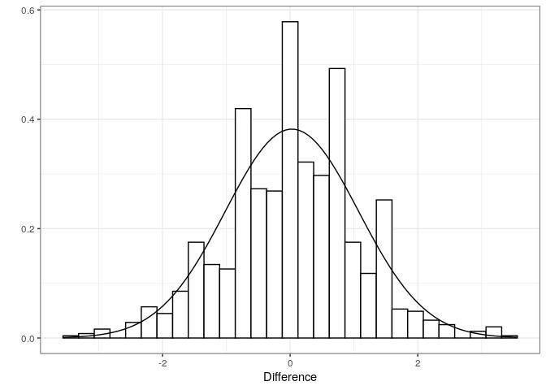

# (06) Sampling Data

## Preamble


```r
# Preamble

## Install Pacman
load.pac <- function() {
  
  if(require("pacman")){
    library(pacman)
  }else{
    install.packages("pacman")
    library(pacman)
  }
  
    pacman::p_load(xts, sp, gstat, ggplot2, rmarkdown, reshape2, ggmap,
                 parallel, dplyr, plotly, tidyverse, reticulate, UsingR, Rmpfr,
                 swirl, corrplot, gridExtra, mise, latex2exp, tree, rpart, lattice,
                 coin, primes, epitools, maps, clipr, ggmap)
  
  
   mise()
   select <- dplyr::select
}

load.pac()
```

```
## Loading required package: pacman
```



```r
load(file = "~/Notes/DataSci/ThinkingAboutData/TAD.rdata")
load(file = "./TAD.rdata")
print("Success")
```

```
## [1] "Success"
```


```r
knitr::opts_chunk$set(fig.path = "./figure/")
```

## Biased

## Biased Sampling
Use the crabs data and operate under the assumption that the file contains the
entire population of crabs.

### Random Sampling
Take a simple random sample of 100 crabs pre-molting size:


```r
N <- 100
s <- sample(crabsmolt$presz, size = N, replace = FALSE)
```

#### Consider the Bias


```r
(bias_mean <- mean(crabsmolt$presz)- mean(s))
```

```
## [1] 1.736864
```

```r
(bias_sd <- sd(crabsmolt$presz)- sd(s))
```

```
## [1] -4.29166
```

### Biased Sampling

Say for example that the experiment was such that only crabs $\geq$ 130 mm
could be measured, such a sample can be simulated:


```r
N <- 100

# Consider the crabs that could have been measured
## Base
a <- crabsmolt$presz[crabsmolt$presz>130]
## Dplyr
a <- crabsmolt %>% dplyr::filter(presz > 130)
a <- a$presz

# Resample the data
s <- sample(a, size = N, replace = FALSE)

# Calculate the bias of the sample mean (i.e. the difference)
(mean_bias <- mean(crabsmolt$presz) - mean(s))
```

```
## [1] -10.05014
```

```r
(sd_bias <- sd(crabsmolt$presz) - sd(s))
```

```
## [1] 10.717
```


## Measuring Type I and Type II Errors
### Type I Error

The probability of rejecting the null hypothesis when it is true is the p-value, in this case we will set it to 5%.

So if we drew two samples from the population:


```r
N <- 50

ss <- list()
for (i in 1:2) {
  s <- sample(crabsmolt$presz, size = N, replace = TRUE)
  ss[[i]] <- s
}
```

And then peformed a hypothesis test for the difference in mean values between the samples:


```r
t.test(ss[[1]], ss[[2]])$p.value 
```

```
## [1] 0.2514563
```

The p-value is quite high, so the probability of getting a false positive is too high for the null hypothesis to be rejected, however, there will be false positives and this is precisely what the p-value measures, for example, observe that if we repeated this 9999 times, the rate of false positives is equal to the p-value (because the p-value is the probability of a false positive):


```r
vals <- replicate(10^4,
                  {
s1 <- sample(crabsmolt$presz, size = N, replace = TRUE)
s2 <- sample(crabsmolt$presz, size = N, replace = TRUE)
t  <- t.test(s1, s2,  )

t$p.value < 0.05
                  })
mean(vals)
```

```
## [1] 0.0476
```

Or for some other value, say a p-value of 13%:


```r
vals <- replicate(10^4,
                  {
s1 <- sample(crabsmolt$presz, size = N, replace = TRUE)
s2 <- sample(crabsmolt$presz, size = N, replace = TRUE)
t  <- t.test(s1, s2,  )

t$p.value < 0.13
                  })
mean(vals)
```

```
## [1] 0.1369
```

Observe that this was a sample were repitition was allowed, If repetition is not allowed the p-value is an over estimation of the probability of a false positive, I'm not totally certain why though.

### Type II Error
The two populations of crabs `presz` and `postsz` have different mean values, if they are compared but the null hypothesis (that they're identical) is not rejected then this will by a Type II error (A TrueNeg).

Sampling the data and performing a t-test:


```r
# Take Samples from the Population
N <- 50
s1 = sample(crabsmolt$presz, size = N, replace = TRUE)
s2 = sample(crabsmolt$postsz, size = N, replace = TRUE)

# Use a t.test to evaluate the hypothesis
t.test(s1, s2)$p.value < 0.05
```

```
## [1] TRUE
```

If this was repeated many times, the *True Negative Rate* may be determined and will approach the probability of a True Negative ($\beta$):


```r
vals <- replicate(10 ^ 4,
                  {
                    # Take Samples from the Population
                    beta <- 7/100
                    N <- 50
                    s1 = sample(crabsmolt$presz, size = N, replace = TRUE)
                    s2 = sample(crabsmolt$postsz, size = N, replace = TRUE)
                    
                    # Use a t.test to evaluate the hypothesis
                    t.test(s1, s2)$p.value < 0.05
                  })
1-mean(vals)
```

```
## [1] 0.0055
```

The power is the probability of rejecting the null hypothesis when it is false, in this case the simulation was performed under the assumption that the null hypothesis was false and hence an estimate for the power is the proportion of correctly rejected comparisons made which is:


```r
vals %>% mean %>% signif(2)
```

```
## [1] 0.99
```

And so the power of this experiment is 99%.


## Paired Data


```r
hm <- nzhelmet
head(hm)
```

```
##   Cardboard Metal
## 1       146   145
## 2       151   153
## 3       163   161
## 4       152   151
## 5       151   145
## 6       151   150
```

```r
apply(hm, 2, mean)
```

```
## Cardboard     Metal 
##  154.5556  152.9444
```

### Measuring P-Value from first Principles
Because Each observation is measured twice (One observation, two features), it isn't possible to randomly permutate the observations in order to measure the probability of a **_False Positiave_**. Instead, to address this, randomly select observations to swap between features, this new data set will then represent a random sample under the hypothesis that there is no difference between the two features.

Hence a simulation of what the distribution of differences would look like under the assumption that there is no difference (i.e. assuming null hypothesis is true) would look like this:


```r
d <- hm$Cardboard - hm$Metal
n <- nrow(hm)
t0 <- mean(d)/(sd(d)/n^0.5)

vals <- replicate(10^3, 
                  {
                     s <- sample(c(-1,1), replace = TRUE, size = n)
                    (t <- mean(s*d)/(sd(s*d)/n^0.5))
                  })
  
df <- data.frame(PF = vals)
ggplot(df, aes(x = PF)) + 
    geom_histogram(aes(y =..density..),
                   colour = "black", 
                   fill = "white") +
stat_function(fun = dnorm, args = list(mean = mean(df$PF), sd = sd(df$PF))) +
  theme_bw() +
  labs(x = "Difference", y = "")
```

```
## `stat_bin()` using `bins = 30`. Pick better value with `binwidth`.
```



And so the false positive rate for the rates for the three different null hypothesis may be determined:


```r
## H0: Cardboard = Metal
## Ha: Cardboard > Metal
(vals > t0) %>% mean()
```

```
## [1] 0.001
```

```r
## H0: Cardboard = Metal
## Ha: Cardboard < Metal
(vals < t0) %>% mean()
```

```
## [1] 0.994
```

```r
## H0: Cardboard = Metal
## Ha: Cardboard =/= Metal
(abs(vals) > abs(t0)) %>% mean()
```

```
## [1] 0.002
```

```r
# mean(vals < -t0) + mean(vals > t0) Equiv
```

When the alternative hypothesis is that the Cardboard is greater, the probability of a false positive when they are actually equal is only 0.002, this is sufficiently small to justify rejecting the null hypothesis and accepting the alternative hypothesis that the Cardboard is greater.

The p-value is too high with respect to the alternative hypothesis that the cardboard is less than or not equal to the Metal.

### Using the T-Test Statistic

Rather than simulating the p-values we could just measure them using the t-distribution which is very similar to a normal distribution.


```r
## H0: Cardboard = Metal
## Ha: Cardboard > Metal
t.test(nzhelmet$Cardboard, nzhelmet$Metal, paired = TRUE, alternative = "greater")
```

```
## 
## 	Paired t-test
## 
## data:  nzhelmet$Cardboard and nzhelmet$Metal
## t = 3.1854, df = 17, p-value = 0.002707
## alternative hypothesis: true difference in means is greater than 0
## 95 percent confidence interval:
##  0.7312591       Inf
## sample estimates:
## mean of the differences 
##                1.611111
```

```r
## H0: Cardboard = Metal
## Ha: Cardboard < Metal
t.test(nzhelmet$Cardboard, nzhelmet$Metal, paired = TRUE, alternative = "less")
```

```
## 
## 	Paired t-test
## 
## data:  nzhelmet$Cardboard and nzhelmet$Metal
## t = 3.1854, df = 17, p-value = 0.9973
## alternative hypothesis: true difference in means is less than 0
## 95 percent confidence interval:
##      -Inf 2.490963
## sample estimates:
## mean of the differences 
##                1.611111
```

```r
## H0: Cardboard = Metal
## Ha: Cardboard =/= Metal
t.test(nzhelmet$Cardboard, nzhelmet$Metal, paired = TRUE, alternative = "two.sided")
```

```
## 
## 	Paired t-test
## 
## data:  nzhelmet$Cardboard and nzhelmet$Metal
## t = 3.1854, df = 17, p-value = 0.005415
## alternative hypothesis: true difference in means is not equal to 0
## 95 percent confidence interval:
##  0.5440163 2.6782060
## sample estimates:
## mean of the differences 
##                1.611111
```

These results are consistent with the simulations previously.

## Challenge

### Crabs
In order to test for a difference between the crab sizes before and after molting, it is necessary to use a paired t-test because otherwise a difference may not be detected as significant. 

In this case we would not expect the variance of the data to be equal between the populations, because the damage to the shell in particular crabs may have made the shell significantly distorted whereas after molting the size of the crabs will have less room for variation.


```r
## H0: pre = Post
## HA: ppre =/= post
t.test(crabsmolt$presz, crabsmolt$postsz, alternative = "two.sided", paired = TRUE, var.equal = FALSE)
```

```
## 
## 	Paired t-test
## 
## data:  crabsmolt$presz and crabsmolt$postsz
## t = -130.57, df = 471, p-value < 2.2e-16
## alternative hypothesis: true difference in means is not equal to 0
## 95 percent confidence interval:
##  -14.90683 -14.46478
## sample estimates:
## mean of the differences 
##               -14.68581
```

```r
## H0: pre = Post
## HA: ppre > post
t.test(crabsmolt$presz, crabsmolt$postsz, alternative = "greater", paired = TRUE, var.equal = FALSE)
```

```
## 
## 	Paired t-test
## 
## data:  crabsmolt$presz and crabsmolt$postsz
## t = -130.57, df = 471, p-value = 1
## alternative hypothesis: true difference in means is greater than 0
## 95 percent confidence interval:
##  -14.87118       Inf
## sample estimates:
## mean of the differences 
##               -14.68581
```

```r
## H0: pre = Post
## HA: ppre < post
t.test(crabsmolt$presz, crabsmolt$postsz, alternative = "less", paired = TRUE, var.equal = FALSE)
```

```
## 
## 	Paired t-test
## 
## data:  crabsmolt$presz and crabsmolt$postsz
## t = -130.57, df = 471, p-value < 2.2e-16
## alternative hypothesis: true difference in means is less than 0
## 95 percent confidence interval:
##       -Inf -14.50043
## sample estimates:
## mean of the differences 
##               -14.68581
```

The appropriate hypothesis to choose is that the crabs are smaller after molting because that's what would be expected, choosing that alternative hypothesis the p-value is very small and so the null hypothesis is rejected and the alternative hypothesis accepted in that the crabs are smaller after molting.

### Student Numbers


```r
ps <- PulseBA
head(PulseBA)
```

```
##   Before After
## 1     82   150
## 2     96   176
## 3     78   141
## 4     88   150
## 5     76    88
## 6     80   146
```

```r
apply(PulseBA, 2, mean)
```

```
##    Before     After 
##  75.45652 126.84783
```

In order to compare these two measurements it is necessary to use a paired t-test to evaluate the differences because otherwise the differences may not be significant enough to detect.

+ $\textsf{H}_0:\quad$ The Pulse does not change in the students before or after the exercise
+ $\textsf{H}_a:\quad$ The Pulse increases following the exercise.

We will assume the variances is different in the pulse before and after exercise because variables such as resting heart rate, age and blood pressure may cause more drastic changes subsequent to exerction.

In order to evaluate this, use the `t.test` function:


```r
t.test(ps$Before, ps$After, alternative = "less", paired = TRUE, var.equal = FALSE)
```

```
## 
## 	Paired t-test
## 
## data:  ps$Before and ps$After
## t = -16.527, df = 45, p-value < 2.2e-16
## alternative hypothesis: true difference in means is less than 0
## 95 percent confidence interval:
##       -Inf -46.16911
## sample estimates:
## mean of the differences 
##                -51.3913
```

The p-value is extremely small, which means that rejecting the null hypothesis that the students have equal pulses is very unlikely to lead to a false positive and so is rejected. In the absence of the null hypothesis the alternative hypothesis is accepted and it is hence concluded that the pulse of students raises after exercise.


