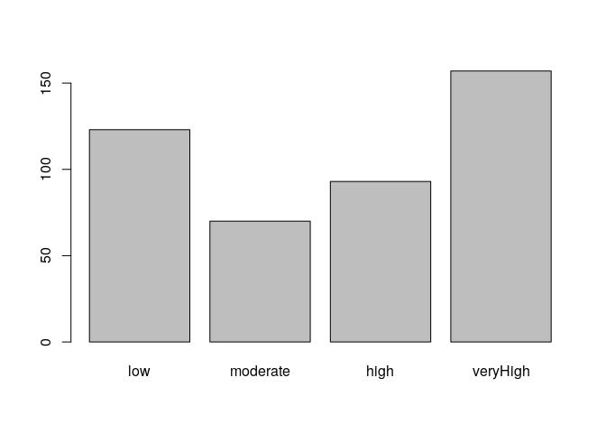
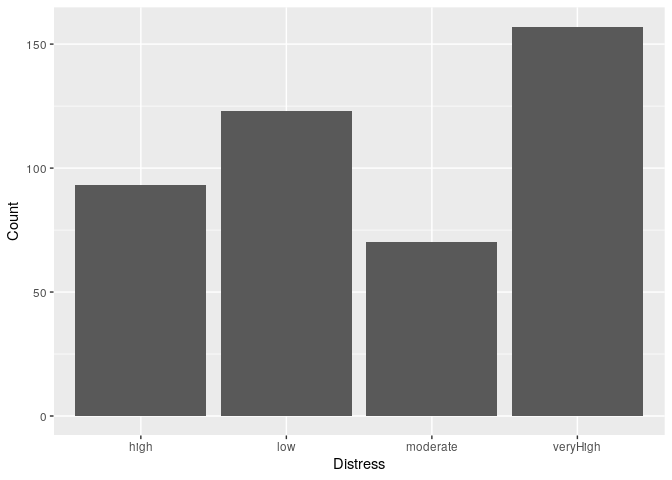

# (07) Correlation
## Preamble


```r
# Preamble

## Install Pacman
load.pac <- function() {
  
  if(require("pacman")){
    library(pacman)
  }else{
    install.packages("pacman")
    library(pacman)
  }
  
    pacman::p_load(xts, sp, gstat, ggplot2, rmarkdown, reshape2, ggmap,
                 parallel, dplyr, plotly, tidyverse, reticulate, UsingR, Rmpfr,
                 swirl, corrplot, gridExtra, mise, latex2exp, tree, rpart, lattice,
                 coin, primes, epitools, maps, clipr, ggmap, RColorBrewer)
  
  
   mise()
   select <- dplyr::select
}

load.pac()
```

```
## Loading required package: pacman
```



```r
setwd(dir = "/home/ryan/Notes/DataSci/ThinkingAboutData/")
load(file = "~/Notes/DataSci/ThinkingAboutData/TAD.rdata")
load(file = "./TAD.rdata")
print("Success")
```

```
## [1] "Success"
```


```r
knitr::opts_chunk$set(fig.path = "./figure/")
```

## Scatterplots

### Crabs

```r
crabsmolt %>%
    as_tibble
```

```
## # A tibble: 472 x 2
##    presz postsz
##    <dbl>  <dbl>
##  1  114.   128.
##  2  118.   133.
##  3  120.   135.
##  4  126.   143.
##  5  127.   139.
##  6  127.   140.
##  7  128.   144.
##  8  130.   145.
##  9  130.   148.
## 10  132.   145.
## #  with 462 more rows
```

```r
plot(postsz ~ presz, data = crabsmolt,
     pch = "*", cex = 3, col = 1:15, main = "Crab Plot",
     xlab = "Before Size", ylab = "After Size")
```

<!-- -->

This can also be plotted in `ggplot2`:


```r
#names(crabsmolt) %>% clipr::write_clip()

ggplot(crabsmolt, aes(x = presz, y = postsz)) +
    geom_point(aes(col = postsz)) +
    labs(x = "Size Previously", y = "Subsequent Size",
         title = "Distribution of Sizes") +
    stat_smooth(method = "lm", se = FALSE, col = "#Db7093" ) +
    scale_color_continuous(low = "white", high = "blue") +
    theme_bw() 
```

<!-- -->

### Pulse Data


```r
plot(After ~ Before, data = PulseBA,
     main = "Student Pulse Measurmenets",
     xlab = "Before Exercise",
     ylab = "After Exercise",
     pch  = 9, cex = 2,
     col = (PulseBA$Before > mean(PulseBA$Before)) + 1)
```

<!-- -->

```r
names(PulseBA)
```

```
## [1] "Before" "After"
```

```r
ggplot(PulseBA, aes(x = Before, y = After)) +
    geom_point() +
    labs(x = "Before Exercise",
         y = "After Exercise",
         title = "Student Pulse Measruements") +
    stat_smooth(method = "lm", col = "#Ff8c00") +
    theme_bw()
```

<!-- -->


### Earning Data


```r
heights %>%
    names()
```

```
## [1] "earn"   "height" "gender" "age"    "eth"
```

```r
## Alternatively Choose Colour Pallete
RColorBrewer::display.brewer.all()
```

<!-- -->

```r
display.brewer.pal(n = 10, "RdBu")
```

<!-- -->

```r
cols <- RColorBrewer::brewer.pal(n = 10, "RdBu")

## Create a Diverging Pallette
pal <- colorRampPalette(c("blue", "red"))
cols <- pal(heights$age)

plot(earn ~ height, data = heights,
#     col = c("PeachPuff", "Violet")[heights$gender],
     col = cols[heights$age],
     xlab = "Height", ylab = "Income", main = "Income and Height",
     cex = 3,
     pch = c(17, 18)[heights$gender])
```

<!-- -->

```r
# Create a legend
# legend(x = )
```

This is far easier to achieve in ggplot2:


```r
names(heights)
```

```
## [1] "earn"   "height" "gender" "age"    "eth"
```

```r
heights$eth <- factor(heights$eth)

ggplot(heights, aes(x = height, y = earn)) +
    geom_point(size = 3, aes(shape = gender, col = age)) +
    labs(x = "Height", y = "Income",
         title = "Income given Height, age, gender and Ethnicity",
         col = "Age", shape = "Gender") +
    stat_smooth(se = FALSE, method = "lm", aes(group = gender, linetype = gender), col ="DarkMagenta" ) +
    scale_linetype_discrete(name = "Fit for Gender", labels = c("Female", "Male")) +
    facet_wrap(. ~ eth) +
    theme_bw()
```

<!-- -->

## Correlation
### Crabs
The correlation coefficient is a measure of the strength of a relationship
between two variables, 1 being a positive and -1 being a negative relationship:
+ The *Pearson Correlation Coefficient* is a measure of the strength of a linear
  relationship between variables
  + squaring this value returns the proportion of variance attributable to the
    linear model
  + A significant linear trend doesn't mean that the rate of change is necessary
    meaningful, e.g. a model may show a mediction certainly increase your life
    by 1 ns, even though it's guaranteed doesn't mean that it matters.
+ The *Spearman Correlation Coefficient* is a measure of the strength of a
  monotone relationship between two variables.


```r
cor(crabsmolt$postsz, crabsmolt$presz, method = "pearson")
```

```
## [1] 0.9903699
```

```r
cor(crabsmolt$postsz, crabsmolt$presz, method = "spearman")
```

```
## [1] 0.9862688
```

This shows that there is a strong linear relationship between the size of a crab
before and after molting.

### Earnings


```r
cor(heights$earn, heights$height, method = "pearson")
```

```
## [1] 0.3023864
```

```r
cor(heights$earn, heights$height, method = "spearman")
```

```
## [1] 0.3373793
```
This shows that there is a weak positive relationship between earnings and height


### Pulse Rate


```r
cor(PulseBA$Before, PulseBA$After, method = "pearson")
```

```
## [1] 0.5484946
```

```r
cor(PulseBA$Before, PulseBA$After, method = "spearman")
```

```
## [1] 0.652997
```

This shows that there is a weak linear relationship between pulse rates before
and after exercise, however the strength of a monotone positive relationship
between the variables is much stronger, this could present evidence that there
is a positive non-linear relationship between the variables.


## Testing the Correlation Coefficient
### Crabs

In order to determine the p-value of a non-zero correlation coefficient, it is
necessary to measure the False Positive rate from a simulation.

The simulation must be made under the circumstance that the null hypothesis is
true, and then the number of False Positives measured:

* $H_0: \enspace \rho = 0$
* $H_a: \enspace \rho \neq 0$

The simulation would be:


```r
# What did we observe the correlation coefficient to be
r_obs <- cor(crabsmolt$postsz, crabsmolt$presz)

sim <- replicate(10^4, {
## What would we see by chance
    post_perm  <- sample(crabsmolt$postsz)
    r_sim      <- cor(post_perm, crabsmolt$presz)
    r_sim
## Is what we saw by chance bigger than our observation?
    ## i.e. Is Chance bigger than what we saw?
    abs(r_sim) > abs(r_obs)
})

mean(sim)
```

```
## [1] 0
```

In this case, the rate of false positives, assuming the correlation coefficient
is zero, is extremely small 

Measuring the number of times that $\rho$ is more extreme than our observation
by chance reveals that this probability of a false positive is very sm


Assuming that $\rho$ is zero, the number of times that a more extreme value
would arise by chance, i.e. the probability of a false positive, is very small,
returning 0 in 10, 000, hence the null hypothesis is rejected and it is
concluded that the correlation between crabs before and after molting is
significantly different from zero.

### Earnings and Height (Spearman)

In order to measure the p-value it is necessary to simulate the number of times
a false positive, given the observation, would arise under the assumption that
the correlation is 0.


```r
r_obs <- cor(heights$earn, heights$height, method = "spearman")

sim <- replicate(10^4, {
    ## What would the Correlation coefficient be in a sample
    earn_perm <- sample(heights$earn)
    r_sim     <- cor(earn_perm, heights$height)

    ## Would this be larger than what we saw?
    abs(r_sim) > abs(r_obs)
        ## This is the number of times that 0 is sampled as large as obs
})

mean(sim)
```

```
## [1] 0
```

The probability of observing a correlation coefficient as extreme as this, given
that the true correlation is 0, is very small (measuring 0 in 10^4), hence the
null hypothesis is rejected and it conceded that there is a significant difference.

### Pulse Rates

In order to measure the p-value of the pulse rates it is sufficient to measure the false positive rate of a large simulation. To acheive this measure the number of times a $\rho$ value returns a value at least as extreme as the observation when in fact there is no correlation given the data:


```r
r_obs <- cor(PulseBA$Before, PulseBA$After, method = "pearson")

sim <- replicate(10^4, {
  After_perm <- sample(PulseBA$After)
  r_sim <- cor(After_perm, PulseBA$Before, method = "pearson")
  abs(r_sim) > abs(r_obs)
})

mean(sim)
```

```
## [1] 0
```

```r
r_obs <- cor(PulseBA$Before, PulseBA$After, method = "spearman")

sim <- replicate(10^4, {
  After_perm <- sample(PulseBA$After)
  r_sim <- cor(After_perm, PulseBA$Before, method = "spearman")
  abs(r_sim) > abs(r_obs)
})

mean(sim)
```

```
## [1] 0
```

The number of false positives for a rho value significantly different from zero when it is in fact not is very small and hence the null hypothesis is rejected, hence concede that there is a correllation between the variables.

### What does the p-value measure

The p-value is:

* The probability of a false positve
* The probability of rejecting the null hypothesis when it is true
  + Different from the false discovery rate, beware of the *Base Rate Fallacy*


## Confidence Intervals
#### Theory
In order to create a confidence interval it is necessary to consider all the
possible $\rho$ values resulting from all the possible samples from the
population of all possible observations.

In order to simulate a confidence interval it is sufficient to simulate a
population by resampling / bootstrapping the original sample and then create a
sufficiently large distribution of $\rho$ values, thanks to statistical
properties this will create a distribution with an expected distribution
equivalent to the population.

An easier way to peform the bootstrapping and correlation at once is to create a
sample from the choices in the original sample, where repetition is allowed and
measure the correlation coefficient of this new sample; repeating this many
times will peform the bootstrapping and measure the correlation in one step.

1. Bootstrap the Sample to create a population
2. Repeat the following many times
    1. Sample the Population
    2. Measure and record the Correlation
3. The quantiles of this new distribution will represent the confidence Intervals

#### Crabs


```r
n <- nrow(crabsmolt)

sim <- replicate(10^4, {
    index <- sample(1:n, size = n, replace = TRUE)
    df    <- crabsmolt[index,]
    cor(df[,1], df[,2])
})
quantile(sim, c(0.025, 0.0975))
```

```
##      2.5%     9.75% 
## 0.9879902 0.9889397
```

Hence a 95% confidence interval for the population value of the correlation
coefficient is [0.988, 0.989].

This means that for any sample drawn from the population, the true population
value would be found within this interval for 0.95 of those samples

#### Earnings (Spearman, 95%)


```r
n <- nrow(heights)

sim <- replicate(10^4,{
    index <- sample(1:n, size = n, replace = TRUE)
    cor(heights$height[index], heights$earn[index])
})
quantile(sim, c(0.05/2, 1-0.05/2))
```

```
##      2.5%     97.5% 
## 0.2526660 0.3497051
```


#### Pulse Rate(Pearson and Spearman, 90%)
In order to measure a confidence interval for the population correlation coefficient given this sample, create a resample with repetition  to create a bootstrap population and then measure the correlation coefficient of various samples of this bootstrapped population, it is equivalent to simply resample with repetition the population to a sample of the same size and then measure the confidence interval repeatedly.


```r
n <- nrow(PulseBA)

sim <- replicate(10^4, {
 index <- sample(1:n, size = n, replace = TRUE) 
 cor(PulseBA$Before[index], PulseBA$After[index], method = "pearson")
})
quantile(sim, c(0.1/2, 1-0.1/2))
```

```
##        5%       95% 
## 0.4248837 0.7094448
```

```r
sim <- replicate(10^4, {
 index <- sample(1:n, size = n, replace = TRUE) 
 cor(PulseBA$Before[index], PulseBA$After[index], method = "spearman")
})
quantile(sim, c(0.1/2, 1-0.1/2))
```

```
##        5%       95% 
## 0.4806912 0.7770431
```


#### What does the confidence Interval Measure?

If a sample is taken from a population an interval on that sample may be drawn such that that interval will contain the population mean in a specified proportion of the samples; for example, a 90% confidence interval will contain the true population mean for 90% of the samples drawn from a population.
## Correlation is not causation
### What does the confidence Interval Measure?
+ [Look at all the correlation](https://www.tylervigen.com/spurious-correlations)
+ [Relevant XKCD Comic](https://xkcd.com/552/)
  + You don't know if the class caused the change in opinion or merely co-incided
    with the change in opinion, usually the error is made in the other way where
    causation is inferred, in this example there clearly was causation but it was
    not inferred and the assumption was made that it could possibly have been merely correlation
