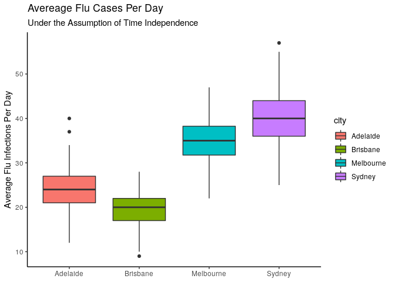
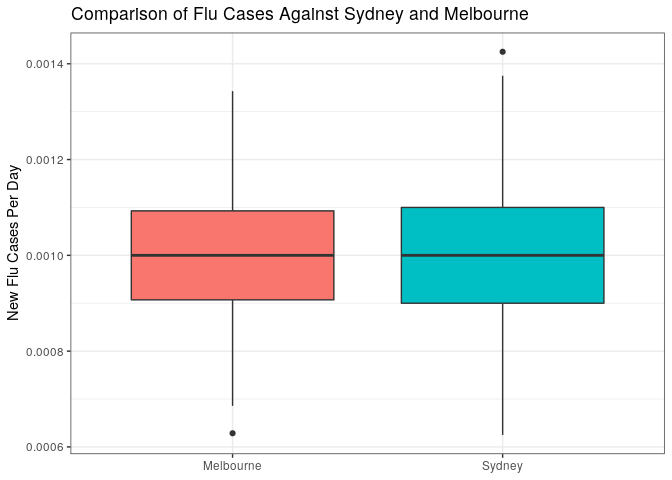
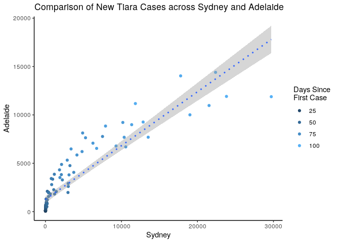
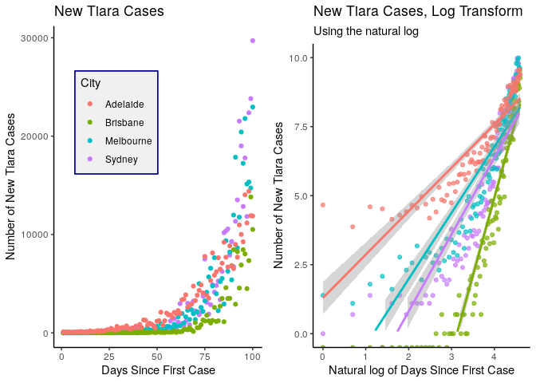
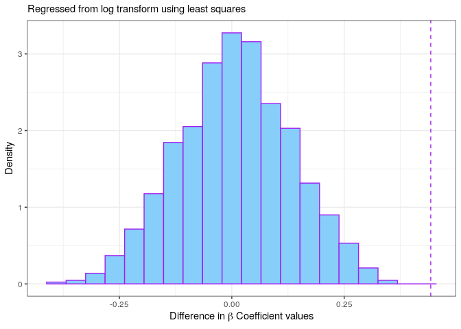

# Declaration
* I hold a copy of this assignment that we can produce if the original is lost or damaged.
* I hereby certify that no part of this assignment/product has been copied from any other student’s work
or from any other source except where due acknowledgement is made in the assignment.
* No part of this assignment/product has been written/produced for us by another person except where
such collaboration has been authorised by the subject lecturer/tutor concerned.
* I am aware that this work may be reproduced and submitted to plagiarism detection software programs
for the purpose of detecting possible plagiarism (which may retain a copy on its database for future
plagiarism checking).
* I hereby certify that we have read and understand what the School of Computing and Mathematics
defines as minor and substantial breaches of misconduct as outlined in the learning guide for this unit.

# Preliminary
Before beginning it is necessary to set the working directory, load any necessary packages and load the data set.

## Load Packages


```r
## Preamble
# setwd("~/Dropbox/Notes/DataSci/ThinkingAboutData/Assessment/")
## Install Pacman
load.pac <- function() {

  if(require("pacman")){
    library(pacman)
  }else{
    install.packages("pacman")
    library(pacman)
  }
  
  ## Install packages
    pacman::p_load(xts, sp, gstat, ggplot2, rmarkdown, reshape2, ggmap,
                 parallel, dplyr, plotly, tidyverse, reticulate, UsingR, Rmpfr,
                 swirl, corrplot, gridExtra, mise, latex2exp, tree, rpart, lattice,
                 coin, primes, epitools, maps, clipr, ggmap, RColorBrewer, latex2exp)
  
  ## Clean up
   mise()
   
   ## Set Defaults
   select <- dplyr::select
   filter <- dplyr::filter
}

load.pac()
```

```
## Loading required package: pacman
```



## Inspect and Clean Data
The data can be inspected thusly:


```r
(read.csv("../0datasets/project2020A.csv") -> data)  %>% head()
```

```
##     city newTiara newFlu date
## 1 Sydney        1     40    1
## 2 Sydney        2     43    2
## 3 Sydney        4     35    3
## 4 Sydney        0     38    4
## 5 Sydney        3     37    5
## 6 Sydney        4     31    6
```

```r
str(data)
```

```
## 'data.frame':	400 obs. of  4 variables:
##  $ city    : chr  "Sydney" "Sydney" "Sydney" "Sydney" ...
##  $ newTiara: int  1 2 4 0 3 4 2 3 3 3 ...
##  $ newFlu  : int  40 43 35 38 37 31 43 38 49 35 ...
##  $ date    : int  1 2 3 4 5 6 7 8 9 10 ...
```

```r
summary(data)
```

```
##      city              newTiara            newFlu           date       
##  Length:400         Min.   :    0.00   Min.   : 9.00   Min.   :  1.00  
##  Class :character   1st Qu.:   31.75   1st Qu.:21.75   1st Qu.: 25.75  
##  Mode  :character   Median :  389.00   Median :29.00   Median : 50.50  
##                     Mean   : 2623.00   Mean   :29.71   Mean   : 50.50  
##                     3rd Qu.: 3130.25   3rd Qu.:37.00   3rd Qu.: 75.25  
##                     Max.   :29711.00   Max.   :57.00   Max.   :100.00
```

```r
if(sum(is.na(data)) > 0) {
  print("The data Needs to be Cleaned")
} else {
  print("The data does not require cleaning")
}
```

```
## [1] "The data does not require cleaning"
```

This data set provides 400 observations with 4 features, one of which is categorical. There is no missing data in this data set.

# Question 1

> Assume that the number of new flu cases each day are independent over the set of days. Test if the mean
> number of new flu cases over the set of days is different for each city, and if so determine which cities have a
> statistically different mean.

It is first necessary to get the data into a tidy format, so first encode the categorical variable as a `factor`:


```r
data$city  <- factor(data$city)
```

Now aggregate the data:


```r
(mean_city <- aggregate(newFlu ~ city, data, mean, na.rm = TRUE)) 
```

```
##        city newFlu
## 1  Adelaide  24.13
## 2  Brisbane  19.38
## 3 Melbourne  35.01
## 4    Sydney  40.33
```

## Plot
This aggregated data can be plotted, it is appropriate to use a boxplot. This plot is illustrative of the average number of new flu infections accross cities under the assumption that the rate of infection is independent of time.


```r
p <- ggplot(data, aes(x = city, y = newFlu, fill = city)) +
  theme_classic() +
  labs(title = "Avereage Flu Cases Per Day",
       subtitle = "Under the Assumption of Time Independence",
y = "Average Flu Infections Per Day") +
  theme(axis.title.x = element_blank())

p + geom_boxplot()
```

<!-- -->


## Observations from Plot
The boxplot strongly suggests that the number of infections in Sydney and Melbourne are
higher than in Adelaide or Brisbane, it would be reasonable to expect that
Sydney would have a statistically higher mean value of new cases. 

An *ANOVA* test can only measure whether or not there is difference between groups, it would be expected that this difference is statistically signifiant.

## Analysis and Results
In order to assess whether or not the mean value does differ accross these
cities a hypothesis test will be established.

### Hypothesis
* $H_0: \quad$ The mean value accross populations does not change
  * And hence we would expect the mean value to be the overall mean
* $H_{a}: \quad$ There is a difference between the mean values across cities.

### Test statistic
The $F$ statistic is given by equation \eqref{F} and compares the variance within groups to the variance outside groups:

\begin{align}
F &= \frac{\mathrm{SS}_B/(K-1)}{\mathrm{SS}_W(K-1)}  \label{F} \\
\ \notag \\
& \quad \qquad S S_{B}=\sum_{i=1}^{K} n_{k}\left(\bar{x}_{k}-\bar{x}\right)^{2} \label{ssb} \\
& \quad \qquad S S_{W}=\sum_{i=1}^{K}\left(n_{k}-1\right) s_{k}^{2} \label{ssw}
\end{align}

where:

* $k$ is the group number or city.
* $K$ is the number of groups (In this case 4 cities)
* $SS_B$ is the sum of squared differences from the group means to the overall means as defined in equation \eqref{ssb}
* $SS_W$ is the sum of squared differences between group values and group mean as defined in equation \eqref{ssw}

The $F$ statistic can also be calculated in **_R_** using the `oneway` function like so:


```r
(F_obs <- oneway.test(newFlu ~ city, data, var.equal = FALSE))
```

```
## 
## 	One-way analysis of means (not assuming equal variances)
## 
## data:  newFlu and city
## F = 369.47, num df = 3.00, denom df = 217.21, p-value < 2.2e-16
```

```r
F_obs <- F_obs$statistic
```

### Rejection Region
Rather than using the $F$ statistic directly, the statistic of concern will be the
probability of a Type I error ($\alpha$) which is essentially a false positive.

The null hypothesis will be rejected for an $\alpha$ value less than 5%, this
represents a low probability of a type I error which is good evidence for
rejecting the null hypothesis.

This value was reported above by the `oneway.test` function but will be derived from first principles below.

### Statistic
The $p$-value is the measured probability of a type I error, it can be measured
by:

1. Simulating the data under the assumption that the null hypothesis is true
2. Determining the frequency at which the null hypothesis would be rejected by mere chance
    + This frequency will be accepted as the probability of a type I error.

In order to simulate the data, the observations can be permuted in order remove
any meaningful difference between mean values that would violate the null
hypothesis and the $F$ statistic measured. The frequency at which a more
extreme F value is observed is the $p$ value, this is shown below:


```r
x <- replicate(10^3, {
  ## Permute the Categories to satisfy H_0
  city_perm <- sample(data$city)
  ## Calculate the F-Statistic
#  F_sim <- oneway.test(newFlu ~ city, data, var.equal = FALSE)$statistic

  ## Calculate Summary Statistics
  K <- length(unique(data$city))
  sd_within_groups <- aggregate(newFlu ~ city, data, sd)$newFlu^2
  xbar <- mean(data$newFlu)
  xbar_within_groups <- aggregate(newFlu ~ city, data, mean)$newFlu

  ## Calculate Squared Sums
  SSB <- length(xbar_within_groups)*(xbar_within_groups-xbar)^2
  SSW <- sum((length(sd_within_groups)-1)*sd_within_groups)

  ## Divide to get F
  F_sim <- (SSB/(K-1) ) / (SSW/(K-1))

  ## Is this more extreme than what we saw?
  F_sim > F_obs
  })

## Average the values
mean(x)
```

```
## [1] 0
```

This returns a $p$ -value of 0 which is consistent with the built in output of the `oneway` function.

## Conclusion
The probability of rejecting the null hypothesis is very small, this is good evidence to support rejecting the null hypothesis, and because the $p$ value is smaller than  the threshold we accept the alternative hypothesis.

This probability does not provide us sufficient information however, to determine the probability of correctly accepting the null hypothesis $(1-\beta)$.

The hypothesis that the rates of infection across cities are equal should be rejected.

# Question 2
> After more investigation, it was found that the sample data was collected from the set of people who visitedthe major city hospital in the last year. The number of people involved in the study is provided below.Test if there is a difference in proportions of the total number of new cases (over the 100 days) between Melbourne and Sydney.

|           | Participants |
| ---       | ---          |
| Sydney    | 40, 000      |
| Melbourne | 35, 000      |
| Brisbane  | 20, 000      |
| Adelaide  | 25, 000      |


## Plot
The proportion of new cases in Sydney and Melbourne may be determined by selecting the correct variables from the data, filtering out observations from Sydney and Melbourne and then dividing by the number of participants:


```r
select <- dplyr::select
filter <- dplyr::filter

tb <- table(data$city)

prop_df <-data %>%
 filter(city %in% c("Sydney", "Melbourne")) %>%
 select(city, newFlu) %>%
 mutate(newFlu = newFlu/c(rep(40000, tb["Sydney"]),
                          rep(35000, tb["Melbourne"]))
        )

aggregate(newFlu ~ city, prop_df, mean)
```

```
##        city      newFlu
## 1 Melbourne 0.001000286
## 2    Sydney 0.001008250
```
This provies that the number of new infections per day is at a rate of approximately 0.1%.

From this a boxplot can be produced to compare the two proportions:


```r
ggplot(prop_df, aes(x = city, y = newFlu, fill = city)) +
  geom_boxplot() +
  theme_bw() +
    theme(axis.title.x = element_blank()) +
  guides(fill = FALSE) +
  labs(y = "New Flu Cases Per Day", title = "Comparison of Flu Cases Against Sydney and Melbourne")
```

<!-- -->


## Observations from Plot
The plot does not suggest that there is any difference between the proportion of new cases between Sydney and Melbourne.

## Analysis and Results
### Student's $t$-distribution
The *Central Limit Theorem* provides that the distribution of mean values from 
samples of a population will be normally distributed such that $\overline{X} \sim \mathcal{N}\left(0, \frac{s}{\sqrt{n}}\right)$ if:

* those samples are sufficiently large, or
* the population is normally distributed

This means that a standardised value for the distribution of mean values can be used to measure the $p$-value as shown in equation \eqref{ttest}.

\begin{align}
z_{i}& = \frac{x_i - \overline{x}}{s}\\
& \implies  t= \frac{\left( \overline{x_1} - \overline{x_2} \right) - 0}{s_p \times \sqrt{\frac{1}{n_1} +  \frac{1}{n_2}} } \label{ttest}
\end{align}

This sample is sufficiently large and so the use of the $t$-test is appropriate, this test is built into **_R_** and can be implemented with the `t.test` function:


```r
t.test(newFlu ~ city, prop_df)
```

```
## 
## 	Welch Two Sample t-test
## 
## data:  newFlu by city
## t = -0.36942, df = 197.98, p-value = 0.7122
## alternative hypothesis: true difference in means is not equal to 0
## 95 percent confidence interval:
##  -5.047898e-05  3.455041e-05
## sample estimates:
## mean in group Melbourne    mean in group Sydney 
##             0.001000286             0.001008250
```

This provides a large $p$-value indicating a high probability that any differences
in the sample observations are a result of mere chance rather than indicative
of a difference in population means.

### Simulation
This test can also be performed by simulation by:

1. Assuming that there is no difference in the data
2. Permuting the city to which the value corresponds in order remove any difference
3. measuring the difference between the average of the two cities
4. repeating this many times

The frequency at which a difference more extreme that what was observed is detected is a measurement of the probability of committing a type I error under the assumption that the null hypothesis is true, this is the $p$-value.


```r
set.seed(85284)

mean_diff_obs <- aggregate(newFlu ~ city, prop_df, mean)[,2] %>% diff()

xbar_sim <- replicate(10^3, {
  city_perm <- sample(prop_df$city)
  mean_diff_sim <- aggregate(newFlu ~ city_perm, prop_df, mean)[,2] %>% diff()

  # Is this more extreme? Is it a false pos?
  abs(mean_diff_sim) > abs(mean_diff_obs)
})

# What Proportion are false postive?
mean(xbar_sim)
```

```
## [1] 0.719
```

This shows, assuming there is no difference between the two populations, that the probability of detecting such a change is $\approx 72\%$, this is consistent with the $t$-test from before.

## Conclusion
A $p$-value in excess of 0.7 is very large and indicates that there is insufficient evidence to reject the hypothesis that there is a difference between the mean value of the proportion of new infections between cities.

Hence it is *not* concluded that there is any difference.


# Question 3
> The recent trend of people from Sydney spending their vacations in Adelaide has
> lead to the belief that the trends in the tiara virus are related. Compute the
> confidence interval for the correlation of new cases of tiara virus between
> Sydney and Adelaide.

## Plot
In order to assess the correlation between case rates across the two cities it is necessary to first pivot the data frame into a different format. This can by done by using `dplyr` to select the appropriate features, filter based on the city and then transform the data into a wide format like so:


```r
(cor_df <- data %>%
  group_by(city) %>%
  select(city, newTiara, date) %>%
  filter(city %in% c("Sydney", "Adelaide")) %>%
  pivot_wider(names_from = city, values_from = newTiara) ) %>% head()
```

```
## # A tibble: 6 x 3
##    date Sydney Adelaide
##   <int>  <int>    <int>
## 1     1      1      106
## 2     2      2       48
## 3     3      4       99
## 4     4      0       92
## 5     5      3       63
## 6     6      4       73
```

This data can then be used to produce a scatter plot comparing the two rates:


```r
ggplot(cor_df, aes(x = Sydney, y = Adelaide)) +
  geom_point(aes(col = date)) +
  stat_smooth(method = 'lm', lty = 3) +
  theme_classic() +
  labs(title = "Comparison of New Tiara Cases across Sydney and Adelaide") +
   guides(col = guide_legend("Days Since \nFirst Case"))
```

```
## `geom_smooth()` using formula 'y ~ x'
```

<!-- -->

## Observations from Plot
This plot suggests that there is a significant amount of correlation between the two variables. The relationship is a monotone positive one but it is non-linear and likely logarithmic.

## Analysis and Results
In order to create a confidence interval of the data a boot strap simulation can be used:

1. Assume that the population is an infinite repetition of the sample
2. Take a sample from this population
    + This can be acheived by resampling the sample with repetition.
3. compute the correlation and repeat. 

This will give a normally distributed range of values for the correlation coefficient ($\rho$). This distribution can be used to estimate the range of $\rho$ values for samples drawn from the population by taking the quantiles, this represents an estimate for the confidence interval.

The confidence interval is a measure of the probability that any given sample from a population will contain the population mean, for example, a 95% confidence interval of some sample from a population will have a 95% probability of containing the population mean. In saying that however, that does not imply that there is a 95% probability of this confidence interval containing the population mean, $\mu$ is not a random variable and so it's not correct to talk about probabilities, rather it is expressed that there is a 95% confidence level that the the population mean is contained in that interval.

A 95% confidence interval of the correlation coefficient can be produced via the bootstrap approach:


```r
n <- nrow(cor_df)

sim <- replicate(10^3, {
    index <- sample(1:n, size = n, replace = TRUE)
    df    <- cor_df[index,]
    cor(df[,1], df[,2])
})
quantile(sim, c(0.025, 0.0975))
```

```
##      2.5%     9.75% 
## 0.6680477 0.6835098
```

This provides that a 95% confidence interval for the correlation coefficient is $\rho \in \left(0.668, 0.684\right)$

## Conclusion
The 95% confidence interval for the correlation coefficient provides a range of values that is reasonably large, hence it may be concluded with a high degree of certainty that there is a **moderate** amount of correlation for the number of new cases of *Tiaria* between Sydney and Adelaide.


# Question 4
> A colleague has observed that the daily new infections of the Tiara virus seem to increase exponentially with
> time, implying a relationship:
> $$
> y = Ae^{\beta x} \\
> $$
> where x is the date, and y is the number of new infections. Using a log transformation changes the model to:
> $$
> \log{\left(y\right)} = \log{\left(A\right)} + \beta x
> $$
> which is now a linear model.
>
> Compute the confidence interval for the parameter $\beta$ for the new infections in Sydney.

## Plot
In order to produce a plot of the data it is necessary to produce a corresponding data frame. The `dplyr` package can be used to `select` the appropriate features and then `ggplot` can be used to produce a plot and a $\log$-transformed plot:


```r
p_raw <- ggplot(data, aes(x = date, y = newTiara, col = city)) +
  geom_point() +
  theme_classic() +
  labs(x = "Days Since First Case",
       y = "Number of New Tiara Cases",
       title = "New Tiara Cases") +
  theme(legend.position = c(0.3, 0.7)) +
  guides(col = guide_legend("City")) +
  theme(legend.background = element_rect(fill="#f0f0f0",
                                  size=0.6, linetype="solid",
                                  colour ="darkblue"))


# No need to clean out x<1 with ggplot2
# data[(data$newTiara<1),]

p_log_trans <- ggplot(data, aes(x = log(date), y = log(newTiara), col = city)) +
  geom_point(alpha = 0.7) +
  stat_smooth(method = 'lm', se = TRUE) +
#  stat_smooth(lty = 3, se = FALSE) +
  scale_y_continuous(limits = c(0, 10)) +
  scale_x_continuous(limits = c(0, log(max(data$date)))) +
  theme_classic() +
  guides(col = FALSE) +
  labs(x = "Natural log of Days Since First Case",
       y = "Number of New Tiara Cases",
       title = "New Tiara Cases, Log Transform",
         subtitle = "Using the natural log")


library(gridExtra)
grid.arrange(grobs = list(p_raw, p_log_trans), layout_matrix = matrix(1:2, nrow = 1))
```

```
## `geom_smooth()` using formula 'y ~ x'
```

```
## Warning: Removed 20 rows containing non-finite values (stat_smooth).
```

```
## Warning: Removed 4 rows containing missing values (geom_point).
```

```
## Warning: Removed 71 rows containing missing values (geom_smooth).
```

<!-- -->

## Observations from Plot
Following the transform the data is quite linear and this, in conjuction with mathematical reasoning, is good evidence to justify the use of an exponential model, there does however appear to be a slight non linear trend in the data corresponding to Adelaide following the transform. 

Looking at the plot and taking the rise over run, the $\beta$ coefficient would appear to be about $\beta \approx \frac{7.5-0}{4-1} = 2.5$.

## Analysis and Results
In order to produce a confidence interval for the slope of the log transformed data it is necessary to first produce a corresponding data frame, this can be acheived by using `dplyr` to select the appropriate features, mutate the values and filter out any $-\infty$ values:


```r
(log_trans <- data %>%
  select(city, newTiara, date) %>%
   filter(city == "Sydney") %>% 
  mutate(newTiara = log(newTiara),
         date     = log(date)) %>%
  filter(newTiara != -Inf )) %>%
  head()
```

```
##     city  newTiara      date
## 1 Sydney 0.0000000 0.0000000
## 2 Sydney 0.6931472 0.6931472
## 3 Sydney 1.3862944 1.0986123
## 4 Sydney 1.0986123 1.6094379
## 5 Sydney 1.3862944 1.7917595
## 6 Sydney 0.6931472 1.9459101
```


To produce a confidence interval for the slope value:

1. Assume that the population is composed of an infinite repetition of the sample
2. Sample from this broader population (by resampling with repetition)
3. Calculate the slope value
4. repeat many times in order to produce a distribution

The quantile of the distribution is hence given by:


```r
n = nrow(log_trans)

beta = replicate(1000, {
## Resample the Data
samp = sample(1:n, replace = TRUE, size = n) # sample the row numbers (with replacement)

## Fit the Regression
fit = lm(newTiara ~ date, data = log_trans[samp,])

## Extract the Slope
coef(fit)[2] # extract the estimate of b
})
## print out the interval boundaries (95% interval)
(limits <- quantile(beta, c(0.025, 0.975)))
```

```
##     2.5%    97.5% 
## 2.403382 3.702158
```

This boot strap distribution can be visualised using a histogram:


```r
ggplot(tibble::enframe(beta), aes(x = value, y = after_stat(density))) +
  geom_histogram(fill = "LightSkyBlue", col = "purple", bins = 20) +
  geom_vline(xintercept = limits[1]) +
  geom_vline(xintercept = limits[2]) +
  theme_bw() +
  labs(x = latex2exp::TeX('Bootstrapped $\\beta$ Coefficient'),
       subtitle = "Regressed from log transform using least squares", 
       main = "Distribution of exponential coefficient", 
       y = "Density")
```

<!-- -->
## Conclusion
The bootstrap provides that a 95% confidence interval for $\beta$ is between 2.4
and 3.7, this is a good estimate for the rate at which the average number of
transmissions per person changes (i.e. the acceleration of the spread or the
second derivative of the number of infected).
### Note on Log Transforms
It's worth acknowledging that the slope coefficient of the log-transformed data
does not solve the least squares optimisation problem for an exponential model,
this would require a numerical solution (which would be too slow to bootstrap)
and so this is appropriate estimation.

# Question 5
> The final piece of analysis wanted by the health minister is to determine if
> the Tiara virus is spreading at a slower rate in Melbourne when compared to
> Sydney. Perform a hypothesis test to test if the rate of increase of new Tiara
> virus cases b is lower in Melbourne when compared to Sydney.

## Plot
In order to plot the data it is necessary to filter the results for Sydney and
Melbourne, this can be done using `dplyr`. This data is best described by an
exponential model as justified by equation \eqref{expmod} and so the rate
considered should be the rate coefficient ($\beta$) in the expoential model.

In order to justify the expoenential model let $p$ be the number of people with
the disease, we would expect the growth of this population to be proportional to
the number of those infected:

\begin{align}
p &\propto \frac{\mathrm{d}p}{\mathrm{d}t} \notag \\
\implies \int  \enspace \mathrm{d}t &\propto \int \frac{1}{p} \frac{\mathrm{d}p}{\mathrm{d}t} \enspace \mathrm{d}t \notag \\
\text{using integration by parts:} \notag \\
\implies \int  \enspace \mathrm{d}t &\propto \int \frac{1}{p} \enspace \mathrm{d}t \notag \\
 t &\propto \ln{\mid p \mid } + C, \quad \exists C \in \mathbb{R} \notag \\
 p \text{ is always positve and so } \mid p \mid \propto p: \notag \\
 t &\propto \ln{ p  } + C, \quad \exists C \in \mathbb{R} \notag \\
 \text{provide proportionality constant:} \notag \\
 e^{\beta t} &= e^{\ln{ p  } + C}, \quad \exists \beta, C \in \mathbb{R}\notag \\
 \implies p &= \gamma e^{\beta t}, \exists \beta, C \in \mathbb{R} \\
\frac{\mathrm{d}p}{\mathrm{d}t} &= \alpha e^{\beta t}, \exists \beta, C \in \mathbb{R}\label{expmod} \\
\end{align}

$\therefore$ the rate of change of new cases, assuming that the rate of spread
is proportional to the number of infected, would be described by an exponential
model. 

Plots can be produces in a similar fashion as the before in order to illustrate the difference in rates:


```r
syd_mel_data <- data %>% 
  filter(city %in% c("Sydney", "Melbourne"))

p_raw <- ggplot(syd_mel_data, aes(x = date, y = newTiara, col = city)) +
  geom_point() +
  theme_classic() +
  labs(x = "Days Since First Case",
       y = "Number of New Tiara Cases",
       title = "Melbourne and Sydney, Daily Tiara Cases, Log Transform") +
  theme(legend.position = c(0.3, 0.7)) +
  guides(col = guide_legend("City")) +
  theme(legend.background = element_rect(fill="#f0f0f0",
                                  size=0.6, linetype="solid",
                                  colour ="darkblue"))

p_log_trans <- ggplot(syd_mel_data, aes(x = log(date), y = log(newTiara), col = city)) +
  geom_point(alpha = 0.7) +
  stat_smooth(method = 'lm', se = TRUE) +
  scale_y_continuous(limits = c(0, 10)) +
  scale_x_continuous(limits = c(0, log(max(data$date)))) +
  theme_classic() +
  guides(col = FALSE) +
  labs(x = "Natural log of Days Since First Case",
       y = "Number of New Tiara Cases",
       title = "Melbourne and Sydney, Daily Tiara Cases, Log Transform",
         subtitle = "Using the natural log")


library(gridExtra)
grid.arrange(grobs = list(p_raw, p_log_trans), layout_matrix = matrix(1:2, nrow = 1))
```

```
## `geom_smooth()` using formula 'y ~ x'
```

```
## Warning: Removed 5 rows containing non-finite values (stat_smooth).
```

```
## Warning: Removed 4 rows containing missing values (geom_point).
```

```
## Warning: Removed 51 rows containing missing values (geom_smooth).
```

<!-- -->

## Observations from Plot
The plot suggests that Melbourne has a higher number of new daily cases of
*Tiara* Virus, the rate of increase of new cases in Sydney does however appear
significantly (albeit slightly) greater than Melbourne.

It appears that Sydney has a higher rate of new coronavirus cases.

## Analysis and Results
In order to consider the rate of change of new cases of *Tiara* virus the data must be filtered for results only pertaining to Sydney and Melbourne and pivoted into a longer format, this can be done with `dplyr`:


```r
## Relevant data
rate_df <- data %>% 
  ## Throw away other features
  select(city, newTiara, date) %>% 
  ## Only use Melbourne and Sydney
  filter(city %in% c("Sydney", "Melbourne")) %>% 
  ## Tage out zero values for the log transform
  filter(newTiara > 0) %>% 
  ## Make the DataFrame wider
  pivot_wider(names_from = city, values_from = newTiara)
```

Then that data can be used to compare the slope of the log transformed data between the two cities:


```r
## Calculate the slope
rate_diff <- function(data) {
  
sydney_mod <- lm(log(Sydney) ~ log(date), data)
sydney_slope <- sydney_mod$coefficients[2]

melbourne_mod <- lm(log(Melbourne) ~ log(date), data)
melbourne_slope <- melbourne_mod$coefficients[2]

(slope_diff <- sydney_slope-melbourne_slope)
}

(slope_diff_obs <- rate_diff(rate_df))
```

```
## log(date) 
##  0.442499
```

This suggests that the rate of new cases in Sydney is higher than Melbourne, by a rate of about 0.44.

### Hypothesis
In order to perform a hypothesis test it is necessary to stipulate two hypothesis:

1. $H_0: \quad$ The rate of change of daily new cases is equal in Sydney and Melbourne.
    + $\beta_\mathrm{Syd} - \beta_\mathrm{Mel} = 0$
2. $H_a: \quad$ Sydney has a higher rate of new daily cases than Melbourne.
    + $\beta_\mathrm{Syd} - \beta_\mathrm{Mel} > 0$

### Test Statistic
In order to measure the $p$ value the data needs to be simulated under the assumption that the null hypothesis is true, the frequency at which the difference between the slope values is atleast as great as the observation is a good estimate for the probability of committing a type I error, this is the $p$ value. A low $p$-value is good evidence to support rejecting the null hypothesis.

To simulate the null hypothesis, combine the observations and randomly assign them to either city, the $\beta$ values can then be measured, differenced and recorded like so:


```r
##H0 is that the b_0-b1 = 0

start <- Sys.time()
sim_diff_vec <- replicate(10^3, {
## Combine the cities and randomly permut the cases between
   (rate_df_perm <- data %>% 
     group_by(date) %>% 
     select(city, newTiara, date) %>% 
     filter(city %in% c("Sydney", "Melbourne")) %>% 
     mutate(city = sample(city)) %>% 
     filter(newTiara > 0) %>% 
     pivot_wider(names_from = city, values_from = newTiara))
  
## Calculate the slope
sim_diff <- rate_diff(rate_df_perm)

return(sim_diff)
}) 

## Is this difference greater than the observation?
fpos <-  (sim_diff_vec > slope_diff_obs)

(p <- mean(fpos))
```

```
## [1] 0
```

```r
Sys.time()-start
```

```
## Time difference of 46.69424 secs
```
This distribution can be plotted as a histogram in order to visualise the significance of the difference in rates:


```r
ggplot(tibble::enframe(sim_diff_vec), aes(x = value, y = after_stat(density))) +
  geom_histogram(fill = "LightSkyBlue", col = "purple", bins = 20) +
  geom_vline(xintercept = slope_diff_obs, lty = 2, col = "purple") +
  theme_bw() +
  labs(x = latex2exp::TeX('Difference in $\\beta$ Coefficient values'),
       subtitle = "Regressed from log transform using least squares", 
       main = "Distribution of Difference in new case rates between Sydney and Melbourne", 
       y = "Density")
```

<!-- -->


## Conclusion
Under the assumption that the rates of daily new cases are equivalent, the
probability of detecting a difference when there was none is practically 0,
this is good evidence to support rejecting the null hypothesis.

It is hence concluded that there is sufficient evidence to reject the hypothesis that the rate of change of cases is lower in Sydney than Melbourne.


