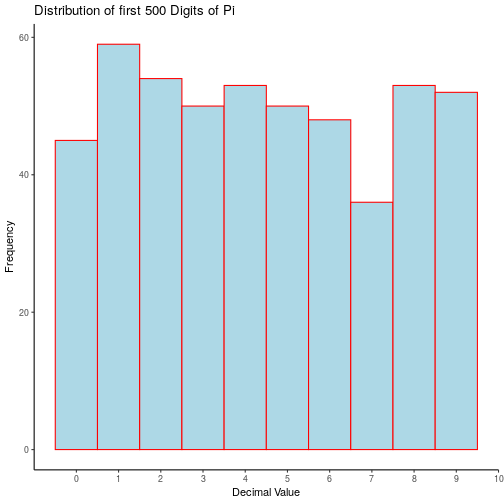
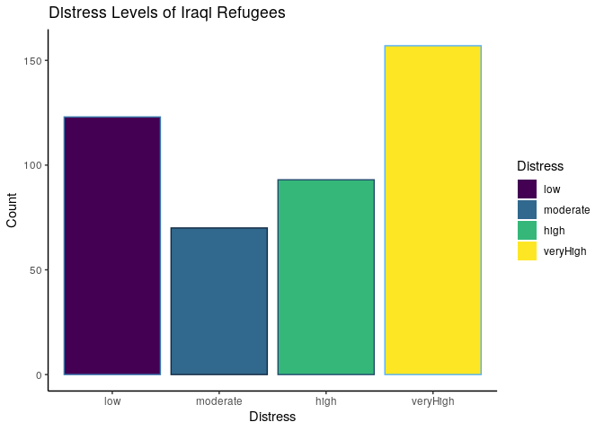
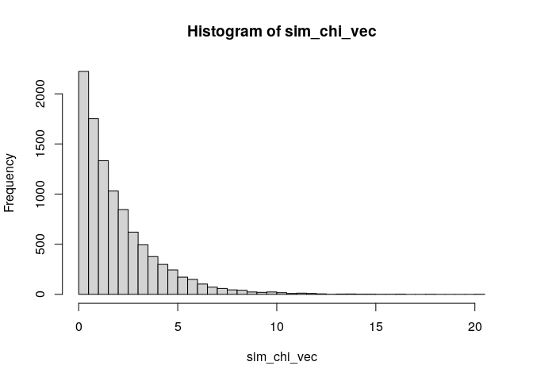
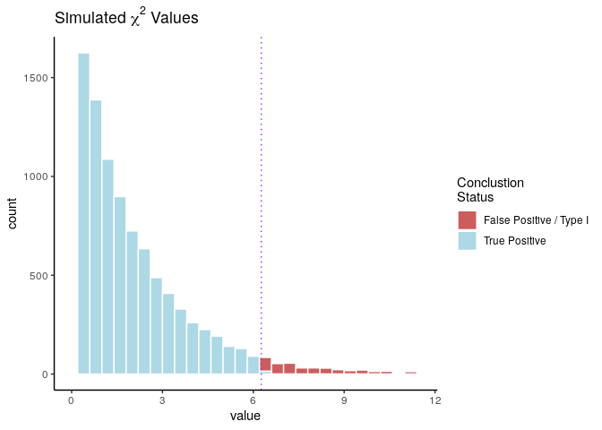

Randomness
==========

Preamble
--------

``` {.r}
load.pac <- function() {
  
  if(require("pacman")){
    library(pacman)
  }else{
    install.packages("pacman")
    library(pacman)
  }
  
  pacman::p_load(xts, sp, gstat, ggplot2, rmarkdown, reshape2, ggmap,
                 parallel, dplyr, plotly, tidyverse, reticulate, UsingR, Rmpfr)
  
}

load.pac()
```

    ## Loading required package: pacman

(1) Compute tables of $\pi$ digits
----------------------------------

First it is necessary to have some digits of pi, we'll just take a
dataset:

``` {.r}
pi_Dig <- UsingR::pi2000[-1]
write.csv(pi_Dig, file = "./piDigits.csv", quote = FALSE, row.names = FALSE)
pi_Tibble <- tibble::enframe(piDig)
```

    ## Error in tibble::enframe(piDig): object 'piDig' not found

``` {.r}
tibble::remove_rownames(pi_Tibble)
```

    ## Error in is.data.frame(.data): object 'pi_Tibble' not found

``` {.r}
pi_Tibble <- pi_Tibble$value
```

    ## Error in eval(expr, envir, enclos): object 'pi_Tibble' not found

``` {.r}
head(pi_Tibble)
```

    ## Error in head(pi_Tibble): object 'pi_Tibble' not found

### using the `Rmpfr` package

An alternative is to use the Rmpfr package deals with handling numbers
of arbitrary precision, this requires the `GMP C` library to be
installed, so the package will be something like `libbmp-dev` and should
be in the repos for `apt` or `pacman -S` or whatever:

``` {.bash}
apt list libgmp3-dev
apt list libgmp
apt list libmpfr-dev


apt list libgmp3-dev libgmp libmpfr-dev
```

    ## 
    ## WARNING: apt does not have a stable CLI interface. Use with caution in scripts.
    ## 
    ## Listing...
    ## libgmp3-dev/bionic,bionic,now 2:6.1.2+dfsg-2 amd64 [installed]
    ## 
    ## WARNING: apt does not have a stable CLI interface. Use with caution in scripts.
    ## 
    ## Listing...
    ## 
    ## WARNING: apt does not have a stable CLI interface. Use with caution in scripts.
    ## 
    ## Listing...
    ## libmpfr-dev/bionic,bionic,now 4.0.1-1 amd64 [installed]
    ## 
    ## WARNING: apt does not have a stable CLI interface. Use with caution in scripts.
    ## 
    ## Listing...
    ## libgmp3-dev/bionic,bionic,now 2:6.1.2+dfsg-2 amd64 [installed]
    ## libmpfr-dev/bionic,bionic,now 4.0.1-1 amd64 [installed]

Rather than specifying significant figures the package works with bits
of precision, so for example a base 10 number like 8 can be represented
with 3 bits of information because $2^3=8$.

if 1000 decimal places were required, the number of bits would be the
number of binary values necessary to represent that same value:

$$
\begin{aligned}
2^{\textsf{bits}} &= 10^{\textsf{digits}} \\
\iff \textsf{bits} &= \textsf{digits} \times \log_{2}{}{\left(  10\right) }\\
\end{aligned}
$$

``` {.r}
library(Rmpfr)
diglength <- 2000 

precision <- diglength*log2(10)
precision <- ceiling(precision)
piVal <- Rmpfr::Const("pi", precision)
print(Rmpfr::Const("pi", 12*log2(10)))
```

    ## 1 'mpfr' number of precision  39   bits 
    ## [1] 3.141592653592

In order to extract the value use `substring()` in order to create
substrings of the values.

``` {.r}
piVal      <- format(piVal)
pi_Digits  <- substring(text = piVal, first = 1:diglength, last = 1:diglength)[3:diglength] #%>% as.numeric()
pi_Digits  <- substring(text = piVal, first = 1:diglength, last = 1:diglength)[3:diglength] %>% as.integer()
pi_Digits <- as.vector(pi_Digits)
#pi_Digits <- factor(pi_Digits, levels = 0:9, ordered = TRUE)
```

A histogram of which may be generated:

``` {.r}
table(pi_Digits)
```

    ## pi_Digits
    ##   0   1   2   3   4   5   6   7   8   9 
    ## 181 212 207 188 195 205 200 197 202 211

``` {.r}
table(pi_Digits) %>% barplot
```


The problem with a histogram is that it will combine The first two
frequencies in a way that is incorrect in this context, it only seems to
do it with the pi digits though for some reason

``` {.r}
hist(pi_Digits, breaks = seq(from = 0, to = 9, by = 1)) %>% summary()
```

    ##          Length Class  Mode     
    ## breaks   10     -none- numeric  
    ## counts    9     -none- numeric  
    ## density   9     -none- numeric  
    ## mids      9     -none- numeric  
    ## xname     1     -none- character
    ## equidist  1     -none- logical

``` {.r}
axis(side = 1, at = seq(0, 9, 1), labels = seq(0, 9, 1))
axis(2,pos = -9)
```


``` {.r}
random_Uniform <- runif(2000, 0, 9)
hist(random_Uniform)
axis(side = 1, at = seq(0, 9, 1), labels = seq(0, 9, 1))
axis(2,pos = -9)
```


A better alternative is to use ggplot2

``` {.r}
pi_DigitsDF <- tibble::enframe(pi_Digits)

HistPlot <- function (DataFrame, heading) {
ggplot(data = DataFrame, aes(x = value, fill = value)) +
#       geom_histogram(binwidth = 1, fill = "lightblue", col = "red") +
       geom_histogram(bins = 10, fill = "lightblue", col = "red") +
       theme_classic() +
       scale_x_continuous(breaks = seq(0, 10, 1)) +
       labs(x = "Decimal Value", y = "Frequency",
        title = heading)
    
}

HistPlot(pi_DigitsDF, "Distribution of Digits of Pi" )
```


### Using Power Series

Using integration by parts, it can be shown that:

$$\begin{aligned}
\int^{b}_{0} \frac{1}{1+ x^2}  \mathrm{d}x&= \arctan\left( b \right) \enspace : \quad b \in\left( \mathbb{R}^+\cap 0 \right)  \\
 \implies  \int^{1}_{0} \frac{1}{1+ x^2}  \mathrm{d}x&= \arctan\left( 1 \right) \\
 \implies  \int^{1}_{0} \frac{1}{1+ x^2}  \mathrm{d}x&= \arctan\left( 1 \right) \\
\end{aligned}$$ Transforming into a a power series with some other
magic:

$$\begin{aligned}
\implies  \pi &= 4 \times \sum^\infty_{n=0}\left[ \frac{\left( - 1 \right) ^k}{2k+ 1}   \right] 
\end{aligned}$$

The problem with this is that the convergence is too slow to be useful:

$$\begin{aligned}
\frac{1}{2k+ 1} \leq 10^{100}  \implies  k\geq 10^{100} \times \frac{1}{2} - 1
\end{aligned}$$

presuming 1 sum per cycle at 5 GHz this would take well in excess of the
age of the universe. There are ways to speed it up but it's all well
outside scope

(4) Evaluate Distribution of pi Digits
--------------------------------------

In order to evaluate whether or not the digits of pi appear uniformally
distriuted first consider the first 50 digits:

### First 50 Digits of pi

``` {.r}
count <- table(pi_Digits[1:50])
rss   <- (table(pi_Digits[1:50])-50/10)^2

piDigErrorDF        <- data.frame(0:9, as.vector(count), as.vector(rss))
names(piDigErrorDF) <- c("value", "Count", "SquareError")

print(piDigErrorDF)
```

    ##    value Count SquareError
    ## 1      0     2           9
    ## 2      1     5           0
    ## 3      2     5           0
    ## 4      3     8           9
    ## 5      4     4           1
    ## 6      5     5           0
    ## 7      6     4           1
    ## 8      7     4           1
    ## 9      8     5           0
    ## 10     9     8           9

``` {.r}
SSE <- sum(piDigErrorDF$SquareError)

print(paste("The Sum of Squared Errors is", SSE))
```

    ## [1] "The Sum of Squared Errors is 30"

``` {.r}
HistPlot(pi_DigitsDF[1:50,], "Distribution of first 50 Digits of Pi")
```


### First 200 Digits of Pi

``` {.r}
count <- table(pi_Digits[1:200])
rss   <- (table(pi_Digits[1:200])-200/10)^2

piDigErrorDF        <- data.frame(0:9, as.vector(count), as.vector(rss))
names(piDigErrorDF) <- c("value", "Count", "SquareError")

print(piDigErrorDF)
```

    ##    value Count SquareError
    ## 1      0    19           1
    ## 2      1    20           0
    ## 3      2    24          16
    ## 4      3    19           1
    ## 5      4    22           4
    ## 6      5    20           0
    ## 7      6    16          16
    ## 8      7    12          64
    ## 9      8    25          25
    ## 10     9    23           9

``` {.r}
SSE <- sum(piDigErrorDF$SquareError)

print(paste("The Sum of Squared Errors is", SSE))
```

    ## [1] "The Sum of Squared Errors is 136"

``` {.r}
HistPlot(pi_DigitsDF[1:200,], "Distribution of first 200 Digits of Pi")
```


### First 500 Digits of Pi

``` {.r}
count <- table(pi_Digits[1:500])
rss   <- (table(pi_Digits[1:500])-500/10)^2

piDigErrorDF        <- data.frame(0:9, as.vector(count), as.vector(rss))
names(piDigErrorDF) <- c("value", "Count", "SquareError")

print(piDigErrorDF)
```

    ##    value Count SquareError
    ## 1      0    45          25
    ## 2      1    59          81
    ## 3      2    54          16
    ## 4      3    50           0
    ## 5      4    53           9
    ## 6      5    50           0
    ## 7      6    48           4
    ## 8      7    36         196
    ## 9      8    53           9
    ## 10     9    52           4

``` {.r}
SSE <- sum(piDigErrorDF$SquareError)

print(paste("The Sum of Squared Errors is", SSE))
```

    ## [1] "The Sum of Squared Errors is 344"

``` {.r}
HistPlot(pi_DigitsDF[1:500,], "Distribution of first 500 Digits of Pi")
```



### Random Sample of pi Digits

In ***R*** sampling something with repetition is referred to replacing,
so to count or sample something with repetition specify
`replace = TRUE`. Recall the counting Formulas:

  selection            ordered     unordered
  -------------------- ----------- --------------------
  With Repetition      $n^m$       $\binom{m+n-1}{n}$
  Without Repetition   $n_{(m)}$   $\binom{n}{m}$

Where:

-   $\binom{n}{m} =\frac{m_(k)}{k!}=\frac{m!}{k!(m-k)!}$
-   $n_{(m)}=\frac{n!}{(n-m)!}$
-   $n! = n \times (n-1) \times (n-2) \times 2 \times 1$

In order to randomly sample the digits of Pi:

``` {.r}
index <- sample(1:diglength, size = 200)
print(table(pi_Digits[index]))
```

    ## 
    ##  0  1  2  3  4  5  6  7  8  9 
    ## 25 23 16 17 14 25 15 18 16 31

``` {.r}
HistPlot(pi_DigitsDF[index,], "Distribution of first 50 Digits of Pi")
```


This can be repeated multiple times:

``` {.r}
library(gridExtra)
```

    ## 
    ## Attaching package: 'gridExtra'

    ## The following object is masked from 'package:dplyr':
    ## 
    ##     combine

``` {.r}
library(tidyverse)

PlotList <- list()
for (i in 1:6) {
index <- sample(1:diglength, size = 200)
PlotList[[i]] <- HistPlot(pi_DigitsDF[index,],
              paste("Distribution of a random sample of \n 200 Digits of Pi from the first", diglength))
}

# arrangeGrob(grobs = PlotList, layout_matrix = matrix(1:6, nrow = 3))
grid.arrange(grobs = PlotList, layout_matrix = matrix(1:6, nrow = 3))
```


(5) Uniformally Distributed Values
----------------------------------

### 50 Digits

``` {.r}
x <- runif(50, 0, 9) %>% round()
x <- sample(0:9, replace = TRUE, size = 50)
xDF <- tibble::enframe(x)

count <- table(x[1:50])
rss   <- (table(x[1:50])-50/10)^2

ErrorDF        <- data.frame(0:9, as.vector(count), as.vector(rss))
names(ErrorDF) <- c("value", "Count", "SquareError")

print(piDigErrorDF)
```

    ##    value Count SquareError
    ## 1      0    45          25
    ## 2      1    59          81
    ## 3      2    54          16
    ## 4      3    50           0
    ## 5      4    53           9
    ## 6      5    50           0
    ## 7      6    48           4
    ## 8      7    36         196
    ## 9      8    53           9
    ## 10     9    52           4

``` {.r}
SSE <- sum(piDigErrorDF$SquareError)

print(paste("The Sum of Squared Errors is", SSE))
```

    ## [1] "The Sum of Squared Errors is 344"

``` {.r}
HistPlot(xDF[1:50,], "Distribution of a uniform random sample of 50 digits")
```


### 200 Digits

``` {.r}
x <- runif(200, 0, 9) %>% round()
x <- sample(0:9, replace = TRUE, size = 200)
xDF <- tibble::enframe(x)

count <- table(x[1:200])
rss   <- (table(x[1:200])-200/10)^2

ErrorDF        <- data.frame(0:9, as.vector(count), as.vector(rss))
names(ErrorDF) <- c("value", "Count", "SquareError")

print(piDigErrorDF)
```

    ##    value Count SquareError
    ## 1      0    45          25
    ## 2      1    59          81
    ## 3      2    54          16
    ## 4      3    50           0
    ## 5      4    53           9
    ## 6      5    50           0
    ## 7      6    48           4
    ## 8      7    36         196
    ## 9      8    53           9
    ## 10     9    52           4

``` {.r}
SSE <- sum(piDigErrorDF$SquareError)

print(paste("The Sum of Squared Errors is", SSE))
```

    ## [1] "The Sum of Squared Errors is 344"

``` {.r}
HistPlot(xDF[1:200,], "Distribution of a uniform random sample of 200 digits")
```


### 500 Digits

``` {.r}
x <- runif(500, 0, 9) %>% round()
x <- sample(0:9, replace = TRUE, size = 500)
xDF <- tibble::enframe(x)

count <- table(x[1:500])
rss   <- (table(x[1:500])-500/10)^2

ErrorDF        <- data.frame(0:9, as.vector(count), as.vector(rss))
names(ErrorDF) <- c("value", "Count", "SquareError")

print(piDigErrorDF)
```

    ##    value Count SquareError
    ## 1      0    45          25
    ## 2      1    59          81
    ## 3      2    54          16
    ## 4      3    50           0
    ## 5      4    53           9
    ## 6      5    50           0
    ## 7      6    48           4
    ## 8      7    36         196
    ## 9      8    53           9
    ## 10     9    52           4

``` {.r}
SSE <- sum(piDigErrorDF$SquareError)

print(paste("The Sum of Squared Errors is", SSE))
```

    ## [1] "The Sum of Squared Errors is 344"

``` {.r}
HistPlot(xDF[1:500,], "Distribution of a uniform random sample of 500 digits")
```


(6) Repeat for multiple larger digits
-------------------------------------

I did 50, 200 and 500 for all of them.

(7) Pairs of Digits
-------------------

Let's consider pairs of digits and their distribution:

``` {.r}
library(Rmpfr)
diglength <- 2000*2*10

precision <- diglength*log2(10)
precision <- ceiling(precision)
piVal <- Rmpfr::Const("pi", precision)
print(Rmpfr::Const("pi", 12*log2(10)))
```

    ## 1 'mpfr' number of precision  39   bits 
    ## [1] 3.141592653592

In order to extract the value use `substring()` in order to create
substrings of the values.

``` {.r}
piVal      <- format(piVal); class(piVal)
```

    ## [1] "character"

``` {.r}
pi_Digits  <- substring(text = piVal, first = seq(from = 1, to = diglength, by = 2), last = seq(from = 2, to = (diglength-1), by = 2))[3:(diglength/2)-1] %>% as.numeric()
pi_Digits  <- as.vector(pi_Digits)
#pi_Digits <- factor(pi_Digits, levels = 0:9, ordered = TRUE)
```

A histogram of which may be generated:

``` {.r}
table(pi_Digits)
```

    ## pi_Digits
    ##   0   1   2   3   4   5   6   7   8   9  10  11  12  13  14  15  16  17  18  19  20  21  22  23  24  25  26  27  28  29  30  31  32  33  34 
    ## 187 224 185 214 196 180 192 212 184 222 214 212 183 218 209 190 190 176 214 201 195 210 191 197 178 219 219 184 193 193 186 207 187 177 209 
    ##  35  36  37  38  39  40  41  42  43  44  45  46  47  48  49  50  51  52  53  54  55  56  57  58  59  60  61  62  63  64  65  66  67  68  69 
    ## 212 162 204 182 222 184 201 179 201 191 219 204 212 206 206 198 196 212 217 208 191 207 205 209 187 199 192 234 197 226 196 186 210 183 222 
    ##  70  71  72  73  74  75  76  77  78  79  80  81  82  83  84  85  86  87  88  89  90  91  92  93  94  95  96  97  98  99 
    ## 202 228 185 212 175 181 215 204 205 180 221 195 182 195 196 227 204 214 203 208 207 188 175 195 223 194 201 168 208 199

``` {.r}
table(pi_Digits) %>% barplot
```


A better alternative is to use ggplot2, count the bins carefully, 00 is
it's own bin and so we would expect 99+1 bins overall

``` {.r}
pi_DigitsDF <- tibble::enframe(pi_Digits)

HistPlot <- function (DataFrame, heading) {
ggplot(data = DataFrame, aes(x = value, fill = value)) +
#       geom_histogram(binwidth = 1, fill = "lightblue", col = "red") +
       geom_histogram(bins = 100, fill = "lightblue", col = "red") +
       theme_classic() +
       scale_x_continuous(breaks = seq(0, 10, 1)) +
       labs(x = "Decimal Value", y = "Frequency",
        title = heading)
    
}

HistPlot(pi_DigitsDF, "Distribution of Digits of Pi" )
```


This distribution looks mostly uniform, let's push it by doing a
significantly larger analysis of pi:

``` {.r}
library(Rmpfr)
diglength <- 2000*2*10*10

precision <- diglength*log2(10)
precision <- ceiling(precision)
piVal <- Rmpfr::Const("pi", precision)
print(Rmpfr::Const("pi", 12*log2(10)))
```

    ## 1 'mpfr' number of precision  39   bits 
    ## [1] 3.141592653592

In order to extract the value use `substring()` in order to create
substrings of the values.

``` {.r}
piVal      <- format(piVal); class(piVal)
```

    ## [1] "character"

``` {.r}
pi_Digits  <- substring(text = piVal, first = seq(from = 1, to = diglength, by = 2), last = seq(from = 2, to = (diglength-1), by = 2))[3:(diglength/2)-1] %>% as.numeric()
pi_Digits  <- as.vector(pi_Digits)
#pi_Digits <- factor(pi_Digits, levels = 0:9, ordered = TRUE)
```

A histogram of which may be generated:

``` {.r}
table(pi_Digits)
```

    ## pi_Digits
    ##    0    1    2    3    4    5    6    7    8    9   10   11   12   13   14   15   16   17   18   19   20   21   22   23   24   25   26   27 
    ## 1977 1963 2008 2119 2006 2009 2025 2038 2010 2016 2008 2088 1984 2068 2023 1980 1898 1968 2102 2052 1910 1987 1943 1927 2032 1967 2000 2130 
    ##   28   29   30   31   32   33   34   35   36   37   38   39   40   41   42   43   44   45   46   47   48   49   50   51   52   53   54   55 
    ## 1994 2015 1987 1948 2063 2023 1961 2038 1971 2076 1884 2041 1969 1938 1975 1969 1947 2029 2018 2040 1968 2053 2022 1977 2030 1999 2047 2056 
    ##   56   57   58   59   60   61   62   63   64   65   66   67   68   69   70   71   72   73   74   75   76   77   78   79   80   81   82   83 
    ## 2002 2072 2038 2044 2078 1999 2021 1994 1983 1961 1933 2102 1924 1934 1949 2009 1975 2004 2112 1970 2111 1917 1955 1923 1977 2018 1989 2016 
    ##   84   85   86   87   88   89   90   91   92   93   94   95   96   97   98   99 
    ## 1987 2003 2010 2040 2003 1952 1965 1970 1920 1986 2089 1961 1962 1970 1940 1954

``` {.r}
table(pi_Digits) %>% barplot
```


A better alternative is to use ggplot2, count the bins carefully, 00 is
it's own bin and so we would expect 99+1 bins overall

``` {.r}
pi_DigitsDF <- tibble::enframe(pi_Digits)

HistPlot <- function (DataFrame, heading) {
ggplot(data = DataFrame, aes(x = value, fill = value)) +
#       geom_histogram(binwidth = 1, fill = "lightblue", col = "red") +
       geom_histogram(bins = 100, fill = "lightblue", col = "red") +
       theme_classic() +
       scale_x_continuous(breaks = seq(0, 10, 1)) +
       labs(x = "Decimal Value", y = "Frequency",
        title = heading)
    
}

HistPlot(pi_DigitsDF, "Distribution of Digits of Pi" )
```


(02) Chi Distribution
=====================

Preamble
--------

``` {.r}
load.pac <- function() {
  
  if(require("pacman")){
    library(pacman)
  }else{
    install.packages("pacman")
    library(pacman)
  }
  
  pacman::p_load(xts, sp, gstat, ggplot2, rmarkdown, reshape2, ggmap, wesanderson,
                 parallel, dplyr, plotly, tidyverse, reticulate, UsingR, Rmpfr, latex2exp,
                 mise)
  
#  devtools::install_github("tidyverse/tidyverse")
}

load.pac()
```

    ## Loading required package: pacman

``` {.r}
mise()
```

Wellness Data (Difference From Control)
---------------------------------------

### (01) Enter Data

Now be really careful here, make sure that the column names you choose
are:

-   [Syntactically Correct](https://rdrr.io/r/base/make.names.html) [^1]
    -   Style Guides recommend lower case, `snake_case` for variable and
        function names (using nouns in the prior and verbs in the
        latter), this would include vectors.
        -   Try to avoid using dots, the S3 scheme for defining classes
            uses `.`'s so you might end up with a confusing method like
            `as.data.frame.data.frame()`
        -   I'm using camelCase for DF column names in order to
            distinguish them from variables and make them clearer inside
            `ggplot` as opposed to `snake_case`.
-   Spelt correctly
    -   You will need matching column names in order to use things like
        `pivot_longer` etc.
-   Short enough to type in without making a spelling Mistake
    -   Same as above, remenber axis-titles and so forth are distinct
        from data frame names.

``` {.r}
iraqi = c(123, 70, 93, 157)
names(iraqi) = c("low", "moderate", "high", "veryHigh")
head(iraqi)
```

    ##      low moderate     high veryHigh 
    ##      123       70       93      157

``` {.r}
str(iraqi)
```

    ##  Named num [1:4] 123 70 93 157
    ##  - attr(*, "names")= chr [1:4] "low" "moderate" "high" "veryHigh"

### BarPlot

#### Base Plot

``` {.r}
barplot(iraqi)
```


#### GGPlot2

##### Tidy Data

This can be done in ggplot2, but first a `tidy` data frame needs to be
constructed. Tidy data satisfies the following three rules:

1.  Each variable will have it's own column
2.  Each ovservation will have it's own row
3.  Each Value will have it's own cell.

A tidy data frame somewhat depends on context, for example:

-   If only the refugees were sampled, the data would be structured
    where:
    -   Observations would be:
        -   Low
        -   Medium
        -   High
    -   Variables would be:
        -   Count
-   If Multiple populations were sampled, for example the Australian
    population and the iraqi populations, the tidy data frame may be
    such that:
    -   Observations would be:
        -   Australia
        -   Iraqi
    -   variables would be:
        -   Count
        -   Distress Level
-   If Individuals were classified into a distress category, the
    corresponding tidy data frame would be:
    -   Observations would be:
        -   Individuals
    -   variables would be:
        -   Country of Origin/Residence
        -   Distress Level

##### Make the Plot

``` {.r}
#pivot_longer(data = iraqi, cols = names(iraqi))
iraqi.tidy <- melt(iraqi, value.name = "Count") %>% as_tibble(rownames = "Distress")
iraqi.tidy
```

    ## # A tibble: 4 x 2
    ##   Distress Count
    ##   <chr>    <dbl>
    ## 1 low        123
    ## 2 moderate    70
    ## 3 high        93
    ## 4 veryHigh   157

``` {.r}
# Base
#barplot(height = iraqi.tidy$Count, names.arg = iraqi.tidy$Distress)

# GGPlot2
ggplot(data = iraqi.tidy, mapping = aes(x = Distress, y = Count)) + 
  geom_col()
```


##### Fix the Order of the Plot

In making this plot you may observe that the order of the plot has been
made to be alphabetical, the order of the data frame has been
disregarded.

This is desirable and expected behaviour, the values of distress have
not been correctly encoded, they need to be encoded as ordered factors
in order to be ordered, unordered factors may as well be placed in
alphabetical order.

``` {.r}
iraqi.tidy <- melt(iraqi, value.name = "Count") %>% as_tibble(rownames = "Distress")
iraqi.tidy$Distress <- factor(iraqi.tidy$Distress, levels = iraqi.tidy$Distress, ordered = TRUE)
iraqi.tidy
```

    ## # A tibble: 4 x 2
    ##   Distress Count
    ##   <ord>    <dbl>
    ## 1 low        123
    ## 2 moderate    70
    ## 3 high        93
    ## 4 veryHigh   157

``` {.r}
# Base
fillCols <- RColorBrewer::brewer.pal(nrow(iraqi.tidy), name = "Pastel1")
barplot(height = iraqi.tidy$Count, names.arg = c("Low", "Moderate", "High", "Very High"), col = fillCols, main = "Distress Levels of Iraqi Refugees", xlab = "Distress Level", ylab = "Count")
```


``` {.r}
# GGPlot2
ggplot(data = iraqi.tidy, mapping = aes(x = Distress, y = Count)) + 
  geom_col(mapping = aes(col = Count, fill = Distress)) + 
  theme_classic() +
  labs(title = "Distress Levels of Iraqi Refugees") +
  guides(col = FALSE)
```



### (02) Enter the AIHW Data

The *Australian Institute of Health and Wellness* data are as follows:

``` {.r}
aihw <- c("low" = 70.65, "moderate" = 18.5, "high" = 7.41, "veryHigh" = 3.43)
aihw.tidy <- tibble::enframe(aihw) # %>% cbind(aihw, iraqi)
names(aihw.tidy) <- c("Distress", "Count")
aihw.tidy$Distress <- factor(x = aihw.tidy$Distress, levels = aihw.tidy$Distress, ordered = TRUE)
aihw.tidy
```

    ## # A tibble: 4 x 2
    ##   Distress Count
    ##   <ord>    <dbl>
    ## 1 low      70.6 
    ## 2 moderate 18.5 
    ## 3 high      7.41
    ## 4 veryHigh  3.43

#### Combine all Observations

Ideally all the data should be combined into a single data set, be
mindful that `pivot_longer()` is gonna complain if columns with the same
name have different data types, so make sure to remember to re-class
categories as factors rather than factors.:

``` {.r}
# First add a variable that can be used to distinguish the two Data Sets
iraqi.tidy$Region <- "Iraq"
aihw.tidy$Region <- "Australia"
# Combine the Data Sets
all.tidy <- rbind(iraqi.tidy, aihw.tidy) 
all.tidy 
```

    ## # A tibble: 8 x 3
    ##   Distress  Count Region   
    ##   <ord>     <dbl> <chr>    
    ## 1 low      123    Iraq     
    ## 2 moderate  70    Iraq     
    ## 3 high      93    Iraq     
    ## 4 veryHigh 157    Iraq     
    ## 5 low       70.6  Australia
    ## 6 moderate  18.5  Australia
    ## 7 high       7.41 Australia
    ## 8 veryHigh   3.43 Australia

``` {.r}
all.tidy$Distress <- factor(all.tidy$Distress, levels = iraqi.tidy$Distress, ordered = TRUE)

# Use Pivot Wider in order to make the column names the Region and the variable the count
all.wide <- pivot_wider(data = all.tidy, names_from = Region, values_from = Count)
all.wide
```

    ## # A tibble: 4 x 3
    ##   Distress  Iraq Australia
    ##   <ord>    <dbl>     <dbl>
    ## 1 low        123     70.6 
    ## 2 moderate    70     18.5 
    ## 3 high        93      7.41
    ## 4 veryHigh   157      3.43

#### Plot the aihw Data

``` {.r}
# Base Plot

fillCols <- RColorBrewer::brewer.pal(nrow(iraqi.tidy), name = "Pastel2")
barplot(height = all.wide$Australia, names.arg = c("Low", "Moderate", "High", "Very High"), col = fillCols, main = "Distress Levels of Iraqi Refugees", xlab = "Distress Level", ylab = "Count")
```


``` {.r}
## ggplot2
ggplot(data = all.tidy, mapping = aes(x = Distress, y = Count, fill = Region, col = Count)) +
  geom_col(position = "dodge") +
  guides(col = FALSE) +
  theme_classic() +
  labs(title = "Distress of Refugees", subtitle = "", y = "Frequency")
```


### (03) Determine Expected Frequency

#### Hypothesis

1.  $H_0 \enspace : \quad$ The Refugee Distress Categories will have
    frequencies equal to Australia
2.  $H_a \enspace : \quad$ There will be a difference between the
    categories

Assuming that the null hypothesis is true, the expected frequency of the
categories can be deterimed:

$$
\textsf{e} = 443 \times \frac{\texttt{aihw}}{100}
$$

``` {.r}
all.wide$IraqExpected <- all.wide$Australia * (sum(all.wide$Iraq)/100)

# Rename the Column to reflect expected and observed frequencies

## using Dplyer
all.wide %>% 
  dplyr::rename(
    IraqObserved = Iraq
  )
```

    ## # A tibble: 4 x 4
    ##   Distress IraqObserved Australia IraqExpected
    ##   <ord>           <dbl>     <dbl>        <dbl>
    ## 1 low               123     70.6         313. 
    ## 2 moderate           70     18.5          82.0
    ## 3 high               93      7.41         32.8
    ## 4 veryHigh          157      3.43         15.2

``` {.r}
## using Base Functions
names(all.wide)[names(all.wide)=="Iraq"] <- "IraqObserved"

# Print the DataFrame
all.wide
```

    ## # A tibble: 4 x 4
    ##   Distress IraqObserved Australia IraqExpected
    ##   <ord>           <dbl>     <dbl>        <dbl>
    ## 1 low               123     70.6         313. 
    ## 2 moderate           70     18.5          82.0
    ## 3 high               93      7.41         32.8
    ## 4 veryHigh          157      3.43         15.2

### (04)Compute the Chi-Squared Distance

The *Chi-Squared* ($\chi^2$) statistic is the squared distance from the
the expected and observed values to the expected value:

$$
\chi^2 = \sum^n_{i=1} \left[ \frac{(o-e)^2}{e} \right]
$$

This can be done readily in ***R***:

``` {.r}
o <- all.wide$IraqObserved
e <- all.wide$IraqExpected

all.wide$ChiDist <- ((o-e)^2/e)
ChiStat <- sum(all.wide$ChiDist)
ChiStat
```

    ## [1] 1550.75

And returns the value $\chi^2 \approx 1551$

### (05) Similate the Counts

A distribution with multiple categories of different probabilities is a
**multinomial** distribution and can be simulated:

``` {.r}
rmultinom(n = 1, size = 443, prob = aihw/100)
```

    ##          [,1]
    ## low       316
    ## moderate   86
    ## high       25
    ## veryHigh   16

``` {.r}
# A more Rigurous simulation by averaging various other simulations
average_sim_count      <- rmultinom(n = 10000, size = 443, prob = aihw/100) %>% rowMeans()
all.wide$IraqSimulated <- average_sim_count 
all.wide
```

    ## # A tibble: 4 x 6
    ##   Distress IraqObserved Australia IraqExpected ChiDist IraqSimulated
    ##   <ord>           <dbl>     <dbl>        <dbl>   <dbl>         <dbl>
    ## 1 low               123     70.6         313.   115.           313. 
    ## 2 moderate           70     18.5          82.0    1.74          82.0
    ## 3 high               93      7.41         32.8  110.            32.9
    ## 4 veryHigh          157      3.43         15.2 1323.            15.2

``` {.r}
# Building a Confidence Interval for the true mean given this Distribution
# The confidence interval is meaningless really, it can be made arbitrarily small by
# making n sufficietnly large, this is just to illustrate confidence intervals for
# population means given a sample of sample means.
sd_sim_count      <- rmultinom(n = 1000, size = 443, prob = aihw/100) %>% apply(MARGIN = 1, sd) # 1 is row, 2 is column

# Calculate the t-statistic for 95%
t <- qt(p = 0.95, df = 999)

data.frame(
  averageSimCount = average_sim_count,
  sdSimCount = sd_sim_count,
  lowerConfidenceForMean= round(average_sim_count - t * (sd_sim_count)/sqrt(1000)),
  upperConfidenceForMean = round(average_sim_count + t * (sd_sim_count)/sqrt(1000))
)
```

    ##          averageSimCount sdSimCount lowerConfidenceForMean upperConfidenceForMean
    ## low             312.8818   9.557677                    312                    313
    ## moderate         81.9786   8.321460                     82                     82
    ## high             32.9205   5.451160                     33                     33
    ## veryHigh         15.2191   3.780478                     15                     15

Or this could be simulated by using the `sample()` function:

``` {.r}
frequency <- sample(1:4, 443, replace = TRUE, prob=all.wide$Australia) %>%
  table %>% 
  tibble::enframe()

names(frequency) <- c("Distress", "Count")
frequency$Distress <- names(iraqi)
frequency
```

    ## # A tibble: 4 x 2
    ##   Distress Count  
    ##   <chr>    <table>
    ## 1 low      307    
    ## 2 moderate  80    
    ## 3 high      40    
    ## 4 veryHigh  16

### (06) Put Everything together

So the idea is, in order to test the hypothesis that there is no
difference we will set up a hypothesis test.

The test statistic will be the total squared distance relative to the
expected value for the distribution, this is known as the $\chi ^2$
value.

If we can:

-   Assume the null hypothesis is true
    -   (no difference between the number of iraqi counts and the number
        of `aihw` counts)
-   With only 5% probability of getting a false positive under this
    assumption

then we will reject the null hypothesis that they are the same and
accept that there is a significant difference between the distribution
of distress in the iraqi population. + (this necessarily show that the
iraqi refugees are more distressed, merely that the distribution is
different from the Australian distribution in such a way that would be
unlikely to be a false positive assuming they were identical.)

In order to evaluate this, We can take a random sample of values that
are distributed with the same frequency as the `aihw` data and measure
how often the corresponding $\chi^2$ value of the sampled values exceed
that of the observed values for the iraqi values, under the assumption
that the iraqi values are distributed at the same frequency of the
`aihw`, this would amount to a False Positive for a difference.

Creating many chi statistics, comparing them and repeating gives a false
positive rate:

``` {.r}
# Calcualate the iraqi Chi Stat
e <- aihw/100 * sum(iraqi)
o <- iraqi
iraqi_chi <- sum((e-o)^2/e)

# Simulate the False Positive Rate for data following the Aus Distribution
n <- 10^3 # Simulation Length
FalsePosVec <- vector(length = n)
for (i in 1:n) {
 # e <- rmultinom(1, 443, aihw/100)
  e <-  sample(1:4, 443, replace = TRUE, prob=aihw) %>%  table
  o <- aihw
#  o <- iraqi
  sim_chi <- sum((e-o)^2/e )
  # Assume null hypotheses, this means we assume the iraqi distance does not exceed the sim distance
  # The number of times it does exceed is:
      # the probability of a false positive assuming the null hypothesis is correct
           # this is the p-value.
  FalsePosQ <- !(iraqi_chi < sim_chi) #(assuming null hypothesis means assuming iraqi distance leq to  sim)
                                     # The number of positives will be the FPR and indicative of 
                                     # the p-value)
  FalsePosVec[i] <- FalsePosQ
}

pval <- mean(FalsePosVec)
print(pval)
```

    ## [1] 1

This could be made more efficient by using `replicate` rather than a
`for` loop (`replicate` is to ***R*** as `Table[]` is to *Mathematica*):

``` {.r}
e <- aihw/100 * sum(iraqi)
o <- iraqi
iraqi_chi <- sum((e-o)^2/e)

FalsePosCount <- replicate(10^4, expr = {
  o <- rmultinom(n = 1, size = sum(iraqi), prob = aihw)
  sim_chi <- sum((e-o)^2/e)
  !(iraqi_chi < sim_chi)
})

mean(FalsePosCount)
```

    ## [1] 1

This returns a value of 1, indicating that the probability of a false
positive, assuming that the data was randomly sampled following the
probabilities of the proportions of the Australian populatation, is
effectively 1, thus the null hypothesis should be rejected and the
alternative hypothesis accepted.

### (07) Use the InBuilt Chi-Square Statistic

The chi-squared value that would correspond to a false positive rate
like in the above simulation, may be determined by integrating the
appropriate probability density function:

$$
\begin{aligned}
f_n\left( x \right)= \frac{1}{2^{\frac{n}{2}} \cdot  \Gamma\left( \frac{n}{2} \right)} \cdot  x^{\frac{n}{2} -  1}\cdot  e^{- \frac{x}{2}}
\end{aligned}
$$

where the mean and variance are $n$ and $2n$ respectively;
$\Gamma\left( x \right)$ is the gamma function it's very similar to the
factorial function ($x!$):

$$\begin{aligned}
x! &= \Gamma\left( x+ 1 \right)\\
x! &= x \cdot  \Gamma\left( x \right)\\
\Gamma\left( n \right)&= \left( n- 1 \right)!, \qquad \forall n \in \mathbb{Z} \setminus \mathbb{Z}^- \\
\Gamma\left( z \right) &= \int_{0}^{\infty}\left(  \left( \# \right)^{z- 1}\cdot  e^{-\left( \# \right)} \right) \mathrm{d} \left( \# \right), \qquad z \in \mathbb{C} \wedge \Re\left( z \right)>0
\end{aligned}$$

This doesn't seem quick to solve, plugging it into *Mathematica* gives:

``` {.wolfram}
Integrate[ 1/2^(n/2*Gamma[n/2])*x^(n/2 - 1)*e^(-x/2), {x, 0, \[Infinity]}]
```

    ConditionalExpression[(2^(1/2 - (3 Sqrt[\[Pi]])/4) Sqrt[\[Pi]])/ Log[e]^(3/2), Re[Log[e]] > 0]

$$
\int^{\infty}_0\frac{1}{2^{\frac{n}{2}} \cdot  \Gamma\left( \frac{n}{2} \right)} \cdot  x^{\frac{n}{2} -  1}\cdot  e^{- \frac{x}{2}} \enspace \mathrm{d}x =   \frac{2^{\frac{1}{2}-\frac{3 \sqrt{\pi }}{4}} \sqrt{\pi }}{\log ^{\frac{3}{2}}(e)} 
 $$

Howerver inside ***R*** this is all built into the `pchisq()` function
and the null hypothesis may be evaluated without necessarily undertaking
the simulation.

#### Evaluate Test Statistic Using Chi Statistic

The probability of a false positive, assuming that the null hypothesis
is true can be determined directly from the critical values of the
Chi-Statistic.

``` {.r}
# the null hypothesis is that there is no difference, the
# probability of detecting a difference will be the upper tail and would be the p-value
pchisq(q = iraqi_chi, df = (length(aihw)-1), lower.tail = FALSE)
```

    ## [1] 0

It isn't even necessary to calculate the $\chi^2$ value, this is built
into ***R*** and can be done all at once:

``` {.r}
chisq.test(x = iraqi, p = aihw, rescale.p = TRUE)
```

    ## 
    ##  Chi-squared test for given probabilities
    ## 
    ## data:  iraqi
    ## X-squared = 1550.6, df = 3, p-value < 2.2e-16

As opposed to using the $\chi^2$ distribution, it is possible to use a
*Monte Carlo* simulation all in one line as well:

``` {.r}
chisq.test(x = iraqi, p = aihw, rescale.p = TRUE, simulate.p.value = TRUE, B = 10^3)
```

    ## 
    ##  Chi-squared test for given probabilities with simulated p-value (based on 1000 replicates)
    ## 
    ## data:  iraqi
    ## X-squared = 1550.6, df = NA, p-value = 0.000999

I can't think of any reason to use the monte carlo simulation over the
density distribution though

Eels Data (Comparison of Two Populations)
-----------------------------------------

### (1) Enter the Data

The data can be entered as a data frame or a matrix, the prior will be
better for plotting and visualisation but the latter may be the expected
format for various built in functions:

``` {.r}
# Create Vectors
g_moringa <- c("BoRdeR" = 264,"GraSs" = 127,"SaNd" = 99)
g_vicinus <- c("BoRder" = 161,"GraSs" = 116,"SaNd" = 67)
    # Capitals to emphasise change later with dimnames

# Create a Matrix
eel_Mat <- rbind(g_moringa, g_vicinus)
dimnames(eel_Mat) <-  list(species = c("G.moringa", "G.vicinus"),
                           location = c("Border", "Grass", "Sand")
                           )


# Create a Data Frame
eel_DF  <- eel_Mat %>%
  as_tibble() %>%
  add_column("Species" = factor(rownames(eel_Mat))) %>%
  dplyr::select(Species, Border, Grass, Sand)

eel_DF # %>% kable()
```

    ## # A tibble: 2 x 4
    ##   Species   Border Grass  Sand
    ##   <fct>      <dbl> <dbl> <dbl>
    ## 1 G.moringa    264   127    99
    ## 2 G.vicinus    161   116    67

#### Plot the Data

In order to plot the data a tidy data frame needs to be made using
`tidyr::pivot_longer()` or `reshape2::melt()`. A custom colour pallet
can be specified using the following layers [^2]:

-   Discrete Data
    -   `scale_fill_manual()`
        -   to change the fill of the object
    -   `scale_color_manual()`
        -   to change the colour of the **outline** of the object
    -   Using Built in Palletes:
        -   `RColorBrewer`
            -   `scale_fill_brewer(palette="Dark2")`
            -   `scale_color_brewer(palette="Dark2")`
        -   `wesanderson`
            -   `scale_fill_manual(values=wes_palette(n=3, name="GrandBudapest"))`
            -   `scale_color_(values=wes_palette(n=3, name="GrandBudapest"))`
-   Continuous Data
    -   `scale_color_gradient(low="blue", high="red")`
        -   Color is the outline, so think Scatter Plot
        -   To Have a Diverging Pallet:
            -   `scale_color_gradient2`(midpoint=mid, low="blue",
                mid="white", high="red", space ="Lab" )
        -   To have a pallet of n different colours (in this example 7:
            -   `scale_color_gradientn(colours = rainbow(7))`
    -   `scale_fill_gradient()`
        -   Fill is the filling so think Histogram

scale\_color\_gradient(low="blue", high="red")

``` {.r}
# Create a Tidy Data Frame

## Using Pivot Longer from `tidyverse` (dev git repo)
eel_DF_Tidy <- pivot_longer(data = eel_DF,
                            cols = names(eel_DF[,-1]),
                            names_to = "Location",
                            values_to = "Count") 

eel_DF_Tidy$Species <- factor(eel_DF$Species)
eel_DF_Tidy$Location <- factor(eel_DF_Tidy$Location)

## Using Melt from `reshape2`
melt(eel_DF, ) %>% dplyr::rename("Location" = variable,
                               "Count" = value)
```

    ## Using Species as id variables

    ##     Species Location Count
    ## 1 G.moringa   Border   264
    ## 2 G.vicinus   Border   161
    ## 3 G.moringa    Grass   127
    ## 4 G.vicinus    Grass   116
    ## 5 G.moringa     Sand    99
    ## 6 G.vicinus     Sand    67

``` {.r}
    # Instead of using dplyr I could have used `variable.name=`...,
        # just done for reference

## ggplot2
violetBluePallet <- c("#511FB5", "dodgerblue3", "#e31a1c")
ggplot(data = eel_DF_Tidy,
       mapping = aes(x = Location,
                     y = Count,
                     fill = Species,
                     col = Count)) +
  geom_col(position = "dodge") +
  guides(col = FALSE) +
  theme_classic() +
  labs(title = "blah", subtitle = "", y = "Frequency") +
  scale_fill_manual(values=violetBluePallet)
```


### (2) Expected Values

In this case the two hypothesis are:

-   $H_0: \quad$ the two species are distriuted with the same frequency
    -   So the proportion in both areas is assumed to be equal
        -   Given this assumption we may take the proportion of the
            total number of observations that occur in this area and
            this will be equal to averaging the proportions of each
            species that occur in the two areas.
-   $H_a: \quad$ there is a difference between the distribution of the
    two frequencies

Under the assumption that both species have the same distribution
(i.e. assume $\mathrm{H}_0$ is true) each term $x_{ij}$ will have an
expected frequency of
$f = \frac{1}{n} \cdot \sum^{2}_{i= 1} \left[x_i \right]$ and hence the
expected count would be the frequency multiplied by the total number of
observed species:

$$\begin{aligned}
    x_{ij}&= f \cdot  \sum^{3}_{j= 1}   \left[ x_{ij} \right] \\
&=  \frac{1}{n} \cdot   \sum^{2}_{i= 1}   \left[x_i \right] \cdot  \sum^{3}_{j= 1}   \left[ x_{ij} \right] 
\end{aligned}$$

so the resulting matrix of counts would be:

$$\begin{aligned}
    \begin{bmatrix} 490 \\ 344 \end{bmatrix}  
    \times 
    \begin{bmatrix} 0.5 & 0.29 & 0.2 \end{bmatrix}  \\
    = \begin{bmatrix} 250 & 143 & 98 \\
    175 & 100 & 68 \end{bmatrix} 
\end{aligned}$$

Assuming that the null hypothesis is true, the expected distribution
between areas could be calculated by using matrix multiplcication:

``` {.r}
species_counts       <-  rowSums(eel_Mat)
location_proportions  <- colSums(eel_Mat)/sum(eel_Mat)
 
# Now Perform matrix Multiplication
 species_counts      
```

    ## G.moringa G.vicinus 
    ##       490       344

``` {.r}
 location_proportions 
```

    ##    Border     Grass      Sand 
    ## 0.5095923 0.2913669 0.1990408

``` {.r}
 as.matrix(species_counts) %*% t(as.matrix(location_proportions)) 
```

    ##             Border    Grass     Sand
    ## G.moringa 249.7002 142.7698 97.52998
    ## G.vicinus 175.2998 100.2302 68.47002

This is actually the definition of the outer product; the [*Outer
Product*](https://en.wikipedia.org/wiki/Outer_product#Definition) is
defined as:

$$
\mathbf{u} \otimes \mathbf {v} =\mathbf {u} \mathbf {v} ^{\textsf {T}}={\begin{bmatrix}u_{1}\\u_{2}\\u_{3}\\u_{4}\end{bmatrix}}{\begin{bmatrix}v_{1}&v_{2}&v_{3}\end{bmatrix}}={\begin{bmatrix}u_{1}v_{1}&u_{1}v_{2}&u_{1}v_{3}\\u_{2}v_{1}&u_{2}v_{2}&u_{2}v_{3}\\u_{3}v_{1}&u_{3}v_{2}&u_{3}v_{3}\\u_{4}v_{1}&u_{4}v_{2}&u_{4}v_{3}\end{bmatrix}}.
$$ In ***R*** vectors [^3] of length $m$ are treated as $m \times 1$
matrices as can be observed by evaluating `as.matrix(1:3)` and
`t(as.matrix(1:3))`, this means that the outer product of two vectors
will be equivalent to:

$$
\mathbf {u} \otimes \mathbf {v} =\mathbf {A} ={\begin{bmatrix}u_{1}v_{1}&u_{1}v_{2}&\dots &u_{1}v_{n}\\u_{2}v_{1}&u_{2}v_{2}&\dots &u_{2}v_{n}\\\vdots &\vdots &\ddots &\vdots \\u_{m}v_{1}&u_{m}v_{2}&\dots &u_{m}v_{n}\end{bmatrix}}
$$

So the expected occurence rate of the species would be:

``` {.r}
# Determine how many species there are
species_counts       <-  rowSums(eel_Mat)
species_proportions <-  rowSums(eel_Mat)/n
# Determine the area proportions
location_proportions  <- colSums(eel_Mat)/sum(eel_Mat)

# Calculate the expected distribution of that number for those proportions
expected_counts <- base::outer(species_counts, location_proportions) 

print(list(species_counts, location_proportions, expected_counts, base::outer(location_proportions, species_counts) ))
```

    ## [[1]]
    ## G.moringa G.vicinus 
    ##       490       344 
    ## 
    ## [[2]]
    ##    Border     Grass      Sand 
    ## 0.5095923 0.2913669 0.1990408 
    ## 
    ## [[3]]
    ##             Border    Grass     Sand
    ## G.moringa 249.7002 142.7698 97.52998
    ## G.vicinus 175.2998 100.2302 68.47002
    ## 
    ## [[4]]
    ##        G.moringa G.vicinus
    ## Border 249.70024 175.29976
    ## Grass  142.76978 100.23022
    ## Sand    97.52998  68.47002

or if you're willing to remember that:

$$
e_{ij} = \frac{\sum{[\textsf{row}]} * \sum{[\textsf{col}]}}{n}
$$

``` {.r}
e <- matrix(1:6, nrow = 2)
  for (i in 1:nrow(eel_Mat)) {
    for (j in 1:ncol(eel_Mat)) {
      e[i,j] <- colSums(eel_Mat)[j] * rowSums(eel_Mat)[i] / n
    }
  }
```

### (3) Simulate The Values

The game plan here is to:

1.  Assume that the null hypothesis is true:

-   The observations are distributed equally across features:
    -   $e_{ij} = \sum \left[ \textsf{rows} \times \right] \sum \left[ \textsf{cols} \right] \times \frac{1}{n}$

2.  Randomly sample values at the same probability

-   given this simulated observation, determine what the expected
    distribution would be determined to be assuming that the null
    hypothesis was true.
-   Determine what the corresponding $\chi^2$ value is.
-   the number of times that this simulated $\chi^2$ value is greater
    than the observed $\chi^2$ value is the ***F**alse **P**ositive
    **R**ate*

#### Sample a Single Value

In order to simulate the values we need simulate data distributed at
given probabilities, this is known as a multinomial distribution, it's
essentially rolling a really oddly lopsided die that matches the
probabilities specified.

From that sample it is necessary to calculate what we would determine
the expected distribution to be assuming that the null hypothesis was
true:

``` {.r}
overall_proportion <- expected_counts/sum(expected_counts)

# Presuming that R's internal structure is consistent
rmultinom(n = 1, size = sum(eel_Mat), prob = overall_proportion) %>% matrix(ncol = 3, nrow = 2)
```

    ##      [,1] [,2] [,3]
    ## [1,]  229  153   96
    ## [2,]  184  102   70

``` {.r}
# Presuming it's not
dist_prob <- overall_proportion %>% as.vector
obs_sim   <- rmultinom(n = 1, size = sum(eel_Mat), prob = dist_prob) %>% matrix(ncol = 3, nrow = 2)
e_sim     <- 1/n*outer(X = rowSums(obs_sim), colSums(obs_sim))

print(list(obs_sim, e_sim), 1)
```

    ## [[1]]
    ##      [,1] [,2] [,3]
    ## [1,]  228  144  107
    ## [2,]  193   99   63
    ## 
    ## [[2]]
    ##      [,1] [,2] [,3]
    ## [1,]  202  116   81
    ## [2,]  149   86   60

``` {.r}
## Sanity Check
#1:6 %>% matrix(nrow = 2, ncol =3) %>% as.vector() 
#1:6 %>% as.matrix() %>% as.vector() %>% matrix(nrow = 2, ncol =3)
#1:6 %>% as.matrix() %>% as.vector() %>% matrix(nrow = 2, ncol =3) %>% as.vector()
#1:6 %>% as.matrix() %>% as.vector() %>% matrix(nrow = 2, ncol =3) %>% as.vector() %>% matrix(nrow = 2, ncol =3)
```

If this was repeated many times over, the number of times that the
$\chi^2$ statistic was sufficiently extreme to reject the null
hypothesis would represent the false positive rate, which would be an
acceptable estimate for the probability of a type I error, the
$p$-value:

> The probability of rejecting the null hypothesis under the assumption
> that it is true (i.e. under the assumption that there is no true
> effect). Careful, this is different from the false discovery rate

This simulation is under the assumption that the null hypothesis is true
and that the two populations are distributed equally, so the null
hypothesis assumes that:

$$
\begin{aligned}
&\mathrm{H}_0:\quad \chi^2_{obs} < \chi^2_{sim} \\
\end{aligned}
$$

A False Positive would be an observation that violates that assumption,
if the probability of a false positive, the $p$ -value:

-   Sufficiently small, the null hypothesis will be rejected.
-   too high the null hypothesis will not be rejected.

#### Simulate Samples of that frequency

Calculate the Chi Distribution for the observations which will become
the test statistic:

``` {.r}
# Create expected and observed vectors
e <- expected_counts
o <- eel_Mat
n <- sum(eel_Mat)
 
chi_obs <- sum((e-o)^2/e)

#obs_sim   <- rmultinom(n = 1, size = sum(eel_Mat), prob = dist_prob) %>% matrix(ncol = 3, nrow = 2)
```

The idea of the simulation is to generate observations at the proportion
assumed by the null hypothesis and reduce these matrices to
corresponding $\chi^2$ values.

Simulate samples at the same proportion and sample the $\chi^2$
statistic:

``` {.r}
# Simulate distribution
    # Use `Replicate` not `for` because it's faster

dist_prob <- overall_proportion %>% as.vector
  # I could also have used rmultinom to sample the split of the population across two species
  # Then split those species amont locations
  # or made two samples of the species and location dist and then used `table()`

sim_chi_vec <- replicate(10^4, {
  
  ## Simulate Samples
obs_sim   <- rmultinom(n = 1, size = sum(eel_Mat), prob = dist_prob) %>% matrix(ncol = 3, nrow = 2)
  
  ## Calculate the expected values from the sample
    ## Assuming the null hypothesis that both rows are equal.
e <- outer(rowSums(obs_sim), colSums(obs_sim))/n

  ## Calculate the Chi Squared Statistic
sim_chi <- sum((e-obs_sim)^2/e)
sim_chi
  
})
```

If a simulated distribution had a $\chi^2$ value more extreme than the
observation, the null hypothesis would be rejected, the simulation was
generated under circumstanes where the null hypothesis was true and so
this would be a false positive or a *Type I Error*.

The rate of false positives is an estimator for the probability of
commiting a Type I error (the $p$ -value), this can be calculated:

``` {.r}
calculate_p_value <- function() {
  mean(falsepos())
}

  falsepos <- function() {
    # If the critical value was our observation, would the simulation be less extreme?
      # If not this is a false positive
    # If the simulated value is more extreme than the 
    !(sim_chi_vec > chi_obs)
    sim_chi_vec > chi_obs
  }

p <- calculate_p_value()

paste("The Probability of rejecting the null hypothesis, assuming that it was true (i.e. detecting a false positive assuming there is no difference between species) is", p) %>% print()
```

    ## [1] "The Probability of rejecting the null hypothesis, assuming that it was true (i.e. detecting a false positive assuming there is no difference between species) is 0.0403"

``` {.r}
"This is too high and so the null hypothesis is not rejected." %>% print()
```

    ## [1] "This is too high and so the null hypothesis is not rejected."

Hence the probability of rejecting the null hypothesis when it is true
is quite small, the $p$ -value is less than 5% and so the null
hypothesis is rejected and the alternative hypothesis, that the species
are distributed differently is accepted.

This can be visualised in a histogram:

``` {.r}
# Plot a Histogram

  ## Base Plot
  myhist <- hist(sim_chi_vec, breaks = 50) 
```



``` {.r}
  plot(myhist, col = ifelse(myhist$mid<6, "white", "lightblue"), 
       main= latex2exp::TeX("Simulated $\\chi^2$ Distances"),
       freq = FALSE, 
       xlab = TeX("$\\chi^2$ distance"))
  abline(v = chi_obs, col = "Indianred", lty = 2, lwd = 3)
```


``` {.r}
    # Conditional Colour: # https://stat.ethz.ch/pipermail/r-help/2008-July/167936.html

  ## GGPlot2

    ### Make a Tidy Data Frame
    chi_vals_Tib <- tibble::enframe(sim_chi_vec)
    chi_vals_Tib$name[sim_chi_vec<chi_obs] <- "TruePos"
    chi_vals_Tib$name[sim_chi_vec>chi_obs] <- "FalsePos"
    
    ### Plot the Data
    ggplot(data = chi_vals_Tib, mapping = aes(x = value))+
      geom_histogram(binwidth = 0.4, col = "white", aes(fill = name)) +
      theme_classic() +
      guides(fill = guide_legend("Conclustion\nStatus")) +
      geom_vline(xintercept = chi_obs, lty = 3, col = "purple") +
      scale_fill_manual(values = c("indianred", "lightblue"),
                        labels = c("False Positive / Type I", "True Positive")
                        ) +
      labs(title = latex2exp::TeX("Simulated $\\chi^2$ Values")) +
      scale_x_continuous(limits = c(0, 11.5))
```

    ## Warning: Removed 32 rows containing non-finite values (stat_bin).

    ## Warning: Removed 4 rows containing missing values (geom_bar).



### (4) Use the Chi Squared Distribution

The $p$-value is a function of:

-   The degrees of freedom
    -   $\mathsf{d.f. = (\mathsf{rows}-1) \times (\mathsf{cols}-1)}$
-   The $\chi^2$ value

So the probability of rejecting the null hypothesis, under the
assumption that it is true can be determined using a predefined
function.

#### Monte Carlo Simulation

``` {.r}
chisq.test(x = eel_Mat, simulate.p.value = TRUE, B = 10^4)
```

    ## 
    ##  Pearson's Chi-squared test with simulated p-value (based on 10000 replicates)
    ## 
    ## data:  eel_Mat
    ## X-squared = 6.2621, df = NA, p-value = 0.0459

#### Analytic Function

``` {.r}
chisq.test(eel_Mat)
```

    ## 
    ##  Pearson's Chi-squared test
    ## 
    ## data:  eel_Mat
    ## X-squared = 6.2621, df = 2, p-value = 0.04367

### Summary

To determine whether or not the two species are distributed differently:

``` {.r}
matrix(c(264, 161, 127, 116, 99, 67), nrow = 2) %>% chisq.test()
```

    ## 
    ##  Pearson's Chi-squared test
    ## 
    ## data:  .
    ## X-squared = 6.2621, df = 2, p-value = 0.04367

Other Examples
--------------

### (1) Daily Frequency

ABC bank has determined the following counts of ATM use, is there any
evidence to suggest that the spread is not equal?

  Mon   Tues   Wed   Thur   Fri
  ----- ------ ----- ------ -----
  253   197    204   279    267

#### Hypothesis

1.  $H_0:\quad x_1 = x_2 = ... x_5$
2.  $H_a:\quad x_i \neq x_j \enspace \exists i,j \in \left\{1,2,3,4,5\right\}$

#### Rejection Region

``` {.r}
atm_usage <- c(253, 197, 204, 279, 267)
chisq.test(x = atm_usage)
```

    ## 
    ##  Chi-squared test for given probabilities
    ## 
    ## data:  atm_usage
    ## X-squared = 23.183, df = 4, p-value = 0.0001164

``` {.r}
chisq.test(x = atm_usage, simulate.p.value = TRUE, B = 10^3)
```

    ## 
    ##  Chi-squared test for given probabilities with simulated p-value (based on 1000 replicates)
    ## 
    ## data:  atm_usage
    ## X-squared = 23.183, df = NA, p-value = 0.000999

The $p$ -value is less than 5% and so the null hypothesis is rejected
and it is concluded that the usage differs between days of usage.

### (2) Mendellian Genetics

Clasp you hands together. Which thumb is on top? Everyone has two copies
of a gene which determines which thumb is most comfortable on top, the
variants can be labelled L and R, an individual is either LL, LR, or RR.
Counts of 65 children found,

  LL   LR   RR
  ---- ---- ----
  14   31   20

According to Mendelian genetics 25% should be LL, 50% LR and 25% RR. Use
chisq.test to see if the data is consistent with this hypothesis.

#### Hypotheses

1.  $H_0:\quad \mathsf{LL}=\mathsf{RR}=0.25; \enspace \mathsf{LR}=0.5$
2.  $H_a:\quad$ The distribution differs from 0.25, 0.25, 0.5.

#### Rejection Region

In order to deal with this type of hypothesis, it is necessary to pass
the probabilities to the function as a seperate argument:

``` {.r}
gene_hand <- c(14, 31, 20)
chisq.test(gene_hand, p = c(0.25, 0.5, 0.25))
```

    ## 
    ##  Chi-squared test for given probabilities
    ## 
    ## data:  gene_hand
    ## X-squared = 1.2462, df = 2, p-value = 0.5363

The $p$ -value is 50%, this indicates that the probability of rejecting
the null hypothesis, if it was true and hence commiting a Type I error
is quite high.

Hence the null hypothesis is not rejected and it is concluded that:

-   There is insufficient evidence to reject the hypothesis that the
    hand usage are distributed in a way consistent with *Mendellian*
    genetics.

### (3) Political Opinion

300 adults were asked whether school teachers should be given more
freedom to punish unruly students. The following results were obtained?

          In Favour   Against   No Opinion
  ------- ----------- --------- ------------
  Men     93          70        12
  Women   87          32        6

Do men and women have the same distribution of opinions?

#### Rejection Region

By default a Chi-Squared test in ***R*** will compare whether or not
rows (observations) in a matrix have the same distribution.

This is distinct from Question 2 above where the question was:

-   Is the observation distributed at the speciefied frequency

In this case the question is:

-   Are the two cases distributed with the same frequency
    -   Assuming that they are means that the true distribution will be
        the mean value of the two observations.

``` {.r}
opinion_punish <- matrix(c(93, 87, 70, 32, 12, 6), nrow = 2)

chisq.test(opinion_punish)
```

    ## 
    ##  Pearson's Chi-squared test
    ## 
    ## data:  opinion_punish
    ## X-squared = 8.2528, df = 2, p-value = 0.01614

The $p$ -value is 2% indicating the probability of rejecting the
null-hypothesis if it were true is quite low, hence the null hypothesis
is rejected and it is concluded that men and women have differing
distributions of opinions.

### (4) Medical Efficacy

Two drugs are administered to patients to treat the same disease.

           Cured   Not Cured
  -------- ------- -----------
  Drug A   44      16
  Drug B   18      22

Are the drugs equally effective?

#### Rejection Region

This is the same as the eels or men/women problem, the drugs are rows /
observations of different classes and the columns will be the outcome of
the treatment:

``` {.r}
drug_effect <- matrix(c(44, 18, 16, 22), nrow = 2)
rownames(drug_effect) <- c("Drug A", "Drug B")
colnames(drug_effect) <- c("Cured", "Not Cured")

chisq.test(drug_effect)
```

    ## 
    ##  Pearson's Chi-squared test with Yates' continuity correction
    ## 
    ## data:  drug_effect
    ## X-squared = 7.0193, df = 1, p-value = 0.008064

The p-value is \<1% indicating that the probability of rejecting the
null hypothesis, under the assumption that it is true, is very small.

Hence the null hypothesis is rejected and it is concluded that the drugs
differ in effectiveness.

(03) Comparison of Samples
==========================

Preamble
--------

``` {.r}
# Preamble
## Install Pacman
load.pac <- function() {
  if (require("pacman")) {
    library(pacman)
   }else{
    install.packages("pacman")
    library(pacman)
  }
  pacman::p_load(xts, sp, gstat, ggplot2, rmarkdown, reshape2, ggmap, parallel,
                  dplyr, plotly, tidyverse, reticulate, UsingR, Rmpfr, swirl,
                  corrplot, gridExtra, mise, latex2exp, tree, rpart, lattice,
                  rstudioapi)
  
  mise()
}

load.pac()
```

    ## Loading required package: pacman



``` {.r}
load(file = "./TAD.rdata")
```

Load the Data

``` {.r}
(birthwt <- as_tibble(read.csv(file = "./0datasets/birthwt.csv", header = TRUE, sep = ",")))
```

    ## # A tibble: 1,226 x 2
    ##      bwt smoke
    ##    <int> <fct>
    ##  1  3429 no   
    ##  2  3229 no   
    ##  3  3657 yes  
    ##  4  3514 no   
    ##  5  3086 yes  
    ##  6  3886 no   
    ##  7  3943 no   
    ##  8  3771 no   
    ##  9  3429 no   
    ## 10  4086 yes  
    ## # … with 1,216 more rows

``` {.r}
 # Always use doubles / numeric unless the data is legitamately
   # restricted to the integers, it will break functions ( and so it should)
birthwt$bwt <- as.numeric(birthwt$bwt)

birthwt$smoke <- c(FALSE, TRUE)[birthwt$smoke]

summary(birthwt)
```

    ##       bwt         smoke        
    ##  Min.   :1571   Mode :logical  
    ##  1st Qu.:3114   FALSE:742      
    ##  Median :3429   TRUE :484      
    ##  Mean   :3415                  
    ##  3rd Qu.:3743                  
    ##  Max.   :5029

``` {.r}
str(birthwt)
```

    ## Classes 'tbl_df', 'tbl' and 'data.frame':    1226 obs. of  2 variables:
    ##  $ bwt  : num  3429 3229 3657 3514 3086 ...
    ##  $ smoke: logi  FALSE FALSE TRUE FALSE TRUE FALSE ...

``` {.r}
dim(birthwt)
```

    ## [1] 1226    2

``` {.r}
nrow(birthwt)
```

    ## [1] 1226

``` {.r}
ncol(birthwt)
```

    ## [1] 2

Smoking and Birth Weight
------------------------

### Summarise Data

#### Table

``` {.r}
table(birthwt$smoke)
```

    ## 
    ## FALSE  TRUE 
    ##   742   484

``` {.r}
table(birthwt$smoke) %>% barplot(main = "Birth Weight and Smoking")
```

<!-- -->

#### Barplot

``` {.r}
desc_stats <- function(x) {
  mean(x)
  median(x)
  var(x)
  sd(x)
}

(desc_stats <- data.frame(
mean = apply(birthwt, 2, mean),
median = apply(birthwt, 2, median),
var = apply(birthwt, 2, var),
sd = apply(birthwt, 2, sd)
))
```

    ## # A tibble: 2 x 4
    ##       mean median        var      sd
    ##      <dbl>  <dbl>      <dbl>   <dbl>
    ## 1 3415.      3429 270498.    520.   
    ## 2    0.395      0      0.239   0.489

##### Range

``` {.r}
range(birthwt$bwt)
```

    ## [1] 1571 5029

``` {.r}
range(birthwt$bwt) %>% diff()
```

    ## [1] 3458

``` {.r}
max(birthwt$bwt) - min(birthwt$bwt)
```

    ## [1] 3458

###### Quantile

The quantile function returns $x$ -axis values corresponding to a what
proportion of the data is specified, so for example, for a standard
normal distribution $\mathcal{N}~\left( 0, 1 \right)$, 2.5% of the
observations lie below 2 and another 2.5% lie above 2.

``` {.r}
quantile(rnorm(1000), 0.025)
```

    ##      2.5% 
    ## -1.900635

``` {.r}
quantile(birthwt$bwt, 0.25)
```

    ##  25% 
    ## 3114

``` {.r}
quantile(birthwt$bwt, 0.75)
```

    ##  75% 
    ## 3743

###### Inter-Quartile Range

This can be calculated thusly:

``` {.r}
IQR(birthwt$bwt)
```

    ## [1] 629

For normally distributed data we would expect:

$$
\textsf{IQR} = 1.349 \times \sigma
$$

Remember tha the normal distribution is modelled using calculus:

$$
\begin{aligned}
f(x) &= - \sqrt{\frac{k}{2\pi}}  \cdot   e^{k\cdot  \frac{\left( x- \mu \right)^2}{2}} \\
    f\left( x \right)&= \sqrt{\frac{1}{2\pi}}\cdot  \sum^{\infty}_{n= 0}   \left[\frac{ \left( - \frac{1}{2}z^2 \right)^n}{n!} \right]  \\
\int f\left( x \right) \mathrm{d}x &= \frac{1}{\sqrt{2\pi} }\int \sum^{\infty}_{n= 0}   \left[ \frac{\left( - \frac{1}{2}z^2 \right)^n}{n!} \right]  \mathrm{d}z \\
&= \frac{1}{\sqrt{2\pi} }\cdot  \sum^{\infty}_{n= 0}   \left[ \int \frac{\left( - 1 \right)^{- 1}z^{2n}}{2^n\cdot  n!} \mathrm{d}z  \right] \\
&= \frac{1}{\sqrt{2\pi} }\cdot  \sum^{\infty}_{n= 0}   \left[ \frac{\left( - 1 \right)^n \cdot  z^{2n+ 1}}{2^n\left( 2n+  1 \right)n!} \right] 
\end{aligned}
$$

#### Histograms

A histogram would offer a better understanding of the data:

``` {.r}
x <- birthwt$bwt
hist(birthwt$bwt, main = "Histogram of Birth Weight Given Smoking", col = "lightblue", border = "indianred", freq = FALSE)
```

<!-- -->

``` {.r}
# curve(dnorm(x, mean(x), sd(x)), add = TRUE)
```

Adding a Density urve is extremely difficult in base plot, it's so much
easier to use ggplot2:

``` {.r}
birthwt_pretty <- birthwt
birthwt_pretty$smoke <- ifelse(birthwt$smoke, "Smoking", "non\nSmoking")

hist <- ggplot(birthwt_pretty, aes(x = bwt, fill = smoke, col = "black", y = ..density..)) +
         theme_classic() + 
         labs(x = "Birth Weight", y = "Density")

plots <- list()

# Dodge
plots[[1]] <- hist + geom_histogram(position = "dodge2", col = "blue", binwidth = 300)

# Overlay
plots[[2]] <-  hist + geom_histogram(binwidth = 300, col = "black")

# Single Histogram
plots[[3]] <- hist + geom_histogram(binwidth = 300, col = "black", aes(group = 1), fill = "lightblue") 

# Facet Grid (i.e. Split Chart)
 plots[[4]] <- hist + geom_histogram(binwidth = 300, col = "black") +
         facet_grid(. ~ smoke) +
         guides(fill = FALSE)

  
  # Colour it
  # Make a Facet Grid
  # Add a Density Curve
```

``` {.r}
layout <- matrix(c(1, 1, 2, 3, 4, 4), byrow = TRUE, nrow = 3)
# arrangeGrob(grobs = plots, layou_tmatrix = layout)
grid.arrange(grobs = plots, layout_matrix = layout)
```

<!-- -->

#### Splitting the Data Up

The `aggregate()` function can split up data by a specified variable
given a `formula`:

``` {.r}
bwt_form <- bwt~smoke

# Formula as a variable
aggregate(bwt_form, birthwt, mean)
```

    ## # A tibble: 2 x 2
    ##   smoke   bwt
    ##   <lgl> <dbl>
    ## 1 FALSE 3516.
    ## 2 TRUE  3260.

``` {.r}
# Otherwise
aggregate(bwt~smoke, birthwt, sd)
```

    ## # A tibble: 2 x 2
    ##   smoke   bwt
    ##   <lgl> <dbl>
    ## 1 FALSE  497.
    ## 2 TRUE   517.

``` {.r}
aggregate(bwt~smoke, birthwt, median)
```

    ## # A tibble: 2 x 2
    ##   smoke   bwt
    ##   <lgl> <dbl>
    ## 1 FALSE  3514
    ## 2 TRUE   3286

It would also be possible to do this manually but it's actually quite
tricky: \> Tibble's will always remain as tibble's when a column is
extracted and will not yield to `as.vector()`, it is necessary to
instead use the `dplyr::pull()` function or first conver the tibble to a
matrix.

``` {.r}
matrix(
  c(
"Mean_Smokers"  = as.matrix(birthwt)[birthwt$smoke==1,"bwt"] %>% mean(),
"Mean_NonSmoke" = as.matrix(birthwt)[birthwt$smoke==0,"bwt"] %>% mean()
))
```

    ##          [,1]
    ## [1,] 3260.285
    ## [2,] 3515.639

#### Split Charts

##### Base

Split Charts are essentially a `facet grid` of two historgrams
corresponding to a variable, the can be generated using the `lattice`
library which is usually bundled with base ***R***:

``` {.r}
library(lattice)
histogram(~bwt|smoke, data = birthwt)
```

<!-- -->

##### GGPlot2

This was shown previously:

``` {.r}
# Facet Grid

ggplot(birthwt_pretty, aes(x = bwt, fill = smoke, col = "black", y = ..density..)) +
         geom_histogram(binwidth = 300, col = "black") +
         facet_grid(. ~ smoke) +
         guides(fill = FALSE) +
         theme_classic() + 
         labs(x = "Birth Weight", y = "Density")
```

<!-- -->

#### Box Plots

##### Base

This is varily easy if the data is such that one variable is a
factor/logical, the syntax uses a `formula`, so in this case `Y ~ X`
would by *birthweights depends on smoking* [^4]:

###### Vertical

``` {.r}
birthwt_pretty <- birthwt
birthwt_pretty$smoke <- ifelse(birthwt$smoke, "Smoking", "Non-Smoking")
boxplot(bwt ~ smoke, birthwt_pretty,
        col = "lightblue", main = "Comparison of Birthweight Given Smoking",
        xlab = "", ylab = "Birth Weight", cex = 2, pch = 3)
```

<!-- -->

###### Horizontal

``` {.r}
birthwt_pretty <- birthwt
birthwt_pretty$smoke <- ifelse(birthwt$smoke, "Smoking", "Non-Smoking")
boxplot(bwt ~ smoke, birthwt_pretty,
        col = "lightblue", main = "Comparison of Birthweight Given Smoking",
        xlab = "", ylab = "Birth Weight", cex = 2, pch = 3, horizontal = TRUE)
```

<!-- -->

##### GGPlot2

``` {.r}
ggplot(birthwt, aes(x = smoke, y = bwt, fill = smoke)) +
  geom_boxplot(show.legend = FALSE) +
  scale_x_discrete(labels = c("Non\nSmoking", "Smoking")) + 
  theme_classic() + 
  labs(x = "", y = "Birth Weight", title = "Comparison of Birthweight Given Smoking Habits")
```

<!-- -->

### Difference in Means

``` {.r}
(birthwt_agg <- aggregate(bwt ~ smoke, data = birthwt, FUN = mean))
```

    ## # A tibble: 2 x 2
    ##   smoke   bwt
    ##   <lgl> <dbl>
    ## 1 FALSE 3516.
    ## 2 TRUE  3260.

``` {.r}
# Diff is the difference like the delta or the derivative in calculus or real anlysis so X2-X1
 # this represents the change from those that smoke to those that dont

# yes - no
diff(birthwt_agg$bwt)
```

    ## [1] -255.3537

In order to simulate a test statistic consider the difference in the
mean values, under the null hypothesis this would be zero.

#### Simulation

Under the Null Hypothesis the Birth Weight is identical regardless of
smoking status, so the simulation would simply consider random
permutations of smoking across the birth weights.

The number of times the birthwt is lower in the observation that that
expected by chance is the rate of false positives, the expected value of
which is the p-value:

> recall that the false positive rate is the rate at which false
> positives occur from all negative responses, i.e. the rate of false
> positives assuming that the null hypothesis is true.

``` {.r}
smoke.sim <- birthwt
smoke.sim$smoke <- sample(birthwt$smoke, replace = FALSE)

(smoke.sim_agg <- aggregate(bwt ~ smoke, smoke.sim, mean))
```

    ## # A tibble: 2 x 2
    ##   smoke   bwt
    ##   <lgl> <dbl>
    ## 1 FALSE 3427.
    ## 2 TRUE  3397.

``` {.r}
# yes - no
diff(smoke.sim_agg$bwt)
```

    ## [1] -29.57357

A False Positive occurs when the random value is even more extreme than
what we observed, this measures the frequency of false positives for
this observation, i.e. the p-value corresponding to this sample.

#### Replicate the Simulation

Replicate uses a `apply` and automatically creates a vector (statically
not dynamicall), so it's usually better to use than a for loop.

``` {.r}
## Create the Simulation

sim_diff <- birthwt
# smoke.sim <- birthwt
simulation <- function() {
  replicate(n = 10^3, expr = {
    comparison()
  }
 )
}

comparison <- function(){
smoke.sim$smoke <- sample(birthwt$smoke, replace = FALSE)
smoke.sim_agg   <- aggregate(bwt ~ smoke, smoke.sim, mean)

diff(smoke.sim_agg$bwt) 
}

# using Abs is a good healthy sanity check
obs     <- aggregate(bwt ~ smoke, birthwt, FUN = mean) %>%
  pull(bwt) %>%
  diff() %>%
  abs()*-1

simdata <- simulation()
simdata.tb <- tibble::enframe(simdata, value = "Weight")
```

##### Create a Histogram

``` {.r}
# Plot a Histogram
  ## Base
   ### Be mindful to set xlim
simdata %>% hist(main = "Expected Difference in Birthweights\n Assuming No Population Difference",
                 xlim = c(-abs(obs), abs(obs)))
abline(v = obs)
```

<!-- -->

``` {.r}
## ggplot
ggplot(data = simdata.tb, aes(x = Weight, y = ..density..)) +
    geom_histogram(fill = "#Eea2ad", col = "#1e90ff" ) +
    theme_bw() +
    labs(y = "Frequency", title = "Simulated Samples Under null hypothesis") +
    # Use aes() to make legend
    geom_vline(lwd = 0.8, lty = 2, aes(xintercept = obs, col = "Observation")) +
    scale_color_manual(name = "Observation", values = c(Observation= "#D02090", mean = "red"), label = "Observed Value")
```

    ## `stat_bin()` using `bins = 30`. Pick better value with `binwidth`.

<!-- -->

##### P-value

The rate at which our observation exceeds the simulation (which is
performed under the assumption that there is no difference) is the false
positive rate, this is the expected value of the p-value.

The p-value is the probability of a type 1 error, the probability of
rejecting the null hypothesis, under the assumption that it is true.

``` {.r}
(pval <- mean(sim_diff < obs))
```

    ## [1] 0

Hence the probability of asserting that:

-   smoking decreases birthweight

Assuming that smoking caused no difference, is too small to detect and
hence we conlude that smoking decreases birthweight.

### Simulating Data (All Together)

``` {.r}
## Create the Simulation
smoke.sim <- birthwt
sim_diff <- replicate(n = 10 ^ 3, expr = {
  # Shuffle the Smoking Status
  smoke.sim$smoke <- sample(birthwt$smoke, replace = FALSE)
  # Aggregate the average Value
  smoke.sim_agg   <- aggregate(bwt ~ smoke, smoke.sim, mean)
  
  # Determine the Difference
  diff(smoke.sim_agg$bwt) 
})

# Select for a data frame; Pull out a vector
obs <- aggregate(bwt ~ smoke, birthwt, mean) %>%
  pull(bwt) %>%
  diff()

# How often is a value equally extreme observed?
# Question on Two Sided vs One Sided

pval <- mean(sim_diff < -obs)
```

A note on Hypotheses Formation
------------------------------

The null hypothesis $H_0$ is always that the two populations, as
indicated by the mean value of the sample statistic, is zero, this is
independent of the alternative hypothesis.

The alternative hypothesis depends entirely on the direction of the
teststatistic, if the false positives are tested for above below or both
above/below determines the whether or not the alternative hypothesis is
upper/lower tail or two-sided.

Challenge Data
--------------

East and West
-------------

### What is the average difference?

``` {.r}
# attach(salesEW) # (would warn me (but don't use the variable assignments it makes,
                   # that's asking for trouble, but do use the autocomplete)
names(salesEW)
```

    ## [1] "sales"  "office"

``` {.r}
xbar_obs <- aggregate(sales ~ office, data = salesEW, FUN = mean)[,2] %>% diff() %>% abs() 
```

### What is the simulated average difference

``` {.r}
  sales_shuffle <- salesEW
xbar_sim <- replicate(10^3, {
  sales_shuffle$office <- sample(salesEW$office)
  aggregate(sales ~ office, sales_shuffle, mean)[,2] %>% diff() # NEVER Abs Here it doesn't make sense!%>% abs
})
```

### What is the P-Value

``` {.r}
#How often is the simulated difference really negative?
p_12 <- mean(xbar_sim < -xbar_obs) + mean(xbar_sim > xbar_obs)
#How often is the simulated difference really Positive?
p_12 <-mean(xbar_sim > xbar_obs)

# Putting them together what's the total FPR for any difference?

(pval <- mean(xbar_sim < -xbar_obs) + mean(xbar_sim > xbar_obs))
```

    ## [1] 0.055

Hence the probability of incorrectly asserting there is a difference in
sales between the two locations (assumint there isn't one) is about 5%
and so the the null hypothesis is rejected and it is concluded that
there is indeed a difference in sales between the two offices.

### Plot the Data

``` {.r}
ggplot(salesEW, aes(x = office, y = sales)) +
  geom_boxplot()
```

<!-- -->

Spiders
-------

``` {.r}
load(file = "~/Notes/DataSci/ThinkingAboutData/TAD.rdata")
spider <- read.csv(file = "./0datasets/Spider.csv")
str(spider)
```

    ## 'data.frame':    24 obs. of  2 variables:
    ##  $ Group  : Factor w/ 2 levels "Picture","Real Spider": 1 1 1 1 1 1 1 1 1 1 ...
    ##  $ Anxiety: int  30 35 45 40 50 35 55 25 30 45 ...

``` {.r}
attach(spider)
```

``` {.r}
g <- diff(aggregate(Anxiety ~ Group, spider, mean)$Anxiety)
g0 <- replicate(10^3, {
  groupShuf <- sample(spider$Group)
  diff(aggregate(Anxiety~groupShuf, spider, mean)$Anxiety)
})

(pVal <- mean(g0 > g))
```

    ## [1] 0.049

``` {.r}
detach(spider)
```

Knit Doc
--------

``` {.r}
# 
# if (require(rmarkdown)) {
#   render("name.md", md_document(preserve_yaml = TRUE, toc = TRUE))
# }
# 
#   # Use the Rstudio API to get the working directory
#   current_path <- getActiveDocumentContext()$path
#  
  

#rmarkdown::_document
```

(04) Comparison of Samples with *Student*'s $t$ test
====================================================

Preamble
--------

``` {.r}
# Preamble
## Install Pacman
load.pac <- function() {
  
  if(require("pacman")){
    library(pacman)
  }else{
    install.packages("pacman")
    library(pacman)
  }
  
  pacman::p_load(xts, sp, gstat, ggplot2, rmarkdown, reshape2, ggmap,
                 parallel, dplyr, plotly, tidyverse, reticulate, UsingR, Rmpfr,
                 swirl, corrplot, gridExtra, mise, latex2exp, tree, rpart, lattice,
                 coin)
  
  
   mise()
}

load.pac()
```

    ## Loading required package: pacman



``` {.r}
load(file = "~/Notes/DataSci/ThinkingAboutData/TAD.rdata")
load(file = "./TAD.rdata")
```

Permutation Test
----------------

So in [wk 3](./03_Summarising_Data.Rmd) the code to test for a
difference was to the effect of:

``` {.r}
# Aggregate is a wrapper for apply
  ## As a Function
aggregate(bwt ~ smoke, birthwt, mean)
```

    ##   smoke      bwt
    ## 1    no 3515.639
    ## 2   yes 3260.285

``` {.r}
  ## For Data Frames
aggregate(x = birthwt$bwt, by = list(smoking_status = birthwt$smoke), FUN = mean)
```

    ##   smoking_status        x
    ## 1             no 3515.639
    ## 2            yes 3260.285

``` {.r}
obs_diff <- aggregate(x = birthwt$bwt, by = list(smoking_status = birthwt$smoke), FUN = mean)[,2] %>% diff()


sim_diff_samples <- replicate(1000, {
  smoke.sim <- birthwt
  smoke.sim$smoke <- sample(birthwt$smoke)
  sim_diff <-
    aggregate(bwt ~ smoke, smoke.sim, mean)[, 2] %>% diff()
})

# H_a, bwt less in smoking

(pval <- sim_diff_samples < obs_diff) %>% mean()
```

    ## [1] 0

Wilcoxon-Mann-Whitney Test
--------------------------

Suppose that we wanted to use the $U$-Statistic from the
*Wilcoxon-Mann-Whitney* test:

> *U* is the number of data points where $s_i$ \< $n_i$;

### The outer Product again

In order to perform this test we can use the outer product (as opposed
to an awful nested for loop), for more information on the use of the
outer product refer to:

-   [Using the Outer Product for Wilcoxon-Mann-Whitney
    Test](~/Notes/MD/University/ThinkingAboutData/04_Using_Outer_for_Wilcoxon-Mann-Whitney_Test.md)
-   [The Outer Product
    Generally](~/Notes/MD/Mathematics/LinearAlgebra/The_Outer_Product.md)

``` {.r}
# Return all the birthweights for nonSmokers
## method 1
bwt_nonsmoke <- birthwt[birthwt$smoke=="no",]$bwt
bwt_smoke <- birthwt[birthwt$smoke=="yes",]$bwt
## method 2
bwt_nonsmoke <- subset(x = birthwt, subset = birthwt$smoke=="no", select = bwt, drop = TRUE)
bwt_smoke <- subset(x = birthwt, subset = birthwt$smoke=="yes", select = bwt, drop = TRUE)

# Sum the values 
outer(bwt_smoke, bwt_nonsmoke, "<") %>% sum()
```

    ## [1] 229164

This can be done by using the built-in functionj (any differences will
be due to special treatment when observations are equal):

``` {.r}
wilcox.test(bwt ~ smoke, birthwt, alternative = "greater")
```

    ## 
    ##  Wilcoxon rank sum test with continuity correction
    ## 
    ## data:  bwt by smoke
    ## W = 231918, p-value < 2.2e-16
    ## alternative hypothesis: true location shift is greater than 0

Standardisation
---------------

<p style="font-family:Courier New,Courier, monospace,serif;font-size:22px;font-style:italic; " align="right" color="blue">
<b> \#standardise<br> </b>
</p>

It is often useful to standardise data, an example of this is when
[performing
PCA](~/Notes/MD/Programming/R/IntroDataSci/PCA-PrincipalComponentAnalysis_10_IntroDataSci.md),
in ***R*** it is also known as scaling the data.

### Standardise the Observations

``` {.r}
birthwt$std_bwt <-  scale(birthwt$bwt, center = TRUE, scale = TRUE)

xbar <- mean(birthwt$std_bwt)
s    <- sd(birthwt$std_bwt)
x    <- birthwt$std_bwt
birthwt$std_bwt <- (x-xbar)/s
```

#### Calculate the Pooled Variance

Recall that the pooled variance is merely the variance of both
populations:

$$
\begin{aligned}
s_{p}^2 &= \frac{1}{n_1 - 1 +  n_2 - 1} \cdot  \sum^{n_1+ n_2}_{i= 1}   \left[ \left( x_i- \overline{x} \right)^2 \right]  \\
\ \\
&=  \frac{(n_1 - 1) \times s^2_1   +  (n_2 - 1) \times s^2_2}{n_1- 1 +  n_2- 1}  
\end{aligned}
$$

``` {.r}
# Simple
(v_p1 <- var(birthwt$bwt))
```

    ## [1] 270498.5

``` {.r}
s_p1 <- sd(birthwt$bwt)

# Formula
## Summary Stats
### Smokers
n_s <- sum(birthwt$smoke=="yes")
df_s <- n_s -1
sd_s <- sd(birthwt$bwt[birthwt$smoke=="yes"])
xbar_s <- mean(birthwt$bwt[birthwt$smoke=="yes"])
var_s <- var(birthwt$bwt[birthwt$smoke=="yes"])
### Non Smokers
n_n <- sum(birthwt$smoke=="no")
df_n <- n_n -1
xbar_n <- mean(birthwt$bwt[birthwt$smoke=="no"])
sd_n <- sd(birthwt$bwt[birthwt$smoke=="no"])
var_n <- var(birthwt$bwt[birthwt$smoke=="no"])

(v_p2 <- (df_s * sd_s^2 + df_n * sd_n^2)/(df_s + df_n))
```

    ## [1] 255114.6

``` {.r}
s_p2 <- sqrt(v_p2)
```

### Calculate the standard error for the difference

For proofs refer to the [org
file](https://ryangreenup.github.io/Org-Publish/ThinkingAboutData.html#org0ac88e7).

$$\begin{aligned}
\sigma_{\overline{x}_{1}\pm \overline{x}_{2}} &=\sigma_p \cdot  \sqrt{\frac{1}{n_{1}} +  \frac{1}{n_{2}}}\\
\end{aligned}$$

``` {.r}
SED <- s_p1* sqrt(1/n_s + 1/n_n)
SED <- s_p2* sqrt(1/n_s + 1/n_n)
```

### Calculate the t-statistic

``` {.r}
#    bwt ~ smoke
(t_stat <- (xbar_n - xbar_s)/(SED))
```

    ## [1] 8.652745

#### Using the Built in t.test

``` {.r}
t.test(bwt ~ smoke, birthwt)
```

    ## 
    ##  Welch Two Sample t-test
    ## 
    ## data:  bwt by smoke
    ## t = 8.5811, df = 1003.2, p-value < 2.2e-16
    ## alternative hypothesis: true difference in means is not equal to 0
    ## 95 percent confidence interval:
    ##  196.9596 313.7478
    ## sample estimates:
    ##  mean in group no mean in group yes 
    ##          3515.639          3260.285

### Permutation Again

In order to perform the permutation based test we can use an additional
library:

``` {.r}
library(coin)
coin::oneway_test(formula = bwt ~ smoke,
                  data = birthwt,
                  distribution = coin::approximate(nresample = 1000),
                  alternative = "greater")
```

    ## 
    ##  Approximative Two-Sample Fisher-Pitman Permutation Test
    ## 
    ## data:  bwt by smoke (no, yes)
    ## Z = 8.4031, p-value < 0.001
    ## alternative hypothesis: true mu is greater than 0

Confidence Intervals
--------------------

### Bootstrap

### Using the `boot()` library

t-based
-------

Challenge
---------

### Sales Data

Using the data `salesEW.csv`:

-   determine if there is a difference in mean sales between the East
    and West offices.
-   Compute the 90% confidence interval for the difference in means.

### Spider Data

Using the data `spider.csv`:

-   determine if there is an increase in mean anxiety levels when seeing
    a spider.
-   Compute the confidence interval for the differenc in mean anxiety
    levels

[^1]: [Style Guide](http://r-pkgs.had.co.nz/style.html)

[^2]: [ggplot2 colors : How to change colors automatically and manually?
    - Easy Guides - Wiki -
    STHDA](http://www.sthda.com/english/wiki/ggplot2-colors-how-to-change-colors-automatically-and-manually)

[^3]: In this context a matrix is vector in the sense that matrices can
    be used to satisfy the axiom of vector addition for a Vector Space,
    refer to 4.2 of R Larson's *Linear Algebra* 7th ed.

[^4]: As opposed to smoking depending on birthweight.
