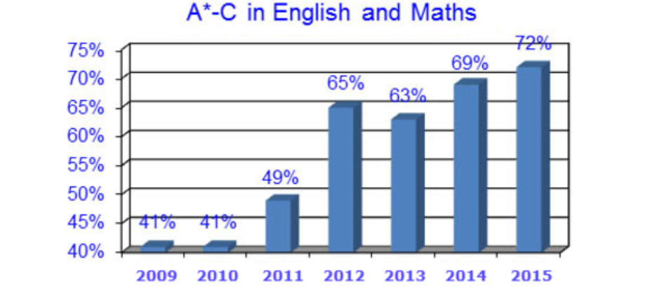

# (05) Multi Dimensional Data 1


## Preamble

```{r}
# Preamble

## Install Pacman
load.pac <- function() {
  
  if(require("pacman")){
    library(pacman)
  }else{
    install.packages("pacman")
    library(pacman)
  }
  
  pacman::p_load(xts, sp, gstat, ggplot2, rmarkdown, reshape2, ggmap,
                 parallel, dplyr, plotly, tidyverse, reticulate, UsingR, Rmpfr,
                 swirl, corrplot, gridExtra, mise, latex2exp, tree, rpart, lattice,
                 coin)
  
  
   mise()
}
load.pac()
```

```{r}
knitr::opts_chunk$set(
  fig.path = "./figure/"
)
```


# (05) Multi Dimensional Data


## Question 1

A simple scatter plot may be produced thusly:

```{r}
reactor <- read.csv(file = "~/Notes/DataSci/Visual_Analytics/05_Data/Tutorial5Ex1.csv", header = TRUE, sep = ",")
p <- ggplot(reactor, aes(x = purity, y = yield)) +
  geom_point(col = "#D2691e") + 
  labs(x = "Purity", y = "Yield (%)", title = "Yield from a Batch Reactor", col = "%") + 
  theme_classic() 

ggplotly(p)
```

### Mapping Colours

It may help to map yield to size and purity to colour, notice in this case that a monotone [^mtn] rather than a divergint pallete is more appropriate for this data, because the data are strictly positive:

[^mtn]: Monotone here in the mathematical sense, as in always decreasing or increasing as opposed to referring necessarily to the colour

```{r}
reactor <- read.csv(file = "~/Notes/DataSci/Visual_Analytics/05_Data/Tutorial5Ex1.csv", header = TRUE, sep = ",")
ggplot(reactor, aes(x = purity, y = yield, col = purity, size = yield)) +
  geom_point() + 
  scale_color_gradient(low="grey", high="purple") +
  labs(x = "Purity", y = "Yield (%)", title = "Yield from a Batch Reactor", col = "%") + 
  theme_classic()


```

### Overlaying a Model

There appears to be no significant relationship between purity and yield, *Ordinary Least Squares Regression* may produce linear Model that can be used to quantify this observation:

```{r}
# Make mappings only in point layer to not conflict with model
ggplot(reactor, aes(x = purity, y = yield)) +
  geom_point(aes(size = yield, col = purity)) + 
  labs(x = "Purity", y = "Yield (%)", title = "Yield from a Batch Reactor", col = "%") + 
  theme_classic() +
    stat_smooth(method = 'lm', col = "#8b0a50", lty = 2 ) +
  scale_color_gradient(low="grey", high="purple") + 
  guides()
```

This model clearly suggests that there is no relationship between purity and yield because the model has no rate of change.

### Adjust the Scale

The data only has observations on the domain of purity between 50-80%, it may be desiralbe to adjust the limits:

```{r}
# Make mappings only in point layer to not conflict with model
ggplot(reactor, aes(x = purity, y = yield)) +
  geom_point(aes(size = yield, col = purity)) + 
  labs(x = "Purity", y = "Yield (%)", title = "Yield from a Batch Reactor", col = "%") + 
  theme_classic() +
    stat_smooth(method = 'lm', col = "#8b0a50", lty = 2 ) +
  scale_color_gradient(low="grey", high="purple") + 
  guides() +
  scale_x_continuous(limits = c(0, 100)) +
  scale_y_continuous(limits = c(0, 100)) +
  scale_size_continuous(range = c(0.3,1.75))
```

This suggests that if more data was collected perhaps there could be a relationship between yield and purity, perhaps a type of [sigmoid function](https://en.wikipedia.org/wiki/Sigmoid_function) would potentially be an appropriate model by way of an analogy to population growth and carrying capacity.

### Conclusion

The Data does not clearly show any significant relationship between purity and yield, however a wider range of data and larger amount of data should be collected in order to confirm that patterns in the data aren't obfuscated by noise.


## Question 2

The chart provided has a misleading base, the base begins from 40% as opposed to beginning from 0 which gives the illusion that the relative proportion by which the plot has changed has been more significant than it is. 





It can be apporporiate to scale continuous scatter or time series plots by reducing the range of the y-axis in order to draw focus to a narrow range of change, however, it is not in this context appropriate because the plot is a bar chart.


## Question 3

```{r}
eg_cars <- read.csv(file = "/home/ryan/Notes/DataSci/Visual_Analytics/05_Data/Tutorial5Ex3.csv", header = TRUE, sep = ",")
```

### Scatter Plot

```{r}
ggplot(data = eg_cars, mapping = aes(x = speed, y = dist)) +
  geom_point(mapping = aes(col = dist), size = 3) +
  scale_color_continuous(low = "#90ee90", high = "#Cd3278") +
  guides(col = guide_legend("Stopping Distance", reverse = TRUE)) +
  theme_light() + 
  labs(x = "Vehicle Speed", y = "Stopping Distance", title = "Stopping Distance Predicted by Vehicles")
  
```

### Modelling the Data

A Linear Model could be fit to the data:


```{r}
mise()
cars_model <- lm(dist ~ speed, data = cars)

newdata <- data.frame(speed = c(30, 33, 37))
newdata$dist <- predict(object = cars_model, newdata)
newdata$datatype <- c("pred")

cars$datatype <- c("obs")

cars <- rbind(cars, newdata)
cars$datatype <- factor(cars$datatype)


ggplot(data = cars, aes(x = speed, y = dist, shape = datatype)) +
  geom_point(mapping = aes(col = dist), size = 3) +
  scale_color_continuous(low = "#90ee90", high = "#Cd3278") +
  guides(col = guide_legend("Stopping Distance", reverse = TRUE)) +
  stat_smooth(method = "lm", aes(group = 1), lty = 2, se = FALSE, col = "lightblue") +
  theme_light() + 
  labs(x = "Vehicle Speed", y = "Stopping Distance", title = "Stopping Distance Predicted by Vehicles")
```

A superior Model would be a Quadratic Model because it would be expected that the stopping force generated by any car would be more or less constant (ideally manufacturers would reach a threshold), then by calculus:

$$
\begin{aligned}
F &=  m\cdot  a \\
\implies  F &\propto a
\end{aligned}
$$

and hence the distance travelled while breaking will be

$$
\begin{aligned}
v &=  a \cdot   t \\
\int v \mathrm{d}t &=  \int a\cdot t \mathrm{d}t  \\
s&= \frac{1}{2}a\cdot  t^2 \\
2s &= a\cdot  \left( \frac{v}{a} \right)^2\\
2as &= v^2
\end{aligned}
$$

Under the assumption that deceleration is constant:

$$
\begin{aligned}
s \propto v^2
\end{aligned}
$$

And so a better model would be:

```{r}
ggplot(data = cars, aes(x = speed, y = dist)) +
  geom_point(mapping = aes(col = dist), size = 3) +
  scale_color_continuous(low = "#90ee90", high = "#Cd3278") +
  guides(col = guide_legend("Stopping Distance", reverse = TRUE)) +
  stat_smooth(method = "lm", aes(group = 1), lty = 2, se = FALSE, formula = y ~ poly(x, 2), col = "lightblue") +
  labs(x = "Vehicle Speed", y = "Stopping \nDistance", title = "Stopping Distance Predicted by Vehicles") +
  theme_light() + 
    scale_linetype_manual(values = c(1, 2), drop = FALSE)

```

This model appears to fit the data more closely.

### Conclusion

There appears to be a quadratic relationship between a vehicle's speed and it's stopping distance.

## Question 4 

### Scatter Plot

A scatter plot can be produced, the y-axis can be mapped to the Sepal Length because it explains the most variation that is distinct from the other features (as shown by PCA and a biplot below), the remaining features would be best mapped to different colours because colours are the most distinct mapping element, the species can be mapped to the shape of the plotted item.


```{r}
data <- pivot_longer(iris, cols = c("Petal.Length", "Petal.Width", "Sepal.Width"))
data <- pivot_longer(iris, cols = c("Petal.Length", "Petal.Width", "Sepal.Width"))

ggplot(data = data, aes(y = Sepal.Length, col = name, x = value, shape = Species)) +
  geom_point(size = 2.5, alpha = 0.9) +
  theme_bw() +
  scale_color_brewer(palette = "Accent", labels = c("Petal Length", "Petal Width", "Sepal Width")) +
  labs(title = "Iris Data Set", y = "Sepal Length", x = "Measurment") +
  guides(col = guide_legend("Measured \n Feature"))
  


```


#### Map all features Uniquely 

Another option would be dedicating the x and y axis to Sepal Length and petal width (these being the choices that explain the most variation of the data and map best to the axis as justified below) and use other mapping variables to denote the other features.

The available continuous aesthetics made availabel in ggplot2 are:

* Colour
* Size
* Transperancy

Colour and size are more effective aesthetics than Transperancy and so will be used.


```{r}
ggplot(iris, aes(y = Sepal.Length, x = Petal.Width, col = Petal.Length, size = Sepal.Width, shape = Species)) +
  geom_point() +
  guides(col = guide_legend("Petal Width"),
         size = guide_legend("Sepal Width")) +
  labs(y = "Sepal Length", x = "Petal Width", title = "Iris Data")
```

This mapping technique however is less effectinve than the earlier plots because generally physical seperation is a more effective aesthetic technique than either size or continuous colour.


##### Choosing the X/Y axis

In order to choose the X/Y axis in the above plots it was necessary to consider:

1. Which variable explained the most data
  + The physical location of a visualisation is the most effective visual aesthetic and so should be reserved for the features that explain the most variation
2. Which Features have data further apart
  + Far apart data may not be practically plotted on the same axis.


#### Bar Chart

In order to consider the spread of the features look at the bar plot of the mean values:

```{r}
iris_stats <- data.frame("means"  = apply(iris[, -5], 2, mean),
                         "spread" = apply(iris[, -5], 2, sd))
iris_stats <- data.frame(Observation = rownames(iris_stats), iris_stats)
iris_stats <- data.frame(Observation = c("Sepal Length", "Sepal Width", "Petal Length", "Petal Width"), iris_stats)

ggplot(iris_stats, aes(x = Observation, y = means, fill = Observation)) +
  geom_col(col = "grey") +
#  scale_fill_manual(values = c("red", "green", "Blue", "Black")) +
  theme_bw() +
  labs(y = "Mean Value", x = "", title = "Mean Values of Iris Values") +
  guides(fill = FALSE)  +
  scale_fill_brewer(palette = "Dark2")


```

This however tells us nothing about the spread of the data, a better way may be to plot representations of density curves:


```{r}
(read.csv(file = "/home/ryan/Notes/DataSci/Visual_Analytics/05_Data/Tutorial5Ex4.csv") == iris) %>% mean()


names(iris)

data <- pivot_longer(iris, cols = c("Petal.Length", "Petal.Width", "Sepal.Length", "Sepal.Width"))
ggplot(data = data, aes(x = value, fill = name )) +
# geom_histogram(position = "dodge", aes(y = ..density..), bins = 5) + guides(col = FALSE) +
stat_function(fun = dnorm, args = list(mean = mean(iris$Petal.Length), sd = sd(iris$Petal.Length)), aes(col = "Petal.Length")) +
stat_function(fun = dnorm, args = list(mean = mean(iris$Petal.Width), sd = sd(iris$Petal.Width)), aes(col = "Petal.Width")) +
stat_function(fun = dnorm, args = list(mean = mean(iris$Sepal.Length), sd = sd(iris$Sepal.Length)), aes(col = "Sepal.Length")) +
stat_function(fun = dnorm, args = list(mean = mean(iris$Sepal.Width), sd = sd(iris$Sepal.Width)), aes(col= "Sepal.Width")) +
  theme_classic() + 
  labs(x = "Measurement Value", y = "Density", title = "Distribution of Measurement Values") +
  guides(col = guide_legend("Measurement")) +
#  scale_color_discrete(labels = c("Sepal Length", "Sepal Width", "Petal Length", "Petal Width")) +
  scale_color_brewer(palette = "Dark2", labels = c("Sepal Length", "Sepal Width", "Petal Length", "Petal Width"))


#ggplot(iris, aes(x))


#So Sepal length should be x and width, petal length should be y
# 
```

This shows that Sepal Width and Petal width are the two features with values furthest apart meaning they may be good candidates for the x/y axis respectively. 

### PCA

Pca can be used to show which factors explain the most variance in the data independent of each other:


```{r, warning=FALSE, results="markup"}
irisTB <- iris[-5]
pca.mod <- prcomp(irisTB, scale = TRUE)
# biplot(pca.mod, scale = 0, cex = 0.5)

# library(devtools); install_github("vqv/ggbiplot")
ggbiplot::ggbiplot(pca.mod) +
  theme_bw() +
  labs(title = "PCA or IRIS Data")

```

In this case Sepal width and either petal measurement explains the most variance.

Given that petal width has the lower variance (from the density curves) and has a value further away from Sepal Width than petal length it will be used for the corresponding axis.

## Question 5

A multi Plot can be generated by using the `facet_grid()` layer in ggplot2. It would be possible to map different plots to different features or different species, but, as will be shown, using seperate plots for seperate species will allow for better seperated data (because the data follow the same trend simply offset by the different *starting point* afforded by the change in species.)

```{r}
names_pretty <- c("Petal\nLength", "Petal\nWidth", "Sepal\nWidth")
data         <- pivot_longer(iris, cols = c("Petal.Length", "Petal.Width", "Sepal.Width"))
data$name    <- factor(x = data$name, levels = unique(data$name), labels = c("Petal\n Length", "Petal\n Width", "Sepal\n Width"))
data$Species <- factor(x = data$Species, levels = unique(data$Species), labels = c("Setosa", "Versicolor", "Virginica"))

ggplot(data = data, aes(y = Sepal.Length, x = value, col = name)) +
  geom_point(size = 2) +
  theme_bw() +
  scale_color_brewer(palette = "Accent", labels = c("Petal Length", "Petal Width", "Sepal Width")) +
  labs(title = "Iris Data Set", y = "Sepal Length", x = "Measurment") +
  guides(col = guide_legend("Measured \n Feature")) +
  facet_grid(. ~ Species)

ggplot(data = data, aes(y = Sepal.Length, x = value, col = Species)) +
  geom_point(size = 2) +
  theme_bw() +
  scale_color_brewer(palette = "Accent") +
  labs(title = "Iris Data Set", y = "Sepal Length", x = "Measurement") +
  guides(col = guide_legend("Measured \n Feature")) +
  facet_grid(. ~ name)


```

Due to the pysical seperation, it would be more effective to plot Species in different plots.

It's also worth noting that **_R_** does come in with a built in function to acheive this:

```{r}
plot(iris[,-5])
```

## Question 6 (Parallel Coordinate Visualisation)

A parallel Coordinate Visualisation can be created in ggplot 2 using by creating a unique id for each observation and passing that as a `group()` parameter to the `geom_line()` layer:

```{r}
# Import the Data Set
parcd <- read.csv(file = "/home/ryan/Notes/DataSci/Visual_Analytics/05_Data/Tutorial5Ex6.csv", header = TRUE, sep = ",")

# Give Each Row an ID Value
parcd <- data.frame(id = 1:nrow(parcd), parcd)
parcd$id <- factor(parcd$id, unique(parcd$id), ordered = FALSE)

# Make the Data Frame Longer
parcd <- pivot_longer(parcd, cols = c("Item.1", "Item.2", "Item.3", "Item.4", "Item.5"))

# Use Grous to Seperate the LInes
ggplot(parcd, aes(x = name, y = value, col = id)) +
  geom_line(aes(group = id) )  +
  guides(col = FALSE) +
  theme_bw() +
  labs(x = "", y = "Value", title = "Parallell Coordinate Plots")

```

It is also possible to do make other aesthetic mappings when using a parallell coordinate plot.

```{r}
mise()
my_diamonds <- data.frame(id = 1:nrow(diamonds), diamonds)
my_diamonds <- my_diamonds[sample(1:nrow(diamonds), size = 100),]
my_diamonds <- pivot_longer(my_diamonds, cols = c("carat","depth", "price", "table","x","y"))


ggplot(my_diamonds, aes(x = name, y = value, col = color, alpha = cut) ) +
  geom_line(aes(group = id), alpha = 0.25) +
  geom_point() +
  theme_bw()

```


