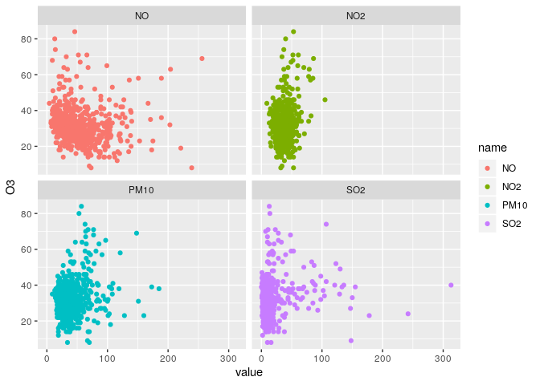

# (06) Multi Dimensional Data 2


## Preamble


```r
# setwd("~/Dropbox/Notes/DataSci/Visual_Analytics/")
# Preamble

## Install Pacman
load.pac <- function() {
  
  if(require("pacman")){
    library(pacman)
  }else{
    install.packages("pacman")
    library(pacman)
  }
  
  pacman::p_load(xts, sp, gstat, ggplot2, rmarkdown, reshape2, ggmap,
                 parallel, dplyr, plotly, tidyverse, reticulate, UsingR, Rmpfr,
                 swirl, corrplot, gridExtra, mise, latex2exp, tree, rpart, lattice,
                 coin, tidyverse, GGally)
  
  
   mise()
}
load.pac()
```


 
 
 
 
 
 
 
 
 
 
 
 
 
 
 
 
 
 
 
 
 
 
 
 
 
 
 
 
 
 
 
 
 
 
 
 
 
 
 
 
 
 
 
 
 
 
 
 
 


```r
knitr::opts_chunk$set(
  fig.path = "./figure/"
)
```


# (06) Multi Dimensional Data


## Question 1

Produce a Scatter plot Matrices of the Data.

A scatter plot matrix repeats information by mapping the same dimension to multiple axis,  for this reason, by default, `ggplot2` doesn't create a scatterplot matrix when calling `facet.grid`/`facet.wrap`, for example:


```r
data <- read.csv(file = "./06_Data/Tutorial6Ex1.csv")
head(data)
```

```
##   O3 NO2  NO SO2 PM10
## 1 32  48  94   8   27
## 2 29  49  86   6   25
## 3 32  34  16  20   32
## 4 32  35  79   9   22
## 5 33  50 108  11   24
## 6 27  58  92  16   26
```

```r
data_long <- pivot_longer(data, cols = names(data[,-1]))

ggplot(data_long, aes(y = O3, x = value, col = name)) +
    facet_wrap(. ~ name) +
    geom_point()
```

<!-- -->

the function `facet_grid` is useful for when there are two discrete features and all combinations of all variables exist in the data, if there is only one feature with many levels `facet_wrap()` might be better.

In order to get a proper matrix scatter plot there is the inbuilt `pairs()`
function, which looks fairly sub-par, there is also the `GGally::ggpairs()`
function that replaces the `ggplot2::plotmatrix()` function, the advantage to
this is that the returned object is a ggplot object that can be layered upon
using the grammar of graphics.


```r
ggpairs(data, aes()) +
    theme_bw()
```

```
## plot: [1,1] [=>------------------------------------------------] 4% est: 0s
## plot: [1,2] [===>----------------------------------------------] 8% est: 1s
## plot: [1,3] [=====>--------------------------------------------] 12% est: 1s
## plot: [1,4] [=======>------------------------------------------] 16% est: 1s
## plot: [1,5] [=========>----------------------------------------] 20% est: 1s
## plot: [2,1] [===========>--------------------------------------] 24% est: 1s
## plot: [2,2] [=============>------------------------------------] 28% est: 1s
## plot: [2,3] [===============>----------------------------------] 32% est: 1s
## plot: [2,4] [=================>--------------------------------] 36% est: 1s
## plot: [2,5] [===================>------------------------------] 40% est: 1s
## plot: [3,1] [=====================>----------------------------] 44% est: 1s
## plot: [3,2] [=======================>--------------------------] 48% est: 1s
## plot: [3,3] [=========================>------------------------] 52% est: 1s
## plot: [3,4] [===========================>----------------------] 56% est: 1s
## plot: [3,5] [=============================>--------------------] 60% est: 1s
## plot: [4,1] [===============================>------------------] 64% est: 1s
## plot: [4,2] [=================================>----------------] 68% est: 1s
## plot: [4,3] [===================================>--------------] 72% est: 1s
## plot: [4,4] [=====================================>------------] 76% est: 0s
## plot: [4,5] [=======================================>----------] 80% est: 0s
## plot: [5,1] [=========================================>--------] 84% est: 0s
## plot: [5,2] [===========================================>------] 88% est: 0s
## plot: [5,3] [=============================================>----] 92% est: 0s
## plot: [5,4] [===============================================>--] 96% est: 0s
## plot: [5,5] [==================================================]100% est: 0s
```

<!-- -->

The real advantage to using `ggplot2` over `base` graphics can be seen when using multiple features,
for example if half of these observations were made at a control site and the
other half made at a facility meaningful and quick observations could be made, for example:


```r
data <- data[order(-data$PM10),]
n <- nrow(data)
data$site[1:n/2] <- "main"
data$site[n/2:n] <- "control"
ggpairs(data,
        legend = 1,
        mapping = ggplot2::aes(colour=site), 
        lower = list(continuous = wrap("smooth", alpha = 0.3, size=0.1))
        ) +
    theme(legend.position = "bottom")
```

```
## 
 plot: [1,1] [>-------------------------------------------------]  3% est: 0s 
 plot: [1,2] [==>-----------------------------------------------]  6% est: 3s 
 plot: [1,3] [===>----------------------------------------------]  8% est: 3s 
 plot: [1,4] [=====>--------------------------------------------] 11% est: 4s 
 plot: [1,5] [======>-------------------------------------------] 14% est: 4s 
 plot: [1,6] [=======>------------------------------------------] 17% est: 4s 
 plot: [2,1] [=========>----------------------------------------] 19% est: 4s 
 plot: [2,2] [==========>---------------------------------------] 22% est: 4s 
 plot: [2,3] [===========>--------------------------------------] 25% est: 4s 
 plot: [2,4] [=============>------------------------------------] 28% est: 4s 
 plot: [2,5] [==============>-----------------------------------] 31% est: 3s 
 plot: [2,6] [================>---------------------------------] 33% est: 3s 
 plot: [3,1] [=================>--------------------------------] 36% est: 3s 
 plot: [3,2] [==================>-------------------------------] 39% est: 3s 
 plot: [3,3] [====================>-----------------------------] 42% est: 3s 
 plot: [3,4] [=====================>----------------------------] 44% est: 3s 
 plot: [3,5] [=======================>--------------------------] 47% est: 3s 
 plot: [3,6] [========================>-------------------------] 50% est: 3s 
 plot: [4,1] [=========================>------------------------] 53% est: 2s 
 plot: [4,2] [===========================>----------------------] 56% est: 2s 
 plot: [4,3] [============================>---------------------] 58% est: 2s 
 plot: [4,4] [==============================>-------------------] 61% est: 2s 
 plot: [4,5] [===============================>------------------] 64% est: 2s 
 plot: [4,6] [================================>-----------------] 67% est: 2s 
 plot: [5,1] [==================================>---------------] 69% est: 2s 
 plot: [5,2] [===================================>--------------] 72% est: 2s 
 plot: [5,3] [=====================================>------------] 75% est: 1s 
 plot: [5,4] [======================================>-----------] 78% est: 1s 
 plot: [5,5] [=======================================>----------] 81% est: 1s 
 plot: [5,6] [=========================================>--------] 83% est: 1s 
 plot: [6,1] [==========================================>-------] 86% est: 1s `stat_bin()` using `bins = 30`. Pick better value with `binwidth`.
## 
 plot: [6,2] [===========================================>------] 89% est: 1s `stat_bin()` using `bins = 30`. Pick better value with `binwidth`.
## 
 plot: [6,3] [=============================================>----] 92% est: 0s `stat_bin()` using `bins = 30`. Pick better value with `binwidth`.
## 
 plot: [6,4] [==============================================>---] 94% est: 0s `stat_bin()` using `bins = 30`. Pick better value with `binwidth`.
## 
 plot: [6,5] [================================================>-] 97% est: 0s `stat_bin()` using `bins = 30`. Pick better value with `binwidth`.
## 
 plot: [6,6] [==================================================]100% est: 0s 
                                                                              
```

<!-- -->


