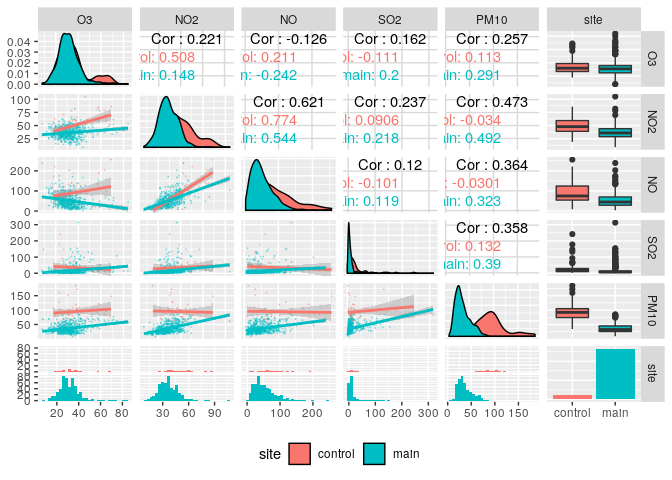
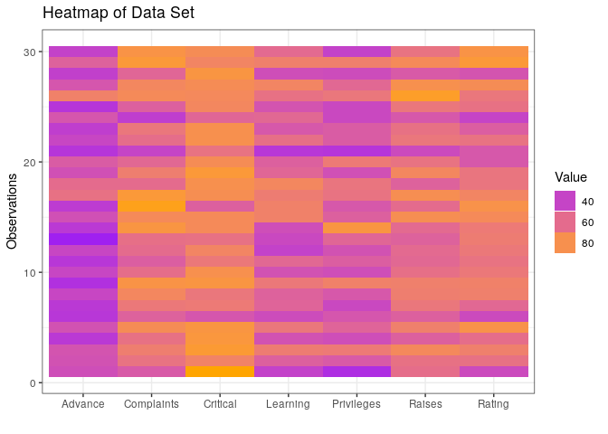

# (06) Multi Dimensional Data 2


## Preamble


```r
# setwd("~/Dropbox/Notes/DataSci/Visual_Analytics/")
# Preamble

## Install Pacman
load.pac <- function() {
  
  if(require("pacman")){
    library(pacman)
  }else{
    install.packages("pacman")
    library(pacman)
  }
  
  pacman::p_load(xts, sp, gstat, ggplot2, rmarkdown, reshape2, ggmap,
                 parallel, dplyr, plotly, tidyverse, reticulate, UsingR, Rmpfr,
                 swirl, corrplot, gridExtra, mise, latex2exp, tree, rpart, lattice,
                 coin, tidyverse, GGally)
  
  
   mise()
}
load.pac()
```




```r
knitr::opts_chunk$set(
  fig.path = "./figure/"
)
```


# (06) Multi Dimensional Data


## Question 1

Produce a Scatter plot Matrices of the Data.

A scatter plot matrix repeats information by mapping the same dimension to multiple axis,  for this reason, by default, `ggplot2` doesn't create a scatterplot matrix when calling `facet.grid`/`facet.wrap`, for example:


```r
data <- read.csv(file = "./06_Data/Tutorial6Ex1.csv")
head(data)
```

```
##   O3 NO2  NO SO2 PM10
## 1 32  48  94   8   27
## 2 29  49  86   6   25
## 3 32  34  16  20   32
## 4 32  35  79   9   22
## 5 33  50 108  11   24
## 6 27  58  92  16   26
```

```r
data_long <- pivot_longer(data, cols = names(data[,-1]))

ggplot(data_long, aes(y = O3, x = value, col = name)) +
    facet_wrap(. ~ name) +
    geom_point()
```

<!-- -->

the function `facet_grid` is useful for when there are two discrete features and all combinations of all variables exist in the data, if there is only one feature with many levels `facet_wrap()` might be better.

In order to get a proper matrix scatter plot there is the inbuilt `pairs()`
function, which looks fairly sub-par, there is also the `GGally::ggpairs()`
function that replaces the `ggplot2::plotmatrix()` function, the advantage to
this is that the returned object is a ggplot object that can be layered upon
using the grammar of graphics.


```r
ggpairs(data, aes()) +
    theme_bw()
```

<!-- -->

The real advantage to using `ggplot2` over `base` graphics can be seen when using multiple features,
for example if half of these observations were made at a control site it would be easy to compare all the measruements between the principal and control sites across the scatterplot matrix like so:


```r
data <- data[order(-data$PM10),]
n <- nrow(data)
data$site[1:n/2] <- "main"
data$site[n/2:n] <- "control"
ggpairs(data,
        legend = 1,
        mapping = ggplot2::aes(colour=site), 
        lower = list(continuous = wrap("smooth", alpha = 0.3, size=0.1))
        ) +
    theme(legend.position = "bottom") 
```

<!-- -->

## Question 2
Produce a Heatmap of the following data.

In order to do this it is necessary to:

1. Create a long data frame from the column and row names using `expand.grid()`
2. Feed the data into long data frame (R always operates column wise, vectors are vertical, so top-to-bottom-left-to-right)
3. Rename the Factors to be neater
  + If they're not ordered don't make them ordered, that way ggplot2 will arrange it to be alphabetical which is easier to read.
4. Create the heatmap using `ggplot2::geom_tile()`


```r
# Read in the Data
data2 <- read.csv(file = "./06_Data/Tutorial6Ex2.csv")

# Create a long-format data frame
  # Well behaved order, see:
     #  matrix(1:30, ncol = 3) %>% as.vector()
d_eg <- expand.grid(1:nrow(data2), names(data2))
names(d_eg) <- c("Observation", "Variable")
d_eg$Value <- as.matrix(data2) %>% as.vector()

# Rename the Factors to be neater
d_eg$Variable <- c("Rating", "Complaints", "Privileges", "Learning", "Raises", "Critical", "Advance")[d_eg$Variable]
  
# Create the Plot
ggplot(d_eg, aes(x = Variable, y = Observation)) +
  geom_tile(aes(fill = Value)) +
  scale_fill_continuous(low = "purple", high = "orange") +
  guides(fill = guide_legend("Value")) +
  labs(y = "Observations", x = "", title = "Heatmap of Data Set") +
  theme_bw() 
```

<!-- -->

# Question 3
> Should we visualise everything from a large data set? What are the normal
methods that we use to reduce the complexity of a large data set?

## Many Observations
Very large data sets, in the context of many observations can be quite difficult to visualise simply because there may be too much data to get through, two simple techniques to deal with this is to:

### Sampling the Data
A random uniform sample of the data will offer a non-biased way to take a snapshot of the data in a manageable way. 

Advantages to this method are:

* Repeatable in many Programs by specifying a `seed` value
* The sample can be retaken multiple times to make sure that the random sample wasn't an outlier.
* It is efficient over large data sets.
* Is consistent with other statistical methods 
  + (e.g. the $t$ -distribution makes the assumption of an unbiased random sample)
* Preserves outlier's so the sample remains *true* to the data.

The Disadvantage to this however is that data is lost and simply not reflected.

### Filter the Data
The data can be arbitrarily filtered by features or values in order to make it more manageable, for example if the data set was on cars, the data could be filtered for 8 cylinder cars, or, if the data was the heights of kids in a classroom maybe only extremely tall students are relevant to this visualisation and the data could be filtered as such.

## Many Features/Variables
Many features in a data set can be a little more challenging, although there are some methods to visualise many dimensions such as mapping to colours, shapes, transperancy, visualising a 3d model to get an extra dimension, having a slider et cetera, there is a fundamental limit to how many dimensions can be visualised at once.

### Remove Features
The simplest method to deal with this is to simply exclude dimensions that do not account for much variation in the data. For example if only 1% of the total variation in the data is attributable many features of that data, it may be acceptable to dispense with those features for the purpose of plotting the data.

### Dimension Reduction
The simplest form of dimension reduction is *Principal Component Analysis* whereby, in essence, a line is drawn through data (usually by using the *Ordinary Least Squares* method) and this line is taken to be a dimension of itself and is called the first principal component, perpendicular lines can be drawn from this line and they will subsequently be additional principal components.

Another way to understand this process is to take a 3d scatterplot and rotate it until the points look like a number line on a sheet of paper, this would represent the first principle component, PCA is esentially the repeated process of performing this to take needless dimensions out of data.

The number of desirable Principle Components can be interpreted by creating a bar plot of total variance against the number of principal components, this is known as a scree plot.

A plot of the principal component vectors with respect to the original dimensions can be plotted in order to determine the composition of any given principal component, such a plot is known as a biplot and provides a means to interpret a principal component.

A newer method published in the last 18 months by Leland McInnes, John Healy and James Melville is known as *Uniform Manifold Approximation and Projection for Dimension Reduction* (***UMAP***), this method performs better in terms of dimension reduction but is not as intuitive as PCA, which is in theory quite trivial.[^umap]


[^umap]: McInnes, L, Healy, J, & Melville, J 2018, 'UMAP: Uniform Manifold Approximation and Projection for Dimension Reduction', arXiv:1802.03426 [cs, stat], viewed 11 April 2020, <http://arxiv.org/abs/1802.03426>.


# Question 4
> Search 5 multi-dimensional visualisation tools/projects on emerging environments (such as VR/AR)

Preliminary Research into Visualisation tools, techniques and projects taking advanting of emergin environments include:

* [VRParaSet](https://link.springer.com/chapter/10.1007/978-3-030-33723-0_11)
  + This is a paper published 6 months ago that investigates modelling multidimensional data in parallell co-ordinates using VR.
    + Nguyen, NVT, Virgen, L, & Dang, T 2019,'VRParaSet: A Virtual Reality Model for Visualizing Multidimensional Data', in G Bebis et al. (eds.), *Advances in Visual Computing*, Lecture Notes in Computer Science, Springer International Publishing, Cham, pp.129–140.
* [Data Viz in VR](http://uncharted-territory.webflow.io/#contact)
  + This is a project undertaken by students at *Northwestern University* in order to investigate techniques for visualising data in VR
* [UK Brexit Data Visualised in VR](https://simonrogers.net/2016/06/20/how-we-made-a-vr-data-visualization/)
  + This was a project undertaken in order to determine whether basic data visualisation could be translated into an Immersive VR experience
* [21 Years of the Nasdaq](https://graphics.wsj.com/3d-nasdaq/)
  + This is a VR Visualisation of wall street prices, it's a novel way to view a time series chart from a different perspective.
* [Visualising in VR Using A-Frame](https://almossawi.com/aframe-d3-visualization/)
  + This is another project involving visualising a surface plot in VR using A-Frame and D3 and JavaScript
 


