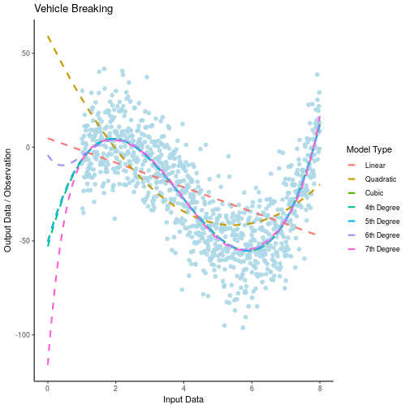
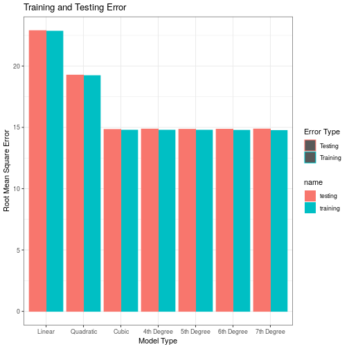

# Overlaying Models onto ggplot2

So bascially the idea is to have two DataFrames:

1. The original sample / observation
2. A data Frame with the Model Predictions for various values

This way the Models can Have a corresponding name for the model type and be used seperately in the `geom_line` layer (as opposed to being sucked into the `geom_point` layer)

## Preamble


```r
# Preamble
## Install Pacman
load.pac <- function() {
  
  if(require("pacman")){
    library(pacman)
  }else{
    install.packages("pacman")
    library(pacman)
  }
  
  pacman::p_load(xts, sp, gstat, ggplot2, rmarkdown, reshape2, ggmap,
                 parallel, dplyr, plotly, tidyverse, reticulate, UsingR, Rmpfr,
                 swirl, corrplot, gridExtra, mise, boot)
  
}

load.pac()
mise()
```


 
 
 
 
 
 
 
 
 
 
 
 
 
 
 
 
 
 
 
 
 
 
 
 
 
 
 
 
 
 
 
 
 
 
 
 
 
 
 
 
 
 
 
 
 
 
 
 
 


## Make some Data
So first some sample data to play with:


```r
set.seed(88)

# Make some data
x <- seq(from = 1, to = 8, length.out = 1000)
y <- 1.8*(x-2)^3 - 10.1* (x-2)^2 - 2.8*x + 9.2 + rnorm(length(x), mean = 0, sd = 15)
mydata <- tibble("input" = x, "output" = y)
```

## Create Some Models

### Using GLM and a List

If the `glm` functoin is used without passing a `family` argument, linear regression wil be performed, so the following will produce the exact same output:

 * `lm(output ~ input, mydata) %>% coef`
 * `glm(output ~ input, mydata) %>% coef`

The benefit of using the `glm` function is that it can be used with the `cv.glm` function to easily perform cross validation (from Leave-One-Out Cross-Validation up to an arbitrary number of folds).


```r
## Models
 ## Do not reuse the name of the argument, it will break cv.glm

mods <- list()
# for (i in 1:7) {
#   model_formula <- paste0("output ~ poly(input, degree =", i, ")")
#   model_formula <- format(model_formula) # This isn't necessary
#    mods[[i]] <- glm(formula = model_formula, data = mydata)
# }


for (i in 1:7) {
mods[[i]] <- glm(formula = output ~ poly(input, i = i, raw = TRUE), data = mydata)
}


## Predictions
 ### Be super careful of the index here, input variable should be i=1 and lm should be i=2 and x^2 as i=3
preds <- tibble("input" = seq(from = 0, to = max(mydata$input), length.out = 1000))
preds[,1]
```

```
## # A tibble: 1,000 x 1
##      input
##      <dbl>
##  1 0      
##  2 0.00801
##  3 0.0160 
##  4 0.0240 
##  5 0.0320 
##  6 0.0400 
##  7 0.0480 
##  8 0.0561 
##  9 0.0641 
## 10 0.0721 
## # … with 990 more rows
```

```r
for (i in 1:length(mods)) {
 preds[,(i+1)] <- predict(mods[[i]], newdata = preds[,1])
 names(preds)[(i+1)] <- paste("p", i)
}

preds %>% head()
```

```
## # A tibble: 6 x 8
##     input `p 1` `p 2` `p 3` `p 4` `p 5` `p 6` `p 7`
##     <dbl> <dbl> <dbl> <dbl> <dbl> <dbl> <dbl> <dbl>
## 1 0        4.71  59.2 -50.4 -52.9 -50.6 -4.22 -116.
## 2 0.00801  4.65  58.9 -49.9 -52.4 -50.1 -4.45 -114.
## 3 0.0160   4.60  58.6 -49.4 -51.8 -49.6 -4.68 -112.
## 4 0.0240   4.55  58.3 -48.9 -51.3 -49.1 -4.90 -110.
## 5 0.0320   4.50  58.1 -48.4 -50.8 -48.6 -5.11 -109.
## 6 0.0400   4.45  57.8 -47.9 -50.2 -48.1 -5.32 -107.
```

What's really strange and **really really worth noting**, is that, if you set the models using the loop above, `cv.glm` will not work, they need to be set by hand for that to work. To test this run all the code with this block commented out:


```r
 mods[[1]] <- glm(formula = output ~ poly(input, degree = 1, raw = TRUE), data = mydata)
 mods[[2]] <- glm(formula = output ~ poly(input, degree = 2, raw = TRUE), data = mydata)
 mods[[3]] <- glm(formula = output ~ poly(input, degree = 3, raw = TRUE), data = mydata)
 mods[[4]] <- glm(formula = output ~ poly(input, degree = 4, raw = TRUE), data = mydata)
 mods[[5]] <- glm(formula = output ~ poly(input, degree = 5, raw = TRUE), data = mydata)
 mods[[6]] <- glm(formula = output ~ poly(input, degree = 6, raw = TRUE), data = mydata)
 mods[[7]] <- glm(formula = output ~ poly(input, degree = 7, raw = TRUE), data = mydata)
```


### Using Variables and the `lm` function

If for some reason it was necessary to:

* Use a individual variables rather than a list

it would be necessary to `parse` the text and then `evaluate` the text, this is probably not the desirable way to do this, but for the sake of completion


```r
# Create Various Models
model_lm <- lm(output ~ input, data = mydata)
for (i in 2:9) {
 eval(
   parse(
     text = paste0("model_p", i, " <-  lm(output ~ poly(input, ", i, "), data = mydata)") 
     )
   )
}
```

## Predict some Corresponding Values


```r
# Create the Predictions

model_preds    <- tibble("input" = seq(from = 0, to = max(mydata$input)*0.9, length.out = 1000))
model_preds$lm <- predict(model_lm, newdata = model_preds[,1])
for (i in 2:7) {
 eval(
   parse(
     text = paste0("model_preds$p", i, " <-  predict(model_p", i, ", newdata = model_preds[,1])") 
     )
   )
}
model_preds %>% head()
```

```
## # A tibble: 6 x 8
##     input    lm    p2    p3    p4    p5    p6    p7
##     <dbl> <dbl> <dbl> <dbl> <dbl> <dbl> <dbl> <dbl>
## 1 0        4.71  59.2 -50.4 -52.9 -50.6 -4.22 -116.
## 2 0.00721  4.66  59.0 -49.9 -52.4 -50.1 -4.43 -114.
## 3 0.0144   4.61  58.7 -49.5 -51.9 -49.7 -4.63 -113.
## 4 0.0216   4.57  58.4 -49.0 -51.5 -49.2 -4.83 -111.
## 5 0.0288   4.52  58.2 -48.6 -51.0 -48.8 -5.03 -109.
## 6 0.0360   4.47  57.9 -48.1 -50.5 -48.3 -5.22 -108.
```

## Make a tidy Data Set of Prediction Values


```r
# Make the Predictions tidy

# head(model_preds)
preds_tidy <- pivot_longer(data = preds, cols = names(preds[,-1]))
head(preds_tidy)
```

```
## # A tibble: 6 x 3
##   input name   value
##   <dbl> <chr>  <dbl>
## 1     0 p 1     4.71
## 2     0 p 2    59.2 
## 3     0 p 3   -50.4 
## 4     0 p 4   -52.9 
## 5     0 p 5   -50.6 
## 6     0 p 6    -4.22
```

## Create the Plot by Overlaying the Model

### Create a Vector of Model Names


```r
     model_labels <- c("Linear", "Quadratic", "Cubic", "4th Degree",
                  "5th Degree", "6th Degree", "7th Degree") 
```


### Create the Plot


```r
# Overlay the Model

ggplot(data = mydata, aes(x = input, y = output)) +
  geom_point(size = 2, alpha = 0.9, col = "lightblue") +
  theme_classic() +
  labs(y = "Output Data / Observation", x = "Input Data", title = "Vehicle Breaking") +
  geom_line(data = preds_tidy, aes(x = input, y = value, col = name), lty =2, lwd = 1) +
  scale_color_discrete(name = "Model Type", labels = model_labels)
```



### Plot the RMSE

#### Training Error

For want of Completion plot the Model RMSE Values


```r
rmse <- function(x, model) {
  preds <- predict(model)
  sqrt(mean((x-preds)^2))
}

model_error <- data.frame("Model" = model_labels)

for (i in 1:length(mods)) {
  model_error$training[i] <- rmse(mydata$output, mods[[i]]) 
}
```

#### Expected Testing Error

The problem with using training error is that in theory it will always  improve in performance for a more flexible model, in order to overcome this cross validation is used as an estimate of the expected test data error.

The `cv.glm` function performs cross validation:

* the `K` argument is the number of folds
* the output `$delta` vector is a vector with the raw _**M**ean **S**quare **E**rror_ as the observation and the second being a value adjusted for bias.
  + The returned values are square error so use `sqrt()` to convert them to `rmse`.


```r
cv.glm(data = mydata, glmfit = glm(output ~ input, data = mydata), K = 10)$delta[1] %>% sqrt()
```

```
## [1] 22.88314
```

```r
cv.glm(data = mydata, glmfit = glm(output ~ poly(input, degree = 1, raw = TRUE), data = mydata), K = 10)$delta[1] %>% sqrt()
```

```
## [1] 22.88609
```

```r
cv.glm(data = mydata, glmfit = glm(output ~ poly(input, degree = 1, raw = FALSE), data = mydata), K = 10)$delta[1] %>% sqrt()
```

```
## [1] 22.88753
```

```r
# mods[[1]] <- glm(output ~ poly(input, degree = 1, raw = FALSE), data = mydata)
cv.glm(data = mydata, glmfit = mods[[1]], K = 10)$delta[1] %>% sqrt()
```

```
## [1] 22.89718
```

```r
library(boot)

## The column name specifies the input and response variable as inferred from the glm model
for (i in 1:length(mods)) {
model_error$testing[i] <- cv.glm(data = mydata, glmfit = mods[[i]], K = 10)$delta[1] %>% sqrt()
}


model_error
```

```
##        Model training  testing
## 1     Linear 22.84386 22.88702
## 2  Quadratic 19.21835 19.26250
## 3      Cubic 14.77219 14.82960
## 4 4th Degree 14.77156 14.86183
## 5 5th Degree 14.77143 14.84444
## 6 6th Degree 14.75960 14.85014
## 7 7th Degree 14.74371 14.86591
```


#### Visualise the Errors


```r
## make the Models an ordered factor
  ## For this to work the levels MUST be specified
model_error$Model <- factor(model_error$Model, levels = model_error$Model, ordered = TRUE)

## Make the data tidy
 ## If you want to print an assignment bracket it
(model_error_tidy <- pivot_longer(data = model_error, cols = c(training, testing)))
```

```
## # A tibble: 14 x 3
##    Model      name     value
##    <ord>      <chr>    <dbl>
##  1 Linear     training  22.8
##  2 Linear     testing   22.9
##  3 Quadratic  training  19.2
##  4 Quadratic  testing   19.3
##  5 Cubic      training  14.8
##  6 Cubic      testing   14.8
##  7 4th Degree training  14.8
##  8 4th Degree testing   14.9
##  9 5th Degree training  14.8
## 10 5th Degree testing   14.8
## 11 6th Degree training  14.8
## 12 6th Degree testing   14.9
## 13 7th Degree training  14.7
## 14 7th Degree testing   14.9
```

```r
## Use GGPlot
## It is necessary to specify that the names sdelineate seperate groups
ggplot(data = model_error_tidy, aes(x = Model, y = value, fill = name, col = name, group = name)) +
#  geom_line() + 
  geom_col(position = "dodge") +
  theme_bw() +
  labs(x = "Model Type", y = "Root Mean Square Error", title = "Training and Testing Error") +
  guides(col = guide_legend("Error Type")) +
  scale_color_discrete(labels = c("Testing", "Training"))
```




I don't like these visualised errors, but, the method seems to be correct and maybe the distinctive u-shape would appear more pronounced with more variables or greater flexibility. 


